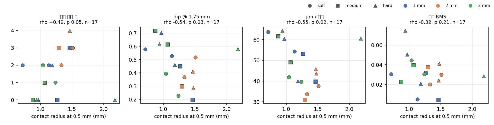
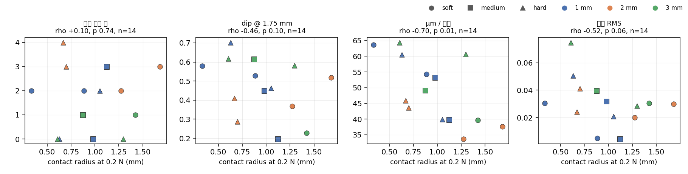
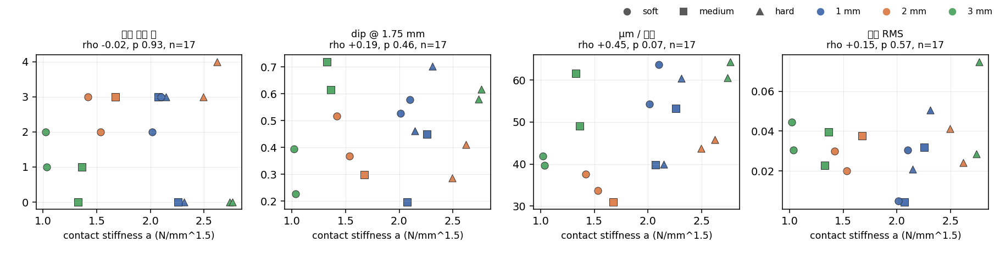
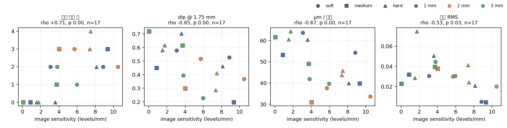

# 경도와 두께를 하나의 변수로 — 접촉 반지름 시도

2026-09-07. 운용자 제안: **프로브를 같은 힘(또는 같은 깊이)만큼 눌렀을 때 이미지에서
밝기가 변한 원의 반지름**을 경도·두께가 함께 만드는 하나의 변수로 두고, 그 반지름과
힘 추정 정확도 / 형상 추정 정확도 / 분해능의 관계를 2차원으로 그리자는 것.
데이터: `data/20260911_VBTSresolution_dataset/9DTact/contact_radius.csv` (17 유닛), 그림: `figures/`.
표와 그림은 `scripts/make_derived.py` 로 다시 만든다.

> **2026-09-08 개정.** 이 문서의 원래 핵심 결론 — "같은 깊이의 접촉 반지름은 두께를
> 다시 쓴 것이다 (ρ = −0.86)" — 은 **측정 인공물이었다.** 반지름을 유닛마다 다른
> 문턱에서 쟀고, 그 문턱이 두께와 함께 올라갔다. §1.1 에 근거를 적었다. 모든 유닛에
> 같은 문턱을 쓰면 두께 상관은 사라진다. 같은 날 축척 측정이 고쳐져 17 유닛 전부가
> 자체 축척을 갖게 된 것도 이 표에 반영했다 (다섯 유닛이 중앙값 자리표를 쓰고 있었다).

이 문서는 결과 문서(`spatial_resolution.md`, `shape_reconstruction.md`,
`force_estimation.md`)와 분리해 둔다. **시도**의 기록이고, 아래에 적힌 대로 절반은 되고
절반은 안 됐다.

> **2026-09-08 2차 개정.** Pass B 가 17/17 로 끝나 §5 의 같은 힘 반지름을 전 유닛에서
> 읽었고, 힘 추정 정확도를 성능 축에 추가했다.

---

## 1. 무엇으로 쟀나

Pass A 의 ball4 깊이 사다리(0.1–0.6 mm, 6 프레임)에서 기준 이미지와의 차이가 문턱을 넘는
영역의 면적을 원으로 환산한 반지름을 그 유닛의 축척(px/mm)으로 나눠 mm 로 만들었다.
**문턱은 17 유닛 모두 7 회색조로 같다** (§1.1 이 이유다). 두 가지 정의:

- **같은 깊이 — 0.5 mm 에서의 반지름** `r_img_d05`: 사다리의 깊이 축에서 보간. 17 유닛.
- **같은 힘 — 0.2 N 에서의 반지름** `r_img_F02`: 사다리의 힘 축에서 보간. 0.5 N 은 ball4
  사다리가 무른 유닛에서 닿지 못해(최대 0.15–0.79 N) 6 유닛뿐이라 0.2 N 으로 내렸고,
  그러면 **14 유닛**이다.

비교를 위해 같은 데이터에서 나오는 다른 후보 두 개도 같이 놓았다:

- **접촉 강성 a** (`hertz_a`): ball4 영점 적합의 F = a·d^1.5 계수. 젤의 유효 강성 —
  경도와 두께가 역학적으로 합쳐진 값. 17 유닛. (레지스트리의 현재 적합값을 쓴다. 이
  문서의 2026-09-07 판은 재적합 이전 값을 인용했다.)
- **이미지 감도** (`img_slope_lvl_per_mm`): 사다리에서 접촉 영역 평균 밝기 변화가 깊이에
  따라 느는 기울기(회색조/mm). 17 유닛.

성능 지표: 분해한 간격 수(0–4), 1.75 mm 에서의 최대 dip, 깊이 분해능(µm/회색조 단계),
형상 잔차(선형 보정 후 RMS), 그리고 **힘 추정 정확도**(Fz MAE, 17 유닛 × 12 입력 크기의
중앙값 — `force_estimation.md`). 마지막 축은 2026-09-08 에 추가됐다.

### 1.1 왜 문턱을 고정했나 — 원래 결론을 뒤집은 지점

측정 스크립트는 사다리를 찍을 때 유닛마다 문턱(`diff_level`)을 따로 골라 `radius_px` 를
기록한다. 자국이 보이는 문턱을 유닛별로 맞춘 것인데, **고른 문턱이 젤 두께와 거의 완전히
같이 움직인다**:

| 두께 | 유닛의 `diff_level` |
|---|---|
| 1 mm | 3, 3, 3, 3, 3, 3 |
| 2 mm | 4, 5, 5, 5, 5 |
| 3 mm | 6, 6, 6, 7, 7, 7 |

두께와 ρ = **+0.98** (p < 0.001, n = 17). 픽셀이 넘어야 할 기준이 두꺼운 젤에서 더 높으니,
같은 물리에서도 원이 더 작게 나온다. 그러면 "같은 깊이 반지름 ↔ 두께"의 상관은 젤이 아니라
문턱이 만든 것이 된다.

모든 유닛에 **같은** 문턱을 쓰고 3 에서 20 까지 훑으면, 두께 상관은 어디에서도 유의하지
않다:

| 문턱 | 두께와의 ρ | 경도와의 ρ | n |
|---|---|---|---|
| 3 | +0.09 (p 0.74) | +0.41 (p 0.10) | 17 |
| 5 | +0.27 (p 0.29) | +0.29 (p 0.27) | 17 |
| **7** | **−0.01 (p 0.96)** | +0.16 (p 0.55) | 17 |
| 10 | −0.24 (p 0.35) | −0.01 (p 0.96) | 17 |
| 15 | −0.23 (p 0.38) | −0.07 (p 0.79) | 17 |
| 20 | −0.14 (p 0.71) | +0.04 (p 0.91) | 9 |
| 유닛별 (원래) | **−0.76 (p 0.000)** | +0.17 (p 0.51) | 17 |

문턱 7 을 쓴다. 17 유닛 전부가 0.5 mm 에서 유한한 반지름을 주는 값 가운데 가장 높아서,
조명 밝기의 유닛 간 차이에 가장 덜 끌린다. 어떤 고정 문턱을 골라도 아래 §2 의 결론은
바뀌지 않는다 — 바뀌는 것은 원래의 유닛별 문턱을 쓸 때뿐이다.

---

## 2. 후보 변수가 경도와 두께를 얼마나 담는가 (Spearman ρ, p, n)

| 변수 | 두께와의 상관 | 경도와의 상관 |
|---|---|---|
| 반지름 @ 0.5 mm | -0.01 (0.96, n=17) | +0.16 (0.55, n=17) |
| 반지름 @ 0.2 N | +0.22 (0.45, n=14) | -0.37 (0.19, n=14) |
| 접촉 강성 a | -0.29 (0.27, n=17) | +0.77 (0.00, n=17) |
| 이미지 감도 | -0.34 (0.18, n=17) | -0.20 (0.44, n=17) |

**접촉 반지름은 어느 정의로도 두께나 경도를 담지 않는다.** 같은 깊이 정의는 두 변수 모두와
ρ ≈ 0 이고(문턱을 고정하기 전에는 두께와 −0.86 이었다), 같은 힘 정의도 유의하지 않다.
운용자가 제안한 "하나로 합친 변수"는 **이 데이터에서는 두 변수 중 어느 쪽도 대신하지
못한다.**

**접촉 강성 a 는 경도를 담는다** (+0.77, p < 0.001). 두께는 약하게 반대 방향(−0.29).
역학적으로는 이것이 가장 "하나의 변수"에 가깝다 — 다만 §3 에서 보듯 성능과는 무관하다.

**이미지 감도는 경도도 두께도 담지 않는다** (둘 다 p > 0.17). 젤의 기하가 아니라 그 위에
얹힌 광학·조명의 변수다. 이 독립성이 §3 에서 중요해진다.

---

## 3. 후보 변수와 성능의 관계 (Spearman ρ, p, n)

| 변수 | 분해 간격 수 | dip @ 1.75 mm | µm / 단계 | 형상 RMS | 힘 MAE |
|---|---|---|---|---|---|
| 반지름 @ 0.5 mm | +0.37 (0.14, n=17) | -0.54 (0.03, n=17) | -0.55 (0.02, n=17) | -0.32 (0.21, n=17) | +0.41 (0.11, n=17) |
| 반지름 @ 0.2 N | -0.00 (0.99, n=14) | -0.46 (0.10, n=14) | -0.70 (0.01, n=14) | -0.52 (0.06, n=14) | +0.23 (0.44, n=14) |
| 접촉 강성 a | -0.02 (0.93, n=17) | +0.19 (0.46, n=17) | +0.45 (0.07, n=17) | +0.15 (0.57, n=17) | +0.26 (0.30, n=17) |
| 이미지 감도 | +0.66 (0.00, n=17) | -0.65 (0.00, n=17) | -0.67 (0.00, n=17) | -0.53 (0.03, n=17) | +0.23 (0.37, n=17) |

읽는 법:

- **이미지 감도가 다섯 지표 중 넷과 유의하게 상관한다** (|ρ| 0.53–0.67, 모두 p ≤ 0.03,
  n = 17; 힘만 예외). 이 중 µm/단계와의 −0.67 은 거의 정의상 같은 양이라 당연하지만,
  **분해 간격 수 +0.66**, **dip −0.65**, **형상 RMS −0.53** 은 독립적인 시험이다. 깊이
  1 mm 가 회색조 몇 단계로 바뀌는가 — 그 유닛의 광학·조명·젤 불투명도가 합쳐진 값 — 가
  세 시험의 성능을 같이 움직인다. 그리고 §2 에서 보았듯 이것은 경도·두께의 함수가
  **아니다**.
- **같은 깊이 반지름은 두 지표와 상관한다** — dip −0.54 (p = 0.03) 와 µm/단계 −0.55
  (p = 0.02). 분해 간격 수(+0.37, p = 0.14)와 형상 RMS(−0.32, p = 0.21)는 유의하지 않다.
  문턱을 고정하기 전에는 이 값들이 모두 유의하지 않았다(|ρ| ≤ 0.30). 다만 부호를 보면
  반지름이 큰 유닛일수록 dip 이 **작다** — dip 은 클수록 좋은 지표이므로 이 방향은
  "반지름이 크면 분해가 잘 된다"와 반대다. 감도와 반지름이 같은 것(밝기 변화가 큰 유닛)을
  재고 있을 가능성이 크고, 이 데이터로는 둘을 분리할 수 없다.
- **접촉 강성 a 는 성능과 무관하다** (모든 p ≥ 0.07). 경도를 가장 잘 담은 변수가 성능을
  전혀 설명하지 못한다 — 즉 **"얼마나 단단하게 느껴지는가"는 이 시험들의 성능을 정하지
  않는다.** 이것은 원래 결론과 같고, 문턱 수정에도 살아남았다.
- **힘 추정 정확도는 네 후보 변수 어느 것과도 상관이 없다** (모든 |ρ| ≤ 0.41, p ≥ 0.11).
  분해능·형상을 설명하던 이미지 감도조차 힘에는 안 걸린다(+0.23, p = 0.37). `force_estimation.md`
  §3.1 이 이유를 준다: 힘 오차의 바닥은 젤도 광학도 아니라 **F/T 라벨 자신의 잡음**이고,
  유닛별 힘 오차는 그 라벨 잡음과 함께 움직인다(ρ = +0.55, p = 0.021). 젤의 성질로 설명할
  여지가 애초에 크지 않다.

---

## 4. 결론

(§5 의 ball8 결과까지 반영한 최종본이다. 읽는 순서상 여기 두지만, 근거의 절반은 뒤에 있다.)

1. 제안된 반지름 변수는 **경도와 두께를 합치지 못한다.** 같은 깊이 정의는 두 변수 어느
   쪽과도 상관이 없고(§2), 같은 힘 정의는 경도만 담는다(§5.1). 두 변수를 함께 담는
   정의는 나오지 않았다. (원래 문서는 같은 깊이 정의가 "두께의 재표현"이라고 적었는데,
   그것은 §1.1 의 문턱 인공물이었다.)
2. 경도와 두께의 역학적 결합은 **접촉 강성 a** 가 하고 있고(경도와 +0.77), 그것은 성능과
   무관했다.
3. **같은 힘 반지름은 경도를 담는다**(§5.1, ρ −0.50 ~ −0.56, p ≤ 0.04) — 같은 힘을 주면
   무른 젤이 더 깊이 들어가 더 넓게 닿으니 물리적으로 자연스럽다. 그러나 두께는 담지 않고
   (p ≥ 0.38), 성능과는 µm/단계를 통해서만 얽힌다(§5.2). 경도만 담는다는 점에서 접촉
   강성 a 와 같은 종류이고, a 보다 약하다.
4. 성능을 정하는 것은 **이미지 감도(회색조/mm)** 이고, 그것은 경도·두께 어느 쪽의 함수도
   아닌 **유닛별 광학의 변수**다. 같은 사양의 두 복제가 감도에서 3 배까지 차이 난다
   (medium_1mm: 0.9 대 9.3 lvl/mm). 성능의 유닛 간 산포는 젤 사양이 아니라 조립에서 온다.
5. **힘 추정 정확도는 어느 후보와도 상관이 없다**(§3). 그 오차의 바닥은 젤이 아니라 F/T
   라벨의 잡음이기 때문이다(`force_estimation.md` §3.1).
6. 따라서 **경도·두께를 하나의 변수로 접는 시도는 이 데이터에서 실패했고**, 대신 측정해야
   할 것은 유닛별 광학 감도다. 그것은 이미 사다리에서 공짜로 나온다.

## 5. 같은 힘 반지름 — ball8 로 17 유닛 전부 (2026-09-08)

§1 의 같은 힘 정의는 ball4 로는 제대로 시험할 수 없었다. 무른 유닛에서 ball4 가
0.1–0.8 N 밖에 못 냈기 때문에 0.5 N 은 6 유닛뿐이었고, 0.2 N 으로 내려도 자국이 덜
발달한 상태였다. Pass B 의 characterize 램프는 ball8 로 **약 2.9–3.6 N** 까지 0.1 mm 씩
올라가며 단마다 `radius_px` 를 기록하므로, 자국이 충분히 발달한 힘에서 **17 유닛 모두**
읽을 수 있다. ball8 은 ball4 보다 접촉이 넓으니 §6 의 ball4 값과 직접 비교하지 말 것.

데이터: `data/20260911_VBTSresolution_dataset/9DTact/contact_radius_ball8.csv`, 스크립트:
`scripts/contact_radius_ball8.py`.

| 유닛 | 두께 | 경도 | r @ 0.5 N | r @ 1.0 N | r @ 2.0 N | 분해 수 | µm/단계 | 힘 MAE N |
|---|---|---|---|---|---|---|---|---|
| hard_3mm_r2 | 3 | hard | 0.00 | 1.04 | 2.22 | 0 | 64 | 0.050 |
| hard_3mm_r1 | 3 | hard | 0.03 | 1.12 | 2.27 | 0 | 61 | 0.088 |
| hard_2mm_r2 | 2 | hard | 1.23 | 1.79 | 2.39 | 3 | 44 | 0.048 |
| soft_1mm_r1 | 1 | soft | 1.49 | 1.80 | 2.34 | 3 | 64 | 0.051 |
| medium_3mm_r1 | 3 | medium | 1.07 | 1.92 | 2.85 | 0 | 62 | 0.046 |
| hard_2mm_r1 | 2 | hard | 1.24 | 2.05 | 2.63 | 4 | 46 | 0.061 |
| soft_1mm_r2 | 1 | soft | 1.72 | 2.08 | 2.51 | 2 | 54 | 0.070 |
| medium_1mm_r2 | 1 | medium | 1.60 | 2.10 | 2.54 | 0 | 53 | 0.063 |
| hard_1mm_r2 | 1 | hard | 1.78 | 2.20 | 2.88 | 0 | 60 | 0.045 |
| hard_1mm_r1 | 1 | hard | 1.87 | 2.20 | 2.58 | 3 | 40 | 0.052 |
| soft_2mm_r1 | 2 | soft | 1.76 | 2.35 | 2.81 | 2 | 34 | 0.070 |
| medium_1mm_r1 | 1 | medium | 2.27 | 2.37 | 2.78 | 3 | 40 | 0.055 |
| medium_3mm_r2 | 3 | medium | 1.73 | 2.44 | 3.10 | 1 | 49 | 0.057 |
| medium_2mm_r2 | 2 | medium | 2.27 | 2.70 | 3.37 | 3 | 31 | 0.064 |
| soft_3mm_r1 | 3 | soft | 2.21 | 2.77 | 3.37 | 1 | 40 | 0.050 |
| soft_2mm_r2 | 2 | soft | 2.39 | 2.99 | 3.58 | 3 | 38 | 0.049 |
| soft_3mm_r2 | 3 | soft | 2.46 | 3.10 | 3.72 | 2 | 42 | 0.042 |

`hard_3mm` 두 유닛의 0.5 N 이 0 에 가까운 것은 실패가 아니다 — 두껍고 단단한 젤은
0.5 N 에서 아직 자국이 문턱을 못 넘는다.

### 5.1 이 정의는 두께가 아니라 **경도**를 담는다

| 변수 | 두께와의 상관 | 경도와의 상관 |
|---|---|---|
| 반지름 @ 0.5 N | -0.19 (0.48, n=17) | -0.50 (0.04, n=17) |
| 반지름 @ 1.0 N | +0.04 (0.87, n=17) | -0.56 (0.02, n=17) |
| 반지름 @ 2.0 N | +0.23 (0.38, n=17) | -0.44 (0.07, n=17) |

**같은 깊이 정의(§2)와 정반대다.** 같은 깊이에서는 두 변수 어느 쪽과도 상관이 없었는데,
같은 힘에서는 **경도가 유의하게 들어온다**(0.5 N 과 1.0 N 에서 p ≤ 0.04). 물리적으로
자연스럽다: 같은 힘을 주면 무른 젤이 더 깊이 들어가 더 넓게 닿는다. 두께는 어느 힘에서도
안 들어온다(p ≥ 0.38).

그래도 **하나의 변수로 합치지는 못한다.** 경도만 담고 두께는 안 담으므로, §2 의 접촉
강성 a(경도 +0.77)와 같은 종류의 변수이고 — a 보다 약하다.

### 5.2 성능과의 관계

| 변수 | 분해 간격 수 | dip @ 1.75 mm | µm / 단계 | 형상 RMS | 힘 MAE |
|---|---|---|---|---|---|
| 반지름 @ 0.5 N | +0.36 (0.15, n=17) | -0.49 (0.05, n=17) | -0.76 (0.00, n=17) | -0.07 (0.80, n=17) | -0.20 (0.45, n=17) |
| 반지름 @ 1.0 N | +0.24 (0.36, n=17) | -0.44 (0.08, n=17) | -0.77 (0.00, n=17) | -0.04 (0.87, n=17) | -0.17 (0.51, n=17) |
| 반지름 @ 2.0 N | +0.12 (0.64, n=17) | -0.24 (0.36, n=17) | -0.63 (0.01, n=17) | +0.09 (0.74, n=17) | -0.36 (0.15, n=17) |

**µm/단계와 −0.76 ~ −0.77 (p < 0.001) 로 강하게 얽힌다.** 그런데 이것은 해석을 조심해야
한다: µm/단계는 그 유닛이 깊이 1 mm 당 회색조를 몇 단계 바꾸는가이고, 밝기가 많이 변하는
유닛은 같은 힘에서 문턱을 넘는 원도 자연히 더 크다. **반지름과 감도가 같은 것을 재고 있을
가능성**이 크고, §3 에서 이미 만난 혼동이다. 이 데이터로는 분리되지 않는다.

분해 간격 수(p ≥ 0.15), 형상 RMS(p ≥ 0.74), 힘 MAE(p ≥ 0.15) 와는 관계가 없다.

---

## 6. 유닛별 값

| 유닛 | 두께 | 경도 | r @ 0.5 mm | r @ 0.2 N | a | 감도 lvl/mm | 분해 수 | dip 1.75 | µm/단계 | 형상 RMS |
|---|---|---|---|---|---|---|---|---|---|---|
| hard_1mm_r1 | 1 | hard | 1.18 | 1.05 | 2.15 | 8.1 | 2 | 0.46 | 40 | 0.021 |
| hard_1mm_r2 | 1 | hard | 0.97 | 0.63 | 2.31 | 3.6 | 0 | 0.70 | 60 | 0.050 |
| hard_2mm_r1 | 2 | hard | 1.46 | 0.67 | 2.62 | 7.5 | 4 | 0.41 | 46 | 0.024 |
| hard_2mm_r2 | 2 | hard | 1.47 | 0.70 | 2.50 | 7.4 | 3 | 0.29 | 44 | 0.041 |
| hard_3mm_r1 | 3 | hard | 2.18 | 1.30 | 2.74 | 1.5 | 0 | 0.58 | 61 | 0.028 |
| hard_3mm_r2 | 3 | hard | 0.94 | 0.61 | 2.77 | 1.7 | 0 | 0.62 | 64 | 0.075 |
| medium_1mm_r1 | 1 | medium | 1.46 | 1.12 | 2.07 | 9.3 | 3 | 0.20 | 40 | 0.004 |
| medium_1mm_r2 | 1 | medium | 1.27 | 0.98 | 2.26 | 0.9 | 0 | 0.45 | 53 | 0.032 |
| medium_2mm_r2 | 2 | medium | 1.29 | — | 1.67 | 4.0 | 3 | 0.30 | 31 | 0.038 |
| medium_3mm_r1 | 3 | medium | 0.87 | — | 1.33 | 0.0 | 0 | 0.72 | 62 | 0.023 |
| medium_3mm_r2 | 3 | medium | 1.07 | 0.87 | 1.36 | 3.7 | 1 | 0.62 | 49 | 0.039 |
| soft_1mm_r1 | 1 | soft | 0.72 | 0.33 | 2.10 | 3.1 | 2 | 0.58 | 64 | 0.031 |
| soft_1mm_r2 | 1 | soft | 1.13 | 0.88 | 2.01 | 8.8 | 2 | 0.53 | 54 | 0.005 |
| soft_2mm_r1 | 2 | soft | 1.33 | 1.27 | 1.53 | 10.5 | 2 | 0.37 | 34 | 0.020 |
| soft_2mm_r2 | 2 | soft | 1.51 | 1.68 | 1.42 | 5.7 | 3 | 0.52 | 38 | 0.030 |
| soft_3mm_r1 | 3 | soft | 1.24 | 1.42 | 1.03 | 6.0 | 1 | 0.23 | 40 | 0.031 |
| soft_3mm_r2 | 3 | soft | 1.04 | — | 1.02 | 3.8 | 2 | 0.39 | 42 | 0.045 |
