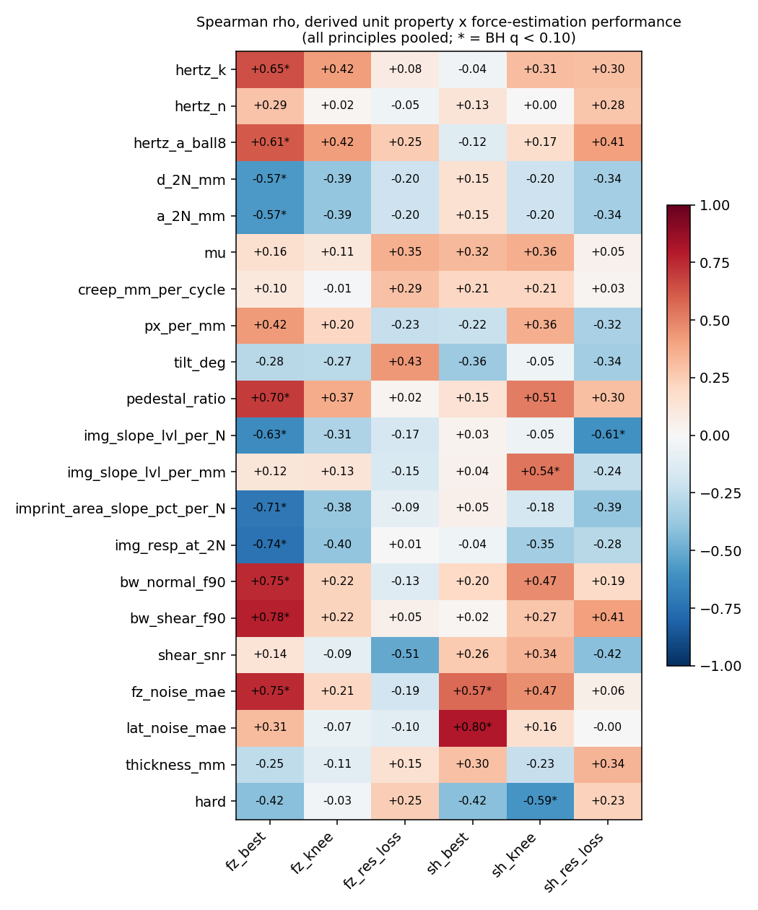
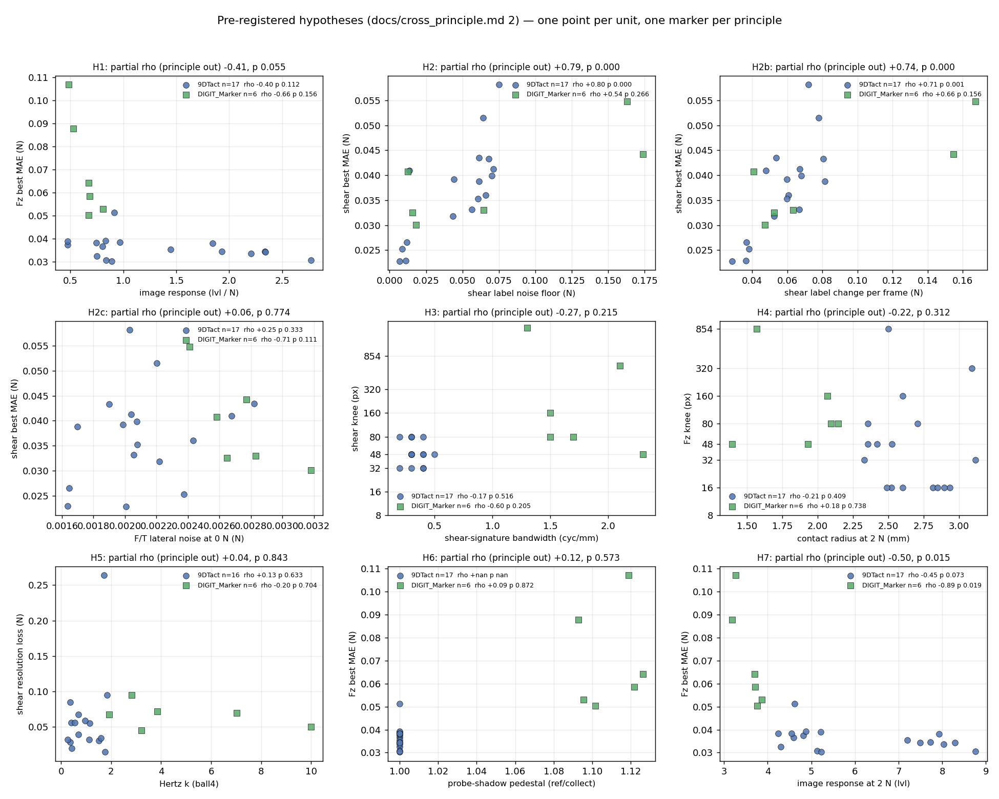

# 원리·젤·해상도 — 파생 변수, 가설, 검증

2026-09-09 밤. 운용자 지시: 학습을 돌리는 동안 지금까지 모은 데이터에서 구할 수 있는 모든
양을 정리하고, 그것들이 힘 추정·형상 복원 성능과 해상도에 어떻게 연결되는지 **가설을 세우고
직접 검증**하라. 이 문서는 그 기록이다. 가설은 결과를 보기 **전에** 적었다(§2). 결과가
가설을 기각하면 그대로 남긴다.

스크립트: `derived_variables.py` → `data/derived_variables.csv`; `correlations.py` →
`data/correlations.csv`, `figures/correlations_pooled.png`; `cross_principle.py` →
`figures/cross_principle_fz.png`; `analyse_saturation.py` → 원리별 `figures/saturation_*.png`.

## 0. 비교의 규칙

**두께나 경도가 하나라도 다르면 다른 센서다.** 원리 간 비교는 같은 (경도, 두께) 칸 안에서만
한다 — 9DTact soft 1 mm 두 유닛 대 DIGIT soft 1 mm 두 유닛. "DIGIT 전체 평균 대 9DTact
전체 평균"은 젤 분포가 같아도 젤 자체가 다른 물건이므로(마커 젤은 Hertz k 가 1.64 배) 쓰지
않는다. 학습 조건은 모든 해상도·모든 원리에서 같다: ResNet-18, 배치 64(경사 누적), 30 epoch,
검증 집합으로 epoch 선택, 사이클 분할(경계 공동 선택, 테스트 ≥ 8 %), Fz ≤ 2 N 필터, 전단
오차는 전단 블록 프레임에서만.

## 1. 유닛마다 구할 수 있는 양 (`derived_variables.csv`)

| 군 | 변수 | 어디서 | 뜻 |
|---|---|---|---|
| 젤 | `hertz_k`, `hertz_n` | Pass A ball4 사다리, F = k·dⁿ | 강성, 기재 개입(n > 1.5) |
| | `hertz_a_ball8`, `d_2N_mm`, `a_2N_mm` | Pass B zero 적합; 2 N 에서의 깊이; a = √(2Rd − d²), R = 4 | ball8 강성, 접촉 반경 |
| | `mu` | 전단 최대 / 그때의 Fz | 마찰 계수 (0.41–0.69) |
| | `creep_mm_per_cycle` | 전단 사이클 시작 깊이의 기울기 | 홀드 중 크리프 |
| 광학 | `px_per_mm`, `tilt_deg` | Pass A scale.yaml | 축척, 젤 기울기 |
| | `pedestal_ratio` | reference.png / 올바른 기준 | 프로브 그림자(DIGIT 1.09–1.15, 9DTact 1.00) |
| | `img_slope_lvl_per_N`, `img_slope_lvl_per_mm` | 정규 블록 0.2–2 N, 전체 프레임 \|diff\| 평균의 기울기 | **이미지 응답률** — 뉴턴당·mm 당 그림이 얼마나 변하나 |
| | `imprint_area_slope_pct_per_N`, `img_resp_at_2N` | 같은 구간 | 자국이 얼마나 넓어지나, 2 N 에서의 응답 |
| | `bw_normal_f90`, `bw_shear_f90`, `shear_snr` | 잡음 차감 스펙트럼, 0–3 c/mm | 자국·전단 신호의 공간 대역폭, 전단 S/N |
| 라벨 | `fz_noise_mae`, `lat_noise_mae` | 세그먼트 안 2 차 차분 | 프레임별 라벨의 "잡음 바닥" — **단단한 젤에서는 램프의 힘 스텝 거칠기를 읽는다** (아래) |
| | `fz_rate_per_frame`, `lat_rate_per_frame` | 세그먼트 안 연속 프레임 \|ΔF\| 중앙값 | 프레임당 라벨이 얼마나 움직이나 — 라벨과 노출 창의 불일치 크기 |
| | `fz_sd_0N`, `lat_sd_0N` | `ft.csv` 의 \|Fz\| < 0.05 N 인 1 s 창들의 sd | **F/T 센서 자신의 잡음** |
| 성능 | `fz_best/knee/res_loss`, `sh_best/knee/res_loss` | 해상도 스윕 (`analyse_saturation`) | 최소 오차, 무릎, 해상도 손실 |
| | `n_resolved`, `dip_175_max`, `um_per_level`, `cyl4_corrected_rms` | 9DTact 만, Pass A | 공간 분해능·형상 복원 |

### 1.1 "라벨 잡음 바닥" 은 센서 잡음이 아니었다

첫 상관 표에서 DIGIT_Marker 유닛의 `lat_noise_mae` 가 0.16–0.17 N 으로 9DTact(0.01–0.07)의
3–10 배였다. 같은 F/T, 같은 DAQ 인데 그럴 수 없다. `ft.csv` 의 0 N 구간에서 센서 잡음을 직접
재면 **세 원리가 같다**: Fz sd 0.0145 / 0.0156 / 0.0158 N, 측면 0.0022 / 0.0026 / 0.0024 N
(9DTact / DIGIT / DIGIT_Marker, 각 6 런 중앙값, 49.5–49.9 Hz). 2 차 차분 추정기는 램프가 국소
선형이라고 가정하는데, 단단한 젤에서는 세그먼트 하나가 0.3–0.6 N 을 뛰어 그 가정이 깨진다 —
추정기가 읽는 것은 **힘 스텝의 거칠기**다. 그래서 세 변수로 나눴다: 센서 잡음(`*_sd_0N`), 프레임당
라벨 변화(`*_rate_per_frame`), 그리고 옛 추정기(`*_noise_mae`, 참고용). `force_estimation.md` §3.1
의 "라벨 잡음 바닥 0.028 N" 은 9DTact 안에서는 여전히 유효한 하한이지만, 원리 간 비교에는 쓰지 않는다.

## 2. 가설 (결과 전에 적음)

- **H1 응답률 → 힘 바닥.** `img_slope_lvl_per_N` 이 클수록(뉴턴당 그림이 많이 변할수록) `fz_best` 가 낮다. 근거: 망은 결국 밝기 변화를 읽는다(§force_estimation 3.2, 스칼라 두 개로 R² 0.94).
- **H2 라벨 잡음 → 힘 바닥.** `fz_noise_mae` 가 `fz_best` 의 하한을 정한다(9DTact 에서 ρ +0.55 였다). 원리를 합쳐도 성립해야 한다.
- **H3 대역폭 → 무릎.** `bw_normal_f90` 이 `fz_knee` 를, `bw_shear_f90` 이 `sh_knee` 를 정한다(Nyquist). 예상: 상관은 있으되 범위가 1.5–1.7 배라 한 칸 안.
- **H4 접촉 반경 → 무릎: 없음.** `a_2N_mm` 은 `fz_knee` 와 무관해야 한다 — 볼이 자국 모양을 정한다는 §2.3b 의 논리.
- **H5 강성 → 전단 해상도 손실.** `hertz_k` 가 클수록 `sh_res_loss` 가 크다(9DTact ρ +0.49). DIGIT 에서도 같은 방향이면 원리 무관한 젤의 성질.
- **H6 프로브 그림자 → DIGIT 의 힘 바닥.** `pedestal_ratio` 가 큰 유닛이 `fz_best` 가 나쁘다 — 그림자가 "darker" 채널의 동적 범위를 잡아먹는다면. 대안: 올바른 기준을 쓰면 무관해야 한다(우리는 올바른 기준으로 학습한다 → **무관이 예측**).
- **H7 원리 간, 같은 젤 칸에서.** DIGIT_Marker 의 Fz 바닥이 9DTact 보다 높다(첫 3 유닛 0.09–0.14 대 0.05). 예상 이유: 응답률(H1)이 낮거나 라벨 잡음(H2)이 높다 — 둘 중 어느 쪽인지 파생 변수가 가른다.
- **H9 마커는 전단의 해상도 이득을 늘린다** (§4 중간 결과를 보고 추가, 비마커 DIGIT 스윕 **전에** 적음).
  마커 점은 전단 변위를 직접 보여주므로, 같은 젤 칸에서 DIGIT_Marker 의 전단 오차는 1920×1080 까지 계속
  내려가고(과적합 팔이 없고) 비마커 DIGIT 은 9DTact 처럼 평평하거나 U 자여야 한다. 검증: 비마커 DIGIT
  스윕의 `sh` 곡선 오른팔.
- **H10 DIGIT_Marker 의 Fz 바닥이 높은 이유는 응답률이다** (같은 시점에 추가). 같은 젤 칸에서
  `img_resp_at_2N`·`img_slope_lvl_per_N` 이 9DTact 보다 낮은 만큼 `fz_best` 가 높다. 대안 가설: 마커
  점이 자국 면적을 가려 정보가 준다 — 그러면 비마커 DIGIT 의 응답률은 9DTact 와 비슷한데 Fz 바닥은
  마커와 비슷해야 한다(응답률이 아니라 원리의 문제). 검증: 세 원리의 (응답률, Fz 바닥) 쌍.
- **H8 형상 복원(9DTact) 과 힘 추정은 다른 것을 요구한다.** `um_per_level`(형상의 양자화 한계)은 `fz_best` 와 무관하고, `n_resolved`(공간 분해능)는 `sh_knee` 와 상관한다.

## 3. 결과

### 3.1 H8 — 형상 복원과 힘 추정은 같은 것을 요구하나 (9DTact 17, `shape_vs_force.py`)

형상 쪽 지표(`shape_vs_resolution_summary`: 실패 크기, 48·32 px 에서의 지름 편향, 48·16 px 에서
쓰인 그레이 레벨 수; `contact_radius`: 분해된 간격 수 `n_resolved`, 175 µm 딥, 레벨당 µm)와
힘 쪽 지표(3 시드 스윕의 Fz·전단 최소/무릎/해상도 손실)를 42 쌍으로 본 것.

| 형상 지표 | 힘 지표 | n | ρ | p | BH q |
|---|---|---|---|---|---|
| `lev_16` (16×9 에서 형상이 쓰는 레벨 수) | **전단 최소** | 16 | **−0.72** | 0.002 | **0.063** |
| `n_resolved` (분해된 간격 수) | 전단 해상도 손실 | 17 | −0.54 | 0.024 | 0.27 |
| `bias_32`, `bias_48` (저해상도 지름 편향) | 전단 최소 | 17 | −0.54, −0.52 | 0.03 | 0.27 |
| `lev_16` | 전단 무릎 | 16 | −0.48 | 0.058 | 0.36 |
| `um_per_level` | Fz 최소 | 17 | +0.45 | 0.073 | 0.36 |

읽기: **형상이 저해상도에서 살아남는 유닛은 전단도 잘 읽는다.** 16×9 에서 그레이 레벨을 더 많이
쓰는(자국이 더 깊고 넓게 찍히는) 유닛일수록 전단 바닥이 낮고(ρ −0.72), 간격을 더 많이 분해하는
유닛일수록 저해상도에서 전단을 덜 잃는다(ρ −0.54). Fz 와는 약하다(p 0.07–0.09). 이것은 H8 의
방향과 맞는다 — **전단은 공간 정보를 쓰는 채널이고 형상 복원과 같은 종류의 그림을 요구한다**,
Fz 는 적분량이라 그렇지 않다. 다만 42 쌍 중 BH q < 0.1 은 하나뿐이고 n = 16–17 이다.
"형상 무릎 = 힘 무릎" 같은 일대일 대응은 보이지 않는다(형상 `fail_at` 은 대부분 8×5, 힘 무릎은
16–80 px).

### 3.2 파생 변수 × 성능 (`correlations.py`, 53 유닛 중 성능이 있는 23: 9DTact 17 + DIGIT_Marker 6)

**세 원리를 그냥 합치면 거의 모든 것이 "유의"해진다** — 150 쌍 중 25 가 BH q < 0.10. DIGIT_Marker
가 9DTact 보다 Fz 바닥이 높고, 동시에 젤이 단단하고, 자국이 좁고, 응답률이 낮고, 그림자 페데스탈이
있고, 라벨이 프레임당 더 움직이므로, 그 모든 변수가 `fz_best` 와 "상관" 한다. 원리를 통제한
편상관(원리별 평균 순위 제거)에서는 **3 쌍만 남는다**, 전부 전단 바닥에 대한 것이다:

| x | y | n | 편상관 ρ | q |
|---|---|---|---|---|
| `lat_noise_mae` (전단 라벨의 2 차 차분) | 전단 최소 | 23 | **+0.79** | 0.001 |
| `lat_rate_per_frame` (프레임당 전단 라벨 변화) | 전단 최소 | 23 | **+0.74** | 0.004 |
| `fz_noise_mae` | 전단 최소 | 23 | +0.66 | 0.030 |

9DTact 안에서만 봐도 같다(138 쌍, q < 0.10 두 개: 같은 두 변수 → 전단 최소, ρ +0.80 / +0.71).
그리고 **F/T 센서 자신의 잡음(`lat_sd_0N`)은 전단 최소와 무관하다**(편상관 +0.06, p 0.77; 9DTact
안 +0.25, p 0.33). 결론: **전단 추정의 바닥을 정하는 것은 센서 잡음이 아니라 "한 프레임 안에서 힘이
얼마나 움직이는가"** 다. 5 fps 카메라의 200 ms 노출 동안 힘이 0.03–0.17 N 움직이면 그 프레임의 라벨은
어느 순간의 힘인지 정의되지 않고, 그 크기가 그대로 바닥이 된다. 단단한 젤은 같은 글라이드 속도에서
힘이 더 빨리 변하므로 바닥이 높다 — 그런데 hard 의 전단 바닥이 가장 낮았다(§force_estimation 2.3b).
모순이 아니다: `lat_rate_per_frame` 은 유닛별 편차를 설명하는 것이고 경도 중앙값은 다른 요인
(자국의 선명도)이 정한다. 두 효과가 겹쳐 있다.

**가설 판정** (편상관 = 원리 통제):

| | 판정 | 근거 |
|---|---|---|
| H1 응답률 → Fz 바닥 | **부분 지지** | `img_slope_lvl_per_N` ρ −0.41 p 0.055; `img_resp_at_2N` (H7) ρ **−0.50 p 0.015**. 마커 6 유닛은 3.2–3.8 lvl, 9DTact 4.2–8.8 lvl |
| H2 라벨 잡음 → 바닥 | **재해석하여 지지** | 센서 잡음(`*_sd_0N`)은 무관, **프레임당 라벨 변화**가 전단 바닥을 정한다 |
| H3 대역폭 → 무릎 | **기각** | `bw_shear_f90` → 전단 무릎 ρ −0.27 p 0.22; `bw_normal_f90` → Fz 무릎 −0.08 |
| H4 접촉 반경 → Fz 무릎 없음 | **예측대로** | ρ −0.22 p 0.31 |
| H5 강성 → 전단 해상도 손실 | **기각(이 표본에서)** | `hertz_k` ρ +0.04 p 0.84; 경도 순위로는 +0.44 p 0.04 (§2.3b 의 p 0.048 과 같은 약한 신호) |
| H6 그림자 → Fz 바닥 | **예측대로 무관** | 편상관 +0.12 p 0.57 (올바른 기준으로 학습했으므로) |
| H7 2 N 응답 → Fz 바닥 | **지지** | ρ −0.50 p 0.015; 마커 안에서 ρ −0.89 p 0.019 (n 6) |

**자기비판.** (i) n = 23, 150 쌍 — 편상관 표의 q 는 믿을 만하지만 개별 p 0.02–0.05 는 아니다.
(ii) 성능 지표가 원리마다 시드 수가 다르다(9DTact 3, 마커 1) — 마커의 무릎·손실은 잠정.
(iii) `lat_rate_per_frame` 과 `lat_noise_mae` 는 거의 같은 것을 잰다(둘 다 프레임 간 힘 변화); 독립
증거가 아니다. (iv) 해상도 **무릎**을 예측하는 변수는 하나도 없다 — 무릎은 젤·광학과 무관하게
48 px 근처에 있다는 §2.3b 의 결론과 정합하지만, "무릎을 정하는 것이 무엇인가" 는 아직 답이 없다.
가장 그럴듯한 답은 "자국을 만드는 볼의 크기" 이고 그건 이 캠페인에서 변하지 않았다(`data_wishlist` #1).

### 3.3 H10 의 재료: 마커 센서는 뉴턴당 이미지 응답이 작다 (53 유닛, 학습 불필요)

§3.2 가 찾은 두 바닥 예측자 — Fz 바닥 ← 2 N 에서의 차영상 응답, 전단 바닥 ← 라벨의 움직임 — 은
학습 결과를 기다리지 않고 파생표만으로 세 원리 전부에서 셀별로 비교할 수 있다. 각 (경도, 두께) 셀의
중앙값을 **9DTact / DIGIT / DIGIT_Marker** 순으로 적었다.

먼저 시간 척도를 맞춰야 한다. §3.2 가 쓴 `lat_rate_per_frame` 은 **저장된 프레임 사이**의 라벨 변화인데,
저장 간격이 9DTact 412 ms 대 DIGIT 계열 196 ms 이고 한 프레임의 라벨을 만드는 평균 창
(`t_exposure_start`→`t_img`)은 205 ms 대 60 ms 다. 즉 "프레임당" 은 원리 간 같은 양이 아니다. 그래서
라벨을 실제로 모호하게 만드는 양 — **그 창 안에서 힘이 움직인 폭** — 을 50 Hz F/T 스트림에서 직접 재고
(`scripts/label_blur.py` → `data/label_blur.csv`), 글라이드 페이싱 자체는 초당 값으로 비교한다.

| 셀 | 이미지 응답 @2 N (레벨) | 마커/9DTact | 창 안 Fz 이동 (N) | 창 안 전단 이동 (N) | Fz 속도 (N/s) |
|---|---|---|---|---|---|
| soft 1 mm | 4.6 / 4.0 / 3.2 | 0.70 | 0.0543 / 0.0299 / 0.0358 | 0.0147 / 0.0061 / 0.0064 | 0.14 / 0.37 / 0.52 |
| soft 2 mm | 8.4 / 4.8 / 3.7 | 0.44 | 0.0471 / 0.0278 / 0.0315 | 0.0124 / 0.0063 / 0.0071 | 0.10 / 0.29 / 0.41 |
| soft 3 mm | 8.0 / 4.3 / 3.8 | 0.48 | 0.0465 / 0.0278 / 0.0311 | 0.0120 / 0.0067 / 0.0072 | 0.09 / 0.28 / 0.46 |
| medium 1 mm | 4.6 / 4.3 / 3.7 | 0.80 | 0.0505 / 0.0335 / 0.0342 | 0.0151 / 0.0060 / 0.0072 | 0.13 / 0.40 / 0.51 |
| medium 2 mm | 7.5 / 5.1 / 3.5 | 0.47 | 0.0497 / 0.0277 / 0.0292 | 0.0122 / 0.0063 / 0.0076 | 0.11 / 0.30 / 0.32 |
| medium 3 mm | 7.6 / 4.6 / 4.0 | 0.52 | 0.0503 / 0.0259 / 0.0317 | 0.0149 / 0.0064 / 0.0079 | 0.12 / 0.22 / 0.35 |
| hard 1 mm | 4.4 / 4.4 / 2.8 | 0.63 | 0.0439 / 0.0318 / 0.0371 | 0.0106 / 0.0061 / 0.0061 | 0.10 / 0.38 / 0.46 |
| hard 2 mm | 5.2 / 4.8 / 3.5 | 0.67 | 0.0445 / 0.0287 / 0.0326 | 0.0118 / 0.0063 / 0.0065 | 0.11 / 0.31 / 0.37 |
| hard 3 mm | 5.0 / 4.2 / 3.4 | 0.68 | 0.0477 / 0.0274 / 0.0311 | 0.0148 / 0.0073 / 0.0070 | 0.11 / 0.28 / 0.33 |

**이미지 응답.** DIGIT_Marker 는 모든 셀에서 9DTact 의 0.44–0.80 배, DIGIT 은 0.53–0.98 배다. 격차는
**얇고 단단한 셀에서 가장 작고 두껍고 부드러운 셀에서 가장 크다**: 9DTact 의 응답은 4.5 → 8.4 레벨로
두께·연성에 따라 거의 두 배가 되는데 DIGIT 계열은 3–5 레벨에 머문다. 9DTact 는 검은 안료층의 접촉 압력에
따른 투과율을 읽으므로 겔이 깊이 눌릴수록 신호가 커지고, DIGIT 은 측면 조명의 표면 명암을 읽으므로 압입이
깊어져도 대비가 포화한다. 그러므로 **H10("마커 Fz 바닥이 높은 이유는 응답 부족")은 파생표 수준에서 이미
성립**하고, 가장 큰 격차가 예상되는 셀은 soft·medium × 2–3 mm 다 — §4 잠정 결과에서 마커 Fz 바닥이
9DTact 의 1.5–2.5 배였던 셀과 일치한다.

**검증: 전체 화면 평균이 아니라 접촉 안에서 재도 같은가.** `img_resp_at_2N` 은 화면 전체의 |차영상| 평균이라
시야가 넓을수록(16.4–24.8 mm) 희석되고, 마커에서는 점의 가장자리가 신호를 대신할 수 있다. 그래서
`scripts/contact_response.py` 로 **접촉 원 안에서만**, 마커 점을 가린 채 다시 쟀다(50 유닛). 결론은 바뀌지
않고 오히려 강해진다: 마커/9DTact 비가 전체 화면에서는 0.44–0.80 이었는데 접촉 안에서는
**0.20–0.56**, DIGIT/9DTact 는 0.25–0.79 다
(원리별 중앙값 14.5 / 8.6 / 5.5 레벨). 접촉 밖 고리(반지름 2–3 배)의 응답은
1.4–2.4 레벨로 배경이며, 접촉/고리 대비는 9DTact 6.1, DIGIT 5.9,
마커 3.9 로 마커가 가장 낮다 — 점이 배경 쪽 변화를 키우기 때문이다. 학습 바닥과의 관계도 두
측정이 같은 방향이다(`fz_best` 원리 통제 ρ −0.49 접촉 / −0.62 전체 화면).

**힘이 얼마나 빨리 움직이나.** 초당 값으로 보면 DIGIT 계열이 9DTact 의 3–7 배 빠르다(Fz 0.22–1.01 대
0.06–0.17 N/s). 글라이드 페이싱이 mm/s 기준이고 DIGIT 겔이 같은 경도 라벨에서도 9DTact 보다 강성이 높기
때문이다(campaign_protocol.md §4.4, Hertz k 1.64 배). 그런데 노출 창이 3.4 배 짧으므로 **창 안에서의 이동은
9DTact 가 오히려 크다**(Fz 0.047 대 0.028/0.033 N). 두 효과가 반대 방향이라 원리 간 라벨 모호성은 뒤집힌다 —
그래서 이 양으로 원리 간 바닥 차이를 설명할 수는 없다(§3.4).

**전단 창 안 이동은 작다.** 0.006–0.015 N 으로 세 원리 모두 Fz 이동의 1/4 이하다. 마커 전단 바닥이 9DTact 와
다르게 나오면 그것은 라벨 쪽이 아니라 이미지 쪽 차이 — 마커 점 변위 대 명암 비대칭 — 이고, 이것이 H9 의
검증 대상이다.

이 절은 학습 **전** 예측이다. DIGIT/DIGIT_Marker 스윕이 끝나면 §4 의 셀별 바닥과 이 표를 짝지어
"응답이 작을수록 Fz 바닥이 높다" 가 원리를 가로질러도 성립하는지 확인한다(원리 통제 편상관은 §3.2 에서
ρ −0.50, 학습 바닥으로는 §3.4 에서 −0.46).

### 3.4 힘 바닥의 오차 예산: 라벨이 어디까지 설명하나 (23 유닛)

§3.2 는 바닥 예측자를 상관으로만 짚었고, 그 예측자(`*_noise_mae`)는 연속 프레임 라벨의 2차 차분이라
"센서 잡음" 이 아니라 라벨의 움직임을 읽는다는 것까지만 말할 수 있었다. §3.3 의 `label_blur.py` 는 같은 것을
**모델과 무관하게** 잰다: 한 프레임의 라벨을 만드는 창(`t_exposure_start`→`t_img`) 안에서 힘이 움직인 폭.

**결과 1 — 창 안 이동은 학습된 바닥을 예측한다.** 원리 통제 순위 편상관(n = 23):

| 대상 | 창 안 Fz 이동 | 창 안 전단 이동(p90) | 2 N 이미지 응답 |
|---|---|---|---|
| `fz_best` | **+0.63** (p 0.001) | +0.45 (p 0.031) | −0.46 (p 0.025) |
| `sh_best` | **+0.68** (p 0.000) | **+0.69** (p 0.000) | 유의하지 않음 |
| `fz_knee` / `sh_knee` | 없음 | 없음 | 없음 |

9DTact 안에서만 봐도(n = 17, 원리 혼입이 아예 없다) `fz_best` +0.62 (p 0.008), `sh_best` +0.78 (p 0.000) 로
같은 방향이다. 무릎 위치는 여전히 아무 것도 예측하지 못한다 — 바닥과 무릎은 서로 다른 것이 정한다.

**결과 2 — 그런데 원리 간 바닥 차이는 이것으로 설명되지 않는다.** 9DTact 의 창 안 Fz 이동은 0.047 N 으로
DIGIT_Marker(0.033 N)보다 **크지만** `fz_best` 는 오히려 낮다(0.036 대 0.061 N). 원리를 통제하지 않고 보면
상관이 사라진다(ρ +0.02). 즉 창 안 이동은 **한 원리 안에서 어느 유닛이 더 나쁜지**를 정하고, **원리 사이의
수준 차이**는 이미지 응답이 정한다(§3.3). 원리를 통제하지 않은 상관을 보고 "라벨이 전부" 라고 말하면 틀린다.

**결과 3 — 오차 예산.** 창 안에서 힘이 폭 `blur` 로 램프처럼 지나가면 한 프레임의 참값은 창 평균에서 평균
`blur/4` 만큼 벗어난다. 창 안 F/T 잡음은 `sd(0 N)/√(창 안 표본 수)` 로 남는다(9DTact 는 창에 10 표본,
DIGIT 계열은 3 표본). 나머지를 제곱합 분해로 잔차로 돌린 값이다.

| 원리 | `fz_best` | 라벨 모호성 | F/T 잡음 | 잔차 | `sh_best` | 라벨 모호성 | F/T 잡음 | 잔차 |
|---|---|---|---|---|---|---|---|---|
| 9DTact | 0.0355 | 0.0118 | 0.0043 | 0.0325 | 0.0388 | 0.0030 | 0.0007 | 0.0387 |
| DIGIT_Marker | 0.0614 | 0.0082 | 0.0085 | 0.0604 | 0.0369 | 0.0017 | 0.0016 | 0.0368 |

라벨 모호성은 Fz 바닥의 진폭 기준 9DTact 33 %, 마커 13 % 이고 제곱합 기준으로는 각각 11 %, 2 % 다. 전단은
훨씬 작다(진폭 9 % / 5 %) — 전단 글라이드 동안 측면 힘은 느리게 움직인다. **F/T 잡음은 어느 채널에서도
바닥을 정하지 않는다**(0.001–0.009 N). 그러므로 바닥의 대부분(제곱합 89 % 이상)은 라벨도 센서 잡음도 아닌
**이미지와 모델** 쪽에 있다 — 힘을 이미지에서 읽어내는 일 자체의 한계다.

**주의.** 이 분해는 라벨 오차가 시험 시점에만 더해진다고 가정한다. 실제로는 학습에도 들어가므로 라벨을
나쁘게 만들면 바닥은 `blur/4` 보다 훨씬 크게 올라간다 — 그것을 재는 것이 §3.7 의 라벨 창 절제다.

### 3.5 마커 격자가 접촉보다 굵다: H9 의 전제가 이 프로브에서는 성립하지 않는다

H9 은 "마커가 전단의 해상도 이득을 키운다" 고 예측했다. 그 전제는 마커 변위장이 전단을 읽을 만큼
표본화된다는 것이다. 격자와 접촉을 같은 자로 재보면(`scripts/marker_geometry.py` → `data/marker_geometry.csv`,
18 유닛, 각 유닛 자기 기준 이미지에서):

| 양 | 중앙값 | 범위 |
|---|---|---|
| 점 간격 | **3.00 mm** (284 px) | 2.69–3.15 mm |
| 점 지름 | 1.09 mm (97 px) | 0.74–1.15 mm |
| 2 N 접촉 지름 (ball8, Hertz) | **3.78 mm** (349 px) | 2.79–4.61 mm |
| 접촉 지름 / 점 간격 | **1.26** | 0.94–1.56 |
| 접촉 안의 점 개수 | **1.24** | 0.70–1.92 |

**접촉 하나에 점이 한 개 남짓 들어온다.** 그러므로 이 프로브에서 마커 채널이 실어 나르는 것은 변위 "장" 이
아니라 사실상 벡터 한 개다. 전단의 비대칭을 점 배치로 읽을 표본이 없다 — H9 은 **가설이 틀렸다기보다 이
데이터로는 시험할 수 없다**. 게다가 불투명한 점이 시야의 약 10 % 를
가리므로, 마커 유닛에서 남는 정보는 점 사이의 명암 압흔이고 그 압흔은 부분적으로 가려져 있다. §4 에서 마커의
Fz 무릎이 9DTact 보다 높게 나오면(잠정 80 대 32 px) 그 원인으로 이 가림을 먼저 의심해야 한다.

**공이 어디에 떨어졌나 (가림의 크기).** 프로브는 매 유닛 같은 자리(≈ 화면 (900, 700))에 내려오지만 겔을 다시
장착할 때마다 격자의 위상이 달라진다. 접촉 중심에서 가장 가까운 점까지 50–142 px
(간격의 0.19–0.46 배)이고, **접촉 원의 8–16 %가 불투명한 점 아래에
들어간다**(`data/marker_occlusion.csv`). 접촉 반지름이 175 px 인데 가장 가까운 점이 그보다 가까우니
**모든 유닛에서 접촉이 점과 겹친다** — 겹치지 않게 놓인 유닛이 하나도 없어서, 가림의 유무를 대조할 수는 없고
정도(8–16 %)만 비교할 수 있다. 마커 스윕이 끝나면 이 값과 유닛별 바닥의 관계를 §4 에서 확인한다.

**해상도 쪽 예측도 뒤집힌다.** 점이 2 px 로 유지되는 폭은 40 px, 간격이 2 px 로 유지되는 폭은
14 px 다. 즉 **격자 자체는 아주 낮은 해상도까지 살아남는다** — 마커 유닛의 높은 무릎은
"점이 안 보여서" 가 아니다. 무릎은 여전히 압흔이 정한다.

**측정 방법 주의.** 점 검출을 면적으로 거르는데 첫 판은 상한을 4000 px² 로 두어 진짜 점(약 9500 px²)을 모두
버리고 잡티만 세어 "점 지름 6 px" 이라는 값을 냈다. 기준 이미지를 직접 열어보고서야 드러났다. 지금은 최근접
간격과 자기상관 첫 링 두 가지로 재고 서로 5 % 안에서 일치한다(`pitch_px` 대 `pitch_nn_px`).

### 3.6 그림이 요구하는 최소 폭: 두께 효과는 DIGIT 에만 있고 9DTact 에는 없다 (53 유닛, 학습 불필요)

이 캠페인의 질문 — "오차가 포화하는 해상도가 겔에 따라 달라지는가" — 은 학습 없이 **그림 쪽에서 먼저**
물어볼 수 있다. 압흔(과 전단이 더하는 쌍극자)의 공간 스펙트럼에서 에너지의 90 % 가 들어가는 주파수 `f90`
아래를 표본화하려면 폭이 얼마나 필요한지 세면 된다: `필요 폭 = 2 · f90[cyc/px] · 1920`.

**cyc/mm 이 아니라 cyc/px 로 세야 한다.** 겔이 두꺼울수록 표면이 높아 배율이 달라지고
(campaign_protocol.md §4.3), 실제로 `px_per_mm` 은 두께와 ρ −0.81…−0.94 로 얽혀 있다(시야 16.4–24.8 mm).
cyc/mm 으로 재면 이 배율 변화가 두께 효과로 둔갑한다 — 9DTact 의 cyc/mm 은 두께 ρ −0.55 (p 0.022) 인데
cyc/px 로 바꾸면 ρ +0.12 (p 0.64) 로 사라진다. 아래는 모두 cyc/px 기준이다.

| 원리 | 채널 | 필요 폭 | 두께 1/2/3 mm 중앙값 | 두께 ρ | 경도 ρ |
|---|---|---|---|---|---|
| 9DTact | 법선 | 8–12 px | 10 / 8 / 9 | +0.12 (p 0.642) | -0.16 (p 0.546) |
| 9DTact | 전단 | 9–20 px | 15 / 13 / 14 | -0.25 (p 0.333) | +0.09 (p 0.723) |
| DIGIT | 법선 | 17–30 px | 24 / 19 / 17 | -0.87 (p 0.000) | +0.12 (p 0.641) |
| DIGIT | 전단 | 33–44 px | 41 / 41 / 41 | +0.00 (p 1.000) | +0.07 (p 0.796) |
| DIGIT_Marker | 법선 | 24–70 px | 45 / 53 / 58 | +0.31 (p 0.213) | +0.22 (p 0.374) |
| DIGIT_Marker | 전단 | 47–105 px | 54 / 87 / 95 | +0.75 (p 0.000) | +0.14 (p 0.568) |

**읽는 법.**
1. **원리가 요구량의 자릿수를 정한다.** 9DTact 8–20 px, DIGIT 17–44 px, DIGIT_Marker 24–105 px. 9DTact 의
   압흔은 안료층의 완만한 명암이라 저주파이고, DIGIT 은 표면 명암의 경사라 더 날카로우며, 마커 유닛에서는
   점의 가장자리가 스펙트럼을 지배한다(§3.5). 측정된 무릎의 순서(9DTact 32/48 px, 마커 80/120 px)와 방향이
   같다 — 다만 절대값은 Nyquist 예측의 1.4–3 배로, 신경망은 표본화 한계보다 여유를 더 요구한다.
2. **두께 효과는 원리마다 다르다.** DIGIT 의 법선 압흔은 겔이 두꺼울수록 요구량이 **줄어든다**
   (24 → 19 → 17 px, ρ −0.87, p 0.000): 두꺼운 층이 변형을 옆으로 퍼뜨려 저역통과 필터처럼 작동한다.
   9DTact 에서는 이 효과가 없는데(ρ +0.12), 이미 요구량이 8–12 px 로 바닥에 붙어 있어 더 흐려질 여지가 없다.
   마커의 전단은 반대로 두꺼울수록 **늘어난다**(54 → 87 → 95 px, ρ +0.75, p 0.000) — 두꺼운 겔에서 점이 더
   많이 움직여 가장자리 차이가 커지기 때문이고, 겔이 아니라 점이 스펙트럼을 정한다는 §3.5 와 맞는다.
3. **경도는 어느 원리에서도 요구량을 바꾸지 않는다**(모든 p > 0.21). 무릎이 경도를 따르지 않았던 §2.3b 의
   결과와 일치한다.

즉 "겔 두께가 포화 해상도를 바꾼다" 는 **DIGIT 계열에서만 성립하고 9DTact 에서는 성립하지 않는다**. 이는
스윕이 끝나면 유닛별 무릎으로 직접 확인할 수 있는 예측이다(§4).

**축척 경고 (마커).** cyc/px 환산은 유닛별 `px_per_mm` 으로 나눈다. 그 값이 캘리퍼로 검증된 유닛은
9DTact 13/17, DIGIT 16/18 인데 **DIGIT_Marker 는 3/18 뿐**이다 — 나머지는 표면 높이
회귀의 예측값이다(마커 점이 교차상관 봉우리를 당겨 축척 pass 가 3/18 만 통과했다, `data_wishlist.md` #5).
따라서 이 표에서 **마커 행의 절대값은 잠정**이다. 두 가지가 그나마 안전하다: (a) 원리 사이의 순서 — 마커의
요구량이 9DTact 의 5–8 배라는 결론은 회귀가 10 % 틀려도 뒤집히지 않는다, (b) 마커 **안에서의** 두께 추세
(ρ +0.75) — 회귀가 두께의 함수이므로 이 추세는 회귀가 만든 것일 수 있어 **가장 약한 주장**이고, #5 의 캘리퍼
pass 로 확인해야 한다.

**예측을 무릎과 맞춰보면: 원리 사이는 맞고 원리 안은 맞지 않는다.** 9DTact 17 유닛에서 예측 폭과 측정된
무릎의 순위 상관은 법선 ρ −0.48 (p 0.052), 전단 ρ −0.18 (p 0.50) 으로 **양의 관계가 없다**. 측정된 무릎은
예측의 3.5–3.7 배이고, 마커에서도 같은 방향의 배수다(법선 45 → 80 px, 전단 67 → 120 px, 잠정 6 유닛). 즉
이 계산은 **원리마다 요구되는 자릿수**를 맞히지만 **한 원리 안에서 어느 유닛이 더 많은 픽셀을 원하는지는
맞히지 못한다**. 이유로 두 가지가 겹친다: `f90` 을 0.1 cyc/mm 격자에서 읽어 9DTact 는 값이 세 개
(0.2/0.3/0.4)뿐이고, 무릎 자체가 2 배 간격의 크기 사다리에서 읽히므로 한 칸이 곧 2 배다. 그러므로 §3.6 의
두께 결론은 **그림이 요구하는 양에 대한 진술**이지 아직 학습 무릎에 대한 진술이 아니다 — DIGIT 스윕이
끝나면 그 예측(24 → 19 → 17 px)이 무릎에서도 보이는지 §4 에서 확인한다.

**주의.** `f90` 은 0.1 cyc/mm 격자에서 읽으므로 9DTact 처럼 값이 0.2–0.3 인 경우 한 칸이 곧 50 % 차이다.
9DTact 의 "효과 없음" 은 이 해상도 한계 안에서의 진술이다. `scripts/imprint_bandwidth.py --runs <dataset>`.

### 3.7 라벨 창 절제: Fz 바닥의 일부는 라벨을 언제 읽었는가로 정해진다 (3 유닛 × 2 해상도 × 5 창 × 3 seed)

§3.4 의 분해는 라벨 오차가 시험 때만 더해진다고 가정했다. 실제로는 학습에도 들어가므로, 직접 재는 방법은
**같은 그림에 라벨만 다시 붙여 다시 학습**하는 것이다(`scripts/label_window_ablation.py`). 50 Hz F/T
스트림에서 다섯 가지 창으로 라벨을 다시 만들었다:

| 창 | 정의 |
|---|---|
| `exposure` | `[t_exposure_start, t_img]` 평균 — 수집이 실제로 쓰는 라벨 |
| `instant` | `t_img` 에 가장 가까운 한 표본 |
| `pre100` | 창을 100 ms 앞으로 넓힘 |
| `sym250` / `sym500` | `t_img` 를 중심으로 ±250 / ±500 ms |

같은 유닛·해상도·seed 끼리 짝지어 비교했다(9DTact 2 유닛 n = 12 쌍, DIGIT_Marker 1 유닛 n = 6 쌍;
Wilcoxon):

| 창 | 9DTact Fz | 9DTact 전단 | 마커 Fz | 마커 전단 |
|---|---|---|---|---|
| `instant` | **×1.48** (Δ +0.017 N, p 0.007) | ×1.06 (p 0.11) | ×0.79 (p 0.56) | ×0.97 (p 0.84) |
| `pre100` | ×1.10 (p 0.79) | ×1.04 (p 0.62) | ×1.11 (p 0.69) | ×0.82 (p 0.22) |
| `sym250` | ×1.21 (p 0.20) | ×1.12 (p 0.38) | ×0.94 (p 0.44) | ×0.87 (p 0.31) |
| `sym500` | ×1.14 (p 0.18) | ×1.12 (p 0.38) | ×0.81 (p 0.03) | ×0.89 (p 0.69) |

**결과 셋.**
1. **9DTact 의 Fz 바닥은 라벨을 언제 읽었는지에 달려 있다.** 노출 창 평균 대신 순간값을 쓰면 1.48 배가 된다
   (320×180 만 보면 1.69 배). 더한 오차 +0.017 N 은 §3.4 가 예측한 라벨 몫(`blur/4` ≈ 0.012 N)과 같은 자리수다.
   **넓히는 쪽은 아무것도 개선하지 않는다** — 수집이 쓰는 노출 일치 창이 최적이다.
2. **전단은 창에 둔감하다**(모든 창에서 ×1.04–1.12, p > 0.1). 전단 글라이드 동안 측면 힘이 느리게 움직이기
   때문이고(§3.3 의 창 안 전단 이동 0.006–0.015 N), 전단 바닥은 라벨 타이밍이 아니라 그림이 정한다.
3. **마커 유닛에서는 창을 무엇으로 바꿔도 유의하지 않다.** 노출 창이 60 ms(F/T 3 표본)뿐이라 `instant` 와
   거의 같은 라벨이고, 무엇보다 이 유닛의 바닥은 이미지 응답이 정한다(§3.4 에서 라벨 몫 13 % 대 9DTact 33 %).
   `sym500` 이 Fz 를 0.81 배로 낮춘 것은 다중 비교(창 4 × 채널 2) 안에서 살아남지 않는다.

**한계.** 9DTact 2 유닛, 마커 1 유닛이고 seed 산포가 크다(cell 표준편차 0.003–0.030 N). 방향은 §3.4 의
예산과 일치하지만, "라벨 몫" 의 유닛별 값을 주장하려면 유닛 수를 늘려야 한다 — `data_wishlist.md` #13.

### 3.8 두 점 분해: DIGIT 은 1.10 mm 를 전부 분해하고, 두께 효과의 부호는 무엇을 고정하느냐로 갈린다

`data_wishlist.md` #0 의 수집을 끝냈다. **DIGIT 18 유닛 × pair025(중심간 1.25 mm) + 18 유닛 ×
pair010(1.10 mm)**, 깊이 사다리 0.1–0.9 mm(1 mm 겔은 백스톱 때문에 0.6 까지), 판정은
`scripts/analyse_resolution.py` 의 **미리 고정된** 두 기준(Rayleigh dip ≥ 0.265, Digit 360 의 MTF ≥ 0.5).
집계는 `scripts/pair_summary.py` → `data/pair_resolution.csv`.

**결과 1 — 36 런 전부가 분해한다.** pair025 18/18, pair010 18/18. 어느 유닛도 두 간격을 못 가르지 않았다.
같은 칸의 9DTact 는 네 간격(1.25–2.00 mm) 중 **하나도** 분해하지 못한 유닛이 17 중 6 이었고 두께별
중앙값이 2.5/3.0/0.5 였다(§0 의 pair 데이터). **DIGIT 의 한계는 1.10 mm 아래**이고 현재 프로브로는 못 잰다.

**결과 2 — 프로브 기하가 검증됐다.** 자국 두 덩어리의 중심간 거리는 pair025 에서 1.19–1.33 mm(설계 1.25),
pair010 에서 1.10–1.12 mm(설계 1.10)로 나온다. pair 프로브는 **간격이 알려진 자**이므로 축척 검증을 겸한다.

**결과 3 — 두께 효과의 부호가 정규화 방식에 달려 있다.** 이것이 이 pass 의 핵심이고, 둘 다 유의하다.

| 무엇을 고정하나 | 두께 1/2/3 mm 중앙값 | pair025 | pair010 |
|---|---|---|---|
| **압입 깊이** (가장 얕은 단의 dip) | 0.55 / 0.16 / 0.18 | ρ −0.49 (p 0.041) | ρ **−0.59** (p **0.007**) |
| **분해에 필요한 힘** (N) | 0.198 / 0.146 / 0.092 | ρ −0.30 (p 0.224) | ρ **−0.72** (p **0.0004**) |
| 힘 0.5 N 에서의 dip | — | ρ +0.52 (p 0.028) | ρ +0.30 (p 0.210) |
| 자국 면적 80 kpx 에서의 dip | — | ρ +0.54 (p 0.025) | ρ +0.32 (p 0.175) |

- **같은 깊이로 누르면 얇은 겔이 낫다.** 두꺼운 겔은 압흔을 옆으로 퍼뜨려 두 자국 사이 골을 메운다 —
  §3.9 의 광학(번짐 1.0 → 3.2 mm)이 재는 바로 그 효과다.
- **같은 힘으로 누르면 두꺼운 겔이 낫고, 분해에 드는 힘도 적다.** 두꺼운 겔이 더 무르므로 같은 힘에서 훨씬
  깊이 들어가고, 그 여분의 깊이가 흐릿함을 상쇄하고도 남는다.

그러므로 **"어느 겔이 공간 분해능이 좋은가" 는 누르는 방식을 정하기 전에는 답이 없다.** 규약에 기대지 않는
실용적 진술은 하나다: 두꺼운 DIGIT 겔은 1.10 mm 를 **더 가벼운 접촉으로** 분해한다(0.198 → 0.092 N).

**결과 4 — 경도는 여기서도 무효다.** 여섯 지표 × 두 프로브 열두 조합에서 전부 유의하지 않다
(pair010 p 0.38–0.78, pair025 p 0.07–0.88). §3.6(대역폭), §3.9(광학), §3.10(무릎)과 같다.

**주의 세 가지.**
1. **라벨.** pair010 pass 는 입력된 이름에서 soft 와 hard 가 **전부** 뒤바뀐 채 수집됐다. 운영자가 알렸고
   무부하 색비율 판정이 확인했으며(`campaign_protocol.md` §4.11), 폴더 이름을 실제 겔로 고쳤다
   (`RELABEL.md`). 스왑이 두께 안에서 일어났으므로 위의 두께 결론은 영향받지 않고, 경도 결론은 원래
   "효과 없음" 이었다.
2. **`sym` 은 DIGIT 에서 기울기 지표가 아니다.** 측면 조명이라 조명 쪽 기둥이 더 밝다. 기울어진 마운트는
   자국 덩어리가 하나만 남는지로 판정한다.
3. **얕은 단의 dip 은 영점 정확도에 오염된다.** 힘 적합과 이미지 개시가 0.12–0.70 mm 어긋나므로
   "0.1 mm" 가 유닛마다 같은 압입이 아니다. 그래서 위 표에 힘·면적 기준을 함께 실었다.

### 3.9 겔의 광학: 두께는 크게 바꾸고 경도는 전혀 바꾸지 않는다 (53 유닛, 학습 불필요)

경도가 다른 겔은 다른 실리콘이거나 배합비가 다르므로 광학도 달라질 수 있다. 그것을 수집된 프레임만으로
쟀다(`scripts/gel_optics.py` → `data/gel_optics.csv`). **먼저 교란 확인**: 노출·밝기·감마·대비·화이트밸런스가
53 유닛 전부 동일하다(exposure 2047, brightness 64, gamma 100, contrast 4, wb 4600). 한 원리의 유닛들은 같은
바디에 겔만 갈아 끼운 것이므로 **원리 안에서의 비교는 겔 비교**다. 원리 사이는 조명도 물리도 달라 비교하지
않는다. 값은 카메라 레벨이며 방사 측정이 아니다.

| 원리 | 양 | 두께 1/2/3 mm 중앙값 | 두께 ρ | 경도 ρ |
|---|---|---|---|---|
| 9DTact | 무부하 밝기 | 70.57 / 97.01 / 127.06 | +0.94 (p 0.000) | +0.14 (p 0.584) |
| 9DTact | 중심/가장자리 | 1.15 / 1.25 / 1.35 | +0.94 (p 0.000) | -0.13 (p 0.623) |
| 9DTact | 확산 (고리/가장자리) | 0.73 / 0.77 / 0.65 | -0.20 (p 0.472) | -0.20 (p 0.485) |
| DIGIT | 무부하 밝기 | 67.26 / 69.34 / 69.82 | +0.26 (p 0.293) | -0.08 (p 0.756) |
| DIGIT | 중심/가장자리 | 1.25 / 1.30 / 1.30 | +0.52 (p 0.025) | +0.00 (p 1.000) |
| DIGIT | 확산 (고리/가장자리) | 0.40 / 0.46 / 0.65 | +0.84 (p 0.000) | +0.09 (p 0.717) |
| DIGIT_Marker | 무부하 밝기 | 54.29 / 56.82 / 60.14 | +0.52 (p 0.025) | -0.16 (p 0.533) |
| DIGIT_Marker | 중심/가장자리 | 1.20 / 1.25 / 1.30 | +0.62 (p 0.006) | -0.16 (p 0.533) |
| DIGIT_Marker | 확산 (고리/가장자리) | 0.51 / 0.58 / 0.53 | +0.04 (p 0.894) | +0.36 (p 0.159) |

**경도는 어떤 광학량도 바꾸지 않는다.** 세 원리 × 세 양, 아홉 조합 전부에서 유의하지 않다(p 0.16–1.00,
|ρ| ≤ 0.36). 배합이 달라 강성은 2 배 이상 달라지지만(campaign_protocol.md §4.4), 그 차이가 **투과·산란·
균일도에는 나타나지 않는다**. 힘 추정과 분해능에서 경도가 계속 무효였던 것(§2.3b, §3.6)과 앞뒤가 맞는다.

**두께는 원리마다 다른 방식으로 크게 바꾼다.**
1. **9DTact — 밝기가 두 배가 된다** (63 → 98 → 131 레벨, ρ +0.94, p < 0.001). 흡수(Beer–Lambert)라면 두꺼울수록
   어두워야 하므로 이건 흡수가 아니라 **산란 부피와 도광**이다: 측면에서 들어온 빛이 두꺼운 층에서 더 많이
   산란해 카메라로 돌아온다. 결과적으로 두꺼운 9DTact 겔은 **레벨 여유가 더 크고**, 이는 §3.3 에서 9DTact 의
   2 N 응답이 두께에 따라 4.5 → 8.4 레벨로 커졌던 것의 광학적 원인이다.
2. **DIGIT — 밝기는 그대로인데 국소 압입의 빛이 더 멀리 번진다.** 접촉 반지름의 2–3 배 고리에서의 응답이
   접촉 가장자리 대비 0.40 → 0.65 로 커지고(ρ +0.84, p < 0.001), 지수 감쇠 길이로 재도 **1.0 → 3.2 mm**
   (ρ +0.81, p < 0.001). **이것이 §3.6 이 대역폭에서 추론한 저역통과의 직접 측정이다** — 두꺼운 DIGIT 겔은
   압흔을 옆으로 퍼뜨리고, 그래서 같은 압흔을 담는 데 픽셀이 덜 든다(24 → 19 → 17 px). 두 측정은 서로
   독립이다(하나는 공간 스펙트럼, 하나는 반경 프로파일).
3. **DIGIT_Marker — 번짐이 두께를 따르지 않는다** (ρ +0.04, p 0.89). 밝기만 약하게 오른다(ρ +0.53, p 0.025).
   점이 시야의 약 10 %를 가리고 스펙트럼을 지배하므로(§3.5), 겔의 광학이 마커 유닛에서는 가려진다.

그림: `docs/figures/gel_optics.png`.

**한계.** (a) 9DTact 의 지수 감쇠 적합은 17 유닛 중 5 개에서 음수가 나와 쓸 수 없다 — 9DTact 의 응답은 접촉
밖에서도 완만해 감쇠를 잴 형태가 아니다. 그래서 표에는 견고한 고리 비만 실었다. (b) 번짐은 2 N 프레임에서
쟀는데 두꺼운 겔은 같은 힘에서 더 깊이 들어간다. 고리를 **접촉 반지름 단위**로 잡아 접촉 크기 차이는
정규화했지만 압입 깊이 차이는 남는다. (c) 원리 간 절대 비교는 조명이 달라 불가능하다.

### 3.10 DIGIT 스윕이 완성됐다: 전단 무릎이 두께를 따라 움직인다 (18 유닛 × 12 크기, 1 seed)

캠페인의 원래 질문 — "오차가 포화하는 해상도가 겔에 따라 달라지는가" — 에 대해 **DIGIT 에서 처음으로
학습 결과가 그렇다고 답한다**. 전단 무릎의 두께별 중앙값:

| 두께 | 전단 무릎 | Fz 무릎 | 전단 바닥 | Fz 바닥 |
|---|---|---|---|---|
| 1 mm | **160 px** | 373 px | 0.0407 N | 0.0545 N |
| 2 mm | **80 px** | 200 px | 0.0318 N | 0.0589 N |
| 3 mm | **64 px** | 200 px | 0.0368 N | 0.0534 N |
| | ρ −0.47 (p 0.051) | ρ −0.16 (p 0.52) | ρ −0.17 (p 0.50) | ρ −0.12 (p 0.64) |

**두꺼운 겔일수록 더 낮은 해상도에서 포화한다**(160 → 80 → 64 px). 경도는 전단 무릎에서 무효다(ρ +0.03).
그림 `docs/figures/saturation_DIGIT.png` 의 오른쪽 아래 칸에서 1 mm 곡선만 48×27 까지 높이 남아 있고
2·3 mm 는 이미 32×18 에서 바닥에 닿은 것으로 보인다.

**세 가지 독립 측정이 같은 방향을 가리킨다.** 이것이 이 결과를 믿는 이유다 — 셋 다 서로 다른 것을 재는데
같은 부호로 두께를 따라간다:

| 측정 | 무엇을 재나 | 학습 필요 | 1 → 3 mm | 방향 |
|---|---|---|---|---|
| §3.9 겔 광학 | 국소 압입 빛의 번짐 (반경 프로파일) | 아니오 | 1.0 → 3.2 mm | 두꺼울수록 넓게 번진다 |
| §3.6 압흔 대역폭 | 필요한 최소 폭 (공간 스펙트럼) | 아니오 | 24 → 17 px | 두꺼울수록 덜 든다 |
| §3.10 전단 무릎 | 오차가 바닥을 뜨는 크기 (학습) | 예 | 160 → 64 px | 두꺼울수록 덜 든다 |

물리적으로 하나의 이야기다: **두꺼운 DIGIT 겔은 압흔을 옆으로 퍼뜨리는 저역통과 필터**이고, 저역통과된
그림은 더 적은 화소로 담긴다. 9DTact 에서는 이 사슬이 끊긴다 — 그 압흔은 이미 8–12 px 면 담기므로
(§3.6) 더 흐려질 여지가 없고, 실제로 9DTact 의 무릎은 모든 겔에서 48 px 였다(§2.3b).

**Fz 는 다르게 움직인다.** 무릎은 두께를 따르지 않고(ρ −0.16), 대신 **해상도 손실**(8×5 − 최저)이 두께를
따른다(0.0286 → 0.0361 → 0.0416 N, ρ +0.695, **p 0.0014**). 즉 두꺼운 겔의 Fz 는 아주 낮은 해상도에서
더 많이 잃지만 포화 지점 자체는 같다. Fz 가 적분량이라 면적 평균 축소가 값을 보존한다는 §2 의 논리와
어긋나지 않는다 — 8×5 는 그 논리가 깨지는 지점이다.

**3 seed 로 다시 재고 하나를 철회한다 (2026-09-10).** 위 표는 1 seed 였다. 큐가 끝나 ≤854 px 의 모든 칸이
3 seed 가 됐고(1280·1920 은 1 seed 그대로), 다시 계산하면 둘 중 하나만 살아남는다.

| 주장 | 1 seed | 3 seed | 판정 |
|---|---|---|---|
| DIGIT 전단 무릎 ~ 두께 | ρ −0.466 (p 0.051) | ρ **−0.456** (p **0.057**) | **그대로** — 값도 유의성도 거의 안 움직였다 |
| DIGIT Fz 해상도 손실 ~ 두께 | ρ +0.695 (**p 0.0014**) | ρ +0.157 (p 0.53) | **철회** — seed 하나가 만든 것이었다 |
| DIGIT_Marker Fz 바닥 ~ 두께 | ρ −0.669 (p 0.0024) | ρ **−0.551** (p **0.018**) | 살아남음, 약해짐 |

**철회한 것이 더 강해 보였던 쪽이라는 점이 교훈이다.** p 0.0014 는 p 0.051 보다 훨씬 단단해 보였지만,
seed 산포를 재지 않은 p 값이었다. 무릎은 2 배 간격 사다리에서 읽히므로 seed 잡음에 둔감하고, 해상도 손실은
8×5 한 점의 오차라 seed 잡음이 그대로 들어간다 — 즉 **seed 하나로 읽어도 되는 양과 안 되는 양이 다르다.**

**9DTact 도 고친 분할로 다시 돌렸다**(`force_vs_resolution_v3.csv`, 17 유닛 × 12 크기). 전단 해상도 손실이
경도를 따르는 결과가 재현된다(ρ **+0.500**, p **0.041**; 옛 분할에서는 +0.49, p 0.048). 전단 무릎은 두께·경도
모두에 평평하다(경도별 120/48/48 px, 두께별 64/48/64) — §2.3b 의 "모든 겔에서 48 px" 가 분할을 고쳐도 유지된다.

그러므로 **"두꺼운 겔이 더 낮은 해상도에서 포화한다" 는 DIGIT 의 전단에서만, 그것도 p 0.057 로 남는다.**
§3.6·§3.9 의 그림 쪽 측정(대역폭 24 → 17 px, 번짐 1.0 → 3.2 mm)은 학습과 무관하게 유의하므로, 세 측정이
같은 방향이라는 서술은 유지되지만 **학습 쪽 다리 하나는 경계선이다.**

### 3.11 평면 펀치로 잰 강성: 경도 라벨은 강성 순서를 만들지 않는다 (35 유닛)

cyl4 는 ⌀4 mm 평면 원기둥이다. 구와 달리 접촉 면적이 깊이에 따라 자라지 않으므로 **힘–깊이 기울기가 곧
겔의 강성**이고, Hertz 기하가 끼어들지 않는다. 이 캠페인에서 강성을 가장 깨끗하게 재는 도구다
(`scripts/cyl4_summary.py` → `data/cyl4_summary.csv`, DIGIT 18 + DIGIT_Marker 17).

**펀치 강성 k (N/mm), 두께별 중앙값**

DIGIT:

| 경도 | 1 mm | 2 mm | 3 mm |
|---|---|---|---|
| soft | 8.8 | 3.1 | 4.3 |
| medium | 7.6 | 6.2 | 3.4 |
| hard | 8.4 | 7.3 | 4.5 |

DIGIT_Marker:

| 경도 | 1 mm | 2 mm | 3 mm |
|---|---|---|---|
| soft | 4.5 | 8.9 | 5.0 |
| medium | 11.3 | 6.5 | 5.8 |
| hard | 1.9 | 10.3 | 4.2 |

**두께는 예상대로 작동한다.** 얇은 겔은 단단한 기재가 받쳐 훨씬 뻣뻣하다 — DIGIT 에서 k 가 두께를 따라
ρ **−0.70** (p **0.001**), 1 N 에서의 압입 깊이는 ρ +0.54 (p 0.021). 마커에서도 깊이 쪽이 ρ +0.75 (p 0.002) 다.

**경도는 작동하지 않는다.** DIGIT ρ +0.33 (p 0.18), 마커 ρ −0.08 (p 0.76). 두께 칸 안에서 보면 아홉 칸 중
**DIGIT 2 mm 한 칸만** soft < medium < hard 순서를 만든다. 나머지는 순서가 섞이거나 뒤집힌다 — 마커 1 mm 는
medium(11.3) > soft(4.5) > hard(1.9) 로 완전히 반대다.

**이것이 경도가 모든 분석에서 무효였던 이유일 수 있다.** 힘 추정 무릎(§3.10), 압흔 대역폭(§3.6), 겔 광학
(§3.9), 두 점 분해(§3.8) — 어디에서도 경도 효과가 없었다. 지금까지는 "경도가 이 물리량들과 무관하다" 로
읽었지만, 가장 깨끗한 강성 측정이 **라벨 자체가 강성을 정렬하지 않는다**고 말한다면 그 해석은 성립하지
않는다. 둘 중 하나다: (a) 세 배합의 강성이 실제로 겹친다, (b) 라벨이 겔과 어긋나 있다.
`campaign_protocol.md` §4.11 이 pair010 pass 에서 soft/hard 가 전부 뒤바뀐 것을 이미 확인했고, Pass B 의
`soft_1mm_r1` 이 1 mm 겔 중 가장 단단하다(hertz_k 11.39, 다음이 6.44)는 것도 같은 방향을 가리킨다.

**필요한 것은 라벨과 무관한 근거다** — 겔의 물리적 표시, 배합 기록, 또는 듀로미터 측정. 그 전까지 이 캠페인의
"경도" 축은 **검증되지 않은 라벨**로 다루어야 하고, 경도에 대한 모든 무효 결과는 "효과 없음" 이 아니라
"라벨이 무엇을 가리키는지 모른다" 로 읽어야 한다.

**부수: 자국 원반이 축척을 확인한다.** 가장 깊은 단의 자국 반지름을 펀치의 2 mm 로 나눈 값은 중앙값
DIGIT 114.8 px/mm, 마커 91.9 px/mm 로, 기록된 축척(101.9 / 91.1)의 1.13 / **1.09** 배다. 자국이 펀치
가장자리 너머로 번지므로 높게 나오는 것이 맞고, **마커 쪽이 1 % 안에서 일치**한다 — §3.6 에서 미검증이라
경고했던 마커 축척이 실제로는 쓸 만하다는 세 번째 증거다(점 격자 3.00 mm, pair 자국 간격에 이어).

## 4. 원리 간 비교, 젤 칸별 — 완성 (53 유닛, 2026-09-11)

세 원리 모두 스윕이 끝났다. 표현은 각 원리의 본래 것을 쓴다 — 9DTact 는 밝기 한 채널
(`grey`), DIGIT 과 DIGIT_Marker 는 `colour`(기준 영상 차분). §4.1 이 그 선택을 검증한다.
학습 조건·크기·`fz_range`(1.6–1.8 N)는 같고, 9DTact 만 1 시드다(나머지는 3 시드 중앙).

### 4.1 표현 선택은 데이터로 정했다

**민 DIGIT — 기준 영상을 빼는 쪽이 낫다.** 18 유닛 짝지은 Wilcoxon, 전해상도:

| 표현 | Fz MAE | 전단 MAE |
|---|---|---|
| **colour** (기준 차분) | **0.0604** | **0.0451** |
| grey | 0.0651 | 0.0619 |
| raw (PyTouch 레시피) | 0.0655 | 0.0639 |

colour 가 raw 보다 Fz p 0.054, **전단 p 0.008** 로 낫다. DIGIT 공식 파이프라인
(`PyTouch`, 64×64 로 줄인 raw RGB + ImageNet 정규화, 기준 차분 없음)을 그대로 옮긴 것이
`raw` 다. **이 리그에서는 기준 영상을 빼는 편이 확실히 낫다** —
`method_vs_literature.md` 의 차이 중 이것 하나는 데이터로 판정됐다.

**마커 — 마커 전용 전처리가 평범한 표현을 이기지 못한다.** 18 유닛 짝지은 검정:

| 비교 | 전단 차이 | p |
|---|---|---|
| inpaint vs colour | +0.0038 | 0.67 |
| inpaint vs grey | −0.0016 | 0.12 |
| inpaint vs flow | −0.0070 | **0.039** |
| inpaint vs raw | −0.0244 | **0.0000** |

주변 중앙값만 보면 inpaint(0.0364)가 colour(0.0432)보다 나아 보이지만, **유닛별로 짝지으면
차이가 없다.** 확실한 것은 둘뿐이다: **마커를 지우는 편(inpaint)이 추적하는 편(flow)보다
낫고**, raw 가 최악이다. 마커를 따로 다루는 구조가 필요하다는 가설은 이 표본에서 지지되지
않는다.

### 4.2 전해상도 성능

| | 9DTact (17) | DIGIT (18) | DIGIT_Marker (18) |
|---|---|---|---|
| **Fz MAE** | **0.0362** | 0.0604 | 0.0729 |
| **전단 MAE** | 0.0523 | 0.0451 | 0.0432 |

- **수직력은 원리가 갈린다.** 9DTact < DIGIT < Marker, 세 쌍 모두 p ≤ 0.0008. 9DTact 가
  DIGIT 의 0.60 배, Marker 의 0.50 배 오차다. 밝기 한 채널을 깊이로 읽는 방식이 수직력에
  유리하다 — Fz 는 그림의 적분이고(`force_estimation.md` §2), 그 적분을 직접 주는 표현이다.
- **전단은 원리가 갈리지 않는다.** 0.0432–0.0523, 모든 쌍 p ≥ 0.33. 마커가 전단 변위를
  직접 보여준다는 기대(H9)는 **전해상도에서 성립하지 않는다** — §3.5 에서 이미 그 전제
  (마커 격자가 접촉보다 굵다)가 이 프로브에서 깨졌음을 봤고, 성능이 그것을 확인한다.

### 4.3 젤 칸별 (전해상도, Fz / 전단)

| 칸 | 9DTact | DIGIT | DIGIT_Marker |
|---|---|---|---|
| soft 1 mm | 0.041 / 0.052 | 0.059 / 0.044 | 0.112 / 0.034 |
| soft 2 mm | 0.049 / 0.040 | 0.072 / 0.041 | 0.088 / 0.060 |
| soft 3 mm | 0.031 / 0.106 | 0.055 / 0.084 | 0.073 / 0.063 |
| medium 1 mm | 0.033 / 0.044 | 0.054 / 0.066 | 0.094 / 0.068 |
| medium 2 mm | 0.071 / 0.053 | 0.057 / 0.052 | 0.065 / 0.034 |
| medium 3 mm | 0.037 / 0.078 | 0.062 / 0.046 | 0.074 / 0.054 |
| hard 1 mm | 0.037 / 0.025 | 0.062 / 0.064 | 0.069 / 0.035 |
| hard 2 mm | 0.042 / 0.079 | 0.064 / 0.045 | 0.083 / 0.051 |
| hard 3 mm | 0.036 / 0.072 | 0.062 / 0.051 | 0.068 / 0.047 |

**Fz 의 원리 순서는 아홉 칸 중 여덟 칸에서 유지된다**(medium 2 mm 만 9DTact 가 가장 나쁘다).
**전단에는 그런 규칙이 없다** — 칸마다 이기는 원리가 다르고, 이것이 §4.2 의 "전단은 원리가
갈리지 않는다"를 칸 단위에서 다시 보여준다.

칸 이름이 같아도 **젤이 같지는 않다**(원리 간 Hertz k 가 1.64 배까지 차이). 비교의 뜻은
"같은 이름의 젤을 썼을 때 그 센서가 무엇을 하는가"다.

### 4.4 해상도

전단 무릎(오차가 전해상도의 1.5 배를 넘는 최대 크기)의 유닛 중앙은 9DTact 8 px,
DIGIT 8 px, **DIGIT_Marker 16 px** 다. 마커 쪽이 픽셀을 두 배 요구한다 — §3.5 의
마커 격자 굵기(피치 3.00 mm, 접촉 3.78 mm)와 같은 방향이다. 다만 유닛별 범위가
8–1280 px 로 넓어(§5) 중앙 말고는 읽지 않는다.

## 5. 자기비판

이 캠페인에서 실제로 틀렸던 것들과, 지금도 결론을 제한하는 것들.

### 5.1 부분 표에서 경향을 읽고 세 번 철회했다

- **"천장이 두께를 따라간다"** — hard 2 mm 와 3 mm 만 보고 적었다. 1 mm 쌍이
  9.85 / 5.19 N 으로 들어오면서 무너졌다.
- **"3 mm 열에서 경도 순서가 보인다"** — soft 5.27 이 medium 6.47–6.63 아래였을 때 적었다.
  soft 복제본이 7.11 로 들어오면서 겹쳤다.
- **"광도 보정이 전이되지 않는다"** — 복제 쌍 −0.33 / −0.34 를 겔의 성질로 읽었다. 격자를
  명령 좌표로 맞춰 비교한 **등록 오차**였고, 화면 좌표로 짝지으니 +0.52 / +0.82 가 됐다
  (`photometric_calibration.md` §2.1).

셋 다 같은 실수다 — **표가 다 차기 전에 읽었다.** 복제 쌍의 흩어짐이 크다는 것을
알면서도(아래) 반복했다.

### 5.2 복제본 사이의 차이가 대부분의 효과보다 크다

| 양 | 복제 쌍 차이 |
|---|---|
| 최대 측정 가능 힘 (18 쌍) | 중앙 **21 %**, 최대 90 % |
| 광도 보정 응답 상관 (18 쌍) | −0.20 … +0.95 |
| 전단 무릎 (유닛별) | 8 … 1280 px |

같은 이름의 젤 두 장이 이만큼 다르면, **칸 하나짜리 차이는 읽을 수 없다.** §4.2 의 Fz
원리 차이(9DTact 가 DIGIT 의 0.60 배)는 이 흩어짐보다 크고 아홉 칸 중 여덟에서 방향이
같아서 살아남았다. §4.4 의 무릎은 그렇지 않다 — 중앙만 인용하고 유닛별로는 쓰지 않는다.

### 5.3 조건이 완전히 같지는 않다

- **9DTact 는 1 시드**, DIGIT·Marker 는 3 시드(중앙). 9DTact 숫자가 더 잡음이 크고,
  `force-estimation-seed-noise` 에 적은 대로 1 시드로는 칸끼리 비교할 수 없다. §4 의 원리
  비교는 유닛 17–18 개를 묶은 것이라 견디지만, 9DTact 의 **칸별** 값은 그만큼 약하다.
- **표현이 원리마다 다르다**(9DTact `grey`, DIGIT·Marker `colour`). 각 원리의 본래 표현을
  쓴 것이고 §4.1 에서 데이터로 골랐지만, 같은 전처리를 세 원리에 똑같이 적용한 비교는
  아니다.
- **칸 이름이 같아도 젤이 다르다** — 원리 간 Hertz k 가 1.64 배까지 차이 난다.

### 5.4 측정 자체가 답을 못 가르는 곳

- **천장은 "더 멀리 읽는다"와 "원래 덜 반응한다"를 못 가른다.** 포화를 그 유닛 자신의 최대
  응답 대비 15 % 로 판정하므로, 응답이 약한 유닛일수록 문턱이 낮아 멀리 간다. 표의 최고값
  `Marker_soft_1mm_r1` 20.52 N 은 그 유닛의 최대 응답이 36 개 중 가장 약한(1.29 lvl/N)
  데서 나온 값이기도 하다.
- **광도 보정의 흩어짐은 겔 개체 차이로 판정됐다** — 이 항목은 해소됐다. 코드를 고치는
  동안 남은 재측정 격자 3 쌍의 자기상관이 dB +0.911 / dG +0.856 / dR +0.771 이고, 복제
  쌍은 +0.690 / +0.553 / +0.573 이다(`photometric_calibration.md` §3.1). 측정이 재현되는
  이상 복제 쌍의 차이는 겔이 실제로 다른 것이다. 다만 자기상관 표본이 3 쌍뿐이다.
- **전단 재수집은 끝내 못 했다.** 수집 범위가 0.5 N 에 묶여 있고 `force-resolution-goal`
  의 슬립 영역 수집은 보류 상태다. §4.2 의 "전단은 원리가 갈리지 않는다"는 **그 범위 안에서**
  의 이야기다.

### 5.5 코드가 결과를 만든 사례

이 캠페인의 상당 부분이 측정이 아니라 측정 도구의 디버깅이었고, 그중 셋은 **잘못된 숫자를
문서에 올릴 뻔했다.**

- 격자 원점이 직전 실행에서 상속돼 두 유닛이 시야 밖을 쟀다 — 전이 상관을 음수로 만들었다.
- characterize 가 격자 직후 **가장자리에서** 램프를 돌았다 — `DIGIT_Marker_hard_2mm_r2`
  가 19.24 N 으로 기록될 뻔했고, 중심에서는 9.42 N 이었다.
- 힘 상한이 포화 판정을 가로채, 이미 포화한 유닛이 "포화 미도달"로 기록됐다.

셋 다 **로그가 정상으로 보이는 동안** 일어났다. 지금 붙어 있는 가드 — 자국이 접촉 크기인지,
격자가 프레임 안인지, 이미지가 실제로 변했는지 — 는 전부 이 사고들에서 나왔다.

