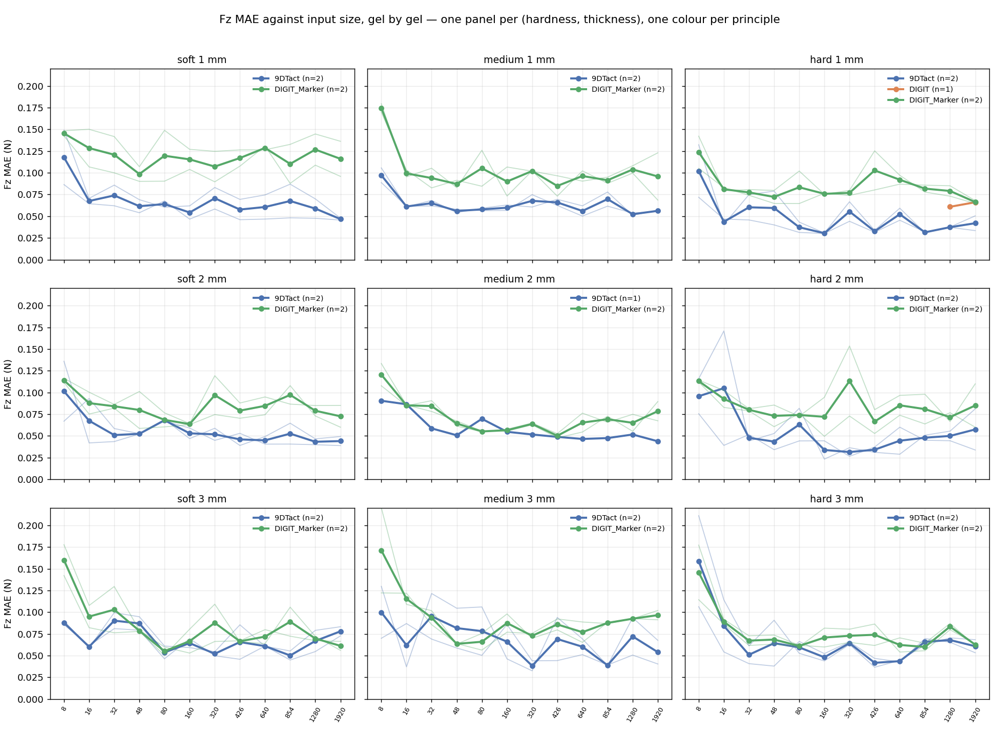
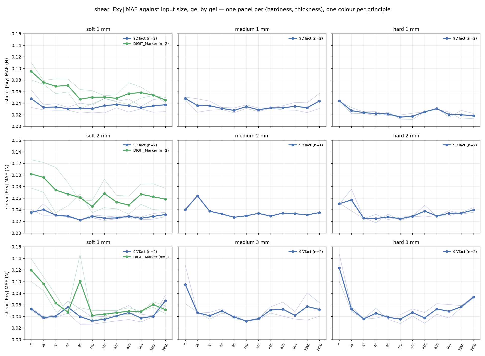

# 원리·젤·해상도 — 파생 변수, 가설, 검증

2026-09-09 밤. 운용자 지시: 학습을 돌리는 동안 지금까지 모은 데이터에서 구할 수 있는 모든
양을 정리하고, 그것들이 힘 추정·형상 복원 성능과 해상도에 어떻게 연결되는지 **가설을 세우고
직접 검증**하라. 이 문서는 그 기록이다. 가설은 결과를 보기 **전에** 적었다(§2). 결과가
가설을 기각하면 그대로 남긴다.

스크립트: `derived_variables.py` → `data/derived_variables.csv`; `correlations.py` →
`data/correlations.csv`, `figures/correlations_pooled.png`; `cross_principle.py` →
`figures/cross_principle_fz.png`; `analyse_saturation.py` → 원리별 `figures/saturation_*.png`.

## 0. 비교의 규칙

**두께나 경도가 하나라도 다르면 다른 센서다.** 원리 간 비교는 같은 (경도, 두께) 칸 안에서만
한다 — 9DTact soft 1 mm 두 유닛 대 DIGIT soft 1 mm 두 유닛. "DIGIT 전체 평균 대 9DTact
전체 평균"은 젤 분포가 같아도 젤 자체가 다른 물건이므로(마커 젤은 Hertz k 가 1.64 배) 쓰지
않는다. 학습 조건은 모든 해상도·모든 원리에서 같다: ResNet-18, 배치 64(경사 누적), 30 epoch,
검증 집합으로 epoch 선택, 사이클 분할(경계 공동 선택, 테스트 ≥ 8 %), Fz ≤ 2 N 필터, 전단
오차는 전단 블록 프레임에서만.

## 1. 유닛마다 구할 수 있는 양 (`derived_variables.csv`)

| 군 | 변수 | 어디서 | 뜻 |
|---|---|---|---|
| 젤 | `hertz_k`, `hertz_n` | Pass A ball4 사다리, F = k·dⁿ | 강성, 기재 개입(n > 1.5) |
| | `hertz_a_ball8`, `d_2N_mm`, `a_2N_mm` | Pass B zero 적합; 2 N 에서의 깊이; a = √(2Rd − d²), R = 4 | ball8 강성, 접촉 반경 |
| | `mu` | 전단 최대 / 그때의 Fz | 마찰 계수 (0.41–0.69) |
| | `creep_mm_per_cycle` | 전단 사이클 시작 깊이의 기울기 | 홀드 중 크리프 |
| 광학 | `px_per_mm`, `tilt_deg` | Pass A scale.yaml | 축척, 젤 기울기 |
| | `pedestal_ratio` | reference.png / 올바른 기준 | 프로브 그림자(DIGIT 1.09–1.15, 9DTact 1.00) |
| | `img_slope_lvl_per_N`, `img_slope_lvl_per_mm` | 정규 블록 0.2–2 N, 전체 프레임 \|diff\| 평균의 기울기 | **이미지 응답률** — 뉴턴당·mm 당 그림이 얼마나 변하나 |
| | `imprint_area_slope_pct_per_N`, `img_resp_at_2N` | 같은 구간 | 자국이 얼마나 넓어지나, 2 N 에서의 응답 |
| | `bw_normal_f90`, `bw_shear_f90`, `shear_snr` | 잡음 차감 스펙트럼, 0–3 c/mm | 자국·전단 신호의 공간 대역폭, 전단 S/N |
| 라벨 | `fz_noise_mae`, `lat_noise_mae` | 세그먼트 안 2 차 차분 | 프레임별 라벨의 "잡음 바닥" — **단단한 젤에서는 램프의 힘 스텝 거칠기를 읽는다** (아래) |
| | `fz_rate_per_frame`, `lat_rate_per_frame` | 세그먼트 안 연속 프레임 \|ΔF\| 중앙값 | 프레임당 라벨이 얼마나 움직이나 — 라벨과 노출 창의 불일치 크기 |
| | `fz_sd_0N`, `lat_sd_0N` | `ft.csv` 의 \|Fz\| < 0.05 N 인 1 s 창들의 sd | **F/T 센서 자신의 잡음** |
| 성능 | `fz_best/knee/res_loss`, `sh_best/knee/res_loss` | 해상도 스윕 (`analyse_saturation`) | 최소 오차, 무릎, 해상도 손실 |
| | `n_resolved`, `dip_175_max`, `um_per_level`, `cyl4_corrected_rms` | 9DTact 만, Pass A | 공간 분해능·형상 복원 |

### 1.1 "라벨 잡음 바닥" 은 센서 잡음이 아니었다

첫 상관 표에서 DIGIT_Marker 유닛의 `lat_noise_mae` 가 0.16–0.17 N 으로 9DTact(0.01–0.07)의
3–10 배였다. 같은 F/T, 같은 DAQ 인데 그럴 수 없다. `ft.csv` 의 0 N 구간에서 센서 잡음을 직접
재면 **세 원리가 같다**: Fz sd 0.0145 / 0.0156 / 0.0158 N, 측면 0.0022 / 0.0026 / 0.0024 N
(9DTact / DIGIT / DIGIT_Marker, 각 6 런 중앙값, 49.5–49.9 Hz). 2 차 차분 추정기는 램프가 국소
선형이라고 가정하는데, 단단한 젤에서는 세그먼트 하나가 0.3–0.6 N 을 뛰어 그 가정이 깨진다 —
추정기가 읽는 것은 **힘 스텝의 거칠기**다. 그래서 세 변수로 나눴다: 센서 잡음(`*_sd_0N`), 프레임당
라벨 변화(`*_rate_per_frame`), 그리고 옛 추정기(`*_noise_mae`, 참고용). `force_estimation.md` §3.1
의 "라벨 잡음 바닥 0.028 N" 은 9DTact 안에서는 여전히 유효한 하한이지만, 원리 간 비교에는 쓰지 않는다.

## 2. 가설 (결과 전에 적음)

- **H1 응답률 → 힘 바닥.** `img_slope_lvl_per_N` 이 클수록(뉴턴당 그림이 많이 변할수록) `fz_best` 가 낮다. 근거: 망은 결국 밝기 변화를 읽는다(§force_estimation 3.2, 스칼라 두 개로 R² 0.94).
- **H2 라벨 잡음 → 힘 바닥.** `fz_noise_mae` 가 `fz_best` 의 하한을 정한다(9DTact 에서 ρ +0.55 였다). 원리를 합쳐도 성립해야 한다.
- **H3 대역폭 → 무릎.** `bw_normal_f90` 이 `fz_knee` 를, `bw_shear_f90` 이 `sh_knee` 를 정한다(Nyquist). 예상: 상관은 있으되 범위가 1.5–1.7 배라 한 칸 안.
- **H4 접촉 반경 → 무릎: 없음.** `a_2N_mm` 은 `fz_knee` 와 무관해야 한다 — 볼이 자국 모양을 정한다는 §2.3b 의 논리.
- **H5 강성 → 전단 해상도 손실.** `hertz_k` 가 클수록 `sh_res_loss` 가 크다(9DTact ρ +0.49). DIGIT 에서도 같은 방향이면 원리 무관한 젤의 성질.
- **H6 프로브 그림자 → DIGIT 의 힘 바닥.** `pedestal_ratio` 가 큰 유닛이 `fz_best` 가 나쁘다 — 그림자가 "darker" 채널의 동적 범위를 잡아먹는다면. 대안: 올바른 기준을 쓰면 무관해야 한다(우리는 올바른 기준으로 학습한다 → **무관이 예측**).
- **H7 원리 간, 같은 젤 칸에서.** DIGIT_Marker 의 Fz 바닥이 9DTact 보다 높다(첫 3 유닛 0.09–0.14 대 0.05). 예상 이유: 응답률(H1)이 낮거나 라벨 잡음(H2)이 높다 — 둘 중 어느 쪽인지 파생 변수가 가른다.
- **H9 마커는 전단의 해상도 이득을 늘린다** (§4 중간 결과를 보고 추가, 비마커 DIGIT 스윕 **전에** 적음).
  마커 점은 전단 변위를 직접 보여주므로, 같은 젤 칸에서 DIGIT_Marker 의 전단 오차는 1920×1080 까지 계속
  내려가고(과적합 팔이 없고) 비마커 DIGIT 은 9DTact 처럼 평평하거나 U 자여야 한다. 검증: 비마커 DIGIT
  스윕의 `sh` 곡선 오른팔.
- **H10 DIGIT_Marker 의 Fz 바닥이 높은 이유는 응답률이다** (같은 시점에 추가). 같은 젤 칸에서
  `img_resp_at_2N`·`img_slope_lvl_per_N` 이 9DTact 보다 낮은 만큼 `fz_best` 가 높다. 대안 가설: 마커
  점이 자국 면적을 가려 정보가 준다 — 그러면 비마커 DIGIT 의 응답률은 9DTact 와 비슷한데 Fz 바닥은
  마커와 비슷해야 한다(응답률이 아니라 원리의 문제). 검증: 세 원리의 (응답률, Fz 바닥) 쌍.
- **H8 형상 복원(9DTact) 과 힘 추정은 다른 것을 요구한다.** `um_per_level`(형상의 양자화 한계)은 `fz_best` 와 무관하고, `n_resolved`(공간 분해능)는 `sh_knee` 와 상관한다.

## 3. 결과

### 3.1 H8 — 형상 복원과 힘 추정은 같은 것을 요구하나 (9DTact 17, `shape_vs_force.py`)

형상 쪽 지표(`shape_vs_resolution_summary`: 실패 크기, 48·32 px 에서의 지름 편향, 48·16 px 에서
쓰인 그레이 레벨 수; `contact_radius`: 분해된 간격 수 `n_resolved`, 175 µm 딥, 레벨당 µm)와
힘 쪽 지표(3 시드 스윕의 Fz·전단 최소/무릎/해상도 손실)를 42 쌍으로 본 것.

| 형상 지표 | 힘 지표 | n | ρ | p | BH q |
|---|---|---|---|---|---|
| `lev_16` (16×9 에서 형상이 쓰는 레벨 수) | **전단 최소** | 16 | **−0.72** | 0.002 | **0.063** |
| `n_resolved` (분해된 간격 수) | 전단 해상도 손실 | 17 | −0.54 | 0.024 | 0.27 |
| `bias_32`, `bias_48` (저해상도 지름 편향) | 전단 최소 | 17 | −0.54, −0.52 | 0.03 | 0.27 |
| `lev_16` | 전단 무릎 | 16 | −0.48 | 0.058 | 0.36 |
| `um_per_level` | Fz 최소 | 17 | +0.45 | 0.073 | 0.36 |

읽기: **형상이 저해상도에서 살아남는 유닛은 전단도 잘 읽는다.** 16×9 에서 그레이 레벨을 더 많이
쓰는(자국이 더 깊고 넓게 찍히는) 유닛일수록 전단 바닥이 낮고(ρ −0.72), 간격을 더 많이 분해하는
유닛일수록 저해상도에서 전단을 덜 잃는다(ρ −0.54). Fz 와는 약하다(p 0.07–0.09). 이것은 H8 의
방향과 맞는다 — **전단은 공간 정보를 쓰는 채널이고 형상 복원과 같은 종류의 그림을 요구한다**,
Fz 는 적분량이라 그렇지 않다. 다만 42 쌍 중 BH q < 0.1 은 하나뿐이고 n = 16–17 이다.
"형상 무릎 = 힘 무릎" 같은 일대일 대응은 보이지 않는다(형상 `fail_at` 은 대부분 8×5, 힘 무릎은
16–80 px).

### 3.2 파생 변수 × 성능 (`correlations.py`, 53 유닛 중 성능이 있는 23: 9DTact 17 + DIGIT_Marker 6)

**세 원리를 그냥 합치면 거의 모든 것이 "유의"해진다** — 150 쌍 중 25 가 BH q < 0.10. DIGIT_Marker
가 9DTact 보다 Fz 바닥이 높고, 동시에 젤이 단단하고, 자국이 좁고, 응답률이 낮고, 그림자 페데스탈이
있고, 라벨이 프레임당 더 움직이므로, 그 모든 변수가 `fz_best` 와 "상관" 한다. 원리를 통제한
편상관(원리별 평균 순위 제거)에서는 **3 쌍만 남는다**, 전부 전단 바닥에 대한 것이다:

| x | y | n | 편상관 ρ | q |
|---|---|---|---|---|
| `lat_noise_mae` (전단 라벨의 2 차 차분) | 전단 최소 | 23 | **+0.79** | 0.001 |
| `lat_rate_per_frame` (프레임당 전단 라벨 변화) | 전단 최소 | 23 | **+0.74** | 0.004 |
| `fz_noise_mae` | 전단 최소 | 23 | +0.66 | 0.030 |

9DTact 안에서만 봐도 같다(138 쌍, q < 0.10 두 개: 같은 두 변수 → 전단 최소, ρ +0.80 / +0.71).
그리고 **F/T 센서 자신의 잡음(`lat_sd_0N`)은 전단 최소와 무관하다**(편상관 +0.06, p 0.77; 9DTact
안 +0.25, p 0.33). 결론: **전단 추정의 바닥을 정하는 것은 센서 잡음이 아니라 "한 프레임 안에서 힘이
얼마나 움직이는가"** 다. 5 fps 카메라의 200 ms 노출 동안 힘이 0.03–0.17 N 움직이면 그 프레임의 라벨은
어느 순간의 힘인지 정의되지 않고, 그 크기가 그대로 바닥이 된다. 단단한 젤은 같은 글라이드 속도에서
힘이 더 빨리 변하므로 바닥이 높다 — 그런데 hard 의 전단 바닥이 가장 낮았다(§force_estimation 2.3b).
모순이 아니다: `lat_rate_per_frame` 은 유닛별 편차를 설명하는 것이고 경도 중앙값은 다른 요인
(자국의 선명도)이 정한다. 두 효과가 겹쳐 있다.

**가설 판정** (편상관 = 원리 통제):

| | 판정 | 근거 |
|---|---|---|
| H1 응답률 → Fz 바닥 | **부분 지지** | `img_slope_lvl_per_N` ρ −0.41 p 0.055; `img_resp_at_2N` (H7) ρ **−0.50 p 0.015**. 마커 6 유닛은 3.2–3.8 lvl, 9DTact 4.2–8.8 lvl |
| H2 라벨 잡음 → 바닥 | **재해석하여 지지** | 센서 잡음(`*_sd_0N`)은 무관, **프레임당 라벨 변화**가 전단 바닥을 정한다 |
| H3 대역폭 → 무릎 | **기각** | `bw_shear_f90` → 전단 무릎 ρ −0.27 p 0.22; `bw_normal_f90` → Fz 무릎 −0.08 |
| H4 접촉 반경 → Fz 무릎 없음 | **예측대로** | ρ −0.22 p 0.31 |
| H5 강성 → 전단 해상도 손실 | **기각(이 표본에서)** | `hertz_k` ρ +0.04 p 0.84; 경도 순위로는 +0.44 p 0.04 (§2.3b 의 p 0.048 과 같은 약한 신호) |
| H6 그림자 → Fz 바닥 | **예측대로 무관** | 편상관 +0.12 p 0.57 (올바른 기준으로 학습했으므로) |
| H7 2 N 응답 → Fz 바닥 | **지지** | ρ −0.50 p 0.015; 마커 안에서 ρ −0.89 p 0.019 (n 6) |

**자기비판.** (i) n = 23, 150 쌍 — 편상관 표의 q 는 믿을 만하지만 개별 p 0.02–0.05 는 아니다.
(ii) 성능 지표가 원리마다 시드 수가 다르다(9DTact 3, 마커 1) — 마커의 무릎·손실은 잠정.
(iii) `lat_rate_per_frame` 과 `lat_noise_mae` 는 거의 같은 것을 잰다(둘 다 프레임 간 힘 변화); 독립
증거가 아니다. (iv) 해상도 **무릎**을 예측하는 변수는 하나도 없다 — 무릎은 젤·광학과 무관하게
48 px 근처에 있다는 §2.3b 의 결론과 정합하지만, "무릎을 정하는 것이 무엇인가" 는 아직 답이 없다.
가장 그럴듯한 답은 "자국을 만드는 볼의 크기" 이고 그건 이 캠페인에서 변하지 않았다(`data_wishlist` #1).

### 3.3 H10 의 재료: 마커 센서는 뉴턴당 이미지 응답이 작다 (53 유닛, 학습 불필요)

§3.2 가 찾은 두 바닥 예측자 — Fz 바닥 ← 2 N 에서의 차영상 응답, 전단 바닥 ← 라벨의 움직임 — 은
학습 결과를 기다리지 않고 파생표만으로 세 원리 전부에서 셀별로 비교할 수 있다. 각 (경도, 두께) 셀의
중앙값을 **9DTact / DIGIT / DIGIT_Marker** 순으로 적었다.

먼저 시간 척도를 맞춰야 한다. §3.2 가 쓴 `lat_rate_per_frame` 은 **저장된 프레임 사이**의 라벨 변화인데,
저장 간격이 9DTact 412 ms 대 DIGIT 계열 196 ms 이고 한 프레임의 라벨을 만드는 평균 창
(`t_exposure_start`→`t_img`)은 205 ms 대 60 ms 다. 즉 "프레임당" 은 원리 간 같은 양이 아니다. 그래서
라벨을 실제로 모호하게 만드는 양 — **그 창 안에서 힘이 움직인 폭** — 을 50 Hz F/T 스트림에서 직접 재고
(`scripts/label_blur.py` → `data/label_blur.csv`), 글라이드 페이싱 자체는 초당 값으로 비교한다.

| 셀 | 이미지 응답 @2 N (레벨) | 마커/9DTact | 창 안 Fz 이동 (N) | 창 안 전단 이동 (N) | Fz 속도 (N/s) |
|---|---|---|---|---|---|
| soft 1 mm | 4.6 / 4.0 / 3.2 | 0.70 | 0.0543 / 0.0299 / 0.0358 | 0.0147 / 0.0061 / 0.0064 | 0.14 / 0.37 / 0.52 |
| soft 2 mm | 8.4 / 4.8 / 3.7 | 0.44 | 0.0471 / 0.0278 / 0.0315 | 0.0124 / 0.0063 / 0.0071 | 0.10 / 0.29 / 0.41 |
| soft 3 mm | 8.0 / 4.3 / 3.8 | 0.48 | 0.0465 / 0.0278 / 0.0311 | 0.0120 / 0.0067 / 0.0072 | 0.09 / 0.28 / 0.46 |
| medium 1 mm | 4.6 / 4.3 / 3.7 | 0.80 | 0.0505 / 0.0335 / 0.0342 | 0.0151 / 0.0060 / 0.0072 | 0.13 / 0.40 / 0.51 |
| medium 2 mm | 7.5 / 5.1 / 3.5 | 0.47 | 0.0497 / 0.0277 / 0.0292 | 0.0122 / 0.0063 / 0.0076 | 0.11 / 0.30 / 0.32 |
| medium 3 mm | 7.6 / 4.6 / 4.0 | 0.52 | 0.0503 / 0.0259 / 0.0317 | 0.0149 / 0.0064 / 0.0079 | 0.12 / 0.22 / 0.35 |
| hard 1 mm | 4.4 / 4.4 / 2.8 | 0.63 | 0.0439 / 0.0318 / 0.0371 | 0.0106 / 0.0061 / 0.0061 | 0.10 / 0.38 / 0.46 |
| hard 2 mm | 5.2 / 4.8 / 3.5 | 0.67 | 0.0445 / 0.0287 / 0.0326 | 0.0118 / 0.0063 / 0.0065 | 0.11 / 0.31 / 0.37 |
| hard 3 mm | 5.0 / 4.2 / 3.4 | 0.68 | 0.0477 / 0.0274 / 0.0311 | 0.0148 / 0.0073 / 0.0070 | 0.11 / 0.28 / 0.33 |

**이미지 응답.** DIGIT_Marker 는 모든 셀에서 9DTact 의 0.44–0.80 배, DIGIT 은 0.53–0.98 배다. 격차는
**얇고 단단한 셀에서 가장 작고 두껍고 부드러운 셀에서 가장 크다**: 9DTact 의 응답은 4.5 → 8.4 레벨로
두께·연성에 따라 거의 두 배가 되는데 DIGIT 계열은 3–5 레벨에 머문다. 9DTact 는 검은 안료층의 접촉 압력에
따른 투과율을 읽으므로 겔이 깊이 눌릴수록 신호가 커지고, DIGIT 은 측면 조명의 표면 명암을 읽으므로 압입이
깊어져도 대비가 포화한다. 그러므로 **H10("마커 Fz 바닥이 높은 이유는 응답 부족")은 파생표 수준에서 이미
성립**하고, 가장 큰 격차가 예상되는 셀은 soft·medium × 2–3 mm 다 — §4 잠정 결과에서 마커 Fz 바닥이
9DTact 의 1.5–2.5 배였던 셀과 일치한다.

**힘이 얼마나 빨리 움직이나.** 초당 값으로 보면 DIGIT 계열이 9DTact 의 3–7 배 빠르다(Fz 0.22–1.01 대
0.06–0.17 N/s). 글라이드 페이싱이 mm/s 기준이고 DIGIT 겔이 같은 경도 라벨에서도 9DTact 보다 강성이 높기
때문이다(campaign_protocol.md §4.4, Hertz k 1.64 배). 그런데 노출 창이 3.4 배 짧으므로 **창 안에서의 이동은
9DTact 가 오히려 크다**(Fz 0.047 대 0.028/0.033 N). 두 효과가 반대 방향이라 원리 간 라벨 모호성은 뒤집힌다 —
그래서 이 양으로 원리 간 바닥 차이를 설명할 수는 없다(§3.4).

**전단 창 안 이동은 작다.** 0.006–0.015 N 으로 세 원리 모두 Fz 이동의 1/4 이하다. 마커 전단 바닥이 9DTact 와
다르게 나오면 그것은 라벨 쪽이 아니라 이미지 쪽 차이 — 마커 점 변위 대 명암 비대칭 — 이고, 이것이 H9 의
검증 대상이다.

이 절은 학습 **전** 예측이다. DIGIT/DIGIT_Marker 스윕이 끝나면 §4 의 셀별 바닥과 이 표를 짝지어
"응답이 작을수록 Fz 바닥이 높다" 가 원리를 가로질러도 성립하는지 확인한다(원리 통제 편상관은 §3.2 에서
ρ −0.50, 학습 바닥으로는 §3.4 에서 −0.46).

### 3.4 힘 바닥의 오차 예산: 라벨이 어디까지 설명하나 (23 유닛)

§3.2 는 바닥 예측자를 상관으로만 짚었고, 그 예측자(`*_noise_mae`)는 연속 프레임 라벨의 2차 차분이라
"센서 잡음" 이 아니라 라벨의 움직임을 읽는다는 것까지만 말할 수 있었다. §3.3 의 `label_blur.py` 는 같은 것을
**모델과 무관하게** 잰다: 한 프레임의 라벨을 만드는 창(`t_exposure_start`→`t_img`) 안에서 힘이 움직인 폭.

**결과 1 — 창 안 이동은 학습된 바닥을 예측한다.** 원리 통제 순위 편상관(n = 23):

| 대상 | 창 안 Fz 이동 | 창 안 전단 이동(p90) | 2 N 이미지 응답 |
|---|---|---|---|
| `fz_best` | **+0.63** (p 0.001) | +0.45 (p 0.031) | −0.46 (p 0.025) |
| `sh_best` | **+0.68** (p 0.000) | **+0.69** (p 0.000) | 유의하지 않음 |
| `fz_knee` / `sh_knee` | 없음 | 없음 | 없음 |

9DTact 안에서만 봐도(n = 17, 원리 혼입이 아예 없다) `fz_best` +0.62 (p 0.008), `sh_best` +0.78 (p 0.000) 로
같은 방향이다. 무릎 위치는 여전히 아무 것도 예측하지 못한다 — 바닥과 무릎은 서로 다른 것이 정한다.

**결과 2 — 그런데 원리 간 바닥 차이는 이것으로 설명되지 않는다.** 9DTact 의 창 안 Fz 이동은 0.047 N 으로
DIGIT_Marker(0.033 N)보다 **크지만** `fz_best` 는 오히려 낮다(0.036 대 0.061 N). 원리를 통제하지 않고 보면
상관이 사라진다(ρ +0.02). 즉 창 안 이동은 **한 원리 안에서 어느 유닛이 더 나쁜지**를 정하고, **원리 사이의
수준 차이**는 이미지 응답이 정한다(§3.3). 원리를 통제하지 않은 상관을 보고 "라벨이 전부" 라고 말하면 틀린다.

**결과 3 — 오차 예산.** 창 안에서 힘이 폭 `blur` 로 램프처럼 지나가면 한 프레임의 참값은 창 평균에서 평균
`blur/4` 만큼 벗어난다. 창 안 F/T 잡음은 `sd(0 N)/√(창 안 표본 수)` 로 남는다(9DTact 는 창에 10 표본,
DIGIT 계열은 3 표본). 나머지를 제곱합 분해로 잔차로 돌린 값이다.

| 원리 | `fz_best` | 라벨 모호성 | F/T 잡음 | 잔차 | `sh_best` | 라벨 모호성 | F/T 잡음 | 잔차 |
|---|---|---|---|---|---|---|---|---|
| 9DTact | 0.0355 | 0.0118 | 0.0043 | 0.0325 | 0.0388 | 0.0030 | 0.0007 | 0.0387 |
| DIGIT_Marker | 0.0614 | 0.0082 | 0.0085 | 0.0604 | 0.0369 | 0.0017 | 0.0016 | 0.0368 |

라벨 모호성은 Fz 바닥의 진폭 기준 9DTact 33 %, 마커 13 % 이고 제곱합 기준으로는 각각 11 %, 2 % 다. 전단은
훨씬 작다(진폭 9 % / 5 %) — 전단 글라이드 동안 측면 힘은 느리게 움직인다. **F/T 잡음은 어느 채널에서도
바닥을 정하지 않는다**(0.001–0.009 N). 그러므로 바닥의 대부분(제곱합 89 % 이상)은 라벨도 센서 잡음도 아닌
**이미지와 모델** 쪽에 있다 — 힘을 이미지에서 읽어내는 일 자체의 한계다.

**주의.** 이 분해는 라벨 오차가 시험 시점에만 더해진다고 가정한다. 실제로는 학습에도 들어가므로 라벨을
나쁘게 만들면 바닥은 `blur/4` 보다 훨씬 크게 올라간다 — 그것을 재는 것이 §3.7 의 라벨 창 절제다.

### 3.5 마커 격자가 접촉보다 굵다: H9 의 전제가 이 프로브에서는 성립하지 않는다

H9 은 "마커가 전단의 해상도 이득을 키운다" 고 예측했다. 그 전제는 마커 변위장이 전단을 읽을 만큼
표본화된다는 것이다. 격자와 접촉을 같은 자로 재보면(`scripts/marker_geometry.py` → `data/marker_geometry.csv`,
18 유닛, 각 유닛 자기 기준 이미지에서):

| 양 | 중앙값 | 범위 |
|---|---|---|
| 점 간격 | **3.00 mm** (284 px) | 2.69–3.15 mm |
| 점 지름 | 1.09 mm (97 px) | 0.74–1.15 mm |
| 2 N 접촉 지름 (ball8, Hertz) | **3.78 mm** (349 px) | 2.79–4.61 mm |
| 접촉 지름 / 점 간격 | **1.26** | 0.94–1.56 |
| 접촉 안의 점 개수 | **1.24** | 0.70–1.92 |

**접촉 하나에 점이 한 개 남짓 들어온다.** 그러므로 이 프로브에서 마커 채널이 실어 나르는 것은 변위 "장" 이
아니라 사실상 벡터 한 개다. 전단의 비대칭을 점 배치로 읽을 표본이 없다 — H9 은 **가설이 틀렸다기보다 이
데이터로는 시험할 수 없다**. 게다가 불투명한 점이 시야의 약 10 % 를
가리므로, 마커 유닛에서 남는 정보는 점 사이의 명암 압흔이고 그 압흔은 부분적으로 가려져 있다. §4 에서 마커의
Fz 무릎이 9DTact 보다 높게 나오면(잠정 80 대 32 px) 그 원인으로 이 가림을 먼저 의심해야 한다.

**공이 어디에 떨어졌나 (가림의 크기).** 프로브는 매 유닛 같은 자리(≈ 화면 (900, 700))에 내려오지만 겔을 다시
장착할 때마다 격자의 위상이 달라진다. 접촉 중심에서 가장 가까운 점까지 50–142 px
(간격의 0.19–0.46 배)이고, **접촉 원의 8–16 %가 불투명한 점 아래에
들어간다**(`data/marker_occlusion.csv`). 접촉 반지름이 175 px 인데 가장 가까운 점이 그보다 가까우니
**모든 유닛에서 접촉이 점과 겹친다** — 겹치지 않게 놓인 유닛이 하나도 없어서, 가림의 유무를 대조할 수는 없고
정도(8–16 %)만 비교할 수 있다. 마커 스윕이 끝나면 이 값과 유닛별 바닥의 관계를 §4 에서 확인한다.

**해상도 쪽 예측도 뒤집힌다.** 점이 2 px 로 유지되는 폭은 40 px, 간격이 2 px 로 유지되는 폭은
14 px 다. 즉 **격자 자체는 아주 낮은 해상도까지 살아남는다** — 마커 유닛의 높은 무릎은
"점이 안 보여서" 가 아니다. 무릎은 여전히 압흔이 정한다.

**측정 방법 주의.** 점 검출을 면적으로 거르는데 첫 판은 상한을 4000 px² 로 두어 진짜 점(약 9500 px²)을 모두
버리고 잡티만 세어 "점 지름 6 px" 이라는 값을 냈다. 기준 이미지를 직접 열어보고서야 드러났다. 지금은 최근접
간격과 자기상관 첫 링 두 가지로 재고 서로 5 % 안에서 일치한다(`pitch_px` 대 `pitch_nn_px`).

### 3.6 그림이 요구하는 최소 폭: 두께 효과는 DIGIT 에만 있고 9DTact 에는 없다 (53 유닛, 학습 불필요)

이 캠페인의 질문 — "오차가 포화하는 해상도가 겔에 따라 달라지는가" — 은 학습 없이 **그림 쪽에서 먼저**
물어볼 수 있다. 압흔(과 전단이 더하는 쌍극자)의 공간 스펙트럼에서 에너지의 90 % 가 들어가는 주파수 `f90`
아래를 표본화하려면 폭이 얼마나 필요한지 세면 된다: `필요 폭 = 2 · f90[cyc/px] · 1920`.

**cyc/mm 이 아니라 cyc/px 로 세야 한다.** 겔이 두꺼울수록 표면이 높아 배율이 달라지고
(campaign_protocol.md §4.3), 실제로 `px_per_mm` 은 두께와 ρ −0.81…−0.94 로 얽혀 있다(시야 16.4–24.8 mm).
cyc/mm 으로 재면 이 배율 변화가 두께 효과로 둔갑한다 — 9DTact 의 cyc/mm 은 두께 ρ −0.55 (p 0.022) 인데
cyc/px 로 바꾸면 ρ +0.12 (p 0.64) 로 사라진다. 아래는 모두 cyc/px 기준이다.

| 원리 | 채널 | 필요 폭 | 두께 1/2/3 mm 중앙값 | 두께 ρ | 경도 ρ |
|---|---|---|---|---|---|
| 9DTact | 법선 | 8–12 px | 10 / 8 / 9 | +0.12 (p 0.642) | -0.16 (p 0.546) |
| 9DTact | 전단 | 9–20 px | 15 / 13 / 14 | -0.25 (p 0.333) | +0.09 (p 0.723) |
| DIGIT | 법선 | 17–30 px | 24 / 19 / 17 | -0.87 (p 0.000) | +0.12 (p 0.641) |
| DIGIT | 전단 | 33–44 px | 41 / 41 / 41 | +0.00 (p 1.000) | +0.07 (p 0.796) |
| DIGIT_Marker | 법선 | 24–70 px | 45 / 53 / 58 | +0.31 (p 0.213) | +0.22 (p 0.374) |
| DIGIT_Marker | 전단 | 47–105 px | 54 / 87 / 95 | +0.75 (p 0.000) | +0.14 (p 0.568) |

**읽는 법.**
1. **원리가 요구량의 자릿수를 정한다.** 9DTact 8–20 px, DIGIT 17–44 px, DIGIT_Marker 24–105 px. 9DTact 의
   압흔은 안료층의 완만한 명암이라 저주파이고, DIGIT 은 표면 명암의 경사라 더 날카로우며, 마커 유닛에서는
   점의 가장자리가 스펙트럼을 지배한다(§3.5). 측정된 무릎의 순서(9DTact 32/48 px, 마커 80/120 px)와 방향이
   같다 — 다만 절대값은 Nyquist 예측의 1.4–3 배로, 신경망은 표본화 한계보다 여유를 더 요구한다.
2. **두께 효과는 원리마다 다르다.** DIGIT 의 법선 압흔은 겔이 두꺼울수록 요구량이 **줄어든다**
   (24 → 19 → 17 px, ρ −0.87, p 0.000): 두꺼운 층이 변형을 옆으로 퍼뜨려 저역통과 필터처럼 작동한다.
   9DTact 에서는 이 효과가 없는데(ρ +0.12), 이미 요구량이 8–12 px 로 바닥에 붙어 있어 더 흐려질 여지가 없다.
   마커의 전단은 반대로 두꺼울수록 **늘어난다**(54 → 87 → 95 px, ρ +0.75, p 0.000) — 두꺼운 겔에서 점이 더
   많이 움직여 가장자리 차이가 커지기 때문이고, 겔이 아니라 점이 스펙트럼을 정한다는 §3.5 와 맞는다.
3. **경도는 어느 원리에서도 요구량을 바꾸지 않는다**(모든 p > 0.21). 무릎이 경도를 따르지 않았던 §2.3b 의
   결과와 일치한다.

즉 "겔 두께가 포화 해상도를 바꾼다" 는 **DIGIT 계열에서만 성립하고 9DTact 에서는 성립하지 않는다**. 이는
스윕이 끝나면 유닛별 무릎으로 직접 확인할 수 있는 예측이다(§4).

**주의.** `f90` 은 0.1 cyc/mm 격자에서 읽으므로 9DTact 처럼 값이 0.2–0.3 인 경우 한 칸이 곧 50 % 차이다.
9DTact 의 "효과 없음" 은 이 해상도 한계 안에서의 진술이다. `scripts/imprint_bandwidth.py --runs <dataset>`.

## 4. 원리 간 비교, 젤 칸별

**중간 (DIGIT_Marker 1 시드 스윕 7 / 18 유닛, 비마커 DIGIT 미시작).** soft 세 칸에서만 두 원리가
겹친다. 같은 젤 사양·같은 학습 조건·같은 크기에서:

| 칸 | 크기 | 9DTact Fz | DIGIT_Marker Fz | 9DTact 전단 | DIGIT_Marker 전단 |
|---|---|---|---|---|---|
| soft 1 mm | 1920 | 0.047 | **0.116** | 0.037 | **0.045** |
| soft 1 mm | 160 | 0.054 | 0.115 | 0.031 | 0.050 |
| soft 1 mm | 8 | 0.118 | 0.145 | 0.048 | 0.095 |
| soft 2 mm | 1920 | 0.044 | 0.073 | 0.032 | 0.058 |
| soft 2 mm | 48 | 0.052 | 0.080 | 0.029 | 0.067 |
| soft 3 mm | 1920 | 0.078 | 0.061 | 0.067 | 0.051 |
| soft 3 mm | 8 | 0.088 | 0.142 | 0.053 | 0.120 |

- **같은 젤 칸에서 DIGIT_Marker 의 Fz 오차가 9DTact 의 1.5–2.5 배**다(soft 1 mm, 2 mm). soft 3 mm 는
  큰 크기에서 오히려 낮다 — 한 시드라 잡음이 크고, 3 시드 pass 뒤에 다시 본다.
- **모양은 같다**: 두 원리 모두 16×9 까지 평평하고 8×5 에서 무너진다. 무릎이 원리로 바뀌지 않는다는
  §force_estimation 2.3b 의 결론이 두 번째 원리에서도 성립한다(잠정).
- **전단은 DIGIT_Marker 가 큰 크기에서도 계속 내려간다**(soft 1 mm 0.095 → 0.045, 2 mm 0.102 → 0.058) —
  9DTact 처럼 평평·U 자가 아니다. 마커 점이 전단 변위를 직접 보여주므로 화소가 많을수록 마커 이동을
  더 정밀히 읽는다는 해석이 가능하다. 비마커 DIGIT 이 들어오면 마커의 몫이 갈린다.
- 두 원리의 마커 젤은 **다른 젤**(Hertz k 1.64 배)이므로 "같은 칸" 이라도 젤이 같지는 않다. 비교의
  뜻은 "같은 이름의 젤을 썼을 때 그 센서가 무엇을 하는가" 다.

## 5. 자기비판

(채워지는 중.)
