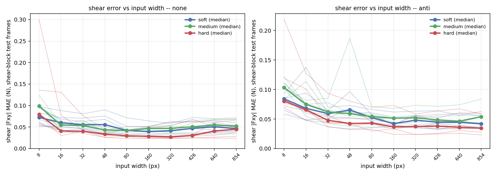
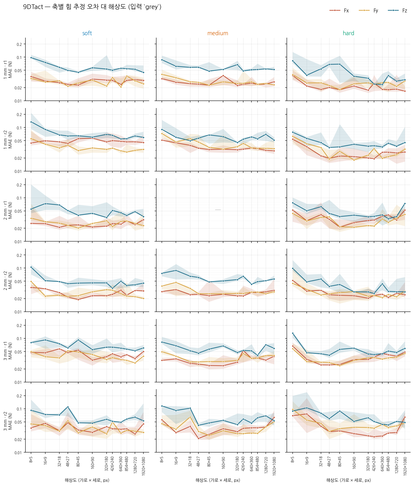
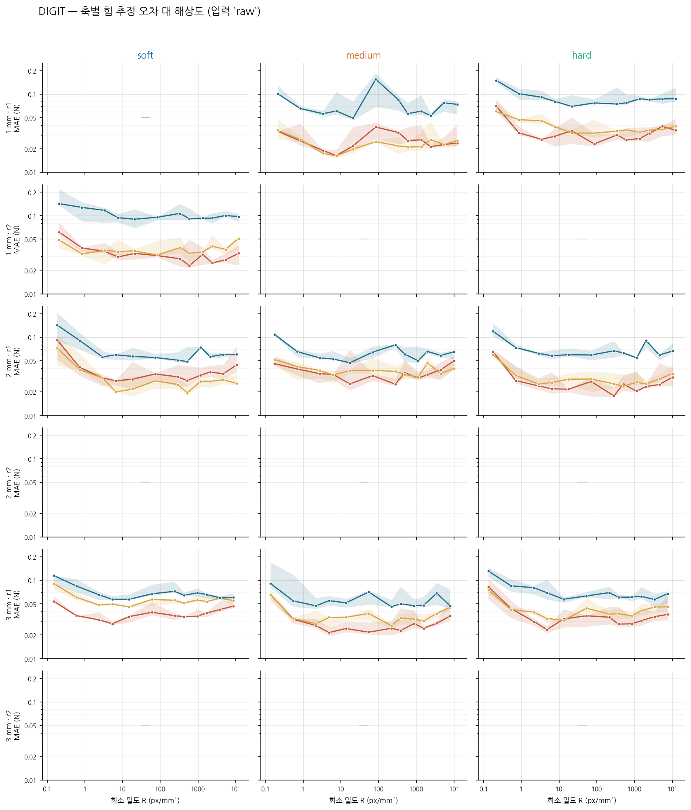
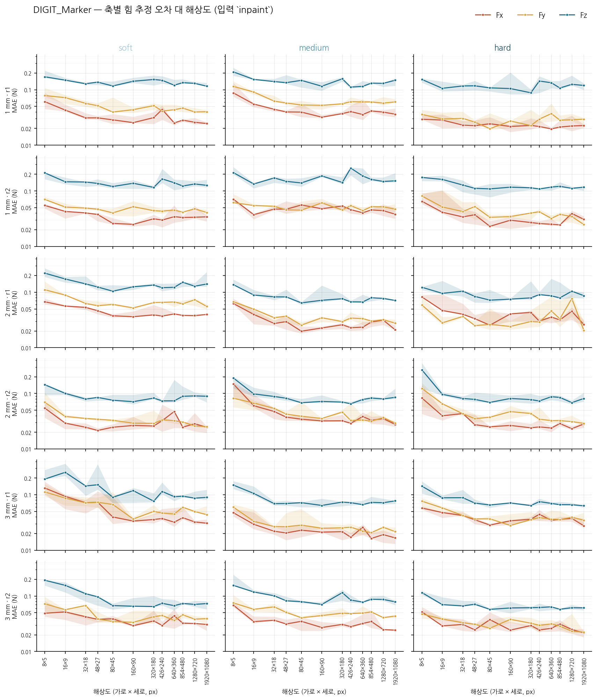

# 해상도별 힘 추정 — 세 원리

9DTact · DIGIT · DIGIT_Marker 를 한 문서에 둔다. §1 ~ §6 은 9DTact 로 방법을
세운 기록이고, **§2.6 이 세 원리의 축별 결과**, §7 이 DIGIT 계열의 2026-09-10
판이다. **세 원리를 평균내지 않는다** — 조명도 겔도 카메라 배치도 다르므로
비교는 같은 (경도, 두께) 칸 안에서만 하고, 원리 간 종합은 `cross_principle.md`.

2026-09-08. Pass B 가 유닛마다 모은 1000 장의 라벨 프레임으로 9DTact 의 힘 추정
파이프라인을 그대로 학습시키고, 입력 크기를 12 단계로 줄여가며 **카메라의 어느 부분이
실제로 쓰이는지** 물었다. `shape_vs_resolution.md` 와 같은 12 개 16:9 크기를 써서 두
곡선을 나란히 놓을 수 있다.

데이터: `data/20260911_VBTSresolution_dataset/9DTact/force_vs_resolution_v2.csv` (408 행 = 17 유닛 × 12 크기 × 2 분할),
`force_scalar_baseline.csv` (17 행). 스크립트: `scripts/force_vs_resolution.py`,
`scripts/force_scalar_baseline.py`, `scripts/make_force_figures.py`.

> **이 문서는 두 번째 판이다.** 첫 판(`force_vs_resolution.csv`, 204 행)은 배치가 입력
> 크기에 따라 4 에서 64 까지 달랐고 검증 집합이 없어 epoch 30 을 무조건 다 돌렸다.
> 그래서 칸끼리 비교할 수 없었다 — 한 유닛의 곡선이 이웃한 크기 사이에서 최대 9.3 배
> 튀었다. 이번 판은 셋을 고쳤다: **배치를 전 해상도에서 64 로 통일**(경사 누적),
> **검증 집합으로 epoch 선택**, **두 가지 분할을 같은 프레임 수로**. 결과의 방향은
> 유지됐지만 수치와 유닛 순위는 바뀌었고, 바뀐 쪽이 옳다(§2.2, §4).

---

## 1. 무엇을 어떻게

**데이터.** 유닛당 1000 프레임. 각 프레임에는 이미지와, 그 프레임의 노출 창 위에서 평균한
6 축 렌치가 붙어 있다. 수직 램프는 0 → 약 2.1 N, 전단은 0.5 N 까지. 드리프트 보정된
라벨(`Fz_s_corr`)이 있으면 그것을, 없으면 원값을 쓴다.

**전처리와 모델은 9DTact 원본을 그대로 가져왔다** (`shape_reconstruction/sensor.py` 의
`raw_image_2_representation`, `force_estimation/train.py`, `model/cnn.py`):

- 3 채널 — ch0 = 회색 기준 이미지, ch1 = 밝아진 차이 × 3, ch2 = 어두워진 차이 × 3.
- ResNet-18, ImageNet 사전학습, fc 를 6 출력 선형층으로 교체.
- 0–255 부동소수 그대로(정규화 없음), L1 손실 `reduction='sum'`, Adam 5e-4, 선형 감쇠.
- 라벨은 학습 집합 기준 min–max 로 [0, 1] 스케일.

### 1.1 첫 판에서 고친 세 가지

**(a) 배치를 통일했다.** 첫 판은 배치를 픽셀 수에 반비례해 줄였다(1080p 에서 4,
426×240 이하에서 64). 그러면 **해상도를 바꿀 때 최적화까지 함께 바뀐다** — 큰 입력은
작은 배치라 경사가 시끄럽고, 같은 epoch 안에서 갱신 횟수도 16 배 많다. 해상도 효과를
재려는 실험에서 이건 교란 변수다.

이번 판은 **옵티마이저의 배치를 전 크기에서 64 로 고정**하고, 카드에는
`micro_batch_for(size)` 만큼씩 흘려 넣어 경사를 누적한다. 손실이
`reduction='sum'` 이므로 **누적은 큰 배치 한 번과 수학적으로 완전히 같다** — 근사가
아니다. 1920×1080 은 micro-batch 2 로 32 번 누적해 한 번 갱신한다.

**(b) 검증 집합을 두고 epoch 을 골랐다.** 첫 판은 검증 없이 epoch 30 의 가중치를 그대로
평가했다. 이번 판은 학습 구간에서 검증을 떼어 매 epoch 평가하고 **검증 손실이 가장 낮은
가중치를 복원**한다. 선택된 epoch 의 중앙값은 30 중 **28** 이었다 — 즉 대부분의 칸은
과적합 전에 끝나지만, 그렇지 않은 칸을 걸러내는 것이 목적이다. (조기 종료는 껐다.
patience 8 을 시험했더니 320×180 이 epoch 14 에서 잘려 0.050 대신 0.079 로 나빠졌다 —
검증 손실의 평탄 구간을 정체로 오독한 것이다. 전 epoch 을 돌리고 최선을 되살리는 쪽이
안전하다.)

**(c) 두 가지 분할을, 같은 프레임 수로.** §2.5 를 보라.

**축척은 건드리지 않는다.** 이 시험은 mm 를 쓰지 않으므로 이미지 축척과 무관하다.

---

## 2. 결과

유닛 17 개의 중앙값, **고친 사이클 분할**(v3, `data/20260911_VBTSresolution_dataset/9DTact/force_vs_resolution_v3.csv`).
`Fz(법선)` 과 `전단(전단블록)` 은 블록을 나눠 잰 값이고, 그 옆 두 열은 모든 프레임을 섞어
잰 예전 방식이다 — 전단을 법선 프레임까지 포함해 평균내면 낮아 보인다(§2.3b).

| 크기 | **Fz MAE N** (법선블록) | **전단 MAE N** (전단블록) | Fz (전체) | 전단 (전체) | R² | 1 회 학습 |
|---|---|---|---|---|---|---|
| **1920×1080** | 0.036 | 0.052 | 0.049 | 0.033 | 0.970 | 256 s |
| **1280×720** | 0.039 | 0.045 | 0.047 | 0.032 | 0.977 | 113 s |
| **854×480** | 0.035 | 0.052 | 0.044 | 0.032 | 0.976 | 53 s |
| **640×360** | 0.042 | 0.050 | 0.054 | 0.035 | 0.962 | 30 s |
| **426×240** | 0.040 | 0.044 | 0.050 | 0.033 | 0.971 | 15 s |
| **320×180** | 0.037 | 0.040 | 0.048 | 0.030 | 0.973 | 9 s |
| **160×90** | 0.042 | 0.041 | 0.047 | 0.029 | 0.975 | 4 s |
| **80×45** | 0.047 | 0.039 | 0.048 | 0.029 | 0.977 | 3 s |
| **48×27** | 0.041 | 0.040 | 0.049 | 0.031 | 0.966 | 3 s |
| **32×18** | 0.046 | 0.050 | 0.055 | 0.032 | 0.962 | 3 s |
| **16×9** | 0.059 | 0.053 | 0.067 | 0.040 | 0.951 | 4 s |
| **8×5** | 0.093 | 0.079 | 0.089 | 0.050 | 0.899 | 4 s |

**이 표는 옛 판을 대체한다.** 이전 표는 전단 테스트 집합이 유닛에 따라 12 프레임까지
줄어드는 분할 버그 위에 있었다(`searchsorted+1`); v3 는 훈련/검증/시험 경계를 70/15/15 에
가장 가깝게 **함께** 고르고 시험 집합에 8 % 하한을 둔다. 고친 뒤 전단 바닥이 0.027 → 0.039 N
으로 올라간다 — **예전 숫자가 좋아 보였던 것은 시험 집합이 작아서였다.**

### 2.1 곡선이 매끄러워졌다

첫 판을 신뢰할 수 없게 만든 것은 중앙값이 아니라 **한 유닛 안에서의 요동**이었다.
`hard_1mm_r1` 은 0.032 → 0.022 → 0.028 → **0.096** → 0.050 → 0.068 로 이웃 칸 사이에서
4 배씩 튀었다. 배치를 통일하고 검증으로 epoch 을 고르자 이 요동이 줄었다:

| 유닛 안에서 이웃 크기 사이의 최대 점프 | 중앙값 | 최악 |
|---|---|---|
| 첫 판 | 1.91× | 9.31× |
| **이번 판** | **1.48×** | **3.27×** |

유닛 내 12 크기의 표준편차도 Fz 0.0229 → **0.0167 N**, 전단 0.0153 → **0.0084 N** 로
줄었다. **줄어든 몫은 해상도가 아니라 최적화가 만들던 잡음이었다.**

### 2.1b 시드를 다섯 번 돌려 잡음을 쟀다

크기 사이의 차이가 해상도인지 학습의 산포인지 가르려면, **아무것도 바꾸지 않고 시드만
바꿨을 때** 얼마나 움직이는지를 알아야 한다. 3 유닛 × 3 크기 × 5 시드, 같은 v2 레시피
(`data/20260911_VBTSresolution_dataset/9DTact/force_seed_study_v2.csv`, 45 행).

| 유닛 | 크기 | 평균 Fz MAE | sd | 최대/최소 |
|---|---|---|---|---|
| hard_1mm_r1 | 160×90 | 0.0412 | 0.0077 | 1.58× |
| hard_1mm_r1 | 640×360 | 0.0481 | 0.0352 | 5.06× |
| hard_1mm_r1 | 1920×1080 | 0.0355 | 0.0123 | 2.53× |
| medium_1mm_r1 | 160×90 | 0.0527 | 0.0039 | 1.18× |
| medium_1mm_r1 | 640×360 | 0.0536 | 0.0037 | 1.20× |
| medium_1mm_r1 | 1920×1080 | 0.0550 | 0.0080 | 1.40× |
| soft_2mm_r1 | 160×90 | 0.0505 | 0.0072 | 1.40× |
| soft_2mm_r1 | 640×360 | 0.0430 | 0.0060 | 1.35× |
| soft_2mm_r1 | 1920×1080 | 0.0450 | 0.0050 | 1.31× |

| | 첫 판 | **이번 판** |
|---|---|---|
| 시드 sd, Fz | 0.0219 N | **0.0072 N** |
| 시드 sd, 전단 | 0.0058 N | **0.0040 N** |

**Fz 의 학습 잡음이 3.0 배 줄었다.** 배치를 통일하고 검증으로 epoch 을 고른 결과이고,
§2.1 에서 곡선이 매끄러워진 것과 같은 이야기를 다른 방향에서 잰 것이다.

> **첫 판의 시드 수치는 이 판과 섞어 쓸 수 없다.** 그것은 배치가 입력 크기를 따라
> 변하던 옵티마이저에서 나온 값이다. 그래서 시드 연구도 v2 레시피로 다시 돌렸다.

**해상도 효과가 이제 잡음 위로 나온다.** 8×5 를 뺀 평평한 구간(48×27 이상)에서:

| | 크기 sd | 시드 sd | 크기가 만드는 몫 | 시드 대비 | 중앙값 대비 |
|---|---|---|---|---|---|
| **Fz** | 0.0116 | 0.0072 | **0.0091 N** | 1.3 배 | 18 % |
| **전단** | 0.0062 | 0.0040 | **0.0048 N** | 1.2 배 | 15 % |

첫 판에서는 Fz 의 몫이 0.0067 N 으로 시드 산포(0.0219)에 완전히 묻혀 "검출되지 않는다"
가 정확한 진술이었고, 전단만 2.5 배로 보였다. 잡음이 3 배 줄자 **두 채널 모두 비슷한
수준(1.2–1.3 배)으로 검출된다.** 즉 평평한 구간의 해상도 효과는 **실재하지만 작다** —
오차의 15–18 %.

크고 분명한 것은 여전히 하나다: **8×5 붕괴**(§2.2).

### 2.2 8×5 에서 처음으로 무너진다

이제 곡선이 읽힌다. **1920×1080 부터 16×9 까지 Fz 중앙값이 0.046 – 0.062 N 으로
완만하고, 8×5 에서 0.090 N 으로 꺾인다** — 바로 위 칸의 1.5 배, 가장 좋은 칸의 2.0 배다.
R² 도 0.936 → 0.872 로 이 칸에서만 떨어진다. 첫 판에서는 8×5 가 0.071 N 으로 16×9 의
0.064 N 과 구별되지 않았다. **학습 잡음이 걷히자 하한이 드러났다.**

8×5 는 40 픽셀이다. 자국 하나가 픽셀 한두 개에 담기는 크기이므로, 여기서 무너지는 것은
놀랍지 않다. 놀라운 쪽은 **16×9(144 픽셀)까지는 1920×1080 과 사실상 같다**는 것이다.

### 2.3 전단은 여전히 U 자다

전단(|Fxy| 의 MAE)은 수직력과 다른 모양이다 — **80×45 에서 0.027 N 으로 최소**를 이루고
양쪽으로 올라간다(1920×1080 에서 0.040, 8×5 에서 0.050 N). 첫 판에서 본 U 자가
**배치를 통일하고 과적합을 막은 뒤에도 살아남았다.** 이것이 이번 재학습에서 가장 중요한
확인이다 — 첫 판의 U 자는 배치가 크기를 따라 변한 탓일 수 있었는데, 아니었다.

양쪽 끝이 나빠지는 이유는 다르다:

- **왼쪽(8×5 · 16×9)**: 전단은 자국의 **비대칭**(한쪽이 더 어두워짐)으로 나타나므로,
  자국을 몇 픽셀로 줄이면 비대칭이 먼저 죽는다. 수직력(전체 밝기)이 16×9 에서도
  R² 0.936 을 유지하는 것과 대조적이다.
- **오른쪽(1280×720 · 1920×1080)**: 입력이 커질수록 ResNet-18 이 700 프레임 남짓에
  과적합할 여지가 커진다. 배치를 통일한 지금도 이쪽이 나쁘다는 것은, 첫 판에서 의심했던
  "배치 4 때문"이 **원인이 아니었음**을 뜻한다. 남는 설명은 표본 대비 입력 차원이다.

### 2.3b 유닛별 전단 해상도 요구 — 3 시드, 새 분할, 전단 블록만

이 절은 2026-09-09 에 **완전히 다시 잰 것**이다. 앞선 판은 (i) 유닛에 따라 전단 테스트가
12 프레임뿐인 분할(§6), (ii) 정규 블록 프레임(전단 ≈ 0)을 섞어 전단 오차를 2 배 희석한
지표, (iii) 칸당 시드 하나 위에 서 있었다. 새 스윕은 17 유닛 × 10 크기(8×5 – 854×480)
× **3 시드**, 사이클 경계를 목표 비율에 가장 가깝게 공동 선택한 분할(전단 테스트
58–119 프레임), **전단 블록 테스트 프레임만으로** 잰 `lat_mae_shear` 다.
`data/20260911_VBTSresolution_dataset/9DTact/shear_knee_none.csv`, `shear_knee_anti.csv`, `scripts/analyse_shear_knee.py`.

유닛마다 두 수를 읽는다. **해상도 손실** = 8×5 에서의 오차 − 그 유닛의 최소(그림을 줄여서
잃는 양). **무릎** = 최소에서 왼쪽으로 가다 3 시드 평균이 처음 `max(2 × 시드 sd, 최소의
15 %)` 를 넘어 오르는 폭(그 아래로는 줄이면 안 되는 크기).

**`none` — 원본 전처리.** 17 유닛 전부에서 해상도 손실이 시드 sd 의 2 배를 넘는다(중앙값
0.039 N = 시드 sd 0.0055 의 7 배). 8×5 는 어느 유닛에서도 최소가 아니다.

| 유닛 | 최소 N | @ | 8×5 N | 해상도 손실 | 무릎 | 시드 sd |
|---|---|---|---|---|---|---|
| soft_1mm_r1 | 0.040 | 320 | 0.054 | 0.014 | 48 | 0.003 |
| soft_1mm_r2 | 0.058 | 320 | 0.097 | 0.039 | 80 | 0.011 |
| soft_2mm_r1 | 0.032 | 160 | 0.051 | 0.019 | 48 | 0.005 |
| soft_2mm_r2 | 0.033 | 80 | 0.062 | 0.028 | 48 | 0.004 |
| soft_3mm_r1 | 0.052 | 160 | 0.084 | 0.032 | 80 | 0.009 |
| soft_3mm_r2 | 0.039 | 160 | 0.095 | 0.056 | 80 | 0.009 |
| medium_1mm_r1 | 0.035 | 48 | 0.102 | 0.067 | 32 | 0.003 |
| medium_1mm_r2 | 0.041 | 80 | 0.073 | 0.032 | 80 | 0.005 |
| medium_2mm_r2 | 0.043 | 80 | 0.068 | 0.024 | 80 | 0.004 |
| medium_3mm_r1 | 0.044 | 48 | 0.099 | 0.055 | 32 | 0.006 |
| medium_3mm_r2 | 0.039 | 48 | 0.124 | 0.085 | 48 | 0.010 |
| hard_1mm_r1 | 0.023 | 80 | 0.078 | 0.055 | 48 | 0.003 |
| hard_1mm_r2 | 0.023 | 160 | 0.082 | 0.059 | 48 | 0.006 |
| hard_2mm_r1 | 0.027 | 80 | 0.057 | 0.030 | 32 | 0.007 |
| hard_2mm_r2 | 0.025 | 320 | 0.059 | 0.034 | 48 | 0.006 |
| hard_3mm_r1 | 0.036 | 48 | 0.300 | 0.264 | 32 | 0.006 |
| hard_3mm_r2 | 0.041 | 80 | 0.136 | 0.095 | 48 | 0.010 |

**무릎은 젤과 무관하다.** 17 유닛의 무릎이 32 / 48 / 80 px 에 4 / 8 / 5 로 모이고,
경도별 중앙값 64 / 48 / 48, 두께별 48 / 48 / 48 이다. 두께와는 ρ = −0.09 (p = 0.72),
경도와는 ρ = −0.49 (p = 0.048) — soft 가 한 칸 높지만 칸 하나 차이이고 leave-one-out 으로
흔들린다. **어느 젤이든 시야 19 mm 에 48 px 폭, 즉 약 2.5 px/mm 아래로 줄이면 전단이
무너진다**는 것이 이 표의 가장 단단한 진술이다. §2.3 의 전단 대역폭(0.30–0.50 cycles/mm,
Nyquist 11–19 px)과 자릿수가 맞는다.

**무릎 아래로 떨어질 때 잃는 양은 경도를 따르는 경향이 있다 — 확정은 아니다.** 해상도
손실 중앙값 soft 0.030 / medium 0.055 / hard 0.057 N, Spearman ρ = +0.49, **p = 0.048**.
그러나 leave-one-out p 가 0.018–0.109 로 흔들리고(17 중 10 에서만 < 0.05),
`hard_3mm_r1`(0.264, 다음 유닛의 2.8 배) 하나를 빼면 p = 0.10 이다. 경도별 중앙값의
부트스트랩 95 % 구간이 겹친다(soft 0.017–0.047, hard 0.032–0.180). Kruskal–Wallis
p = 0.14. 경도당 5–6 유닛으로는 **"soft 가 저해상도에서 덜 잃는다"는 방향까지**만 말할 수
있다. 두께와는 무관하다(ρ = +0.36, p = 0.16).

> 앞선 판은 이 상관을 p = 0.003 으로 적었다. 같은 유닛들의 순위는 두 판 사이에서 남아
> 있으므로(ρ = +0.77, p = 0.0003) 그림이 바뀐 것이 아니라 **확신이 줄어든** 것이다 —
> 12 프레임짜리 테스트와 한 시드가 만든 유의성이었다. 그리고 전단 블록만으로 잰 최소가
> 섞어 잰 최소의 **1.48 배**다: 정규 블록 프레임이 전단 오차를 그만큼 낮춰 보이게 했다.

**바닥은 hard 가 가장 낮다.** 최소 오차 중앙값 hard 0.026 / soft 0.039 / medium 0.041 N
(ρ = −0.49, p = 0.048). 단단한 젤이 전단을 더 정확히 읽는다 — 마찰이 같으면 변위가 작아
자국이 덜 번지기 때문으로 읽힌다.

**`anti` — 단극자를 지우고 쌍극자만 남긴 절제.** 각 전단 프레임에서 같은 사이클의 최소
전단 프레임을 빼고 DC 를 제거하면(§1.1), 정규 하중이 만든 자국(화소 에너지의 대부분)은
사라지고 전단이 만든 비대칭만 남는다. 그 결과:

| | `none` | `anti` |
|---|---|---|
| 무릎 중앙값 (soft / medium / hard) | 64 / 48 / 48 | **80 / 80 / 64** |
| 최소 중앙값 | 0.039 N | 0.042 N |
| 해상도 손실 중앙값 (soft / medium / hard) | 0.030 / 0.055 / 0.057 | 0.035 / 0.067 / 0.053 |
| 해상도 손실 ~ 경도 | ρ +0.49, p 0.048 | ρ +0.46, p 0.065 |

무릎이 **한 칸 위로**(48 → 64–80 px) 올라간다. 쌍극자만으로 전단을 읽으려면 두 엽을
분해할 화소가 더 필요하다는 뜻이고, 이것이 §2.3 의 U 자가 왜 있는지에 대한 가장 직접적인
증거다. 최소는 거의 그대로다(0.039 → 0.042) — 큰 그림에서는 단극자 단서 없이도 전단을 같은
정확도로 읽는다. 경도 경향은 같은 방향, 같은 세기다.

### 2.4 유닛별 — 17 개 패널

열 = 경도, 행 = 두께 × 복제, 축은 모두 공유(로그). 붉은 파선은 그 유닛의 라벨 잡음 바닥,
초록 점선은 프레임당 스칼라 두 개로 얻는 값(§3.2)이다.

### 2.5 누수 — 무작위 분할이 20 % 를 공짜로 준다

두 분할을 **유닛마다 프레임 수를 정확히 맞춰** 돌렸다. `split_random` 은
`split_by_cycle` 이 만든 경계를 `like=cut` 으로 받아 같은 크기의 학습/검증/테스트를
만든다. 따라서 두 수치의 차이는 **분할 방식 하나**에서만 온다.

| | Fz MAE N | 전단 N |
|---|---|---|
| **cycle** (뒤쪽 사이클이 테스트) | 0.0566 | 0.0336 |
| **random** (프레임 무작위) | 0.0453 | 0.0269 |
| **누수** | **20 %** | **20 %** |

무작위로 나누면 **같은 램프의 이웃 프레임이 학습과 테스트 양쪽에 들어간다.** 연속
촬영이므로 이웃 프레임은 거의 같은 이미지이고, 모델은 사실상 답을 본 문제를 푼다.
두 채널이 똑같이 20 % 라는 것도 이 해석과 맞는다 — 누수는 채널이 아니라 시간축의
성질이다.

유닛별로는 **−3 % 에서 +47 %** 까지 벌어진다(중앙값 +16 %). 사이클 사이의 변동이 큰
유닛일수록 누수가 크다.

> **실무적 함의.** 촉각 힘 추정 논문이 무작위 분할로 보고한 수치는 시간 분할 대비
> 대략 이만큼 낙관적이다. 이 스윕은 두 분할을 같은 프레임 수로 나란히 돌렸기 때문에
> 그 크기를 처음으로 못 박을 수 있었다. **이 문서의 본문 수치는 모두 `cycle` 이다.**

---

### 2.6 축별로 나눠 보니 — 2026-09-12/13, 세 원리 재학습

**모델은 처음부터 6 축을 예측하고 있었다.** ResNet-18 의 `fc` 가 6 출력이고
`mae6 = |p - t|.mean(0)` 이 축별 오차를 다 계산하는데, CSV 에는 `mae6[2]`(Fz)와
`[3][4][5]`(토크)만 쓰고 **Fx·Fy 를 버린 뒤 `lat_mae = hypot(Fx, Fy)` 로 합쳤다.**
방향별 성능이 보이지 않았다. 두 줄을 고치고 세 원리를 다시 학습했다 —
가중치를 저장하지 않아 재학습이 필요했다.

학습 파라미터는 원리·해상도에 걸쳐 전부 같다: 실효 배치 64(경사 누적으로 고정),
30 에폭, Adam 5e-4, weight decay 1e-4, `cycle` 분할, seed 3 개, 해상도 12 단
(1920 → 8 px). 입력 표현만 원리별로 다르다 — 9DTact `grey`(원저자 방식),
DIGIT `raw`(카메라 프레임 그대로), DIGIT_Marker `inpaint`(마커 점 제거).

### 유닛별 — §2.4 와 같은 배치

열 = 경도, 행 = 두께 × 복제. 축은 모두 공유(로그)이고 선은 **Fx · Fy · Fz** 셋,
띠는 seed 3 개의 범위다. 빈 칸은 `9DTact_medium_2mm_r1`(2026-09-04 파괴).

**세 원리 모두 같은 모양이다** — 8 px 에서 가파르게 좋아지다 수십 px 에서 바닥을
치고, 그 위로는 평평하거나 다시 나빠진다. 그리고 **Fz(파랑)가 Fx·Fy 보다 일관되게
위에 있다** — 법선력이 횡력보다 약 2 배 어렵다. 합쳐진 `lat_mae` 로는 이 둘이 보이지
않았다.

그림을 만든 것은 `src/scripts/make_force_mae_figures.py`, 자료는
`result/<원리>/data/force_mae_vs_resolution.csv`.

### 해상도를 올리면 어느 지점부터 나빠진다

| 원리 | Fx 최소 | Fy 최소 | Fz 최소 | 1920 px 의 악화 |
|---|---|---|---|---|
| 9DTact (15 유닛) | 0.0252 N @ 80×45 | 0.0252 @ 80×45 | 0.0484 @ 640×360 | +67 / +24 / +9 % |
| DIGIT (18) | 0.0269 N @ 48×27 | 0.0331 @ 640×360 | 0.0611 @ 80×45 | +38 / +27 / +12 % |
| **DIGIT_Marker (18)** | **0.0269 @ 1920×1080** | **0.0318 @ 1920×1080** | 0.0796 @ 80×45 | **+0 / +0** / +12 % |

**마커가 없는 두 원리는 최소가 중저해상도에 있고 1920 px 는 손해다.** 카메라 대역폭·
저장·연산을 아낄 수 있다는 실용적 결론이 나온다. **마커가 있으면 전단에 한해 그렇지
않다** — 아래 「마커는 전단의 해상도 의존성을 뒤집는다」.

> 9DTact 는 15 유닛이다. `medium_2mm_r1` 은 2026-09-04 에 파괴됐고, `hard_1mm_r2` 와
> `medium_1mm_r2` 는 빛 누출로 제외했다(`replicate_audit.md`).

### 무릎 — 잡음에 강한 정의

`argmin` 은 곡선이 평평한 구간에서 흔들린다. **최소의 110 % 안에 드는 가장 낮은
해상도**를 무릎으로 쓴다.

| 축 | 9DTact | DIGIT | DIGIT_Marker | 유의한 쌍 (Mann-Whitney) |
|---|---:|---:|---:|---|
| Fx | 48 px | 48 px | **120 px** | 마커가 나머지 둘보다 높다 (p 0.016, 0.015) |
| Fy | 80 px | **40 px** | **120 px** | 9DTact–DIGIT 0.004, DIGIT–마커 <0.001 |
| Fz | **320 px** | 64 px | 80 px | 9DTact 가 나머지 둘보다 높다 (p 0.003, 0.012) |

유닛별 무릎의 중앙값이다. **마커는 전단(Fx·Fy)의 무릎이 가장 높고, 9DTact 는 Fz 의
무릎이 가장 높다.** 축마다 어느 원리가 해상도를 더 요구하는지가 다르다.

| 축 | 9DTact | DIGIT | DIGIT_Marker | 유의한 쌍 |
|---|---:|---:|---:|---|
| Fx | 0.0229 N | 0.0232 | 0.0248 | 없음 (p ≥ 0.14) |
| Fy | **0.0237** | 0.0310 | 0.0291 | 9DTact 가 나머지 둘보다 낮다 (0.020, 0.016) |
| Fz | **0.0416** | 0.0557 | 0.0716 | 셋 다 갈린다 (p < 0.001) |

유닛별 최소 MAE 의 중앙값이다. **Fz 는 9DTact < DIGIT < Marker 로 셋이 다 갈리고,
Fx 는 아무도 갈리지 않는다.** 마커를 붙이면 Fz 가 나빠진다(불투명한 점이 접촉의
8 ~ 16 % 를 가린다, `cross_principle.md` §3.5).

**무릎과 최소가 반대 방향이다.** DIGIT 은 **적은 픽셀로 자기 한계에 빨리 도달하지만
그 한계가 더 높다**. 9DTact 는 픽셀을 더 요구하는 대신 더 정확하다.

### 마커는 전단의 해상도 의존성을 뒤집는다 — 사전등록 H9

`cross_principle.md` §2 에 **비마커 DIGIT 스윕 전에** 적어 둔 가설이다: 마커 점이 전단
변위를 직접 보여주므로 `DIGIT_Marker` 의 전단 오차는 1920×1080 까지 계속 내려가고,
비마커 쪽은 평평하거나 U 자여야 한다.

전단 = (Fx MAE + Fy MAE) / 2 의 유닛 중앙값:

| 해상도 | 9DTact | DIGIT | DIGIT_Marker |
|---|---:|---:|---:|
| 8×5 | 0.0440 | 0.0579 | 0.0696 |
| 48×27 | 0.0267 | 0.0304 | 0.0380 |
| **80×45** | **0.0252** | **0.0302** | 0.0337 |
| 320×180 | 0.0279 | 0.0317 | 0.0372 |
| 1280×720 | 0.0291 | 0.0379 | 0.0357 |
| **1920×1080** | 0.0366 | 0.0396 | **0.0293** |

| | 해상도–오차 상관 | 최소 |
|---|---|---|
| 9DTact | ρ +0.070 p 0.83 (평평) | 80×45 |
| DIGIT | ρ +0.021 p 0.95 (평평) | 80×45 |
| **DIGIT_Marker** | **ρ −0.727 p 0.007** | **1920×1080** |

유닛 단위 대응 검정에서 **방향이 뒤집힌다**:

| | 1920×1080 이 80×45 보다 나은 유닛 | p (Wilcoxon) |
|---|---|---|
| 9DTact | 2 / 15 | 0.001 |
| DIGIT | 1 / 18 | < 0.001 |
| **DIGIT_Marker** | **15 / 18** | 0.002 |

**H9 이 예측한 그대로다.** 다만 **기전은 H9 이 상정한 것이 아닐 것이다** — 접촉 하나에
마커 점이 1.24 개뿐이라 변위 "장" 을 표본화하지 못하는데도 해상도가 도움이 된다면,
남는 설명은 점 개수가 아니라 **점 하나의 중심을 더 정밀하게 읽는 것**이다. 이 해석은
검증하지 않았다. 자세한 것은 `cross_principle.md` §3.5a.

> **효과 크기는 작다.** 마커의 1920 대 80 중앙 차이는 −0.0036 N, 0.033 N 대비 11 %
> 이고 seed 3 개의 폭(0.0054 N)보다 작다. 유닛 하나로는 구별되지 않고, 근거는
> **18 유닛 중 15 개가 같은 방향**이라는 것이다. 방향은 믿을 만하고 크기는 그렇지 않다.

> **Fz 는 반응하지 않는다.** 세 원리 모두 80×45 근처에서 바닥친다. 전단만 마커에
> 반응하는데, 이것은 마커가 **접선 변위**를 싣는다는 설명과 일관된다.
**Fx 는 두 지표 모두 차이가 없다** — 축에 따라 결론이 갈리므로 "원리 A 가 B 보다
해상도를 덜 요구한다" 를 축을 밝히지 않고 쓰면 안 된다.

### 필요 해상도는 겔로 조절되지 않는다

| | ρ | p |
|---|---:|---:|
| Fz 무릎 vs 경도 | +0.10 | 0.550 |
| Fz 무릎 vs 두께 | −0.06 | 0.721 |

**원리가 정하고 겔은 못 바꾼다.** 이것은 천장과 **다른 그림이다** — 천장은 9DTact 에서
겔 설계로 2.6 배 범위를 조절할 수 있다(`force_ceiling.md` §6.8). 두 결과를 함께
보고해야 한다.

유닛별 무릎과 최소 MAE 는 `result/extra/data/force_knees.csv`, 그림은
`result/1_9DTact/figures/force_mae_*.png` 와 `result/2_DIGIT/…`.

> **DIGIT_Marker 는 학습 중이다** (2026-09-13 기준). 끝나면 세 원리로 다시 검정한다.

## 3. 그러면 무엇이 오차를 정하는가

### 3.1 라벨 자신의 잡음

F/T 읽기에도 잡음이 있고, 모델은 라벨보다 정확해질 수 없다. 한 세그먼트 안에서 Fz 의
**2 차 차분**(램프의 선형 성분을 상쇄한다; 분산 = 6σ²)으로 재면 σ 중앙값 0.036 N,
가우시안 MAE 환산 **0.0284 N**. 1 차 차분을 쓰면 프레임 사이의 진짜 힘 변화
(중앙값 0.048 N)가 섞여 잡음을 5 배 부풀린다.

관측된 중앙값 **0.051 N** 은 이 바닥의 1.8 배다.

참고로 ATI Mini45 가 공시한 Fz 분해능은 1/16 N = 0.0625 N 이다. **이미지에서 읽은 힘이
힘 센서의 공시 분해능보다 정확하다.**

### 3.2 신경망은 밝기 하나만 보는 게 아니다

16×9 에서 R² 0.936 이 나온다면, 망이 공간 구조가 아니라 전체 밝기만 읽는 것 아닌가 —
그건 물리적으로 옳은 단서이기도 하다(많이 닿을수록 어둡다). 그래서 프레임당 **숫자
두 개**(어두워진 채널의 평균, 문턱을 넘는 면적)만으로 같은 분할에서 능선 회귀를 돌렸다.

| | Fz MAE N | 전단 N |
|---|---|---|
| 프레임당 스칼라 2 개 + 능선 회귀 | 0.080 | 0.081 |
| ResNet-18 (48×27 이상 중앙값) | **0.051** | **0.032** |
| 이득 | **1.55×** | **2.83×** |

스칼라만으로도 수직력은 꽤 나온다 — 힘의 대부분은 정말 "얼마나 어두운가"에 있다.
**그러나 전단은 다르다.** 스칼라 두 개로는 0.081 N 에 머물러 수직력과 같은 수준인데,
망은 0.032 N 으로 내려간다. 전단은 자국의 **비대칭**이므로 밝기 요약으로는 잡히지
않고, 오직 공간 구조에서만 나온다. §2.3 의 U 자가 전단에서만 보이는 것과 같은
이야기다 — **해상도를 요구하는 것은 공간 구조를 쓰는 채널이다.**

---

## 4. 유닛별

8×5 · 16×9 · 32×18 을 뺀 **9 개 크기의 중앙값**으로 유닛을 요약했다(그 아래는 §2.2 의
붕괴 구간이라 유닛 특성이 아니라 크기 효과를 잰다).

| 유닛 | 두께 | 경도 | **Fz MAE N** | ± | R² | 전단 N | 스칼라 N | 이득 | (첫 판) |
|---|---|---|---|---|---|---|---|---|---|
| hard_1mm_r2 | 1mm | hard | **0.033** | 0.002 | 0.990 | 0.023 | 0.061 | 1.82× | 0.046 |
| hard_1mm_r1 | 1mm | hard | **0.043** | 0.006 | 0.990 | 0.018 | 0.068 | 1.57× | 0.041 |
| hard_2mm_r2 | 2mm | hard | **0.044** | 0.003 | 0.979 | 0.029 | 0.052 | 1.17× | 0.047 |
| soft_2mm_r1 | 2mm | soft | **0.045** | 0.003 | 0.977 | 0.024 | 0.074 | 1.64× | 0.057 |
| soft_1mm_r1 | 1mm | soft | **0.048** | 0.002 | 0.966 | 0.025 | 0.067 | 1.41× | 0.049 |
| soft_2mm_r2 | 2mm | soft | **0.049** | 0.003 | 0.945 | 0.030 | 0.076 | 1.54× | 0.043 |
| medium_3mm_r1 | 3mm | medium | **0.050** | 0.005 | 0.963 | 0.040 | 0.094 | 1.87× | 0.045 |
| medium_2mm_r2 | 2mm | medium | **0.051** | 0.002 | 0.970 | 0.033 | 0.098 | 1.92× | 0.066 |
| hard_2mm_r1 | 2mm | hard | **0.051** | 0.007 | 0.974 | 0.032 | 0.073 | 1.43× | 0.045 |
| hard_3mm_r1 | 3mm | hard | **0.053** | 0.004 | 0.958 | 0.053 | 0.101 | 1.89× | 0.083 |
| soft_3mm_r2 | 3mm | soft | **0.055** | 0.004 | 0.956 | 0.032 | 0.085 | 1.55× | 0.042 |
| medium_1mm_r1 | 1mm | medium | **0.057** | 0.002 | 0.951 | 0.028 | 0.082 | 1.44× | 0.054 |
| medium_1mm_r2 | 1mm | medium | **0.061** | 0.003 | 0.947 | 0.036 | 0.082 | 1.36× | 0.062 |
| soft_3mm_r1 | 3mm | soft | **0.061** | 0.005 | 0.918 | 0.050 | 0.097 | 1.59× | 0.049 |
| hard_3mm_r2 | 3mm | hard | **0.062** | 0.006 | 0.970 | 0.040 | 0.066 | 1.07× | 0.039 |
| medium_3mm_r2 | 3mm | medium | **0.069** | 0.010 | 0.868 | 0.053 | 0.122 | 1.75× | 0.057 |
| soft_1mm_r2 | 1mm | soft | **0.069** | 0.004 | 0.948 | 0.043 | 0.080 | 1.15× | 0.072 |
| **중앙값** | | | **0.051** | 0.004 | 0.963 | 0.032 | 0.080 | 1.55× | 0.049 |
### 4.1 유닛 순위는 재학습을 견디지 못했다

마지막 열이 첫 판의 같은 수치다. **두 판의 유닛 순위는 상관이 없다** —
Spearman ρ = +0.28, p = 0.28, n = 17. `hard_3mm_r1` 은 첫 판에서 가장 나빴는데
(0.083 N) 이번 판에서는 한가운데(0.053 N)이고, `soft_3mm_r2` 는 가장 좋았는데
(0.042 N) 이번에는 중간 아래(0.055 N)다.

두 판은 같은 데이터를 같은 모델로 잰 값이다. 그런데 순위가 남지 않았다. **적어도 한
쪽은 잡음이 지배했다는 뜻이고, 첫 판 쪽이다** — 첫 판은 칸마다 최적화 조건이 달랐고
epoch 선택도 없었다(§1.1). 이번 판의 유닛 간 폭(0.033 – 0.069 N, 2.1 배)도 첫 판과
비슷하지만, 그 폭이 유닛의 성질인지는 **아직 확정하지 못했다**. 확정하려면 칸마다
시드를 여러 번 돌려야 한다(§6).

### 4.2 젤 두께 × 경도

**Fz MAE (N)** (칸마다 r1, r2 순)

| 두께 \ 경도 | soft | medium | hard |
|---|---|---|---|
| 1 mm | 0.048, 0.069 | 0.057, 0.061 | 0.043, 0.033 |
| 2 mm | 0.045, 0.049 | 0.051 | 0.051, 0.044 |
| 3 mm | 0.061, 0.055 | 0.050, 0.069 | 0.053, 0.062 |

**두께에도 경도에도 유의한 경향이 없다** — 두께와 ρ = +0.33 (p = 0.20), 경도와
ρ = −0.24 (p = 0.35), n = 17. 첫 판의 ρ = −0.19 / +0.00 과 부호까지 달라졌는데, 둘 다
유의하지 않으므로 **"경향이 없다"가 두 판에서 일관되게 유지된 결론**이다. 분해능·형상에서
본 것과 같은 모습이다: 젤 사양이 아니라 유닛 개체가 성능을 정한다.

---

## 5. 결론

1. **수직력의 하한은 8×5 다.** 1920×1080 부터 16×9(144 픽셀)까지 Fz 중앙값이
   0.046 – 0.062 N 으로 완만하고, 8×5(40 픽셀)에서 0.090 N 으로 꺾인다 — 바로 위 칸의
   1.5 배. 첫 판에서는 이 꺾임이 학습 잡음에 묻혀 보이지 않았다.
2. **전단은 다르다 — 최적이 가운데 있다.** 80×45 에서 최소(0.027 N)이고 양쪽으로
   나빠진다(1920×1080 0.040, 8×5 0.050). 이 U 자는 배치를 통일하고 검증으로 epoch 을
   고른 뒤에도 살아남았으므로, **배치가 크기를 따라 변한 탓이 아니다.**
   평평한 구간에서도 해상도 효과는 검출된다 — 크기가 만드는 몫이 Fz 0.0091 N,
   전단 0.0048 N 으로 둘 다 시드 산포의 1.2–1.3 배다(§2.1b). 첫 판에서 Fz 가
   "검출되지 않는다"였던 것은 학습 잡음이 3 배 컸기 때문이다. 다만 그 크기는 오차의
   15–18 % 로 **작고**, 크고 분명한 것은 8×5 붕괴 하나다.
3. **전단이 공간 구조를 쓰는 채널이다.** 프레임당 스칼라 두 개로는 수직력이 0.080 N
   까지 가는데 전단은 0.081 N 에 머문다. 망은 전단을 0.032 N 으로 내린다(2.83 배).
   전단은 자국의 **비대칭**이라 밝기 요약으로 잡히지 않고, 그래서 해상도를 요구한다.
   **해상도 요구는 채널이 공간 구조를 얼마나 쓰는가를 따라간다.**
4. **무작위 분할은 20 % 를 공짜로 준다.** 두 분할을 유닛마다 같은 프레임 수로 돌려
   측정한 값이고, Fz 와 전단이 똑같이 20 % 다(§2.5). 촉각 힘 추정에서 무작위 분할로
   보고된 수치는 시간 분할 대비 이만큼 낙관적이다.
5. **수직력의 바닥은 카메라가 아니라 라벨이다.** 중앙값 0.051 N 은 F/T 읽기 자신의
   잡음(0.028 N)의 1.8 배다. 그리고 이 값은 ATI Mini45 의 공시 Fz 분해능
   0.0625 N 보다 작다 — **이미지에서 읽은 힘이 힘 센서의 공시 분해능보다 정확하다.**
6. **젤 두께·경도는 힘 추정 성능을 정하지 않는다.** 두께 ρ = +0.33 (p = 0.20),
   경도 ρ = −0.24 (p = 0.35), n = 17. 첫 판과 부호까지 달라졌지만 둘 다 유의하지
   않으므로 "경향 없음"은 두 판에서 일관된다.
7. 실무: `shape_vs_resolution.md` §4 의 결론 — 픽셀 수보다 프레임률과 노출 — 이 힘
   쪽에서도 유지된다. 다만 **너무 줄여도 안 된다.** 형상이 80×45, 전단이 80×45,
   수직력이 16×9 를 요구하므로 **80×45 가 이 방식 전체의 하한**이다.

---

## 6. 한계

- **크기 스윕은 칸마다 시드가 하나다.** 시드 산포 자체는 3 유닛 × 3 크기에서 5 시드로
  쟀지만(§2.1b), 408 칸 전부를 그렇게 돌리지는 않았다. 유닛 순위가 두 판 사이에서
  남지 않았다는 것(§4.1, ρ = +0.28, p = 0.28)이 그 대가다. 유닛 간 폭 2.1 배가 유닛의
  성질인지 학습의 산포인지는 **아직 확정하지 못했다** — 유닛별 se 0.004 N 은 9 크기를
  독립으로 본 값인데 그 9 개는 같은 데이터·같은 분할을 공유하므로 실제 se 는 더 크다.
  크기 곡선의 결론(§2.2, §2.3)은 17 유닛의 중앙값이라 이 문제에 훨씬 둔감하다.
- **이 판의 전단 테스트 집합은 너무 작았다.** 사이클 경계를 `searchsorted(누적, 0.85) + 1`
  로 잡아 목표를 넘는 교차 사이클이 val 로 갔고, 테스트는 그 뒤에 남은 것만 받았다.
  마지막 사이클이 짧은 전단 블록에서 가장 심해 `hard_1mm_r1` 은 전단 500 프레임 중
  **12 개(2.4 %)** 로 시험됐고, 그 유닛의 전단 MAE 는 시드에 따라 0.020 ↔ 0.040 으로
  흔들렸다. 정규 블록은 42–55 프레임(8–11 %)이었다. 2026-09-08 에 경계를 목표 비율에
  가장 가까운 사이클 짝으로 **공동 선택**하고 테스트 ≥ 8 % 를 제약으로 두어 전단 테스트가
  17 유닛 모두 58–119 프레임이 됐다. 사이클이 5 개뿐인 `hard_1mm_r1` 의 전단 블록은
  51/25/24 가 통째 사이클로 가능한 가장 정직한 분할이다. §2.3b 는 새 분할·시드 3 개로 다시 잰 결과다; §2 의 12 크기 표와 §2.3 의 중앙값
  곡선, §4 의 유닛 표는 아직 옛 분할·한 시드 위에 있다.
- **`lat_mae` 는 테스트 프레임 전체의 평균이다.** 정규 블록 프레임(전단 ≈ 0, 어느 모델이나
  ~0 으로 맞힘)이 절반을 차지해 전단 오차를 약 2 배 희석하고, 해상도와 무관한 항을 섞는다.
  블록별 지표(`lat_mae_shear`, `fz_mae_normal`)를 추가했고 다음 판은 그것으로 보고한다.
- **한 프로브(ball8), 한 궤적**이다. 다른 접촉 형상·다른 힘 이력으로 일반화되는지는
  재지 않았다.
- **전단은 lateral MAE 하나로만 요약했다.** 방향별 정확도, 수직·전단 결합은 아직 안 봤다.
- **축소는 소프트웨어 면적 평균이다.** 진짜 저해상도 센서는 픽셀이 크면서 잡음도
  다르므로, 여기 결과는 "정보량" 기준이지 특정 카메라의 예측이 아니다.
- **9DTact 하나의 원리다.** DIGIT · DIGIT_Marker 의 같은 스윕은 아직 없다.

---

## 7. DIGIT 과 DIGIT_Marker — 2026-09-10 의 같은 질문

> **이 절은 `force_estimation.md` §7를 합친 것이다** (2026-09-13). 세 원리가 한
> 문서에 있어야 축별 재학습(§2.6)과 나란히 읽힌다.

9DTact 에 대한 같은 질문(`force_estimation.md`)을 나머지 두 원리에 되풀이한 결과.
**세 원리를 한 표에 놓고 평균내지 않는다** — 조명도, 겔도, 카메라 배치도 다르므로 비교는
같은 (경도, 두께) 칸 안에서만 하고, 여기서는 각 원리 안에서의 해상도 의존만 다룬다
(원리 간 비교는 `cross_principle.md`).

## 7.1 무엇을 어떻게

- **데이터**: Pass B ball8 collect, 유닛당 1000 프레임. DIGIT 18 유닛, DIGIT_Marker 18 유닛.
  각 유닛의 CANONICAL 런만 쓰고, 차영상의 기준은 `reference_collect.png`
  (`campaign_protocol.md` §4.7 (10) 의 프로브 그림자 문제).
- **모델과 학습**: 9DTact 와 **완전히 같은 조리법** — ResNet-18(ImageNet 사전학습),
  최적화 배치 64(경사 누적으로 정확히 맞춤), 30 epoch, 검증으로 epoch 선택, L1.
  해상도가 바뀌어도 배치·epoch·학습률·분할이 모두 동일하다. 이것이 전제다:
  **해상도만 바뀌어야 해상도의 효과를 읽을 수 있다.**
- **분할**: 사이클 단위. 훈련/검증/시험 경계를 70/15/15 에 가장 가깝게 함께 고르고
  시험 집합에 8 % 하한을 둔다(옛 분할은 전단 시험이 12 프레임까지 줄었다).
- **범위**: `--fz-max 2.0` 으로 2 N 을 넘는 프레임을 버린다. 마커 `soft_1mm_r1/r2` 는
  수정 전에 수집돼 프레임의 14–26 % 가 그 위에 있다.
- **지표**: **블록을 나눠 잰다.** `Fz` 는 법선 블록 프레임만, `전단` 은 전단 블록
  프레임만. 섞어서 평균내면 전단이 실제보다 좋아 보인다.
- **크기**: 12 단계(1920×1080 → 8×5), 면적 평균 축소. ≤854 px 는 **3 시드**,
  1280·1920 은 1 시드.
- **입력 표현**: `grey`(9DTact 조리법: 회색 차영상) 와 `colour`(세 채널 보존) 둘 다.

## 7.2 결과 — 유닛 중앙값

| 크기 | DIGIT grey Fz | DIGIT grey 전단 | DIGIT colour Fz | DIGIT colour 전단 | 마커 grey Fz | 마커 grey 전단 | 마커 colour Fz | 마커 colour 전단 |
|---|---|---|---|---|---|---|---|---|
| **1920×1080** | 0.065 | 0.062 | 0.060 | 0.045 | 0.068 | 0.043 | 0.073 | 0.043 |
| **1280×720** | 0.066 | 0.048 | 0.062 | 0.054 | 0.082 | 0.054 | 0.073 | 0.046 |
| **854×480** | 0.064 | 0.051 | 0.065 | 0.048 | 0.083 | 0.052 | 0.072 | 0.051 |
| **640×360** | 0.064 | 0.049 | 0.061 | 0.044 | 0.079 | 0.047 | 0.072 | 0.047 |
| **426×240** | 0.065 | 0.046 | 0.065 | 0.046 | 0.079 | 0.044 | 0.074 | 0.053 |
| **320×180** | 0.069 | 0.044 | 0.067 | 0.041 | 0.075 | 0.045 | 0.073 | 0.046 |
| **160×90** | 0.067 | 0.045 | 0.068 | 0.043 | 0.070 | 0.042 | 0.072 | 0.046 |
| **80×45** | 0.062 | 0.046 | 0.062 | 0.039 | 0.066 | 0.049 | 0.065 | 0.048 |
| **48×27** | 0.066 | 0.051 | 0.061 | 0.042 | 0.074 | 0.062 | 0.069 | 0.051 |
| **32×18** | 0.078 | 0.051 | 0.068 | 0.048 | 0.082 | 0.070 | 0.083 | 0.055 |
| **16×9** | 0.084 | 0.065 | 0.074 | 0.057 | 0.100 | 0.083 | 0.094 | 0.081 |
| **8×5** | 0.091 | 0.087 | 0.107 | 0.075 | 0.135 | 0.122 | 0.148 | 0.115 |

**세 가지가 눈에 띈다.**

1. **Fz 는 넓은 구간에서 평평하다.** DIGIT 은 1920 → 48 px 에서 0.065 → 0.066 N 으로
   사실상 변화가 없고, 32 px 아래에서만 무너진다(0.078 → 0.084 → 0.091). 마커도 같은
   모양이되 바닥이 높다(0.066–0.083). 9DTact 에서와 같은 이유다 — Fz 는 그림의 적분량이고
   면적 평균 축소는 적분을 보존한다.
2. **전단은 U 자다.** 두 원리 모두 80–320 px 부근에서 가장 낮고 양쪽 끝에서 오른다.
   큰 쪽의 상승은 해상도가 아니라 과적합이다(1920 px 에서 유닛당 프레임 수는 그대로인데
   입력 차원만 커진다).
3. **8×5 에서 두 채널 모두 무너진다** — DIGIT Fz 0.091, 마커 Fz 0.135. 마커 쪽 붕괴가
   1.5 배 크다.

## 7.3 색을 살리면 나아진다

같은 유닛·크기·시드끼리 짝지어 비교했다(각 576 쌍, Wilcoxon):

| | DIGIT Fz | DIGIT 전단 | 마커 Fz | 마커 전단 |
|---|---|---|---|---|
| colour / grey | **0.960** (p 0.0003) | **0.903** (p < 0.0001) | **0.960** (p 0.0003) | 0.976 (p 0.0017) |
| ≤48 px 에서만 | 0.945 | 0.860 | 0.965 | 0.893 |

**세 채널을 살리면 오차가 4–10 % 준다.** 이득은 **낮은 해상도에서 더 크다**(≤48 px 에서
DIGIT 전단 14 % 개선). DIGIT 은 R/G/B LED 로 겔을 옆에서 비추므로 채널마다 다른 방향의
빛을 담고 있고, 회색으로 합치면 그 방향 정보가 사라진다. 화소가 적을수록 남은 화소 하나에
든 정보가 귀해지므로 채널을 버리는 대가가 커진다.

마커에서는 전단 이득이 작다(2.4 %). 점이 스펙트럼을 지배해 채널 간 차이가 묻히는 것과
같은 방향이다(`cross_principle.md` §3.5).

## 7.3b DIGIT 자신의 레시피와 마커 전용 전처리 — 둘 다 더 낫지 않다 (2026-09-11)

18 유닛 짝지은 Wilcoxon, 전해상도, 1 시드.

**민 DIGIT — 기준 영상을 빼는 편이 낫다:**

| 표현 | Fz MAE | 전단 MAE |
|---|---|---|
| **colour** (기준 차분, 우리 방식) | **0.0604** | **0.0451** |
| grey | 0.0651 | 0.0619 |
| raw (PyTouch 레시피) | 0.0655 | 0.0639 |

`raw` 는 DIGIT 공식 파이프라인을 그대로 옮긴 것이다 — 64×64 로 줄인 raw RGB,
ImageNet 정규화, **기준 차분 없음**(`method_vs_literature.md` §2). colour 가 Fz 는
p 0.054, **전단은 p 0.008** 로 낫다.

**갈렸다 (2026-09-11).** `raw` 는 두 가지를 동시에 바꾸므로 `colour + ImageNet` 팔을
따로 돌렸다:

| 팔 | Fz MAE | 전단 MAE |
|---|---|---|
| colour + 정규화 없음 (우리) | **0.0604** | **0.0451** |
| colour + ImageNet | 0.0636 | 0.0481 |
| raw + ImageNet (PyTouch) | 0.0655 | 0.0639 |

| 무엇만 바꿨나 | Fz | 전단 |
|---|---|---|
| **정규화만** (colour 고정) | p 0.97 | p 0.52 |
| **기준 차분만** (ImageNet 고정) | p 0.060 | **p 0.0008** |

**ImageNet 정규화는 차이를 만들지 않고, 기준 영상 차분이 전부다.** 정규화를 켠 채 차분만
빼면 전단 오차가 0.0121 늘어난다(p 0.0008). 우리가 정규화를 안 켠 것은 결과에 영향이
없었고, DIGIT 공식 파이프라인이 뒤지는 이유는 **기준을 빼지 않기 때문**이다.

**마커 — 마커 전용 전처리가 평범한 표현을 못 이긴다:**

| 비교 | 전단 차이 | p |
|---|---|---|
| inpaint vs colour | +0.0038 | 0.67 |
| inpaint vs grey | −0.0016 | 0.12 |
| inpaint vs flow | −0.0070 | **0.039** |
| inpaint vs raw | −0.0244 | **0.0000** |

주변 중앙값(inpaint 0.0364 vs colour 0.0432)은 inpaint 가 나아 보이게 하지만 **유닛별로
짝지으면 차이가 없다.** 확실한 것은 둘: **마커는 추적(flow)보다 지우는(inpaint) 편이 낫고**,
raw 가 최악이다. "마커는 별도 구조가 필요하다"는 가설은 이 표본에서 지지되지 않는다.

## 7.4 젤에 따라 포화 해상도가 달라지는가

이것이 캠페인의 원래 질문이다. 유닛별로 무릎(오차가 자기 바닥에서 벗어나는 가장 작은 크기)과
바닥을 재고 경도·두께와의 순위 상관을 봤다(3 시드, `scripts/analyse_saturation.py`).

| | DIGIT | DIGIT_Marker |
|---|---|---|
| 전단 무릎 ~ 두께 | ρ **−0.456** (p **0.057**), 중앙값 120 / 32 / 48 px | ρ −0.162 (p 0.52) |
| Fz 무릎 ~ 두께 | ρ −0.095 (p 0.71) | ρ +0.020 (p 0.94) |
| Fz 바닥 ~ 두께 | ρ +0.105 (p 0.68) | ρ **−0.551** (p **0.018**) |
| 경도 (모든 지표) | 전부 유의하지 않음 | 전부 유의하지 않음 |

- **DIGIT 의 전단만 두께를 따른다** — 두꺼울수록 더 낮은 해상도에서 포화한다. 다만 **p 0.057
  로 경계선**이고, 1 시드에서 p 0.051 이었던 것이 3 시드에서도 거의 그대로다(값도 −0.466 →
  −0.456). 그림 쪽 측정 두 가지가 같은 방향을 가리킨다: 압흔 대역폭이 요구하는 폭
  24 → 17 px(`cross_principle.md` §3.6), 국소 압입 빛의 번짐 1.0 → 3.2 mm(§3.9).
- **마커는 Fz 바닥이 두께를 따른다**(두꺼울수록 낮다). 무릎은 어느 채널도 두께를 따르지 않는다.
- **경도는 어디에서도 효과가 없다.** 그런데 §3.11 에서 평면 펀치로 잰 강성이 경도 라벨을
  정렬하지 않는다는 것이 드러났으므로, 이 무효는 "경도가 무관하다" 가 아니라 **"라벨이
  무엇을 가리키는지 모른다"** 로 읽어야 한다.

그림: `figures/saturation_DIGIT_3seed.png`, `figures/saturation_DIGIT_Marker_3seed.png`.

## 7.4b 유닛별 — 18 개 패널

중앙값은 유닛 안의 요동을 감춘다. 아래는 **유닛 하나에 패널 하나**, 두 채널을 겹쳐 그린 것이다.
열은 soft / medium / hard, 행은 1 mm r1, r2, 2 mm r1, r2, 3 mm r1, r2. 축은 공유,
y 는 선형, x 는 범주형(크기는 선형 척도가 아니므로 선형으로 그리면 오해를 부른다).
띠는 세 시드의 폭이다.

**패널에서 읽히는 것.**

1. **두 채널의 모양이 유닛마다 일관되게 다르다.** 거의 모든 DIGIT 패널에서 전단(빨강)이
   Fz(검정) **아래**에 있고 더 평평하다. 중앙값 표에서 본 "Fz 평평, 전단 U 자" 는 몇몇
   유닛이 만든 평균이 아니라 18 개 중 대부분에서 같은 모양으로 나타난다.
2. **예외가 있고, 예외가 정보다.** `medium_1mm_r2` 와 `hard_1mm_r2` 는 전단이 Fz 위에 있고
   큰 크기로 갈수록 **올라간다** — 과적합 팔이 전단에서만 뚜렷한 경우다. 두 유닛 모두 1 mm
   이고, 1 mm 겔은 전단 무릎이 가장 큰(120 px) 집단이다(§4).
3. **8×5 의 붕괴는 보편적이다.** 18 개 패널 전부에서 마지막 칸이 솟는다. 두 채널 모두.
4. **시드 폭이 큰 곳은 큰 크기 쪽이 아니라 작은 크기 쪽이다.** 8×5–32×18 에서 띠가 가장
   넓다 — 화소가 적을 때 최적화가 어디에 안착하느냐가 더 많이 갈린다.

비교를 위해 9DTact 도 같은 형식으로 그렸다(17 유닛, 고친 분할 v3):

`scripts/per_unit_figures.py <csv> <label> <out.png>`.

## 7.5 한계

1. **1280·1920 px 는 1 시드**다. 그 두 점의 상승(과적합 팔)은 시드 잡음과 구분되지 않는다.
2. **무릎은 2 배 간격 사다리에서 읽힌다.** 한 칸이 곧 2 배이므로 p 0.057 짜리 추세를
   확정하려면 √2 간격(24, 40, 64, 113, 226 px)이 필요하다 — 수집 없이 학습만으로 가능하다
   (`data_wishlist.md` #10).
3. **전단 범위가 유닛마다 다르다.** 명령은 0.5 N 이었지만 실제 |Fxy| 최대는 0.52–0.94 N 로
   1.8 배 벌어진다(마찰이 목표를 넘겨 끌고 간다). "모든 유닛을 같은 span 에서 비교한다" 는
   전제가 전단에서는 성립하지 않는다(`data/analysis/passB_range_check.csv`).
4. **마커 두 유닛**(`soft_1mm_r1/r2`)은 수집 프로토콜 수정 전 데이터라 2 N 초과 프레임이
   14–26 % 다. `--fz-max 2.0` 으로 걸러내지만 남는 프레임 수가 다른 유닛보다 적다.
5. 원리 간 비교는 여기서 하지 않는다. 같은 칸 안에서의 비교는 `cross_principle.md` §4.
6. §3b 의 분리 실험은 **1 시드**다(colour 3 시드와 비교됨). 세 팔의 순서는 뒤집힐 여지가
   작지만(전단 p 0.0008), 절대값은 시드 하나짜리다.
