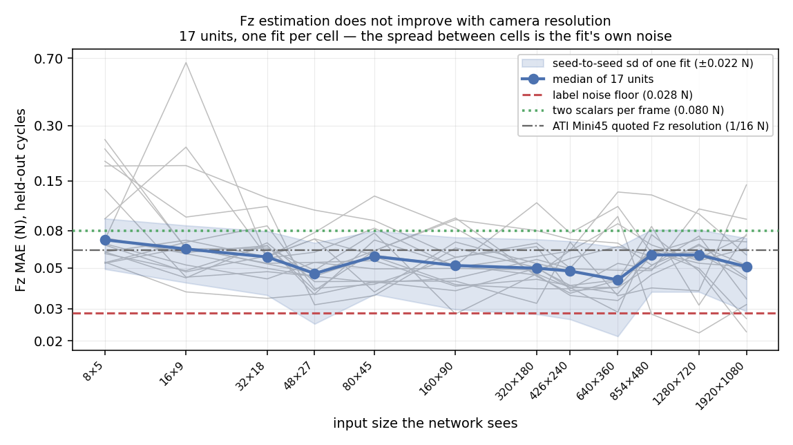
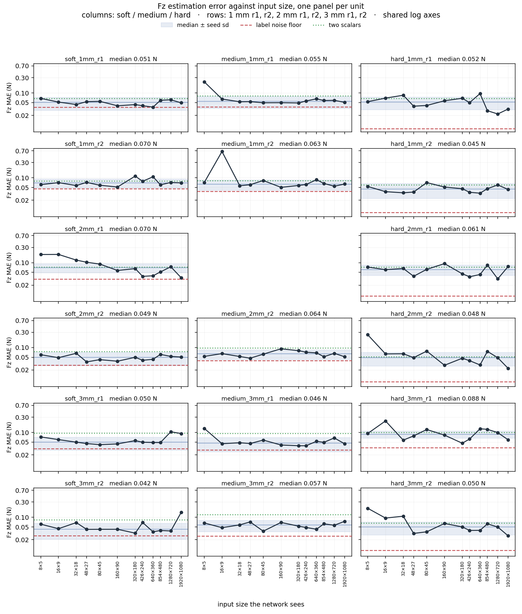
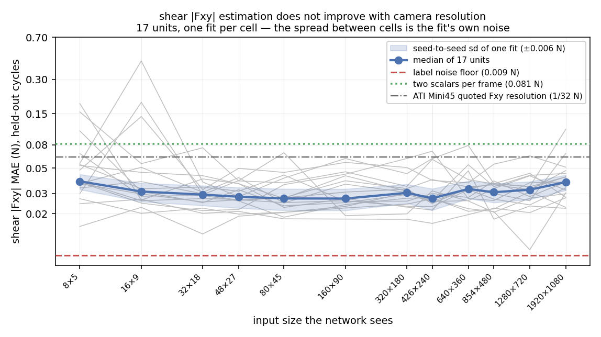
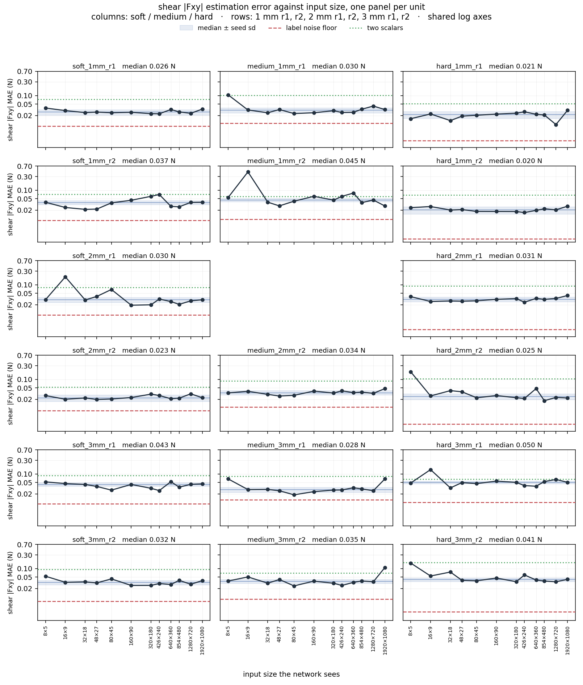
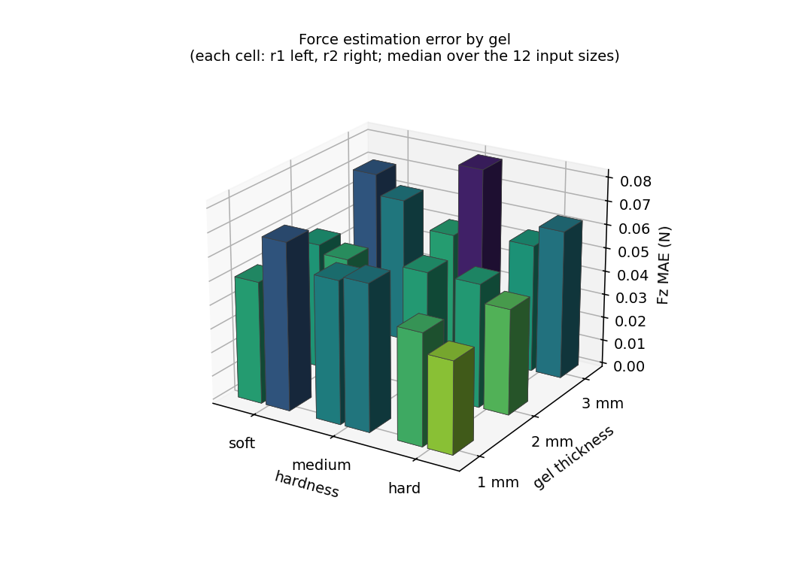

# 힘 추정 — 이미지에서 렌치를 되읽기, 그리고 카메라 해상도

2026-09-08. Pass B 가 유닛마다 모은 1000 장의 라벨 프레임으로 9DTact 의 힘 추정
파이프라인을 그대로 학습시키고, 입력 크기를 12 단계로 줄여가며 **카메라의 어느 부분이
실제로 쓰이는지** 물었다. `shape_vs_resolution.md` 와 같은 12 개 16:9 크기를 써서 두
곡선을 나란히 놓을 수 있다.

데이터: `data/9DTact/force_vs_resolution.csv` (204 행), `force_seed_study.csv` (45 행),
`force_scalar_baseline.csv` (17 행). 스크립트: `scripts/force_vs_resolution.py`,
`scripts/force_scalar_baseline.py`, `scripts/make_force_figures.py`.

---

## 1. 무엇을 어떻게

**데이터.** 유닛당 1000 프레임. 각 프레임에는 이미지와, 그 프레임의 노출 창 위에서 평균한
6 축 렌치가 붙어 있다. 수직 램프는 0 → 약 2.1 N, 전단은 0.5 N 까지. 드리프트 보정된
라벨(`Fz_s_corr`)이 있으면 그것을, 없으면 원값을 쓴다.

**분할은 사이클 단위다.** 각 블록(수직 / 전단)에서 **마지막 30 % 사이클**이 테스트다.
프레임을 무작위로 나누면 같은 램프의 이웃 프레임이 학습과 테스트에 함께 들어가 성능이
부풀려진다. 유닛당 학습 933 / 테스트 67 프레임.

**전처리와 모델은 9DTact 원본을 그대로 가져왔다** (`shape_reconstruction/sensor.py` 의
`raw_image_2_representation`, `force_estimation/train.py`, `model/cnn.py`):

- 3 채널 — ch0 = 회색 기준 이미지, ch1 = 밝아진 차이 × 3, ch2 = 어두워진 차이 × 3.
- ResNet-18, ImageNet 사전학습, fc 를 6 출력 선형층으로 교체.
- 0–255 부동소수 그대로(정규화 없음), L1 손실 `reduction='sum'`, Adam 5e-4, 선형 감쇠.
- 라벨은 학습 집합 기준 min–max 로 [0, 1] 스케일.
- epoch 30. 배치는 원본의 64 를 픽셀 수에 반비례해 줄인다(1080p 에서 4, 426×240 이하에서 64).

**축척은 건드리지 않는다.** 이 시험은 mm 를 쓰지 않으므로 이미지 축척과 무관하다.

---

## 2. 결과 — 크기를 12 단계 줄여도 오차가 움직이지 않는다

| 크기 | 배치 | **Fz MAE N** | R² | lateral MAE N | 1 회 학습 |
|---|---|---|---|---|---|
| **1920×1080** | 4 | 0.051 | 0.969 | 0.038 | 341 s |
| **1280×720** | 11 | 0.059 | 0.968 | 0.032 | 151 s |
| **854×480** | 24 | 0.059 | 0.970 | 0.031 | 71 s |
| **640×360** | 44 | 0.043 | 0.980 | 0.033 | 40 s |
| **426×240** | 64 | 0.048 | 0.978 | 0.027 | 19 s |
| **320×180** | 64 | 0.050 | 0.978 | 0.030 | 12 s |
| **160×90** | 64 | 0.052 | 0.979 | 0.027 | 4 s |
| **80×45** | 64 | 0.058 | 0.964 | 0.027 | 3 s |
| **48×27** | 64 | 0.047 | 0.975 | 0.028 | 3 s |
| **32×18** | 64 | 0.057 | 0.966 | 0.029 | 3 s |
| **16×9** | 64 | 0.064 | 0.947 | 0.031 | 3 s |
| **8×5** | 64 | 0.071 | 0.941 | 0.038 | 4 s |

중앙값이 **0.043 – 0.071 N 사이에서 평평**하다. 1920×1080 이 48×27 보다 낫지 않고,
8×5 — 40 픽셀 — 에서도 R² 0.94 다.

**그런데 이 표를 곧이곧대로 읽으면 안 된다.** 한 유닛 안에서 크기를 따라가면 순서가
없다. `hard_1mm_r1` 은 0.032 → 0.022 → 0.028 → **0.096** → 0.050 → 0.068 로 4 배씩
튄다. 부드러운 곡선이어야 할 자리다. 유닛별 "최고 크기"도 1920×1080 부터 48×27 까지
흩어진다. 이것은 해상도의 모습이 아니라 **학습 자체의 산포**로 보인다.

### 2.1 그래서 시드를 다섯 번 돌렸다

3 유닛 × 3 크기 × 5 시드, 다른 모든 것을 고정하고 `torch.manual_seed` 만 바꿨다.

시드 5 개의 Fz MAE (N), 오름차순:

| 유닛 | 크기 | 1 | 2 | 3 | 4 | 5 | sd | 최대/최소 |
|---|---|---|---|---|---|---|---|---|
| hard_1mm_r1 | 160×90 | 0.023 | 0.027 | 0.027 | 0.041 | 0.063 | 0.017 | 2.8× |
| hard_1mm_r1 | 640×360 | 0.024 | 0.033 | 0.044 | 0.057 | 0.091 | 0.026 | 3.7× |
| hard_1mm_r1 | 1920×1080 | 0.016 | 0.022 | 0.040 | 0.056 | 0.080 | 0.026 | 4.9× |
| medium_1mm_r1 | 160×90 | 0.047 | 0.052 | 0.060 | 0.071 | 0.102 | 0.022 | 2.2× |
| medium_1mm_r1 | 640×360 | 0.053 | 0.059 | 0.060 | 0.065 | 0.117 | 0.026 | 2.2× |
| medium_1mm_r1 | 1920×1080 | 0.047 | 0.051 | 0.052 | 0.086 | 0.095 | 0.023 | 2.0× |
| soft_2mm_r1 | 160×90 | 0.040 | 0.041 | 0.046 | 0.046 | 0.050 | 0.004 | 1.2× |
| soft_2mm_r1 | 640×360 | 0.036 | 0.040 | 0.044 | 0.045 | 0.048 | 0.005 | 1.3× |
| soft_2mm_r1 | 1920×1080 | 0.039 | 0.045 | 0.052 | 0.061 | 0.093 | 0.021 | 2.4× |

| | sd (N) |
|---|---|
| 같은 유닛·같은 크기, 시드만 바꿈 | **0.0219** |
| 같은 유닛, 12 개 크기 전체 (시드 1 개) | **0.0229** |

**크기 산포의 96 % 가 시드만으로 설명된다.** 한 칸 안에서 시드를 바꾸는 것만으로
오차가 최대 4.9 배 움직인다. 분산이 더해진다고 보면 크기가 만드는 몫은
√(0.0229² − 0.0219²) = **0.0067 N** 이하다 — 중앙값 오차의 13 % 로, §2 의 표에서
칸끼리 비교하기에는 너무 작다. 5 시드 중앙값으로 봐도 160×90 과 1920×1080 은 시드
산포 안에서 구별되지 않는다.

> **결론: 1920×1080 부터 최소 48×27 까지, 해상도 효과는 이 데이터로 검출되지 않는다.**
> "해상도가 무관하다"가 아니라 "**있더라도 0.0067 N 이하**"가 정확한 진술이다. 그보다
> 작은 효과를 보려면 칸마다 시드를 여러 번 돌려야 한다(§6).

크기가 8×5 · 16×9 로 내려가면 중앙값이 조금 오르고(0.063 → 0.071) 개별 유닛의 실패가
많아진다(0.18 – 0.66 N). 여기서는 효과가 잡음을 넘는다.

### 2.2 유닛별 — 17 개 패널

같은 자료를 유닛마다 따로 그렸다(열 = 경도, 행 = 두께 × 복제, 축은 모두 공유, 로그).
각 패널의 파란 띠는 그 유닛의 **12 크기 중앙값 ± 시드 sd(0.022 N)** 이고, 붉은 파선은
그 유닛의 라벨 잡음 바닥, 초록 점선은 프레임당 스칼라 두 개로 얻는 값이다.

읽는 법:

- **48×27 이상에서 점의 80 % 가 띠 안에 있다** (122/153). 띠는 ±1 sd 이므로 순수한
  가우시안 잡음이라면 68 % 가 들어올 자리다. 실제로 더 많이 들어온다는 것은 크기가
  만드는 흔들림이 시드가 만드는 것보다 **작다**는 뜻이고, §2.1 의 0.007 N 상한과 같은
  이야기다. 어느 유닛에서도 큰 해상도가 작은 해상도보다 낫다는 모양이 나타나지 않는다.
  (가장 많이 벗어난 세 유닛도 hard_3mm_r1 3/9, hard_2mm_r1 4/9, soft_2mm_r1 5/9 로,
  벗어나는 방향이 크기와 무관하다.)
- **띠를 벗어나는 점은 왼쪽 끝에 몰려 있다.** 8×5 · 16×9 · 32×18 에서 `soft_2mm_r1`
  (0.18 → 0.20 N), `hard_2mm_r2`(0.25 N), `medium_1mm_r2`(0.66 N), `hard_3mm_r2`
  (0.19 N) 가 크게 튄다. 여기서는 효과가 잡음을 넘고, 부호도 일정하다 — 너무 작으면
  나빠진다.
- **라벨 바닥까지의 거리가 유닛마다 다르다.** hard 1 mm · 2 mm 는 바닥이 0.008–0.009 N
  으로 아주 낮은데(F/T 읽기가 조용한 유닛) 모델은 0.045–0.061 N 에 머문다 — 이 유닛들은
  라벨이 아니라 **모델이 한계**다. 반대로 soft·medium 은 바닥이 0.026–0.045 N 이라
  모델이 바닥에 가깝다. §3.1 의 ρ = +0.55 를 패널 단위로 본 것이다.
- **스칼라 선(초록) 아래로 내려가는 정도**가 그 유닛에서 공간 구조가 얼마나 도움이
  되는지다. `medium_3mm_r2`·`soft_3mm_r1`·`medium_3mm_r1` 은 선이 한참 위에 있고(이득
  1.95–2.12 배), `soft_2mm_r1`·`hard_2mm_r2` 는 선이 곡선에 붙어 있다(1.05–1.07 배) —
  후자는 망이 사실상 밝기만 쓰고 있다는 뜻이다.

---

### 2.3 전단 — 여기서는 해상도 효과가 보인다

수직력과 같은 자료의 lateral 열(|Fxy| 의 MAE)을 같은 방식으로 그렸다.

| 크기 | Fz MAE N | **전단 Fxy MAE N** |
|---|---|---|
| **1920×1080** | 0.051 | 0.038 |
| **1280×720** | 0.059 | 0.032 |
| **854×480** | 0.059 | 0.031 |
| **640×360** | 0.043 | 0.033 |
| **426×240** | 0.048 | 0.027 |
| **320×180** | 0.050 | 0.030 |
| **160×90** | 0.052 | 0.027 |
| **80×45** | 0.058 | 0.027 |
| **48×27** | 0.047 | 0.028 |
| **32×18** | 0.057 | 0.029 |
| **16×9** | 0.064 | 0.031 |
| **8×5** | 0.071 | 0.038 |

**U 자다.** 중앙값이 0.038 N(8×5)에서 0.027 N(160×90)까지 내려갔다가
1920×1080 에서 다시 0.038 N 으로 올라간다. 수직력에서는 이런 모양이 없었다.

차이는 잡음이다. 전단은 F/T 라벨 잡음이 수직력의 1/3 이고(0.009 대 0.028 N),
학습 시드 산포도 1/3.8 이다:

| | 시드 sd | 크기 sd | 크기가 만드는 몫 | 중앙값 대비 |
|---|---|---|---|---|
| 수직 Fz | 0.0219 N | 0.0229 N | ≤ 0.0066 N | 13 % |
| **전단 Fxy** | **0.0058 N** | **0.0153 N** | **0.0142 N** | **46 %** |

전단에서는 크기가 만드는 몫이 시드 산포의 **2.5 배**이고 오차의 거의 절반을
차지한다. 즉 **해상도 효과가 없는 것이 아니라, 수직력 채널에서는 잡음에 묻혀 있었다.**
같은 실험에서 한 채널은 검출하고 한 채널은 못 하는 것이 이 스윕의 정확한 상태다.

유닛별로도 같은 모양이 반복된다 — `soft_1mm_r1`, `medium_3mm_r1`, `soft_3mm_r1`,
`hard_3mm_r2` 에서 가운데가 눈에 띄게 내려간다.

### 2.4 최적 크기는 왜 중간에 있나

양쪽 끝이 나빠지는 이유가 다르다.

- **왼쪽(8×5 · 16×9)**: 자국이 픽셀 몇 개로 뭉개져 전단이 만드는 **비대칭**이 사라진다.
  전단은 자국의 한쪽이 더 어두워지는 것으로 나타나므로, 자국을 몇 픽셀로 줄이면 그
  비대칭이 먼저 죽는다. 수직력(전체 밝기)이 8×5 에서도 R² 0.94 를 유지하는 것과 대조적이다.
- **오른쪽(1280×720 · 1920×1080)**: 입력이 커질수록 ResNet-18 이 933 프레임에 과적합할
  여지가 커지고, 배치도 픽셀 수에 반비례해 4 까지 줄어 학습이 불안정해진다(§1).
  1920×1080 의 시드 산포가 다른 크기보다 큰 것도 같은 이야기다.

운용자가 별도로 돌린 MobileNetV2 0.35× 연구(9DTact, 10 해상도, 물체 단위 분할)도 같은
모양을 보인다 — R² 가 224×224 · 320×180 부근에서 정점이고 1920×1080 에서 떨어진다.
모델과 데이터가 다른데 최적 크기가 **5 만 – 10 만 픽셀**로 겹친다는 것이 이 결과의 가장
강한 근거다.

---

## 3. 그러면 무엇이 오차를 정하는가

### 3.1 라벨 자신의 잡음

F/T 읽기에도 잡음이 있고, 모델은 라벨보다 정확해질 수 없다. 한 세그먼트 안에서 Fz 의
**2 차 차분**(램프의 선형 성분을 상쇄한다; 분산 = 6σ²)으로 재면 σ 중앙값 0.036 N,
가우시안 MAE 환산 **0.0284 N**. 1 차 차분을 쓰면 프레임 사이의 진짜 힘 변화
(중앙값 0.048 N)가 섞여 잡음을 5 배 부풀린다.

관측된 중앙값 **0.052 N** 은 이 바닥의 1.8 배다. 그리고 유닛별로
**모델 오차가 그 유닛의 라벨 잡음과 함께 움직인다** (Spearman ρ = +0.55, p = 0.021,
n = 17). 즉 성능의 상당 부분이 모델이 아니라 측정에서 온다.

참고로 ATI Mini45 가 공시한 Fz 분해능은 1/16 N = 0.0625 N 이다. **이미지에서 읽은 힘이
힘 센서의 공시 분해능보다 정확하다.**

### 3.2 신경망은 밝기 하나만 보는 게 아니다

40 픽셀에서 R² 0.94 가 나온다면, 망이 공간 구조가 아니라 전체 밝기만 읽는 것 아닌가 —
그건 물리적으로 옳은 단서이기도 하다(많이 닿을수록 어둡다). 그래서 프레임당 **숫자
두 개**(어두워진 채널의 평균, 문턱을 넘는 면적)만으로 같은 분할에서 능선 회귀를 돌렸다.

| | Fz MAE (N) | R² |
|---|---|---|
| 프레임당 스칼라 2 개 + 능선 회귀 | 0.080 | 0.938 |
| ResNet-18, 크기 중앙값 | **0.052** | 0.969 |

스칼라만으로도 R² 0.938 가 나온다 — 힘의 대부분은 정말 "얼마나 어두운가"에
있다. 그래도 망은 그보다 **1.55 배** 정확하므로, 공간 구조를 실제로 쓴다.
유닛별 이득은 1.05 – 2.12 배로 폭이 넓다(§4 표의 마지막 열).

---

## 4. 유닛별

크기 효과가 검출되지 않으므로 **12 개 크기를 유닛당 12 회 반복으로 묶었다.** 그러면
유닛별 추정의 표준오차가 0.007 N 으로 내려간다 — 한 칸만 볼 때의 ±0.022 N 보다
훨씬 낫고, 이것이 이 스윕에서 얻을 수 있는 가장 정밀한 유닛별 수치다.

| 유닛 | 두께 | 경도 | **Fz MAE N** | ± | R² | lateral MAE N | 라벨 바닥 N | 스칼라 N | 이득 |
|---|---|---|---|---|---|---|---|---|---|
| soft_3mm_r2 | 3 mm | soft | **0.042** | 0.009 | 0.978 | 0.032 | 0.027 | 0.085 | 2.00× |
| hard_1mm_r2 | 1 mm | hard | **0.045** | 0.003 | 0.985 | 0.020 | 0.008 | 0.061 | 1.37× |
| medium_3mm_r1 | 3 mm | medium | **0.046** | 0.008 | 0.973 | 0.028 | 0.028 | 0.094 | 2.03× |
| hard_2mm_r2 | 2 mm | hard | **0.048** | 0.018 | 0.975 | 0.025 | 0.009 | 0.052 | 1.07× |
| soft_2mm_r2 | 2 mm | soft | **0.049** | 0.003 | 0.979 | 0.023 | 0.028 | 0.076 | 1.54× |
| soft_3mm_r1 | 3 mm | soft | **0.050** | 0.006 | 0.981 | 0.043 | 0.031 | 0.097 | 1.95× |
| hard_3mm_r2 | 3 mm | hard | **0.050** | 0.014 | 0.979 | 0.041 | 0.009 | 0.066 | 1.33× |
| soft_1mm_r1 | 1 mm | soft | **0.051** | 0.003 | 0.961 | 0.026 | 0.036 | 0.067 | 1.33× |
| hard_1mm_r1 | 1 mm | hard | **0.052** | 0.007 | 0.986 | 0.021 | 0.008 | 0.068 | 1.31× |
| medium_1mm_r1 | 1 mm | medium | **0.055** | 0.014 | 0.956 | 0.030 | 0.037 | 0.082 | 1.48× |
| medium_3mm_r2 | 3 mm | medium | **0.057** | 0.004 | 0.966 | 0.035 | 0.026 | 0.122 | 2.12× |
| hard_2mm_r1 | 2 mm | hard | **0.061** | 0.006 | 0.944 | 0.031 | 0.009 | 0.073 | 1.18× |
| medium_1mm_r2 | 1 mm | medium | **0.063** | 0.050 | 0.969 | 0.045 | 0.037 | 0.082 | 1.31× |
| medium_2mm_r2 | 2 mm | medium | **0.064** | 0.004 | 0.959 | 0.034 | 0.040 | 0.098 | 1.54× |
| soft_2mm_r1 | 2 mm | soft | **0.070** | 0.015 | 0.961 | 0.030 | 0.031 | 0.074 | 1.05× |
| soft_1mm_r2 | 1 mm | soft | **0.070** | 0.006 | 0.965 | 0.037 | 0.045 | 0.080 | 1.14× |
| hard_3mm_r1 | 3 mm | hard | **0.088** | 0.014 | 0.945 | 0.050 | 0.034 | 0.101 | 1.15× |
| **중앙값** | | | **0.052** | 0.007 | 0.969 | 0.031 | 0.028 | 0.080 | 1.55× |

"라벨 바닥"은 그 유닛의 F/T 읽기 자신의 잡음, "스칼라"는 §3.2 의 두 숫자 회귀,
"이득"은 스칼라 대비 망의 배수.

### 4.1 젤 두께 × 경도 — 함께 본다

두께와 경도는 따로 평균 낼 변수가 아니다(`shape_reconstruction.md` §3.5 와 같은 이유).

**Fz MAE (N)** (칸마다 r1, r2 순)

| 두께 \ 경도 | soft | medium | hard |
|---|---|---|---|
| 1 mm | 0.051, 0.070 | 0.055, 0.063 | 0.052, 0.045 |
| 2 mm | 0.070, 0.049 | 0.064 | 0.061, 0.048 |
| 3 mm | 0.050, 0.042 | 0.046, 0.057 | 0.088, 0.050 |

**두께에도 경도에도 경향이 없다** — 두께와 ρ = −0.19 (p = 0.48), 경도와 ρ = +0.00
(p = 1.00), n = 17. 같은 사양의 두 복제 사이 차이(예: hard_3mm 는 0.088 대 0.050)가
격자의 어느 축을 따라가는 차이보다 크다. 이는 분해능·형상에서 본 것과 같은 모습이다:
젤 사양이 아니라 유닛 개체가 성능을 정한다.

---

## 5. 결론

1. **채널마다 답이 다르다.** **수직력**은 1920×1080 부터 48×27 까지 차이가 시드 산포
   (±0.022 N) 안에 있어 해상도 요구가 검출되지 않는다. **전단**은 다르다 — 크기가
   만드는 몫이 0.0142 N(시드 산포의 2.5 배, 오차의 46 %)이고,
   **160×90 부근에서 최소**를 이루며 양쪽으로 나빠진다(§2.3). 전단이 해상도를 요구하는
   쪽이고, 그 요구는 1920×1080 이 아니라 **5 만 – 10 만 픽셀**이다.
2. **수직력의 바닥은 카메라가 아니라 라벨이다.** 중앙값 0.052 N 은 F/T 읽기 자신의
   잡음(0.028 N)의 1.8 배이고, 유닛별로 둘이 함께 움직인다(ρ = +0.55). 더 좋은 수직력
   추정을 원하면 카메라가 아니라 **라벨의 평균 시간**을 늘려야 한다. **전단은 반대다** —
   라벨 바닥이 0.009 N 인데 모델은 0.031 N 으로 그 3.4 배에 있다.
   전단에서 남은 여지는 라벨이 아니라 모델과 입력 쪽에 있고, 그래서 §2.3 의 해상도
   효과가 이 채널에서만 보인다.
3. **망은 스칼라보다 낫고, 전단에서 더 낫다** — 수직력 1.55 배, 전단 2.6 배
   (0.081 → 0.031 N). 이미지 전체 밝기가 수직력의 대부분을 담지만
   (스칼라만으로 R² 0.94), 전단은 자국의 **비대칭**이라 스칼라로는 거의 잡히지 않는다.
   §2.3 · §2.4 와 같은 이야기다.
4. **젤 두께·경도는 힘 추정 성능을 정하지 않는다.** 복제 간 차이가 사양 간 차이보다 크다.
5. 실무: 힘·형상용 카메라는 픽셀 수보다 **프레임률과 노출**을 사야 한다는
   `shape_vs_resolution.md` §4 의 결론이 힘 쪽에서도 유지된다. 다만 전단까지 보려면
   너무 줄여도 안 된다 — 형상이 80×45, 전단이 160×90 을 요구하므로 **160×90 이 이
   방식 전체의 하한**이다.

---

## 6. 한계

- **칸마다 시드 하나다.** §2 의 표는 그래서 칸끼리 비교할 수 없고, 5 시드 연구는 3 유닛
  × 3 크기에만 있다. 전 표를 5 시드로 다시 돌리면 약 15 시간이 든다(현재 1 회 3 시간).
  작은 해상도 효과가 실제로 있는지는 그렇게 해야 답이 나온다.
- **테스트 프레임이 67 개다.** 사이클 단위 분할이 옳지만 그만큼 테스트가 작아, 한 사이클의
  특이함이 그대로 수치에 들어간다.
- **한 프로브(ball8), 한 궤적**이다. 다른 접촉 형상·다른 힘 이력으로 일반화되는지는 재지
  않았다.
- **전단은 lateral MAE 하나로만 요약했다.** 방향별 정확도, 그리고 수직·전단 결합은 아직
  안 봤다.
- **축소는 소프트웨어 면적 평균이다.** 진짜 저해상도 센서는 픽셀이 크면서 잡음도 다르므로,
  여기 결과는 "정보량" 기준이지 특정 카메라의 예측이 아니다.
