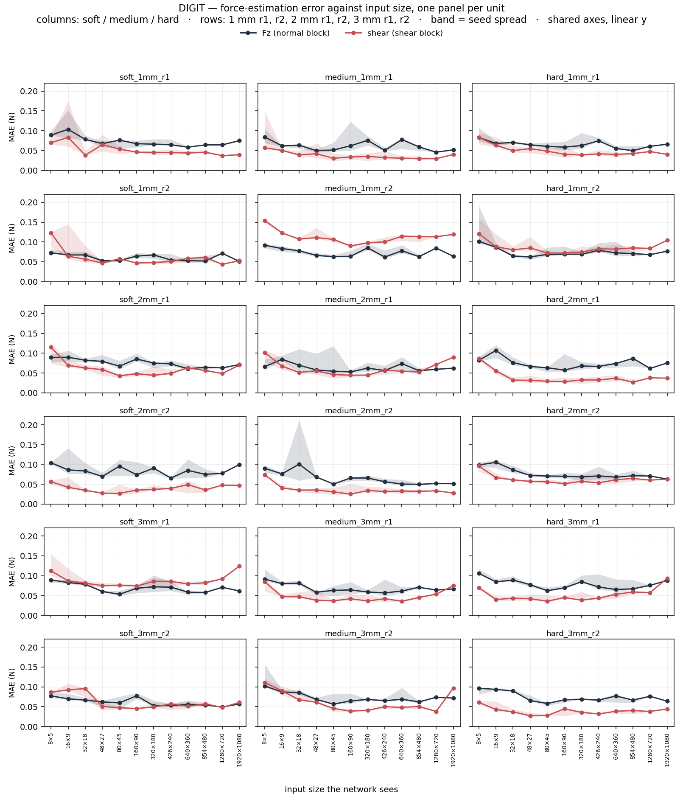
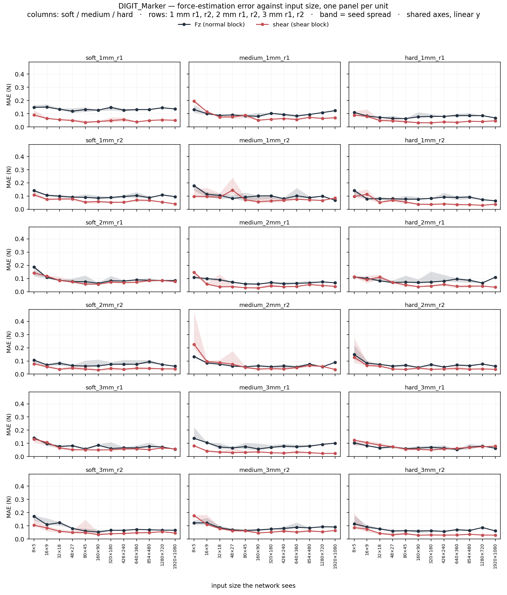
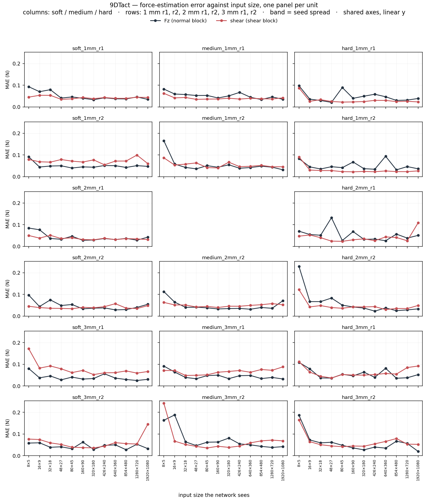

# DIGIT 과 DIGIT_Marker 의 해상도별 힘 추정 — 2026-09-10

9DTact 에 대한 같은 질문(`force_estimation.md`)을 나머지 두 원리에 되풀이한 결과.
**세 원리를 한 표에 놓고 평균내지 않는다** — 조명도, 겔도, 카메라 배치도 다르므로 비교는
같은 (경도, 두께) 칸 안에서만 하고, 여기서는 각 원리 안에서의 해상도 의존만 다룬다
(원리 간 비교는 `cross_principle.md`).

## 1. 무엇을 어떻게

- **데이터**: Pass B ball8 collect, 유닛당 1000 프레임. DIGIT 18 유닛, DIGIT_Marker 18 유닛.
  각 유닛의 CANONICAL 런만 쓰고, 차영상의 기준은 `reference_collect.png`
  (`campaign_protocol.md` §4.7 (10) 의 프로브 그림자 문제).
- **모델과 학습**: 9DTact 와 **완전히 같은 조리법** — ResNet-18(ImageNet 사전학습),
  최적화 배치 64(경사 누적으로 정확히 맞춤), 30 epoch, 검증으로 epoch 선택, L1.
  해상도가 바뀌어도 배치·epoch·학습률·분할이 모두 동일하다. 이것이 전제다:
  **해상도만 바뀌어야 해상도의 효과를 읽을 수 있다.**
- **분할**: 사이클 단위. 훈련/검증/시험 경계를 70/15/15 에 가장 가깝게 함께 고르고
  시험 집합에 8 % 하한을 둔다(옛 분할은 전단 시험이 12 프레임까지 줄었다).
- **범위**: `--fz-max 2.0` 으로 2 N 을 넘는 프레임을 버린다. 마커 `soft_1mm_r1/r2` 는
  수정 전에 수집돼 프레임의 14–26 % 가 그 위에 있다.
- **지표**: **블록을 나눠 잰다.** `Fz` 는 법선 블록 프레임만, `전단` 은 전단 블록
  프레임만. 섞어서 평균내면 전단이 실제보다 좋아 보인다.
- **크기**: 12 단계(1920×1080 → 8×5), 면적 평균 축소. ≤854 px 는 **3 시드**,
  1280·1920 은 1 시드.
- **입력 표현**: `grey`(9DTact 조리법: 회색 차영상) 와 `colour`(세 채널 보존) 둘 다.

## 2. 결과 — 유닛 중앙값

| 크기 | DIGIT grey Fz | DIGIT grey 전단 | DIGIT colour Fz | DIGIT colour 전단 | 마커 grey Fz | 마커 grey 전단 | 마커 colour Fz | 마커 colour 전단 |
|---|---|---|---|---|---|---|---|---|
| **1920×1080** | 0.065 | 0.062 | 0.060 | 0.045 | 0.068 | 0.043 | 0.073 | 0.043 |
| **1280×720** | 0.066 | 0.048 | 0.062 | 0.054 | 0.082 | 0.054 | 0.073 | 0.046 |
| **854×480** | 0.064 | 0.051 | 0.065 | 0.048 | 0.083 | 0.052 | 0.072 | 0.051 |
| **640×360** | 0.064 | 0.049 | 0.061 | 0.044 | 0.079 | 0.047 | 0.072 | 0.047 |
| **426×240** | 0.065 | 0.046 | 0.065 | 0.046 | 0.079 | 0.044 | 0.074 | 0.053 |
| **320×180** | 0.069 | 0.044 | 0.067 | 0.041 | 0.075 | 0.045 | 0.073 | 0.046 |
| **160×90** | 0.067 | 0.045 | 0.068 | 0.043 | 0.070 | 0.042 | 0.072 | 0.046 |
| **80×45** | 0.062 | 0.046 | 0.062 | 0.039 | 0.066 | 0.049 | 0.065 | 0.048 |
| **48×27** | 0.066 | 0.051 | 0.061 | 0.042 | 0.074 | 0.062 | 0.069 | 0.051 |
| **32×18** | 0.078 | 0.051 | 0.068 | 0.048 | 0.082 | 0.070 | 0.083 | 0.055 |
| **16×9** | 0.084 | 0.065 | 0.074 | 0.057 | 0.100 | 0.083 | 0.094 | 0.081 |
| **8×5** | 0.091 | 0.087 | 0.107 | 0.075 | 0.135 | 0.122 | 0.148 | 0.115 |

**세 가지가 눈에 띈다.**

1. **Fz 는 넓은 구간에서 평평하다.** DIGIT 은 1920 → 48 px 에서 0.065 → 0.066 N 으로
   사실상 변화가 없고, 32 px 아래에서만 무너진다(0.078 → 0.084 → 0.091). 마커도 같은
   모양이되 바닥이 높다(0.066–0.083). 9DTact 에서와 같은 이유다 — Fz 는 그림의 적분량이고
   면적 평균 축소는 적분을 보존한다.
2. **전단은 U 자다.** 두 원리 모두 80–320 px 부근에서 가장 낮고 양쪽 끝에서 오른다.
   큰 쪽의 상승은 해상도가 아니라 과적합이다(1920 px 에서 유닛당 프레임 수는 그대로인데
   입력 차원만 커진다).
3. **8×5 에서 두 채널 모두 무너진다** — DIGIT Fz 0.091, 마커 Fz 0.135. 마커 쪽 붕괴가
   1.5 배 크다.

## 3. 색을 살리면 나아진다

같은 유닛·크기·시드끼리 짝지어 비교했다(각 576 쌍, Wilcoxon):

| | DIGIT Fz | DIGIT 전단 | 마커 Fz | 마커 전단 |
|---|---|---|---|---|
| colour / grey | **0.960** (p 0.0003) | **0.903** (p < 0.0001) | **0.960** (p 0.0003) | 0.976 (p 0.0017) |
| ≤48 px 에서만 | 0.945 | 0.860 | 0.965 | 0.893 |

**세 채널을 살리면 오차가 4–10 % 준다.** 이득은 **낮은 해상도에서 더 크다**(≤48 px 에서
DIGIT 전단 14 % 개선). DIGIT 은 R/G/B LED 로 겔을 옆에서 비추므로 채널마다 다른 방향의
빛을 담고 있고, 회색으로 합치면 그 방향 정보가 사라진다. 화소가 적을수록 남은 화소 하나에
든 정보가 귀해지므로 채널을 버리는 대가가 커진다.

마커에서는 전단 이득이 작다(2.4 %). 점이 스펙트럼을 지배해 채널 간 차이가 묻히는 것과
같은 방향이다(`cross_principle.md` §3.5).

## 3b. DIGIT 자신의 레시피와 마커 전용 전처리 — 둘 다 더 낫지 않다 (2026-09-11)

18 유닛 짝지은 Wilcoxon, 전해상도, 1 시드.

**민 DIGIT — 기준 영상을 빼는 편이 낫다:**

| 표현 | Fz MAE | 전단 MAE |
|---|---|---|
| **colour** (기준 차분, 우리 방식) | **0.0604** | **0.0451** |
| grey | 0.0651 | 0.0619 |
| raw (PyTouch 레시피) | 0.0655 | 0.0639 |

`raw` 는 DIGIT 공식 파이프라인을 그대로 옮긴 것이다 — 64×64 로 줄인 raw RGB,
ImageNet 정규화, **기준 차분 없음**(`method_vs_literature.md` §2). colour 가 Fz 는
p 0.054, **전단은 p 0.008** 로 낫다.

**단, `raw` 는 두 가지를 동시에 바꾼다** — 기준 차분을 빼고 정규화를 켠다. 어느 쪽이
원인인지는 `colour + ImageNet` 한 팔을 돌려야 갈린다(진행 중,
`force_vs_resolution_colour_imagenet.csv`).

**마커 — 마커 전용 전처리가 평범한 표현을 못 이긴다:**

| 비교 | 전단 차이 | p |
|---|---|---|
| inpaint vs colour | +0.0038 | 0.67 |
| inpaint vs grey | −0.0016 | 0.12 |
| inpaint vs flow | −0.0070 | **0.039** |
| inpaint vs raw | −0.0244 | **0.0000** |

주변 중앙값(inpaint 0.0364 vs colour 0.0432)은 inpaint 가 나아 보이게 하지만 **유닛별로
짝지으면 차이가 없다.** 확실한 것은 둘: **마커는 추적(flow)보다 지우는(inpaint) 편이 낫고**,
raw 가 최악이다. "마커는 별도 구조가 필요하다"는 가설은 이 표본에서 지지되지 않는다.

## 4. 젤에 따라 포화 해상도가 달라지는가

이것이 캠페인의 원래 질문이다. 유닛별로 무릎(오차가 자기 바닥에서 벗어나는 가장 작은 크기)과
바닥을 재고 경도·두께와의 순위 상관을 봤다(3 시드, `scripts/analyse_saturation.py`).

| | DIGIT | DIGIT_Marker |
|---|---|---|
| 전단 무릎 ~ 두께 | ρ **−0.456** (p **0.057**), 중앙값 120 / 32 / 48 px | ρ −0.162 (p 0.52) |
| Fz 무릎 ~ 두께 | ρ −0.095 (p 0.71) | ρ +0.020 (p 0.94) |
| Fz 바닥 ~ 두께 | ρ +0.105 (p 0.68) | ρ **−0.551** (p **0.018**) |
| 경도 (모든 지표) | 전부 유의하지 않음 | 전부 유의하지 않음 |

- **DIGIT 의 전단만 두께를 따른다** — 두꺼울수록 더 낮은 해상도에서 포화한다. 다만 **p 0.057
  로 경계선**이고, 1 시드에서 p 0.051 이었던 것이 3 시드에서도 거의 그대로다(값도 −0.466 →
  −0.456). 그림 쪽 측정 두 가지가 같은 방향을 가리킨다: 압흔 대역폭이 요구하는 폭
  24 → 17 px(`cross_principle.md` §3.6), 국소 압입 빛의 번짐 1.0 → 3.2 mm(§3.9).
- **마커는 Fz 바닥이 두께를 따른다**(두꺼울수록 낮다). 무릎은 어느 채널도 두께를 따르지 않는다.
- **경도는 어디에서도 효과가 없다.** 그런데 §3.11 에서 평면 펀치로 잰 강성이 경도 라벨을
  정렬하지 않는다는 것이 드러났으므로, 이 무효는 "경도가 무관하다" 가 아니라 **"라벨이
  무엇을 가리키는지 모른다"** 로 읽어야 한다.

그림: `figures/saturation_DIGIT_3seed.png`, `figures/saturation_DIGIT_Marker_3seed.png`.

## 4b. 유닛별 — 18 개 패널

중앙값은 유닛 안의 요동을 감춘다. 아래는 **유닛 하나에 패널 하나**, 두 채널을 겹쳐 그린 것이다.
열은 soft / medium / hard, 행은 1 mm r1, r2, 2 mm r1, r2, 3 mm r1, r2. 축은 공유,
y 는 선형, x 는 범주형(크기는 선형 척도가 아니므로 선형으로 그리면 오해를 부른다).
띠는 세 시드의 폭이다.

**패널에서 읽히는 것.**

1. **두 채널의 모양이 유닛마다 일관되게 다르다.** 거의 모든 DIGIT 패널에서 전단(빨강)이
   Fz(검정) **아래**에 있고 더 평평하다. 중앙값 표에서 본 "Fz 평평, 전단 U 자" 는 몇몇
   유닛이 만든 평균이 아니라 18 개 중 대부분에서 같은 모양으로 나타난다.
2. **예외가 있고, 예외가 정보다.** `medium_1mm_r2` 와 `hard_1mm_r2` 는 전단이 Fz 위에 있고
   큰 크기로 갈수록 **올라간다** — 과적합 팔이 전단에서만 뚜렷한 경우다. 두 유닛 모두 1 mm
   이고, 1 mm 겔은 전단 무릎이 가장 큰(120 px) 집단이다(§4).
3. **8×5 의 붕괴는 보편적이다.** 18 개 패널 전부에서 마지막 칸이 솟는다. 두 채널 모두.
4. **시드 폭이 큰 곳은 큰 크기 쪽이 아니라 작은 크기 쪽이다.** 8×5–32×18 에서 띠가 가장
   넓다 — 화소가 적을 때 최적화가 어디에 안착하느냐가 더 많이 갈린다.

비교를 위해 9DTact 도 같은 형식으로 그렸다(17 유닛, 고친 분할 v3):

`scripts/per_unit_figures.py <csv> <label> <out.png>`.

## 5. 한계

1. **1280·1920 px 는 1 시드**다. 그 두 점의 상승(과적합 팔)은 시드 잡음과 구분되지 않는다.
2. **무릎은 2 배 간격 사다리에서 읽힌다.** 한 칸이 곧 2 배이므로 p 0.057 짜리 추세를
   확정하려면 √2 간격(24, 40, 64, 113, 226 px)이 필요하다 — 수집 없이 학습만으로 가능하다
   (`data_wishlist.md` #10).
3. **전단 범위가 유닛마다 다르다.** 명령은 0.5 N 이었지만 실제 |Fxy| 최대는 0.52–0.94 N 로
   1.8 배 벌어진다(마찰이 목표를 넘겨 끌고 간다). "모든 유닛을 같은 span 에서 비교한다" 는
   전제가 전단에서는 성립하지 않는다(`data/passB_range_check.csv`).
4. **마커 두 유닛**(`soft_1mm_r1/r2`)은 수집 프로토콜 수정 전 데이터라 2 N 초과 프레임이
   14–26 % 다. `--fz-max 2.0` 으로 걸러내지만 남는 프레임 수가 다른 유닛보다 적다.
5. 원리 간 비교는 여기서 하지 않는다. 같은 칸 안에서의 비교는 `cross_principle.md` §4.
6. **§3b 의 `raw` 는 두 변경을 겹쳐 놓은 것**이다(기준 차분 제거 + ImageNet 정규화).
   분리 실험이 끝나기 전까지 "PyTouch 레시피가 더 나쁘다"까지만 말할 수 있고 "기준 차분이
   중요하다"는 아직 못 한다.
