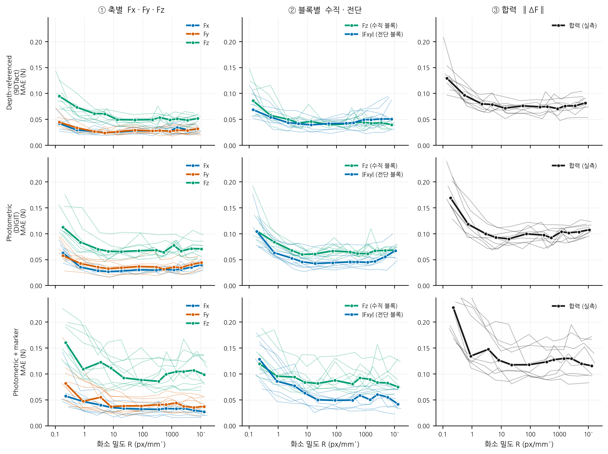

# 같은 학습을 세 가지로 묶어 본다 — 축별 · 블록별 · 합력

2026-09-15. 자료 `docs/figures/force_views.csv`, 그림
`docs/figures/force_views.png`, 만드는 것 `src/scripts/force_views.py`.
선택 27 유닛(원리당 아홉), 12 해상도 단, seed 3 개.

한 번의 학습이 프레임마다 여섯 수를 낸다. **그것을 어떻게 묶느냐가 "이 센서가
얼마나 정확한가" 의 답을 바꾼다.** 세 묶음은 다른 실험이 아니라 **같은 예측을
다르게 센 것**이다. 그러므로 셋이 어긋나면 그것은 센서가 아니라 세는 방식의
문제다.

| 보기 | 무엇 | 왜 |
|---|---|---|
| ① 축별 | Fx · Fy · Fz 따로 | 방향마다 다른지. 합치면 사라지는 것이 있다 |
| ② 블록별 | 수직 블록의 Fz, 전단 블록의 \|Fxy\| | **시험 프레임을 나눈다.** 섞으면 전단이 쉬워 보인다 |
| ③ 합력 | ‖F_pred − F_true‖ | 센서를 쓰는 쪽이 겪는 하나의 수 |

세 열이 같은 세로 눈금을 쓴다 — 합력이 축별보다 큰 것은 당연한데, 축을 따로
잡으면 그 당연한 사실이 그림에서 사라진다.

## 1. 평탄 구간(R ≥ 13)의 중앙 MAE 와 평탄 밀도

| 원리 | 보기 | MAE (N) | 평탄 R (px/mm²) |
|---|---|---:|---:|
| 9DTact | ① Fx | 0.0282 | 2.6 |
| | ① Fy | 0.0265 | 5.5 |
| | ① Fz | 0.0504 | 44.7 |
| | ② Fz (수직 블록) | 0.0417 | 6.2 |
| | ② \|Fxy\| (전단 블록) | 0.0404 | 13.8 |
| | ③ 합력 | 0.0739 | 13.6 |
| DIGIT | ① Fx | 0.0300 | 7.5 |
| | ① Fy | 0.0358 | 6.7 |
| | ① Fz | 0.0661 | 6.3 |
| | ② Fz (수직 블록) | 0.0624 | 6.6 |
| | ② \|Fxy\| (전단 블록) | 0.0464 | 17.4 |
| | ③ 합력 | 0.0907 | 4.9 |
| DIGIT_Marker | ① Fx | 0.0332 | 22.7 |
| | ① Fy | 0.0368 | 28.4 |
| | ① Fz | 0.0953 | 22.7 |
| | ② Fz (수직 블록) | 0.0821 | 9.7 |
| | ② \|Fxy\| (전단 블록) | 0.0510 | 89.6 |
| | ③ 합력 | 0.1187 | 22.4 |

## 2. 각 보기가 혼자 말하는 것

### ① 축별 — Fz 가 횡력의 두 배다

세 원리 모두 **Fz 오차가 횡력 평균의 1.9 ~ 2.6 배**다(9DTact 0.0504 대 0.0273,
DIGIT 0.0661 대 0.0329, 마커 0.0953 대 0.0362). 이것은 ③ 에서 하나로 접히고 ② 는
두 블록이 다른 프레임이라 직접 견줄 수 없다 — **축별로만 보이는 사실이다.**

**Fx 와 Fy 는 거의 같다.** 평탄 구간에서 짝지어 보면 Fy/Fx 가 9DTact 0.94
(p 0.36), DIGIT 1.19 (p 0.13), 마커 1.11 (**p 0.012**). 마커만 유의한데 그
크기는 11 % 다. 두 축을 굳이 나눠 실을 이유는 크지 않지만, **합치기 전에
같은지 확인한 기록**으로 남긴다.

> 이것이 2026-09-12 이전에 놓쳤던 것이다. 그때는 `lat_mae = hypot(Fx, Fy)` 로
> 두 축을 합쳐 버려 방향별 성능이 보이지 않았고, Fz 와의 2 배 차이도 견줄
> 대상이 없었다(`force_estimation.md` §2.6).

### ② 블록별 — 섞으면 전단이 쉬워 보인다

전단을 **전 시험 프레임**으로 재면 9DTact 0.0278 N 인데 **전단 블록만** 쓰면
0.0404 N 이다 — **1.45 배**. DIGIT 1.37 배, 마커 1.42 배로 세 원리가 같다.

이유는 수직 블록에서 전단 라벨이 **마찰 잡음(0 ~ 0.05 N)** 이라 어떤 모형이든
0 에 가깝게 맞춘다는 것이다. 그 쉬운 프레임이 절반이므로 평균이 내려간다.
**그리고 크기만 내려가는 것이 아니라 해상도 의존성까지 묽어진다** — 그 쉬운
절반은 해상도와 거의 무관하기 때문이다.

> 그래서 "전단 추정 오차" 라고 쓸 때는 **어느 프레임에서 잰 것인지** 밝혀야
> 한다. 이 캠페인은 `lat_mae_shear`(전단 블록)를 그 이름으로 쓴다.

### ③ 합력 — 사실상 Fz 다

제곱합에서 Fz 가 차지하는 몫이 9DTact 59 %, DIGIT 65 %, 마커 80 % 로 셋 다
등분선(33 %)보다 한참 위다. 그래서 **합력 곡선의 모양은 Fz 곡선의 모양**이고
전단은 크기를 조금 올릴 뿐이다.

합력의 값어치는 새 정보가 아니라 **해석의 단위**에 있다. 0.074 · 0.091 · 0.119 N 은
측정 범위 0 ~ 2.1 N 의 **3.5 · 4.3 · 5.7 %** 이고, 이것이 손가락 하나가 힘 벡터를
얼마나 틀리게 읽는지다. 축별 0.027 N 을 보고 "3 % 오차" 라고 말하면 안 된다 —
세 축이 함께 틀리기 때문이다.

## 3. 세 보기가 어긋나는 곳

**평탄 밀도가 보기마다 다르다.** 9DTact 에서 ① Fx 는 R ≈ 2.6, ① Fz 는
R ≈ 44.7 로 **17 배** 차이다. 같은 학습, 같은 프레임인데 무엇을 세느냐로
"필요한 화소 밀도" 가 열일곱 배 움직인다.

그러므로 **"이 센서에 필요한 화소 밀도는 X 다" 라는 문장은 그 자체로
불완전하다.** 어느 축, 어느 프레임, 어느 묶음인지를 함께 적어야 한다.

| 무엇을 말하려는가 | 쓸 보기 |
|---|---|
| 방향마다 다른가 | ① |
| 전단 추정이 얼마나 되나 | ② (전단 블록) |
| 이 손가락이 힘을 얼마나 틀리나 | ③ |
| 해상도 요구를 한 수로 | ③ — 다만 Fz 가 끌고 간다는 것을 밝힐 것 |

## 4. 한계

- **평탄 밀도는 허용치에 달려 있고, 5 % 로 조이면 학습 판 사이에서 재현되지
  않는다**(`result/results_single_sensor.md` 의 해당 절). 위 표는 전부 10 %
  기준이다.
- ② 의 두 곡선은 **다른 프레임**에서 나온 것이라 세로로 견주면 안 된다. 같은
  그림에 둔 것은 해상도에 따른 **모양**을 견주기 위해서다.
- 유닛 사이의 산포가 이 차이들보다 큰 경우가 있다 — 가는 선을 함께 그린
  이유다. 굵은 선만 보고 읽지 말 것.
