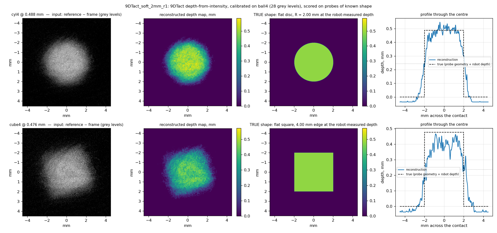
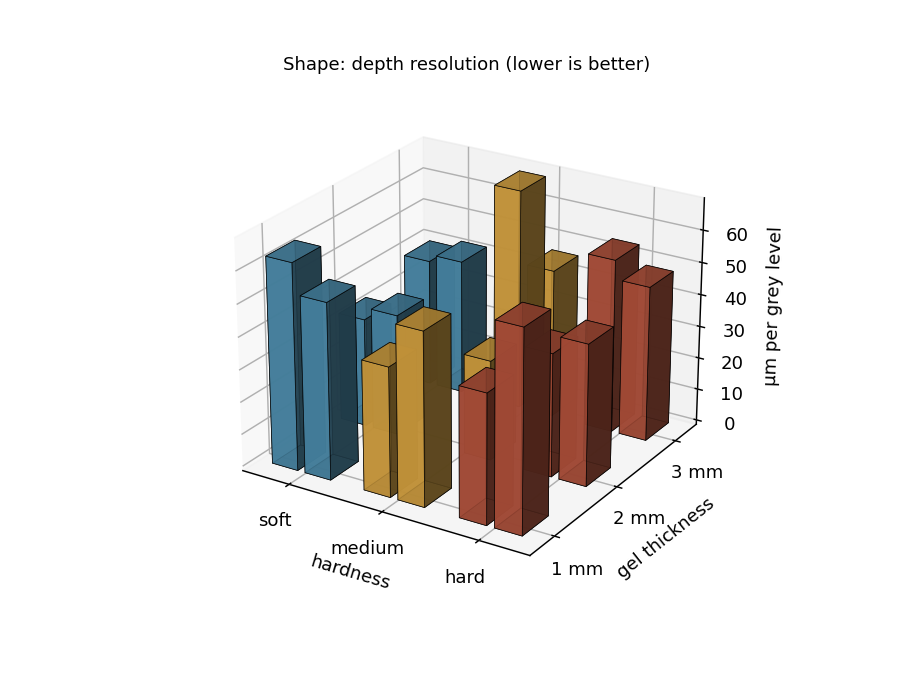
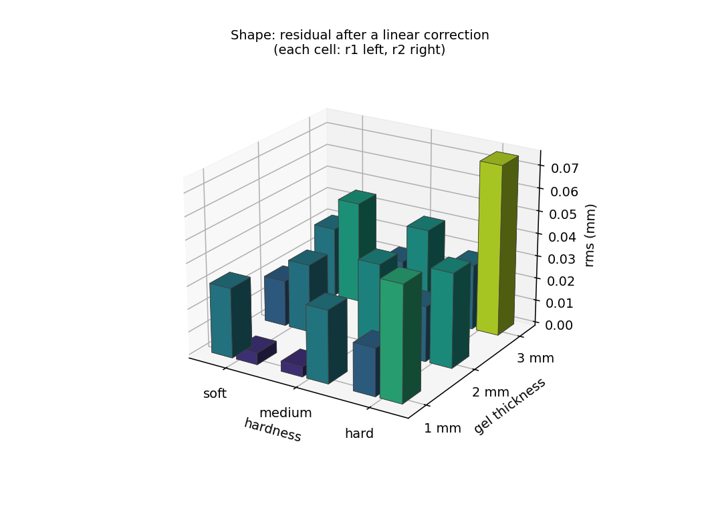

# 시험 2 — 형상 재구성 (shape reconstruction)

2026-09-05 ~ 09-06 측정, 09-07 전 유닛 분석. 9DTact 17 유닛, 유닛당 ball4 로 교정하고
cyl4 (18 프레임) 와 cube4 (6 프레임) 로 채점 — **17 × 24 = 408 평가 프레임**.
데이터: `data/20260911_VBTSresolution_dataset/9DTact/20260905_passA_{ball4,cube4,cyl4}/<sensor>/`,
분석: `scripts/analyse_shape.py`, 결과: `data/20260911_VBTSresolution_dataset/9DTact/shape_reconstruction.csv`
(유닛당 1 행) 와 `shape_reconstruction_rungs.csv` (프레임당 1 행).
2026-09-05 의 단일 유닛 파일럿은 `archive/shape_reconstruction_pilot.html` 에 그대로 있다.

---

## 1. 무엇을 재는가

**이미지 한 장에서 접촉면의 깊이 지도를 얼마나 되찾는가.** 9DTact 가 제안한
밝기→깊이 방식(depth from intensity)을 그대로 쓴다: 어두워진 정도가 깊이다. 이
방법의 성능은 알고리즘이 아니라 **센서가 깊이를 몇 단계의 회색조로 부호화하는가**로
정해지므로, 54 설계를 비교하는 지표로 삼기에 알맞다.

---

## 2. 방법

### 2.1 9DTact 의 원 방법 (`shape_reconstruction/_2_Sensor_Calibration.py`, `sensor.py`)

1. **교정** — 반경 R 을 아는 공을 한 번 누른다. 접촉원 안에서는 구의 기하가 모든
   픽셀의 참 높이를 준다: `h(r) = √(R²−r²) − √(R²−rc²)`. 이 높이와 그 픽셀의
   어두워짐(기준 − 프레임)을 짝지어 **회색조 → 깊이** 표를 만든다(회색조당 평균).
2. **재구성** — `depth = 표[blur(기준 − 프레임)] − 표[조명 문턱]`, 그 뒤 7×7 가우시안
   두 번.

### 2.2 이 리그에서 달리 한 세 가지 — 모두 강제된 것이고, 모두 실측 근거가 있다

**픽셀이 정사각형이 아니다.** 9DTact 는 체커보드로 정류하고 mm/px 하나를 쓴다. 밀봉된
센서 안에 체커보드를 넣을 수 없어, 로봇을 아는 거리만큼 움직이며 자국을 추적해 축척을
쟀다. 그 결과는 스칼라가 아니라 **2×2 야코비안**(이방성 1.02–1.28, 회전 24–33°)이고,
모든 프레임을 그 역행렬로 정사각·축정렬 픽셀에 재표본한 뒤 재구성한다.

**접촉 반경은 검출하지 않고 계산한다.** 손으로 누르면 깊이를 모르니 9DTact 는 자국을
문턱 처리해 원을 찾는다. 여기선 로봇이 깊이 d 를 재므로 반경은 기하에서 나온다:
`rc = √(2Rd − d²)`. 문턱 처리한 영역은 0.18 mm 이상에서 참 접촉보다 **일정하게 1.25배**
넓게 잡히므로(2026-09-05 실측) 논문대로 하면 높이 지도가 25 % 틀린 반경 위에 세워진다.

**교정 깊이에 구의 영점 편향을 보정한다.** 공의 힘–깊이 적합 영점은 참 표면보다
0.155 ± 0.029 mm 깊다(`hertz_zero_bias.md`, 17 유닛). 사다리의 기록 깊이는 그만큼
과소이고, 그 위에 세운 표는 모든 재구성을 그만큼 얕게 읽는다. **이것이 파일럿이 설명하지
못한 "0.128 mm 상수 편향"의 정체다.** 유닛마다 자기 평면 압자(cyl4) 영점에서 공 영점을
뺀 값 — 둘 다 실측 — 을 사다리 깊이에 더한 뒤 표를 만든다. 보정 전후를 모두 보고한다.

### 2.3 채점

자유 매개변수가 없는 형상에 대고 잰다. **cyl4** 는 반경 2.00 mm 평면 원판, **cube4** 는
한 변 4.00 mm 평면 정사각형이고 둘 다 로봇이 잰 깊이로 눌렀다. 재구성에서 (a) 중심
깊이, (b) 반깊이 등고선에서의 자국 폭(x, y 두 축), (c) 바닥의 평탄도(중심부 표준편차)를
읽는다. 0.1, 0.2 mm 는 방법이 빼는 조명 문턱에 걸치고 자국도 덜 발달해 원리적으로
얕게 읽히므로, **깊이와 폭의 판정은 0.3 mm 이상 단에서** 한다(모든 단의 값은 CSV 에 있다).

**깊이 분해능**은 유닛의 교정 자체에서 읽는다: 가장 깊은 공 누름이 이르는 회색조
(접촉 내 픽셀의 99 백분위)로 그 깊이를 나눈 값이다. 이게 잔차의 한계이고, 설계 간
비교의 핵심 수치다.

### 2.4 한 장의 예 — 무엇을 무엇과 비교하는가



`soft_2mm_r1`, 0.5 mm 단. 왼쪽부터: 입력(기준 − 프레임, 회색조), 재구성된 깊이 지도(mm),
**참 형상**, 중심을 지나는 단면. 참 형상은 다른 재구성이 아니라 **프로브의 기하와 로봇이 잰
깊이로 만든 것**이다 — cyl4 는 반경 2.00 mm 원 안이 깊이 d(로봇 실측, 평면 압자 영점 기준)이고
밖이 0 인 평평한 원판, cube4 는 한 변 4.00 mm 정사각형. §3 의 모든 오차는 이 참 형상과
재구성 사이의 차이다: 중심 깊이 차이(편향·RMS), 반깊이 등고선 폭과 4.00 mm 의 차이(지름·변
오차), 정사각형의 두 변 비(정사각성), 바닥의 표준편차(평탄도, 참값 0).

단면에서 보이는 것 — 바닥 높이는 맞고(편향 −0.02 mm), 가장자리는 참 형상의 수직 벽이 아니라
경사로 나온다. 경사의 절반은 방법의 7×7 가우시안 두 번이고, 절반은 젤이 실제로 압자 둘레에서
가라앉기 때문이다(참 형상은 압자면만 그린 것이라 이 sink-in 을 갖지 않는다). 그래서 폭은
반깊이에서 잰다.

---

## 3. 결과

### 3.1 유닛별

| 유닛 | 축척 | 회색조 단계 | **µm / 단계** | cyl4 편향 (보정 전) | cyl4 편향 (보정 후, ≥0.3 mm) | 선형 보정 후 RMS | cyl4 지름 오차 | cube4 변 오차 | cube4 정사각성 |
|---|---|---|---|---|---|---|---|---|---|
| medium_2mm_r2 | 빌림 | 17 | **31** | -0.045 | -0.082 | 0.038 | +1.17 | +1.82 | 0.84 |
| soft_2mm_r1 | 자체 | 23 | **34** | -0.107 | +0.002 | 0.020 | -0.07 | +0.18 | 0.93 |
| soft_2mm_r2 | 빌림 | 18 | **38** | -0.090 | -0.050 | 0.030 | +0.70 | +1.22 | 0.90 |
| soft_3mm_r1 | 빌림 | 16 | **40** | -0.074 | -0.047 | 0.031 | +0.51 | +1.04 | 0.96 |
| medium_1mm_r1 | 자체 | 21 | **40** | -0.138 | -0.006 | 0.004 | +0.13 | +0.58 | 1.00 |
| hard_1mm_r1 | 자체 | 18 | **40** | -0.094 | -0.014 | 0.021 | +0.08 | +0.27 | 0.92 |
| soft_3mm_r2 | 빌림 | 15 | **42** | -0.082 | -0.071 | 0.045 | +1.11 | +1.70 | 0.97 |
| hard_2mm_r2 | 자체 | 19 | **44** | -0.080 | +0.051 | 0.041 | +0.26 | +0.44 | 0.99 |
| hard_2mm_r1 | 자체 | 19 | **46** | -0.128 | -0.012 | 0.024 | -0.07 | +0.71 | 0.99 |
| medium_3mm_r2 | 빌림 | 15 | **49** | -0.078 | -0.006 | 0.039 | +0.41 | +1.28 | 0.96 |
| medium_1mm_r2 | 빌림 | 14 | **53** | -0.105 | -0.021 | 0.032 | +0.00 | +0.50 | 0.97 |
| soft_1mm_r2 | 빌림 | 14 | **54** | -0.146 | -0.097 | 0.005 | +0.41 | +0.38 | 0.97 |
| hard_1mm_r2 | 자체 | 13 | **60** | -0.097 | +0.002 | 0.050 | +0.28 | +0.98 | 0.95 |
| hard_3mm_r1 | 자체 | 14 | **61** | -0.119 | +0.003 | 0.028 | +1.17 | +1.08 | 0.90 |
| medium_3mm_r1 | 빌림 | 10 | **62** | -0.150 | -0.151 | 0.023 | +0.06 | +0.89 | 0.97 |
| soft_1mm_r1 | 자체 | 12 | **64** | -0.128 | -0.073 | 0.031 | -0.16 | +0.10 | 0.90 |
| hard_3mm_r2 | 자체 | 12 | **64** | -0.143 | -0.136 | 0.075 | +0.74 | +1.75 | 0.93 |
축척: 자체 = 이 ball4 런 자신의 신뢰 축척, 빌림 = 같은 유닛의 다른 pass(cube4/cyl4 또는
재측정 런)에서. **중앙값 대체는 더 이상 없다** — 2026-09-08 에 축척 추적이 고쳐지면서
17 유닛 전부가 실측 축척을 갖게 됐다(§3.4 끝). 단위: 편향·RMS 는 mm, 지름·변 오차는
mm (참값 4.00).

### 3.2 깊이 분해능 — 이 시험의 헤드라인

| | µm / 회색조 단계 |
|---|---|
| **전체 중앙값** | **46** (범위 31 – 64) |
| 두께 1 / 2 / 3 mm | 54 / **38** / 55 |
| 경도 soft / medium / hard | 41 / 49 / 53 |

0.6 mm 남짓한 깊이가 **10 – 23 단계**(중앙값 15)의 회색조로 부호화된다. 즉 이 방법으로
읽을 수 있는 최소 깊이 차이는 유닛에 따라 **0.031 – 0.064 mm** 이고, 이는 §3.3 의 잔차와
같은 크기다 — 알고리즘이 아니라 **이미지의 동적 범위가 한계**라는 파일럿의 결론이 17
유닛에서 그대로 성립한다. **2 mm 젤이 가장 촘촘하고**(38 µm), 1 mm 가 가장 낮다(54 µm).
경도의 효과는 두께보다 작다.

파일럿(같은 방법, 18 교정 프레임)의 28 단계 / 0.548 mm = 20 µm 보다 낮은 이유는 두 가지다:
캠페인 사다리는 유닛당 교정 프레임이 6 장이고, 여기서는 최고 회색조를 99 백분위로
보수적으로 잡았다. 유닛 간 순위는 이 정의에 둔감하다.

### 3.3 깊이 정확도

| | 중앙값 (mm) | 범위 |
|---|---|---|
| cyl4 편향, 보정 전 | -0.107 | -0.170 .. -0.045 |
| cyl4 편향, 영점 보정 후 (≥ 0.3 mm) | -0.050 | -0.148 .. +0.051 |
| **선형 보정 한 번 뒤의 RMS 잔차** | **0.026** | 0.004 .. 0.045 |

**영점 보정이 편향의 약 절반을 지운다** (−0.107 → −0.050). 나머지 −0.05 mm(약 1 회색조
단계)는 방법 자체에서 온다: 조명 문턱 값을 빼는 것, 그리고 한 회색조에 여러 깊이가
섞이는 표의 평균이 얕은 쪽으로 치우치는 것. 유닛당 **선형 보정 하나**(기울기·절편)를
허용하면 잔차는 **0.026 mm**, 즉 반 단계 남짓으로 내려가며 파일럿의 0.021 mm 와 같다.
절대 깊이를 인용하려면 이 보정이 필요하고, 설계 간 비교에는 필요 없다.

깊이 단별 오차 (cyl4, 보정 표, 17 유닛 합산):

| 목표 깊이 | 오차 중앙값 | 유닛 간 σ | n |
|---|---|---|---|
| 0.1 mm | -0.072 | 0.027 | 49 |
| 0.2 mm | -0.073 | 0.034 | 49 |
| 0.3 mm | -0.031 | 0.045 | 49 |
| 0.4 mm | -0.012 | 0.052 | 49 |
| 0.5 mm | -0.028 | 0.056 | 49 |
| 0.6 mm | -0.090 | 0.067 | 49 |

얕은 두 단은 원리적으로 얕게 읽힌다(§2.3). 0.3 mm 부터는 편향이 −0.05 안팎으로
일정하다 — **상수 오프셋이지 깊이에 비례하는 오차가 아니다.**

### 3.4 형상 — 원판과 정사각형을 되찾는가

| 축척 출처 | n | cyl4 지름 오차 중앙값 | cube4 변 오차 중앙값 | cube4 정사각성 중앙값 | 선형 보정 후 RMS |
|---|---|---|---|---|---|
| 자체 | 9 | +0.13 mm | +0.58 mm | 0.93 | 0.028 |
| 빌림 | 8 | +0.46 mm | +1.13 mm | 0.97 | 0.031 |

자체 축척을 가진 유닛에서는 **지름 4.00 mm 원판이 4.13 mm 로, 정사각형은 변 4.58 mm · 변 비 0.93 로**
되찾힌다. 폭은 반깊이 등고선에서 재고, 정사각형은 등고선에 **최소 면적 회전 사각형**을
맞춰 두 변을 읽는다 — cube4 는 홀더에 꽂힌 각도(유닛별 실측 72–80°)만큼 돌아가 있어,
2026-09-07 오전판처럼 이미지 x·y 축 방향으로 폭을 재면 변이 1/cos θ 만큼 넓게 나온다.
정사각형의 모서리는 방법의 7×7 가우시안 두 번에 둥글려지고 바닥은 cyl4 보다 0.03–0.1 mm
얕게 읽힌다(cube4 편향 열).

**축척을 다른 pass 에서 빌린 유닛은 형상이 눈에 띄게 나쁘다** — 지름 오차
+0.46 mm, 변 오차 +1.13 mm.
깊이 잔차(RMS)는 0.031 대 0.028 로
거의 같으므로 밝기→깊이 표는 멀쩡하고, 틀린 것은 **이방성과 회전**이다.

다만 이 대비는 **원인을 가리지 못한다.** "빌림"이란 이 ball4 런 자신의 축척 측정이 게이트를
통과하지 못했다는 뜻이고, 축척 측정이 흔들린 런은 사다리도 흔들렸을 수 있다. 빌린 축척이
나쁜 것인지, 그 런 전체가 나쁜 것인지는 이 데이터로 나뉘지 않는다. 나누려면 같은 유닛의
같은 축척으로 두 런의 사다리를 비교해야 한다(미완).

2026-09-08 기준 **17 유닛 전부가 실측 축척을 갖는다** — 중앙값 대체는 더 이상 쓰이지
않는다. 상관 추적이 영점 변위로 무너지는 경우를 잡아내고(`_track_series`), 창을 깎는
대신 탐색 영역을 패딩하도록 고친 결과다. 자세한 것은 `campaign_protocol.md` 의 축척
절에 적었다.

### 3.5 젤 두께 × 경도 — 함께 본다

두께와 경도는 **따로 평균 낼 수 없는 변수**다. 같은 경도에서 두께를 바꾸면 반응이
바뀌고, 같은 두께에서 경도를 바꿔도 바뀌므로, 한 축을 평균으로 뭉개면 다른 축의 효과가
그 안에 섞여 들어간다. 그래서 여기서는 3×3 격자의 **모든 칸을 그대로** 보이고, 그림은
x 축 경도, y 축 두께, z 축 지표의 3차원 막대로 그렸다(칸마다 r1 왼쪽, r2 오른쪽).




**깊이 분해능 µm/단계** (칸마다 r1, r2 순; † = 자체 축척이 아니라 같은 유닛의 다른 pass 에서 빌린 축척)

| 두께 \ 경도 | soft | medium | hard |
|---|---|---|---|
| 1 mm | 64, 54† | 40, 53† | 40, 60 |
| 2 mm | 34, 38† | 31† | 46, 44 |
| 3 mm | 40†, 42† | 62†, 49† | 61, 64 |

**선형 보정 후 RMS mm** (칸마다 r1, r2 순; † = 자체 축척이 아니라 같은 유닛의 다른 pass 에서 빌린 축척)

| 두께 \ 경도 | soft | medium | hard |
|---|---|---|---|
| 1 mm | 0.031, 0.005† | 0.004, 0.032† | 0.021, 0.050 |
| 2 mm | 0.020, 0.030† | 0.038† | 0.024, 0.041 |
| 3 mm | 0.031†, 0.045† | 0.023†, 0.039† | 0.028, 0.075 |

**cyl4 깊이 편향 (≥0.3 mm) mm** (칸마다 r1, r2 순; † = 자체 축척이 아니라 같은 유닛의 다른 pass 에서 빌린 축척)

| 두께 \ 경도 | soft | medium | hard |
|---|---|---|---|
| 1 mm | -0.073, -0.097† | -0.006, -0.021† | -0.014, +0.002 |
| 2 mm | +0.002, -0.050† | -0.082† | -0.012, +0.051 |
| 3 mm | -0.047†, -0.071† | -0.151†, -0.006† | +0.003, -0.136 |

**cyl4 지름 오차 mm** (칸마다 r1, r2 순; † = 다른 pass 에서 빌린 축척)

| 두께 \ 경도 | soft | medium | hard |
|---|---|---|---|
| 1 mm | -0.16, +0.41† | +0.13, +0.00† | +0.08, +0.28 |
| 2 mm | -0.07, +0.70† | +1.17† | -0.07, +0.26 |
| 3 mm | +0.51†, +1.11† | +0.06†, +0.41† | +1.17, +0.74 |

**cube4 정사각성** (칸마다 r1, r2 순; † = 다른 pass 에서 빌린 축척)

| 두께 \ 경도 | soft | medium | hard |
|---|---|---|---|
| 1 mm | 0.90, 0.97† | 1.00, 0.97† | 0.92, 0.95 |
| 2 mm | 0.93, 0.90† | 0.84† | 0.99, 0.99 |
| 3 mm | 0.96†, 0.97† | 0.97†, 0.96† | 0.90, 0.93 |

읽는 법:

- **깊이 분해능(µm/단계)은 두께 축을 따라 움직인다.** 세 경도 모두에서 2 mm 행이 가장
  작고(31–44), 1 mm 행이 가장 크다(40–64). 같은 두께 행 안에서 경도를 따라가면 차이가
  일관되지 않는다 — 1 mm 에서 soft 64/54, medium 40/53, hard 40/62. 즉 이 데이터에서
  경도 효과는 복제 간 산포 안에 있다.
- **선형 보정 뒤 잔차는 격자 전체에서 0.004–0.045 mm** 이고 어느 축으로도 경향이
  없다. 깊이 정확도는 설계가 아니라 회색조 단계 수가 정한다.
- **형상 열(지름 오차·정사각성)은 † 칸이 나쁘다.** 축척을 다른 런에서 빌리거나 중앙값으로
  대체한 유닛이 soft 2–3 mm 와 hard 3 mm 에 몰려 있어, 그 칸의 형상 수치는 설계가 아니라
  축척의 문제다(§3.4). 형상에 대한 두께·경도 결론은 축척을 다시 잰 뒤로 미룬다.
- 경도와 두께를 **하나의 물리 변수**로 묶어 보는 시도는 `contact_variable.md` 에 있다.

---

## 4. 한계와 주의

- **교정 프레임이 유닛당 6 장**(깊이 0.1–0.6 mm, 1 회)이다. 파일럿의 18 장보다 표가
  거칠고, 회색조 단계 수도 그만큼 보수적으로 나온다. 순위 비교에는 충분하다.
- **절대 깊이는 −0.05 mm 편향을 안고 있다.** 인용하려면 유닛당 선형 보정을 적용해야
  하고, 그 뒤 잔차는 반 회색조 단계다.
- **17 유닛 모두 실측 축척이다**(2026-09-08). 그 중 **8 유닛은 같은 유닛의 다른
  pass 에서 빌렸고**, 그 유닛들의 지름·변 오차는 §3.4 의 이유로 보류한다. 자체 축척
  9 유닛이 형상 판정의 근거다.
- **cyl4 의 반깊이 폭은 자국 그 자체가 아니다.** 평면 압자 둘레의 젤도 함께 가라앉으므로
  반깊이 등고선은 압자보다 조금 넓게 나온다. 파일럿과 같은 정의를 썼고 자체 축척 유닛에서
  +2 % 이므로 이 효과는 작다.
- 이 수치들은 **9DTact 의 밝기→깊이 방식**에 대한 것이다. DIGIT / DIGIT_Marker 는 광도
  스테레오 방식이라 별도 파이프라인이 필요하다. **2026-09-13 에 만들어 돌렸고, 결과는
  §5 에 있다** — 18 유닛 중 15 개가 MAE 0.1 mm 밑이고, 남은 한계는 정확도가 아니라
  **깊이의 절대 배율**이다.

## 5. DIGIT 용 파이프라인 — 광도 스테레오

`src/scripts/digit_shape.py`. GelSight 계열의 표준 절차를 따른다:

1. 알려진 반지름의 구를 여러 위치·깊이에 눌러(`calibgrid_ball4` + `shape_ball4`)
   **픽셀별 참 기울기를 Hertz 접촉으로 계산**한다 — 원 검출이 필요 없다
2. `(색차 dB·dG·dR, 정규화 위치 x·y) → (gx, gy)` 를 작은 MLP 로 회귀한다
3. **푸아송 방정식**을 이산 코사인변환으로 풀어 높이맵을 만든다

경험적 보정 상수는 없다. 평가는 보정에 쓰지 않은 `cyl4` / `cube4` 로 한다.

### 결과 — 기준영상을 고치자 해상도 의존성이 나타났다 (2026-09-13)

> **철회.** 이 자리에 "18 유닛 중 6 개에서만 전이되고, 오차가 해상도에 평평하다" 고
> 적었다. **둘 다 기준영상의 결함이 만든 것이었다.** 2026-09-13 에 고치고 18 유닛
> 전부를 다시 보정·평가했다.

문제는 `reference.png` 였다. 모든 DIGIT 런에서 그것이 이후 프레임보다 **8 ~ 14 % 밝다**
— 반투명 겔을 옆에서 비추는데 압자가 그림자를 드리우기 때문이다(`data/analysis` 의
기준영상 메모). 그 밝기 차가 색차에 통째로 실려 기울기 예측을 망가뜨렸다.
`reference_working.png` → `touchcheck.png` 순으로 내려가게 고쳤다.

| | 고치기 전 | 고친 뒤 |
|---|---|---|
| `cyl4` 최소 MAE | 0.113 mm @ 1920×1080 | **0.043 mm** @ 80×45 |
| 해상도에 따른 변화 | 0.121 → 0.111 (**평평**) | 0.170 → 0.043 (**3.9 배**) |
| MAE < 0.1 mm 인 유닛 | 6 / 18 | **15 / 18** |
| 유닛 안의 상관 (중앙) | — | **+0.980** (16 / 18 이 > 0.9) |

해상도별 |오차| 중앙 (mm), 18 유닛:

| 해상도 | 8×5 | 16×9 | 32×18 | 48×27 | 80×45 | 160×90 | 320×180 | 1920×1080 |
|---|---:|---:|---:|---:|---:|---:|---:|---:|
| `cyl4` | 0.170 | 0.148 | 0.103 | 0.067 | **0.043** | 0.044 | 0.049 | 0.045 |
| `cube4` | 0.127 | 0.118 | 0.115 | 0.092 | **0.056** | 0.055 | 0.056 | 0.056 |

**무릎이 80×45 에 있고 그 위로 평평하다** — 9DTact 와 같은 자리다(§3).

여전히 실패하는 유닛이 둘 있다: `hard_1mm_r2` 0.280 mm, `soft_2mm_r2` 0.529 mm.
나머지 16 개는 0.022 ~ 0.116 mm 다.

### 남은 한계 — 깊이 배율이 유닛 사이에서 옮겨지지 않는다

유닛 **안에서는** 예측이 참값을 잘 따라간다(상관 중앙 +0.980, 유닛당 4 ~ 6 프레임).
그런데 참값 대 예측의 **기울기가 유닛마다 0.16 에서 0.92 까지** 흩어진다. 유닛을 합쳐
놓고 보면 상관이 +0.46 으로 떨어지고 "늘 중앙 깊이라고 답하기" 기준선보다 1.1 배밖에
낫지 않은데, **그것은 복원이 나빠서가 아니라 유닛마다 배율이 달라서다.** 합친 수치를
성능으로 보고하면 안 된다.

#### 기울기가 1 이 아닌 이유는 물리다 — 탄성 헤일로가 보이지 않는다

Hertz 에서 접촉 가장자리(r = a)의 표면은 이미 **δ/2 만큼 내려가 있다**. 그 바깥의
헤일로가 나머지 절반을 담는데, 거기서는 표면 기울기가 작아 색 변화가 DIGIT 의 잡음
바닥 아래이고 배경과 구분되지 않는다. 배경 픽셀이 압도적으로 많으니 회귀가 그 구간의
기울기를 0 으로 예측한다.

실측(`hard_1mm_r1`, 참 깊이 0.446 mm, a = 0.944 mm):

| r/a | 참 침하 u (mm) | 복원 −z (mm) | 비 |
|---:|---:|---:|---:|
| 0.25 | 0.432 | 0.197 | 0.46 |
| 1.00 (접촉 테두리) | 0.223 | 0.046 | 0.21 |
| 1.50 | 0.133 | 0.002 | 0.02 |
| 3.00 | 0.064 | −0.004 | — |

**r = 1.5a 를 넘으면 복원면이 완전히 0 이다.** 구 압자에서 깊이가 참값의 **0.47 배**로
나오고, 배율 하나만 곱하면 잔차가 0.0245 mm 로 떨어진다 — 9DTact 의 0.021 mm 와 같은
수준이다. 형상은 잘 복원되고 **진폭만** 틀린다.

접촉 마스크 탓이 아니다. 마스크를 아예 없애도 배율은 0.47 그대로다 — 회귀가 그 구간에서
이미 0 을 내놓기 때문이다.

> **그러므로: 광도측정 VBTS 는 절대 압입량이 아니라 접촉 캡 깊이를 잰다.**

#### 배율 보정은 시험했고 버렸다

유닛별 배율을 구 보정에서 맞춰 곱해 봤다. **해로웠다.** 배율은 압자 모양에 딸린 값이라
구로 맞춘 것을 원기둥·정육면체에 적용하면 예측이 참값의 2 배가 된다(적용 시 MAE 0.151,
빼면 0.042). 평면 압자는 헤일로가 거의 없어 결손이 작기 때문이다.

**9DTact 는 이 문제를 겪지 않는다.** 밝기를 깊이에 직접 대응시키므로 헤일로 결손이
보정 안으로 흡수된다. 광도 스테레오는 기울기를 거쳐 적분하기 때문에 보이지 않는 구간이
그대로 손실이 된다. **두 원리의 방법론 차이로 보고할 만하다.**

> **두 원리의 형상 정확도를 직접 비교하지 말 것.** DIGIT 은 0.010 ~ 0.578 mm 를 평가하고
> 9DTact 는 그보다 깊은 구간을 평가한다(구 최심 중앙 0.761 mm). 같은 자가 아니다.


### 만들며 잡은 버그 일곱 개

각각이 결과를 통째로 망가뜨렸고, 매번 **독립된 검증**이 잡았다.

| 버그 | 증상 | 잡은 방법 |
|---|---|---|
| 배경 픽셀 미학습 | 깊이 7 배 과대 | — |
| 발산 부호 반전 | 복원이 상하 반전 | 합성 그릇 |
| 접촉 밖 기울기 미차단 | 참값 적분 1937 mm | 참값 적분 검사 |
| 침하량/높이 부호 혼동 | 그릇이 봉우리로 | 합성 그릇 |
| **접촉 반경을 기하 교선으로** (`√(2Rd−d²)`) | 깊이 절반 손실 → 축척을 1.5 배 키워야 맞는 것처럼 보임 | **pair 자**가 9DTact 축척을 1.000 확인 → 9DTact 에서도 같은 배율이 필요 → 축척이 아니라 기하 |
| 보정과 평가의 깊이 범위 불일치 | held-out 상관 +0.15 ~ +0.31 | 범위 대조 |
| 깊이 배율을 압자 간 전이 | MAE 0.042 → 0.151 | held-out 평가 |

다섯 번째가 가장 컸다. 탄성 접촉의 반경은 Hertz 의 `a = √(Rδ)` 이고 강체 교선
`√(2Rd−d²)` 가 아니다 — a 가 √2 배 다르다. 거기에 **접촉 가장자리의 표면이 0 이 아니라
δ/2** 라는 것을 놓쳐 깊이의 절반을 잃었다. 두 오류가 겹쳐 **축척 탓으로 오진**했고,
`scale_axes.csv` 가 틀렸다고 적을 뻔했다.

---

## 6. 재현

```bash
/usr/bin/python3 src/scripts/analyse_shape.py                      # 17 유닛, CSV 두 개 갱신
/usr/bin/python3 src/scripts/analyse_shape.py 9DTact_soft_2mm_r1   # 한 유닛, 단별 표 출력
```

상수는 스크립트 머리: 조명 문턱 2, 커널 7×7×2 (모두 9DTact 의 값), 공 반경 2.0,
원판 반경 2.0, 정사각형 변 4.0, 재표본 크기 900×900.
