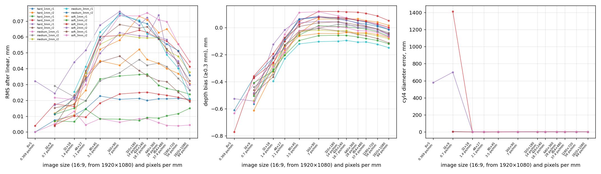
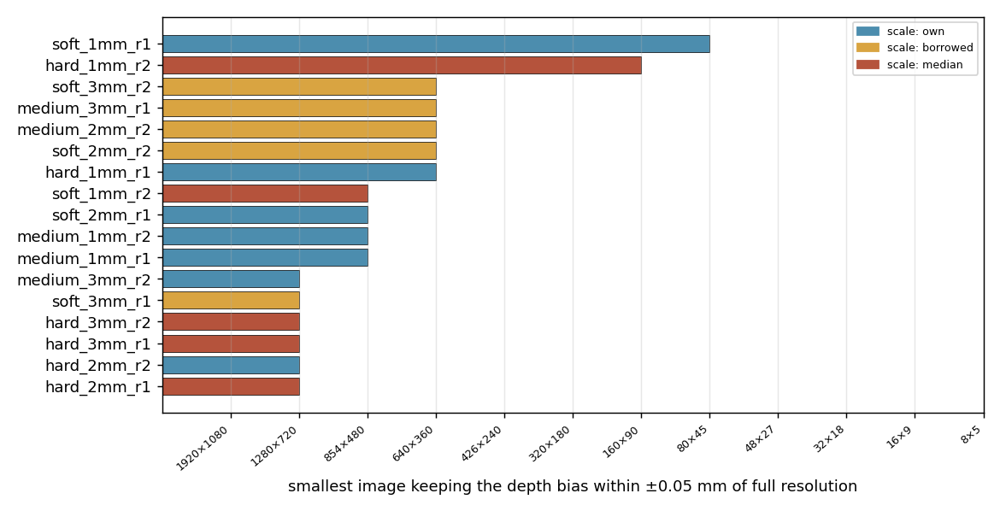

# 형상 재구성에 카메라 해상도가 얼마나 필요한가

2026-09-07. 17 유닛 × 8 배율. 데이터 `data/9DTact/shape_vs_resolution.csv` (배율·유닛당
1 행), 요약 `shape_vs_resolution_summary.csv`, 스크립트 `scripts/analyse_shape_resolution.py`.

## 1. 방법

`analyse_shape.py` 의 파이프라인(ball4 교정 → cyl4/cube4 채점)을 **입력 프레임만 축소**해
다시 돌렸다. 기준 이미지를 포함한 모든 프레임을 ×1, 2, 3, 4, 6, 8, 12, 16 으로 면적 평균
축소하고 야코비안을 같은 배율로 줄였다 — 즉 "픽셀이 f 배 적고 f 배 큰 카메라"를 흉내 낸
것이고 알고리즘·문턱·커널은 그대로다. 유닛의 원래 축척이 71–102 px/mm 이므로 스윕은
**약 90 → 5 px/mm (11 → 190 µm/px)** 를 덮는다.

각 배율에서 전해상도와 같은 지표를 읽고, 유닛마다 **전해상도 값을 유지하는 가장 성긴
px/mm** 를 찾았다. "유지"의 기준은 셋을 나란히 둔다: 엄격(RMS +0.005 mm 이내), **반 회색조
단계(+0.02 mm)**, 2 배 이내.

## 2. 17 유닛 중앙값 — 배율별

| 배율 | px/mm | µm/px | 선형 보정 후 RMS mm | 깊이 편향 mm | cyl4 지름 오차 mm | cube4 정사각성 | 회색조 단계 |
|---|---|---|---|---|---|---|---|
| ×1 | 84 | 12 | 0.026 | -0.050 | +6.00 | 1.02 | 16 |
| ×2 | 42 | 24 | 0.046 | -0.011 | +6.00 | 1.00 | 14 |
| ×3 | 28 | 36 | 0.051 | +0.015 | +6.00 | 1.02 | 14 |
| ×4 | 21 | 48 | 0.056 | +0.027 | +6.00 | 1.01 | 14 |
| ×6 | 14 | 71 | 0.057 | +0.036 | +6.00 | 1.02 | 13 |
| ×8 | 11 | 95 | 0.058 | +0.028 | +6.00 | 1.00 | 13 |
| ×12 | 7 | 143 | 0.059 | +0.028 | +6.00 | 1.02 | 12 |
| ×16 | 5 | 190 | 0.056 | +0.012 | +6.00 | 1.00 | 12 |

**결과는 두 단으로 갈린다.**

- **깊이 정확도(RMS)는 첫 축소에서 한 번 나빠지고 그 뒤로는 평평하다.** 전해상도 0.026 mm
  → ×2 에서 0.046 → ×16 까지 0.05–0.06 으로 고정. 즉 ×2 이후로는 해상도를 8 배 더 줄여도
  더 나빠지지 않는다. 손실은 약 **0.02–0.03 mm, 반 회색조 단계** 다.
- **형상(지름·정사각성), 편향, 회색조 단계 수는 5 px/mm 까지 사실상 해상도와 무관하다.**
  지름 오차 +0.2 → +0.3 mm 안, 정사각성 1.00–1.02, 회색조 16 → 12 단계. 자국이 mm 단위로
  넓고 가장자리가 부드러워 190 µm 픽셀로도 잡힌다. 편향은 오히려 좋아진다(−0.05 → 0 근처,
  면적 평균의 효과).

첫 축소에서 RMS 가 계단처럼 떨어지는 이유는 방법의 구조에 있다. 밝기→깊이 표는 **정수
회색조 단계마다** 평균 깊이를 담는데, 면적 평균은 접촉 가장자리처럼 밝기 기울기가 급한
곳에서 이웃 픽셀의 회색조를 섞어 그 표를 무디게 만든다. 한 번 무뎌지면 더 줄여도 더
무뎌질 것이 별로 없다 — 그래서 ×2 와 ×16 이 같다.

## 3. 유닛별 saturation

| 유닛 | 축척 | 전해상도 px/mm | RMS ×1 | ×2 | ×16 | sat 엄격 | **sat 반단계** | sat 2배 | sat 지름 | sat 정사각 | 회색조 ×1→×16 |
|---|---|---|---|---|---|---|---|---|---|---|---|
| hard_2mm_r1 | median | 84 | 0.024 | 0.026 | 0.033 | 42 | 5 | 5 | 84 | 5 | 19 → 16 |
| soft_1mm_r2 | median | 84 | 0.015 | 0.010 | 0.008 | 5 | 5 | 5 | 42 | 84 | 14 → 12 |
| medium_1mm_r1 | own | 89 | 0.004 | 0.011 | 0.015 | 89 | 6 | 89 | 44 | 6 | 21 → 20 |
| soft_2mm_r1 | own | 89 | 0.020 | 0.023 | 0.027 | 15 | 6 | 6 | 89 | 6 | 23 → 20 |
| hard_1mm_r1 | own | 94 | 0.021 | 0.021 | 0.019 | 6 | 6 | 6 | 31 | 12 | 18 → 16 |
| soft_1mm_r1 | own | 102 | 0.031 | 0.038 | 0.043 | 102 | 13 | 6 | 8 | 102 | 12 → 10 |
| hard_3mm_r2 | median | 84 | 0.019 | 0.029 | 0.045 | 84 | 21 | 21 | 84 | 84 | 15 → 12 |
| medium_2mm_r2 | borrowed | 71 | 0.038 | 0.050 | 0.059 | 71 | 24 | 4 | 71 | 4 | 17 → 14 |
| hard_2mm_r2 | own | 86 | 0.041 | 0.053 | 0.063 | 86 | 29 | 5 | 5 | 5 | 19 → 16 |
| medium_3mm_r2 | own | 71 | 0.036 | 0.053 | 0.070 | 71 | 36 | 9 | 71 | 71 | 16 → 12 |
| soft_3mm_r2 | borrowed | 72 | 0.045 | 0.059 | 0.066 | 72 | 36 | 4 | 72 | 6 | 15 → 11 |
| soft_2mm_r2 | borrowed | 76 | 0.030 | 0.046 | 0.058 | 76 | 38 | 5 | 38 | 19 | 18 → 15 |
| medium_1mm_r2 | own | 78 | 0.026 | 0.040 | 0.040 | 78 | 39 | 5 | 5 | 5 | 14 → 12 |
| soft_3mm_r1 | borrowed | 82 | 0.032 | 0.047 | 0.065 | 82 | 41 | 21 | 82 | 82 | 16 → 13 |
| hard_1mm_r2 | median | 84 | 0.044 | 0.060 | 0.056 | 84 | 42 | 5 | 84 | 11 | 13 → 11 |
| hard_3mm_r1 | median | 84 | 0.026 | 0.055 | 0.091 | 84 | 84 | 84 | 84 | 14 | 15 → 12 |
| medium_3mm_r1 | borrowed | 85 | 0.021 | 0.049 | 0.070 | 85 | 85 | 85 | 85 | 85 | 9 → 7 |

`sat` 열은 그 지표가 전해상도 값을 (기준 안에서) 유지하는 **가장 낮은 px/mm** — 작을수록
해상도를 덜 요구한다.

- **엄격 기준(+0.005 mm)으로는 13 / 17 유닛이 전해상도에서만 성립한다.** 위의
  계단 때문이다 — 첫 축소가 이미 0.005 를 넘긴다. 이 기준은 "해상도가 어디서 saturate
  하는가"보다 "전해상도가 유일하게 좋다"를 말한다.
- **반 회색조 단계(+0.02 mm) 기준으로는 중앙값 29 px/mm**
  (범위 5–85). 2 배 기준으로는 6 px/mm.
- 지름은 중앙값 71 px/mm, 정사각성은 12 px/mm 에서 이미 saturate 한다.

## 4. 결론

1. 이 방법(9DTact 밝기→깊이)의 **형상 정보는 5 px/mm(190 µm/px)에서도 살아 있다.**
   1920×1080 의 84 px/mm 는 형상 재구성에는 **16 배 과잉**이다.
2. **깊이 정확도만 전해상도를 원한다** — 그것도 반 회색조 단계(0.02 mm)를 위해서다.
   ×2 (약 40 px/mm, 24 µm/px) 이후로는 해상도를 더 줄여도 잃는 게 없다.
3. 따라서 이 시험에서 유닛 간 차이를 만드는 것은 해상도가 아니라 **회색조 동적 범위**
   (`shape_reconstruction.md` §3.2)다 — 회색조 단계 수는 ×16 에서도 12 단계로, 유닛 간
   차이(9–23)가 배율 차이보다 크다.
4. 실무적 함의: 힘·형상용 카메라를 고를 때 픽셀 수보다 **프레임률과 노출(=회색조 깊이)**을
   사야 한다. 지금 카메라는 1080p 라서 4.9 fps 에 묶여 있는데, 4 배 낮은 해상도로도 이
   결과를 유지하면서 프레임률을 벌 수 있다(카메라가 그 모드를 주는지는 별개).

## 5. 한계

- 축소는 소프트웨어 면적 평균이다. 진짜 저해상도 센서는 픽셀이 크면서 잡음 특성도
  다르므로, 여기 결과는 "정보량" 기준이지 특정 카메라의 예측이 아니다.
- 커널(7×7)은 출력 픽셀 단위라 배율과 함께 물리적 폭이 커진다. 알고리즘을 그대로 둔
  결과이며, 커널을 mm 로 고정하면 저해상도 쪽이 조금 더 좋아질 수 있다.
- 형상 열은 자체 축척 유닛(7 개)에서만 절대값을 믿을 수 있다(`shape_reconstruction.md` §3.4).
  여기서는 배율 간 **변화**만 보므로 축척 출처의 영향은 상쇄된다.
- 공간 분해능 시험(pair 프로브)은 이 스윕에 넣지 않았다. 두 자국 사이 골의 검출은 형상
  재구성보다 해상도에 민감할 가능성이 크므로 따로 봐야 한다.
