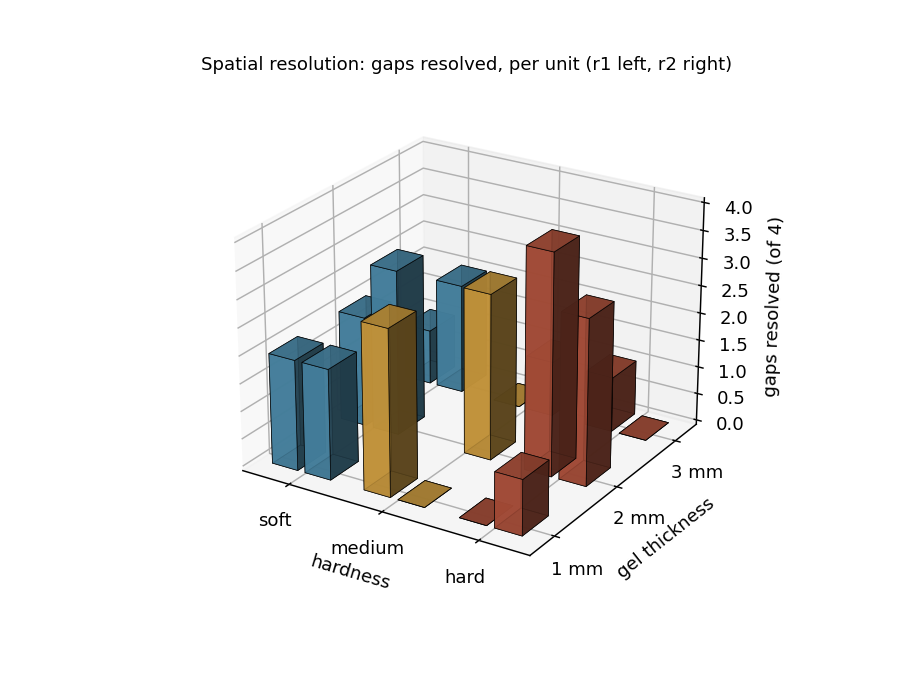
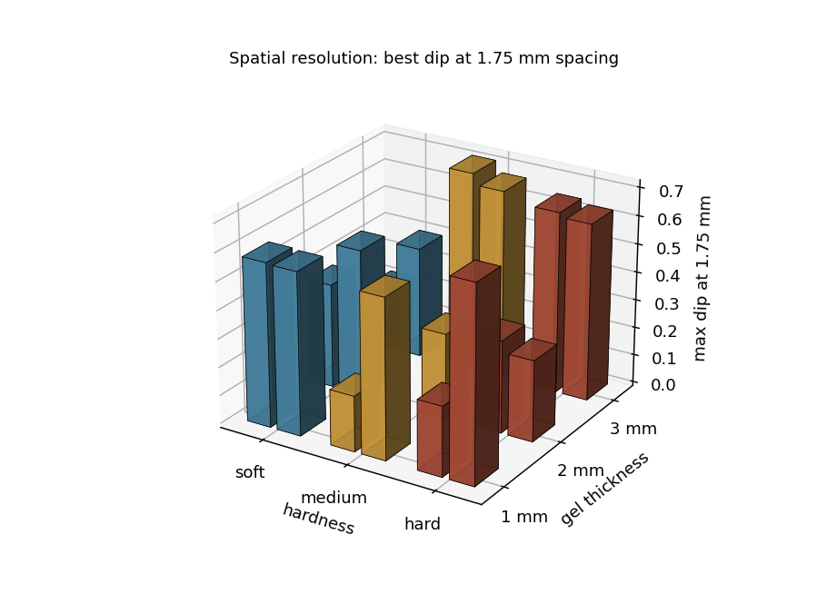

# 시험 3 — 공간 분해능 (spatial resolution)

2026-09-05 ~ 09-07 측정, 09-07 정리. 9DTact 17 유닛 × 4 간격 × 3 깊이 = **204 측정점**.
데이터: `data/9DTact/20260905_passA_pair{100,075,050,025}/<sensor>/`,
판정: `scripts/analyse_resolution.py`, 결과표: `data/9DTact/resolution_measurements.csv`.

---

## 1. 무엇을 재는가

**두 점을 하나로 보는가, 둘로 보는가.** 지름 1 mm 기둥 두 개가 나란히 선 프로브
(`pair100` … `pair025`)를 젤에 눌러, 이미지에서 두 자국이 갈라져 보이는 가장 좁은
중심간격을 찾는다. DIGIT 360(arXiv:2411.02479)이 쓴 dual-pronged microindenter
방식을 따랐고, 판정도 그들의 MTF 기준을 함께 계산한다.

| 프로브 | 기둥 사이 틈 | **중심간격** | 공간주파수 |
|---|---|---|---|
| pair100 | 1.00 mm | **2.00 mm** | 0.25 lp/mm |
| pair075 | 0.75 mm | **1.75 mm** | 0.29 lp/mm |
| pair050 | 0.50 mm | **1.50 mm** | 0.33 lp/mm |
| pair025 | 0.25 mm | **1.25 mm** | 0.40 lp/mm |

네 프로브는 기둥 지름과 접촉 면적이 같고 간격만 다르다. 그래서 같은 깊이에서 자국의
진하기는 프로브 사이에 같아야 하고, 실제로 그렇다 — 이 사실이 §6의 재측정 판단 근거다.

---

## 2. 측정 절차

센서 하나를 장착하고, 프로브 네 개를 차례로 갈아 끼우며 각각 아래를 반복한다
(`scripts/pass_a_sensor.sh <sensor> <probe>`, 유닛당 약 2분).

1. **정렬** — 팁을 센서 축 위에, 프로브 축을 그 유닛의 **실측 젤 법선**에 맞춘다.
   17 유닛 모두 명목 법선에서 sensor y 로 +2.19° ± 0.65 기울어 있어(전부 같은 부호)
   명목 법선에 맞추면 기둥 두 개가 같은 깊이로 들어가지 않는다.
2. **영점** — 힘–깊이 곡선을 평면 압자 법칙(F ∝ δ¹)으로 맞춰 표면을 정한다. 기둥이
   1 mm 라 부러지기 쉬워 **첫 접촉에서 0.5 mm 까지만** 들어간다(운용자 한계). 접근
   시작점은 기록된 표면 + 2.0 mm: pair 프로브 팁이 4 mm 프로브보다 **약 1.10 mm
   길어서**(10 유닛 이상 실측, sd 0.13) 여백 1.0 mm 로는 시작점이 이미 젤 속이었다.
3. **깊이 사다리** — 0.1 / 0.2 / 0.3 mm, 각 1회. 깊이는 명령값이 아니라 로봇이 읽은
   값에서 영점을 뺀 것이다. 각 깊이에서 정지 후 프레임 한 장.
4. **후퇴** — 어떤 경로로 끝나든 젤 위 78 mm 로 올린다.

이미지 축척(mm/px)은 pair 패스에서 재지 않는다 — 열 곳을 눌러야 하는 축척 측정이 1 mm
기둥에는 과한 부하라서다. 축척은 센서의 광학에 속하므로 같은 유닛의 ball4 패스 값을
빌린다(§7 참조).

---

## 3. 판정 방법

각 프레임에서 기준 이미지와의 차이를 만들고, 두 자국의 중심을 잇는 축을 따라 밝기
프로파일을 뽑는다. 봉우리 두 개(P₁, P₂)와 그 사이 골(T)에서:

```
dip  = (P − T) / P,     P = min(P₁, P₂)        ← Rayleigh 계열
MTF  = (P − T) / (P + T)                          ← DIGIT 360 (Michelson)
sym  = min(P₁, P₂) / max(P₁, P₂)                 ← 두 기둥의 접촉 대칭성
```

**약한 봉우리 기준으로 판정한다.** 두 점이 "분해됐다"는 건 약한 쪽도 봉우리로 서
있다는 뜻이다. 평균을 쓰면 한쪽만 깊이 박힌 자국이 분해된 것처럼 보인다. 약한 쪽
기준은 판정을 엄격하게만 만든다.

세 관문을 다 넘어야 **분해**다:

| 관문 | 기준 | 근거 |
|---|---|---|
| 신호 | P ≥ **2.5** 회색조 | 시험 2에서 28 회색조가 0.548 mm 깊이에 해당(0.0196 mm/level). 깊이 영점의 σ 0.01–0.03 mm 는 1–1.5 level 이므로 2.5 level 은 영점 불확실도의 약 2σ. 이보다 약한 자국은 봉우리가 아니라 잡음이다 → **신호부족** |
| 잡음 | dip ≥ 3 σ_dip | 프로파일의 연속 차분으로 잡음을 추정(median\|Δ\|/0.6745/√2)해 dip 에 전파. 이보다 얕은 골은 잡음이 만든 것 → **잡음** |
| 깊이 | dip ≥ **0.265** | Rayleigh 기준(두 Airy 봉우리가 한 봉우리의 첫 영점에서 만날 때 골이 26.5 %) → 미달이면 **미분해** |

DIGIT 360 의 기준 MTF ≥ 0.5 는 dip 으로 환산하면 M = D/(2−D) 에서 **dip 0.667** —
Rayleigh 보다 **2.5배 엄격**하다. 둘 다 계산하고 둘 다 보고한다.

한 센서가 어떤 간격을 "분해한다"는 것은 세 깊이 중 **하나라도** 분해 판정인 것으로
정의했다.

---

## 4. 결과

### 4.1 간격별

| 중심간격 | 분해 센서 | dip 중앙값 | 약한 봉우리 중앙값 | MTF 중앙값 |
|---|---|---|---|---|
| 2.00 mm | **10 / 17** | 0.413 | 2.08 | 0.261 |
| 1.75 mm | **9 / 17** | 0.258 | 2.72 | 0.148 |
| 1.50 mm | **4 / 17** | 0.239 | 2.45 | 0.135 |
| 1.25 mm | **5 / 17** | 0.206 | 3.33 | 0.115 |

**9DTact 의 분해능 한계는 0.3 mm 이하 깊이에서 1.75 mm 와 1.50 mm 사이에 있다.**
2.00 → 1.75 mm 에서 dip 중앙값이 0.41 → 0.26 으로 꺾이고, 1.50 mm 부터는 대부분
Rayleigh 문턱 아래다.

**DIGIT 360 기준(MTF ≥ 0.5)으로는 204 행 중 14 행만 통과**하고, 센서 단위로는 사실상
어느 간격도 "분해"가 아니다. 같은 데이터에서 Rayleigh 와 MTF 가 **정반대의 헤드라인**을
준다. 어느 쪽을 쓰느냐는 선택이며, 논문에는 둘 다 실어야 한다.

### 4.2 깊이별

| 깊이 | 분해 행 | dip 중앙값 |
|---|---|---|
| 0.1 mm | 6 / 68 | 0.408 |
| 0.2 mm | 15 / 68 | 0.260 |
| 0.3 mm | 21 / 68 | 0.233 |

깊을수록 잘 갈라진다 — 자국이 진해져 신호 관문을 넘기 때문이다(0.1 mm 에서는 dip 이
크지만 봉우리가 2.5 level 을 못 넘겨 대부분 **신호부족**). 기둥 보호를 위해 0.3 mm 에서
멈췄으므로, 위 수치는 **0.3 mm 까지의** 분해능이다. 더 깊이 누르면 더 좁은 간격도
갈라질 가능성이 있고, 그 한계는 재지 않았다.

### 4.3 젤 두께 × 경도 — 함께 본다

두께와 경도는 따로 평균 낼 변수가 아니다(같은 이유를 `shape_reconstruction.md` §3.5
에 적었다). 3×3 격자의 모든 칸을 그대로 보이고, 그림은 x 경도, y 두께, z 지표의 3차원
막대다(칸마다 r1 왼쪽, r2 오른쪽).




**분해한 간격 수 (0–4)** (칸마다 r1, r2 순)

| 두께 \ 경도 | soft | medium | hard |
|---|---|---|---|
| 1 mm | 2, 2 | 3, 0 | 0, 1 |
| 2 mm | 2, 3 | 3 | 4, 3 |
| 3 mm | 1, 2 | 0, 1 | 1, 0 |

**1.75 mm 에서의 최대 dip** (칸마다 r1, r2 순)

| 두께 \ 경도 | soft | medium | hard |
|---|---|---|---|
| 1 mm | 0.58, 0.58 | 0.20, 0.56 | 0.25, 0.69 |
| 2 mm | 0.37, 0.52 | 0.30 | 0.33, 0.29 |
| 3 mm | 0.22, 0.39 | 0.71, 0.67 | 0.64, 0.63 |

**접촉 대칭성 sym 중앙값** (칸마다 r1, r2 순)

| 두께 \ 경도 | soft | medium | hard |
|---|---|---|---|
| 1 mm | 0.92, 0.73 | 0.70, 0.54 | 0.66, 0.82 |
| 2 mm | 0.85, 0.90 | 0.91 | 0.77, 0.89 |
| 3 mm | 0.63, 0.74 | 0.58, 0.77 | 0.73, 0.59 |

읽는 법:

- **2 mm 행이 세 경도 모두에서 가장 많이 가른다** (soft 2·3, medium 3, hard 4·3 —
  2 mm 다섯 유닛이 15/20). 1 mm 와 3 mm 행은 경도와 무관하게 0–3 이다.
- 그러나 **2 mm 행은 접촉 대칭성도 가장 좋다** (sym 0.88 대 0.70 / 0.66). 두 기둥이 같은
  깊이로 들어간 정도가 두께 행과 함께 움직이므로, 이 격자에서 "2 mm 가 분해능이 좋다"
  와 "2 mm 가 잘 안착됐다" 를 가를 수 없다. sym 을 공변량으로 넣는 분석이 먼저다(미완).
- 같은 두께 행 안에서 경도를 따라가면 일관된 경향이 없다 — hard 2 mm(4, 3)가 가장 좋지만
  hard 1 mm(0, 1)와 hard 3 mm(1, 0)는 가장 나쁜 축에 든다. 경도 단독 효과는 이 데이터에서
  복제 간 산포보다 작다.
- 경도와 두께를 하나의 변수로 묶는 시도는 `contact_variable.md`.

### 4.4 센서별 패턴 (2.00 / 1.75 / 1.50 / 1.25)

```
hard_1mm_r1    × × × ×      medium_1mm_r1  ○ × ○ ○      soft_1mm_r1  × ○ ○ ×
hard_1mm_r2    ○ × × ×      medium_1mm_r2  × × × ×      soft_1mm_r2  ○ ○ × ×
hard_2mm_r1    ○ ○ ○ ○      medium_2mm_r2  ○ ○ × ○      soft_2mm_r1  ○ ○ × ×
hard_2mm_r2    ○ ○ ○ ×      medium_3mm_r1  × × × ×      soft_2mm_r2  ○ ○ × ○
hard_3mm_r1    × ○ × ×      medium_3mm_r2  × ○ × ×      soft_3mm_r1  ○ × × ×
hard_3mm_r2    × × × ×                                  soft_3mm_r2  ○ × × ○
```

같은 내용을 표로. 칸의 숫자는 그 간격에서 세 깊이 중 **가장 큰 dip** 이고, ○ 는 세 관문을
모두 넘긴 깊이가 하나라도 있었다는 뜻이다(dip 이 0.265 를 넘어도 신호·잡음 관문에서
떨어지면 ×).

| 유닛 | 두께 | 경도 | 2.00 mm | 1.75 mm | 1.50 mm | 1.25 mm | 분해 수 | 가장 좁은 분해 간격 |
|---|---|---|---|---|---|---|---|---|
| soft_1mm_r1 | 1 mm | soft | × 0.76 | **○** 0.58 | **○** 0.27 | × 0.20 | 2 / 4 | 1.50 mm |
| soft_1mm_r2 | 1 mm | soft | **○** 0.49 | **○** 0.58 | × 0.62 | × 0.58 | 2 / 4 | 1.75 mm |
| soft_2mm_r1 | 2 mm | soft | **○** 0.49 | **○** 0.37 | × 0.61 | × 0.17 | 2 / 4 | 1.75 mm |
| soft_2mm_r2 | 2 mm | soft | **○** 0.55 | **○** 0.52 | × 0.26 | **○** 0.59 | 3 / 4 | 1.25 mm |
| soft_3mm_r1 | 3 mm | soft | **○** 0.53 | × 0.22 | × 0.71 | × 0.55 | 1 / 4 | 2.00 mm |
| soft_3mm_r2 | 3 mm | soft | **○** 0.53 | × 0.39 | × 0.41 | **○** 0.50 | 2 / 4 | 1.25 mm |
| medium_1mm_r1 | 1 mm | medium | **○** 0.50 | × 0.20 | **○** 0.31 | **○** 0.45 | 3 / 4 | 1.25 mm |
| medium_1mm_r2 | 1 mm | medium | × 0.58 | × 0.56 | × 0.39 | × 0.35 | 0 / 4 | — |
| medium_2mm_r2 | 2 mm | medium | **○** 0.48 | **○** 0.30 | × 0.25 | **○** 0.44 | 3 / 4 | 1.25 mm |
| medium_3mm_r1 | 3 mm | medium | × 0.24 | × 0.71 | × 0.26 | × 0.38 | 0 / 4 | — |
| medium_3mm_r2 | 3 mm | medium | × 0.54 | **○** 0.67 | × 0.76 | × 0.69 | 1 / 4 | 1.75 mm |
| hard_1mm_r1 | 1 mm | hard | × 0.84 | × 0.25 | × 0.37 | × 0.20 | 0 / 4 | — |
| hard_1mm_r2 | 1 mm | hard | **○** 0.64 | × 0.69 | × 0.62 | × 0.59 | 1 / 4 | 2.00 mm |
| hard_2mm_r1 | 2 mm | hard | **○** 0.61 | **○** 0.33 | **○** 0.57 | **○** 0.39 | 4 / 4 | 1.25 mm |
| hard_2mm_r2 | 2 mm | hard | **○** 0.59 | **○** 0.29 | **○** 0.67 | × 0.57 | 3 / 4 | 1.50 mm |
| hard_3mm_r1 | 3 mm | hard | × 0.70 | **○** 0.64 | × 0.59 | × 0.35 | 1 / 4 | 1.75 mm |
| hard_3mm_r2 | 3 mm | hard | × 0.37 | × 0.63 | × 0.64 | × 0.47 | 0 / 4 | — |
| **합계** | | | **10 / 17** | **9 / 17** | **4 / 17** | **5 / 17** | | |

넓은 간격은 못 갈랐는데 좁은 간격을 가른 **역전**이 여럿 있다(soft_1mm_r1 의 × ○ ○ ×,
medium_1mm_r1 의 ○ × ○ ○ 등). 물리적으로 넓은 간격이 더 어려울 수는 없으므로 이건
**측정 산포가 관문 근처에서 판정을 뒤집은 것**이다. 이 표를 "이 센서는 1.25 mm 를
분해한다"로 읽으면 안 되고, 4.1 의 집계로 읽어야 한다. 그 중 두 건(§6)은 원인이 분명하다.

---

## 5. 판정 기준의 민감도 — 결과의 일부로 보고할 것

`MIN_PEAK` 를 2.5 에서 2.0 회색조로 내리면 **1.25 mm 의 분해 센서가 5 → 9** 로 뛴다.
0.5 level 은 0.01 mm 에 해당하는 차이다. 즉 좁은 간격의 판정은 신호 관문에 걸쳐 있고,
문턱을 조금 움직이면 답이 크게 바뀐다. 이 민감도는 조정해서 없앨 것이 아니라
**한계로 보고**한다. Rayleigh 0.265 는 광학의 관례이고, 2.5 level 은 §3 의 근거로
고정했다.

---

## 6. 두 기둥은 왜 같은 깊이로 안 들어가는가

같은 유닛(`soft_3mm_r1`)에 같은 프로브(pair100)로 두 번 재되, 사이에 **툴을 프로브
축 둘레로 180° 돌렸다.** 왼쪽/오른쪽 봉우리 비의 로그를 S(젤 쪽 원인) + P(프로브 쪽
원인)으로 놓으면 0° 에서 S + P, 180° 에서 S − P 가 읽히므로 둘이 분리된다:

| 원인 | log(좌/우) | 해석 |
|---|---|---|
| **S — 젤** | **−0.440 ± 0.060** | 젤 평면 기울기, 유닛의 속성 |
| P — 프로브 | +0.131 ± 0.029 | 두 기둥의 길이 차, 프로브의 속성 |

**젤이 프로브보다 3.4배 크다.** 그래서 정렬을 실측 젤 법선에 맞추는 것(§2-1)이 이
시험의 전제다. 자세한 것은 `pair_contact_asymmetry.md`. (그 회전 시험에서 Cartesian
자세 명령으로 툴을 돌린 것은 잘못된 방법이었다 — IK 가 다른 가지를 택해 팔이 617 mm
로 튀었다. 조인트 6 만 돌려야 한다.)

**재측정이 밀려 있는 두 건.** `soft_1mm_r1` 과 `hard_1mm_r1` 의 pair100(2.00 mm) 약한
봉우리가 1.22 / 1.00 level 로, 같은 유닛의 다른 세 프로브(3.90–7.06)와 pair100 전체
중앙값(4.62)의 1/4–1/6 이다. 접촉 면적이 같은 프로브에서 나올 수 없는 값이고, 그
결과 soft_1mm_r1 은 2.00 mm 는 못 가르고 1.75/1.50 은 가르는 불가능한 순서가 됐다.
두 런 모두 pair100 패스 초기, 접근 여백이 1.0 mm 이던 때의 것이다(팁이 1.10 mm 길어
시작점이 접촉면에 걸쳐 있었고 그 상태에서 잡은 F/T 영점이 깊이 기준을 흔들었다).
여백을 2.0 mm 로 올린 뒤에는 이런 값이 없다. **둘 다 1 mm 젤이라, 재측정하면 2.00 mm
는 10 → 12/17, 1 mm 두께는 8 → 10/24 가 될 수 있다.** pair100 을 다시 물릴 때 2 런,
약 4 분.

---

## 7. 한계와 주의

- **축척이 없는 유닛 5 개**(hard_1mm_r2, hard_2mm_r1, hard_3mm_r1, hard_3mm_r2,
  soft_1mm_r2)는 mm 축을 **13 유닛 축척의 중앙값**으로 대체했다. 유닛 간 축척 차이가
  15 % 이므로 이들의 lp/mm 에는 ±15 % 가 붙는다. dip 자체는 축의 늘림에 둔감하다.
  축척이 다른 패스에만 있는 5 유닛은 그 값을 빌렸다.
- **판정은 이미지 한 장의 프로파일**이다. 깊이당 1회 반복이라 깊이 안에서의 산포는
  없고, 산포는 깊이 사이의 일관성(§4.4 의 역전)으로만 드러난다.
- **0.3 mm 까지만** 눌렀다(§4.2).
- 두께 효과는 안착과 뒤섞여 있다(§4.3).
- `resolution_measurements.csv` 는 (패스·센서)당 정확히 하나의 런에서 왔다. 2026-09-07
  정리 때 `soft_3mm_r1` 2.00 mm 의 폐기된 런 행 6 개를 지웠고(210 → 204), 남은 204 행은
  `analyse_resolution.py` 로 소수점까지 재현됨을 확인했다.

---

## 8. 재현

```bash
/usr/bin/python3 scripts/analyse_resolution.py 20260905_passA_pair050 9DTact_hard_3mm_r2
```

문턱값은 스크립트 머리의 `RAYLEIGH`, `MTF_MIN`, `MIN_PEAK`, `NOISE_K`. 런 선택 규칙과
축척 대체 규칙은 같은 파일의 `main()` 과 `jacobian()`.
