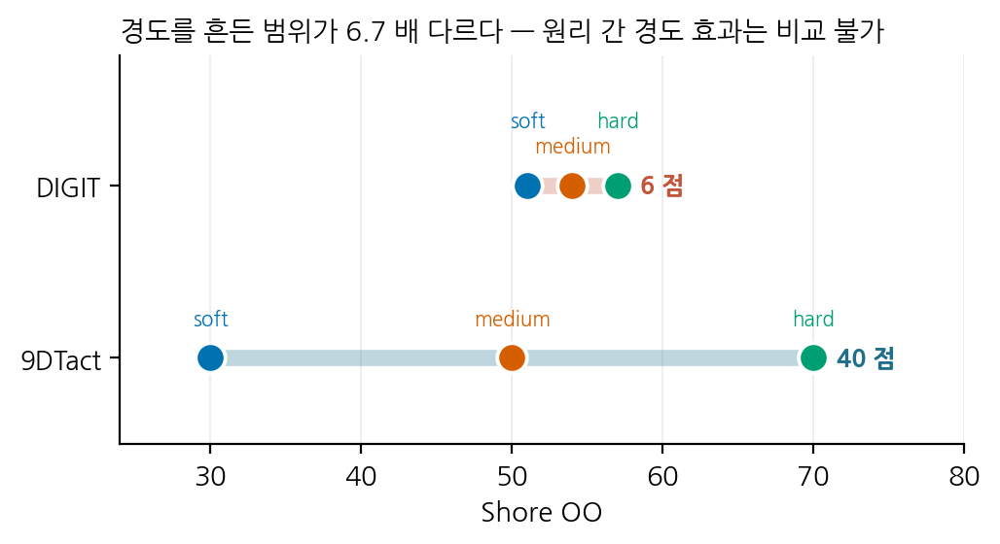
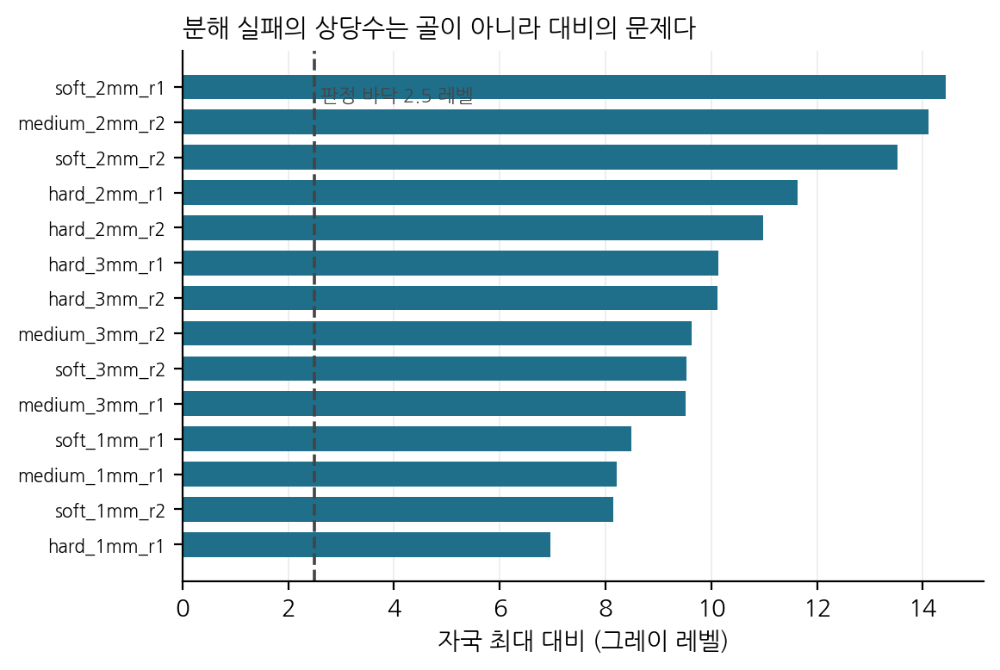

# 결과 — 그림과 표

VBTS 해상도 캠페인의 결과물 전부. **모든 그림에 그것을 그린 CSV 가 같은 이름으로
`data/` 에 있다** — 직접 다시 그릴 수 있다.

생성: `python3 src/scripts/make_results_md.py` (그림은 `make_result_figures.py`, `make_optical_curves.py`, 표는 `make_result_tables.py`)

> **수집은 2026-09-12 에 끝났다.** 한계는 `docs/methods.md` §10.0 에 있고, 
> 이 문서의 각 절에도 해당하는 것을 적어 두었다.

---

## 0. 한눈에

| | 9DTact | DIGIT | DIGIT_Marker |
|---|---|---|---|
| 유닛 | 18 (천장 17) | 18 | 18 |
| 최대 측정 가능 힘 | **ball8** 17/18 | **ball8** 18/18 | `ball4` 만 |
| 공간 분해능 | 6 간격 × 17 | 2 간격 × 18 | **없음** |
| 힘 추정 vs 해상도 | 12 단 × 17 | 12 단 × 18 | 12 단 × 18 |
| 형상 복원 vs 해상도 | 8 단 × 17 | 파이프라인 신규 | **없음** |

**프로브가 다르면 천장을 비교할 수 없다.** 같은 유닛을 `ball4` 와 `ball8` 로 잰
18 쌍에서 힘 비가 1.50 ~ 3.26 (변동계수 21 %) 로 흩어진다. 그래서 `DIGIT_Marker`
의 천장은 다른 둘과 같은 표에 놓지 않았다.

## 1. 최대 측정 가능 힘 (천장)

이미지가 변하기를 멈추는 힘. 판정은 *응답이 그 유닛 최대의 15 % 아래로 두 단 연속*.
겔이 견디는 한계가 아니라 **사진이 답하기를 멈추는 지점**이다.

*천장 대 두께, 경도별. 9DTact 는 두께가 늘면 오르고 DIGIT 은 내려간다.*

그림: `extra/figures/B_ceiling_vs_thickness.png` · 자료: `extra/data/B_ceiling_vs_thickness.csv`

### 3×3 표 — 칸은 `r1 / r2  (평균)`

**9DTact** (N)

| hardness   | 1mm                   | 2mm                 | 3mm                 |
|:-----------|:----------------------|:--------------------|:--------------------|
| soft       | 27.8 / 26.8  (27.3)   | 30.2 / 24.6  (27.4) | 31.0 / 30.6  (30.8) |
| medium     | 31.0 / 38.6  (34.8) ! | 30.2                | 38.5 / 34.2  (36.3) |
| hard       | 27.5 / 34.1  (30.8) ! | 43.3 / 43.8  (43.6) | 63.2 / 60.3  (61.7) |

자료: `1_9DTact/data/table_max_force_3x3.csv`

**DIGIT** (N)

| hardness   | 1mm                 | 2mm                 | 3mm                 |
|:-----------|:--------------------|:--------------------|:--------------------|
| soft       | 23.4 / 22.4  (22.9) | 17.7 / 14.7  (16.2) | 11.8 / 11.1  (11.4) |
| medium     | 18.2 / 22.1  (20.1) | 14.1 / 22.6  (18.4) | 14.4 / 15.0  (14.7) |
| hard       | 19.5 / 17.0  (18.2) | 22.4 / 17.7  (20.1) | 11.8 / 13.7  (12.8) |

자료: `2_DIGIT/data/table_max_force_3x3.csv`

**DIGIT_Marker** (N)

| hardness   | 1mm                 | 2mm                | 3mm                |
|:-----------|:--------------------|:-------------------|:-------------------|
| soft       | 20.5 / 12.3  (16.4) | 12.3 / 9.4  (10.8) | 8.1 / 7.1  (7.6)   |
| medium     | 8.3 / 12.6  (10.4)  | 6.2 / 10.0  (8.1)  | 6.9 / 6.7  (6.8)   |
| hard       | 10.8 / 10.0  (10.4) | 9.7 / 9.4  (9.6)   | 9.2 / 12.3  (10.8) |

자료: `3_DIGIT_Marker/data/table_max_force_3x3.csv`

`!` 는 운전자가 빛이 새는 것을 육안으로 확인한 유닛이다 — 신호가 약해 판정 문턱이
낮아지므로 천장이 **부풀려져** 있다. 분석에서 따로 표시하거나 빼야 한다.

`9DTact_medium_2mm_r1` 은 2026-09-04 에 파괴돼 복제가 하나뿐이다.

**DIGIT_Marker 는 `ball4` 로 잰 값**이라 위 두 표와 같은 자가 아니다.

## 2. 포화가 일어나는 깊이

*포화 깊이는 두 원리 모두 두께를 따라 증가한다 — 기울기가 2.2 배 다르다.*

그림: `extra/figures/A_saturation_depth_vs_thickness.png` · 자료: `extra/data/A_saturation_depth_vs_thickness.csv`

**힘과 깊이는 다른 이야기를 한다.** 천장(힘)은 두 원리가 반대로 가지만, 깊이는
둘 다 두께를 따라 증가한다. 9DTact 는 두께의 2.0 ~ 5.2 배까지 들어가 **기재에
눌린 상태**에서 포화하고, DIGIT 은 0.56 ~ 1.32 배에서 **광학이 먼저** 포화한다.

## 3. 판정 기준 — 상대와 절대

*상대 기준은 원리 간 격차를 1.8 배로 압축한다.*

그림: `extra/figures/C_relative_vs_absolute_criterion.png` · 자료: `extra/data/C_relative_vs_absolute_criterion.csv`

현행 판정은 문턱이 **유닛 자신의 최대 응답의 15 %** 라, 응답이 약한 유닛일수록
천장이 높게 나온다. 복제 쌍 다섯에서 모두 그 방향이었다. 고정 문턱으로 다시
계산하면 격차가 **4.3 ~ 6.6 배**로 커진다.

**원리 간 비교에는 절대 기준을 쓴다.** 상대 기준 값은 한 유닛의 운용 한계로만 쓴다.

## 4. 경도 범위 불균형 — 철회한 결론의 근거

*9DTact 는 40 Shore 점, DIGIT 계열은 6 점을 흔들었다.*

그림: `extra/figures/D_hardness_range_imbalance.png` · 자료: `extra/data/D_hardness_range_imbalance.csv`

한때 *"경도는 9DTact 만 가른다"* 고 적었다가 **철회했다.** 9DTact 의 경도 민감도
(3 mm 에서 0.77 N/Shore 점)를 DIGIT 의 6 점 범위에 적용하면 예상 변이가 4.6 N 인데
실측이 3.3 N 이다 — 같은 크기다. **DIGIT 이 둔감한 것이 아니라 경도를 거의 바꾸지
않았다.** 원리 간 경도 효과 비교는 이 설계로 불가능하다.

## 5. 프로브 전이 — 깊이는 옮겨지고 힘은 아니다

*ball8/ball4 비. 힘은 1.50~3.26 으로 흩어지고 깊이는 0.99 에 모인다.*

그림: `extra/figures/E_probe_transfer.png` · 자료: `extra/data/E_probe_transfer.csv`

Hertz 는 같은 깊이의 힘이 √R 에 비례한다고 예측하므로 **1.41** 을 기대하는데,
실측 중앙이 **2.37** 이고 복제 쌍 안에서도 1.98 과 3.26 으로 갈린다. 반면 깊이
비는 중앙 **0.99** 로 1 과 통계적으로 구분되지 않는다 (p 0.858).

> **포화 깊이는 유닛의 성질이고, 그 깊이에서의 힘은 프로브가 정한다.**

같은 18 쌍이 *시야 포화* 교란도 기각한다 — `ball8` 은 같은 깊이에서 자국이 1.2~1.4
배 큰데, 시야가 원인이라면 계통적으로 더 얕게 포화해야 한다. 더 얕게 포화한 것이
18 중 10 (이항검정 p 0.815) 으로 효과가 없다.

| unit          | hardness   |   thickness_mm |   ball4_N |   ball4_depth_mm |   ball8_N |   ball8_depth_mm |   force_ratio |   depth_ratio |
|:--------------|:-----------|---------------:|----------:|-----------------:|----------:|-----------------:|--------------:|--------------:|
| soft_1mm_r1   | soft       |              1 |   7.84619 |         0.828292 |   23.4125 |         0.959903 |       2.98394 |      1.15889  |
| soft_1mm_r2   | soft       |              1 |   8.46835 |         1.1716   |   22.4492 |         1.31538  |       2.65095 |      1.12272  |
| soft_2mm_r1   | soft       |              2 |   6.40522 |         1.47523  |   17.7183 |         1.57532  |       2.76624 |      1.06784  |
| soft_2mm_r2   | soft       |              2 |   6.80288 |         1.5084   |   14.7359 |         1.49601  |       2.16613 |      0.991789 |
| soft_3mm_r1   | soft       |              3 |   5.26627 |         1.81725  |   11.7611 |         1.79652  |       2.23329 |      0.988595 |
| soft_3mm_r2   | soft       |              3 |   7.11478 |         2.13669  |   11.0916 |         1.92659  |       1.55895 |      0.901669 |
| medium_1mm_r1 | medium     |              1 |   7.52194 |         1.10242  |   18.2193 |         1.09121  |       2.42215 |      0.989829 |
| medium_1mm_r2 | medium     |              1 |   8.92793 |         1.11373  |   22.0723 |         1.15873  |       2.47228 |      1.0404   |
| medium_2mm_r1 | medium     |              2 |   5.19531 |         1.60146  |   14.1386 |         1.64787  |       2.72141 |      1.02898  |
| medium_2mm_r2 | medium     |              2 |   7.33058 |         1.44554  |   22.5909 |         1.52836  |       3.08174 |      1.05729  |
| medium_3mm_r1 | medium     |              3 |   6.63405 |         2.21707  |   14.416  |         2.06706  |       2.17303 |      0.932335 |
| medium_3mm_r2 | medium     |              3 |   6.47109 |         2.25668  |   15.0342 |         2.16089  |       2.32329 |      0.95755  |
| hard_1mm_r1   | hard       |              1 |   9.84857 |         1.12074  |   19.4554 |         1.09528  |       1.97545 |      0.977288 |
| hard_1mm_r2   | hard       |              1 |   5.19425 |         0.915261 |   16.9507 |         0.962061 |       3.26336 |      1.05113  |
| hard_2mm_r1   | hard       |              2 |   7.36926 |         1.55224  |   22.4109 |         1.68119  |       3.04114 |      1.08307  |
| hard_2mm_r2   | hard       |              2 |   9.02935 |         1.63027  |   17.7377 |         1.4679   |       1.96445 |      0.900408 |
| hard_3mm_r1   | hard       |              3 |   7.88039 |         2.20143  |   11.8343 |         1.82267  |       1.50175 |      0.827949 |
| hard_3mm_r2   | hard       |              3 |   7.86481 |         1.98085  |   13.6734 |         1.689    |       1.73856 |      0.852662 |

자료: `extra/data/E_probe_transfer.csv`

## 6. 공간 분해능

두 기둥(지름 1.0 mm)을 여러 간격으로 눌러 골이 보이는지 판정한다. 세 관문을
모두 넘어야 *분해*다: **dip ≥ 0.265**(Rayleigh), **자국 ≥ 2.5 그레이 레벨**,
**dip > 잡음의 3 배**.

### 9DTact — 분해된 가장 좁은 간격 (중심간격 mm)

| hardness   | 1mm                 | 2mm                 | 3mm                 |
|:-----------|:--------------------|:--------------------|:--------------------|
| soft       | 1.50 / 1.75  (1.62) | 1.75 / 1.25  (1.50) | 2.00 / 1.25  (1.62) |
| medium     | 1.10 / 1.10  (1.10) | 1.10                | 2.50 / 1.75  (2.12) |
| hard       | 1.25 / 1.10  (1.18) | 1.25 / 1.50  (1.38) | 2.50 / 2.50  (2.50) |

자료: `1_9DTact/data/table_spatial_resolution_3x3.csv`

### 9DTact — 분해된 깊이 범위 (mm)

| hardness   | 1mm               | 2mm               | 3mm               |
|:-----------|:------------------|:------------------|:------------------|
| soft       | 0.2–0.6 / 0.1–0.6 | 0.1–0.9 / 0.1–0.9 | 0.3–0.3 / 0.2–0.9 |
| medium     | 0.1–0.6 / 0.1–0.1 | 0.1–0.9           | 0.5–0.9 / 0.3–0.9 |
| hard       | 0.1–0.6 / 0.2–0.6 | 0.1–0.9 / 0.2–0.9 | 0.4–0.9 / 0.3–0.9 |

자료: `1_9DTact/data/table_resolved_depth_range_3x3.csv`

### DIGIT — 분해된 가장 좁은 간격 (중심간격 mm)

| hardness   | 1mm                 | 2mm                 | 3mm                 |
|:-----------|:--------------------|:--------------------|:--------------------|
| soft       | 1.10 / 1.10  (1.10) | 1.10 / 1.10  (1.10) | 1.10 / 1.10  (1.10) |
| medium     | 1.10 / 1.10  (1.10) | 1.10 / 1.10  (1.10) | 1.10 / 1.10  (1.10) |
| hard       | 1.10 / 1.10  (1.10) | 1.10 / 1.10  (1.10) | 1.10 / 1.10  (1.10) |

자료: `2_DIGIT/data/table_spatial_resolution_3x3.csv`

### DIGIT — 분해된 깊이 범위 (mm)

| hardness   | 1mm               | 2mm               | 3mm               |
|:-----------|:------------------|:------------------|:------------------|
| soft       | 0.1–0.6 / 0.1–0.6 | 0.1–0.9 / 0.1–0.9 | 0.1–0.9 / 0.1–0.9 |
| medium     | 0.1–0.6 / 0.1–0.6 | 0.1–0.9 / 0.1–0.9 | 0.2–0.9 / 0.1–0.9 |
| hard       | 0.1–0.6 / 0.1–0.6 | 0.1–0.9 / 0.1–0.9 | 0.2–0.9 / 0.1–0.9 |

자료: `2_DIGIT/data/table_resolved_depth_range_3x3.csv`

> **DIGIT 의 분해능 표는 아홉 칸이 전부 1.10 mm 다.** 가장 좁은 프로브를 18/18
> 유닛이 분해했으므로 **값이 아니라 상한**이다 — "가장자리 간격 0.10 mm 보다
> 좋다" 가 이 연구가 말할 수 있는 전부다. 구별은 **깊이 범위** 표에서 나온다:
> 1 mm 겔은 0.6 mm 까지, 2~3 mm 겔은 0.9 mm 까지 분해한다.

> **DIGIT_Marker 는 공간 분해능을 재지 않았다** (운전자 결정, 2026-09-11).

*자국 대비와 판정 바닥 2.5 레벨. 분해 실패의 상당수는 골이 아니라 대비의 문제다.*

그림: `extra/figures/F_imprint_contrast.png` · 자료: `extra/data/F_imprint_contrast.csv`

## 7. 깊이에 따른 자국 지름과 밝기

지름은 **픽셀**로 둔다 — mm 환산에 필요한 px/mm 이 유닛마다 최대 1.5 배 어긋나는
것이 2026-09-12 에 확인됐다. 픽셀은 측정된 그대로다.

### 9DTact

*9DTact — 유닛별 깊이-지름(실선)과 깊이-밝기(점선)*

그림: `1_9DTact/figures/optical_vs_depth_18units.png` · 자료: `1_9DTact/data/optical_vs_depth_18units.csv`

**지름 기울기, ball4 (px/mm)**

| hardness   | 1mm              | 2mm              | 3mm   |
|:-----------|:-----------------|:-----------------|:------|
| soft       | 463 / 317  (390) | 386 / 687  (537) | 589   |
| medium     | 230 / 11  (121)  | —                | —     |
| hard       | 361 / 544  (453) | 551 / 562  (557) | —     |

자료: `1_9DTact/data/optical_slope_diameter_ball4_3x3.csv`

**지름 기울기, ball8 (px/mm)**

| hardness   | 1mm              | 2mm              | 3mm              |
|:-----------|:-----------------|:-----------------|:-----------------|
| soft       | 321 / 295  (308) | 285 / 294  (289) | 256 / 272  (264) |
| medium     | 229 / 259  (244) | 308              | 306 / 324  (315) |
| hard       | 333              | 464 / 359  (412) | 547 / 453  (500) |

자료: `1_9DTact/data/optical_slope_diameter_ball8_3x3.csv`

### DIGIT

*DIGIT — 유닛별 깊이-지름(실선)과 깊이-밝기(점선)*

그림: `2_DIGIT/figures/optical_vs_depth_18units.png` · 자료: `2_DIGIT/data/optical_vs_depth_18units.csv`

**지름 기울기, ball4 (px/mm)**

| hardness   | 1mm              | 2mm              | 3mm              |
|:-----------|:-----------------|:-----------------|:-----------------|
| soft       | 355 / 319  (337) | 226 / 188  (207) | 173 / 211  (192) |
| medium     | 429 / 374  (402) | 199 / 261  (230) | 151 / 289  (220) |
| hard       | 414 / 252  (333) | 250 / 266  (258) | 167 / 195  (181) |

자료: `2_DIGIT/data/optical_slope_diameter_ball4_3x3.csv`

**지름 기울기, ball8 (px/mm)**

| hardness   | 1mm              | 2mm              | 3mm              |
|:-----------|:-----------------|:-----------------|:-----------------|
| soft       | 322 / 309  (315) | 339 / 319  (329) | 306 / 255  (280) |
| medium     | 357 / 69  (213)  | 359 / 367  (363) | 243 / 361  (302) |
| hard       | 136 / 586  (361) | 332 / 366  (349) | 326 / 292  (309) |

자료: `2_DIGIT/data/optical_slope_diameter_ball8_3x3.csv`

### DIGIT_Marker

*DIGIT_Marker — 유닛별 깊이-지름(실선)과 깊이-밝기(점선)*

그림: `3_DIGIT_Marker/figures/optical_vs_depth_18units.png` · 자료: `3_DIGIT_Marker/data/optical_vs_depth_18units.csv`

**지름 기울기, ball4 (px/mm)**

| hardness   | 1mm              | 2mm              | 3mm              |
|:-----------|:-----------------|:-----------------|:-----------------|
| soft       | 330 / 379  (354) | 245 / 223  (234) | 202 / 185  (193) |
| medium     | 374 / 60  (217)  | 244 / 284  (264) | 72 / 169  (120)  |
| hard       | 531 / 398  (464) | 273 / 262  (268) | 186 / 147  (166) |

자료: `3_DIGIT_Marker/data/optical_slope_diameter_ball4_3x3.csv`

> **원리 간 기울기를 비교하면 안 된다.** 자료마다 깊이 구간이 다르고 (각 유닛의
> 유효 구간에서 맞춘다), 자국이 시야를 채우면 `contact_region` 이 덩어리를 놓쳐
> 지름이 무너지므로 그 지점에서 잘랐다. 구간은 `optical_slopes.csv` 의
> `depth_lo_mm` / `depth_hi_mm` 에 있다.

## 8. 힘 추정 오차 대 해상도

ResNet-18 을 해상도 12 단(1920 → 8 px)에서 학습해 축별 MAE 를 낸다.
**학습 파라미터는 원리·해상도에 걸쳐 전부 같다** — 실효 배치 64(경사 누적으로
고정), 30 에폭, Adam 5e-4, weight decay 1e-4, cycle 분할, seed 3 개.

| 원리 | 입력 표현 |
|---|---|
| 9DTact | `grey` — 원저자 방식 (기준영상 + 밝아진 양 + 어두워진 양) |
| DIGIT | `raw` — 카메라 프레임 그대로 |
| DIGIT_Marker | `inpaint` — 마커 점을 지우고 주변에서 메움 |

*9DTact — 유닛별 축별 MAE 대 해상도*

그림: `1_9DTact/figures/force_mae_vs_resolution_18units.png` · 자료: `1_9DTact/data/force_mae_vs_resolution_18units.csv`

*DIGIT — 유닛별 축별 MAE 대 해상도*

그림: `2_DIGIT/figures/force_mae_vs_resolution_18units.png` · 자료: `2_DIGIT/data/force_mae_vs_resolution_18units.csv`

*DIGIT_Marker — 유닛별 축별 MAE 대 해상도*

그림: `3_DIGIT_Marker/figures/force_mae_vs_resolution_18units.png` · 자료: `3_DIGIT_Marker/data/force_mae_vs_resolution_18units.csv`

## 9. 형상 복원 대 해상도

**9DTact** 는 밝기→깊이 조회표를 `ball4` 로 보정하고 `cyl4`·`cube4` 로 평가한다.
**DIGIT 계열**은 광도 스테레오라 다른 파이프라인이 필요하고, 이번에 새로 만들었다
(`src/scripts/digit_shape.py`): 알려진 반지름의 구로 픽셀별 참 기울기를 구 기하에서
계산하고, (색차, 위치) → (gx, gy) 를 회귀한 뒤 푸아송 방정식을 DCT 로 풀어
높이맵을 만든다.

> **DIGIT_Marker 는 형상 복원을 하지 않는다** — 마커 점이 음영을 가려 같은 방법을
> 쓸 수 없다.

*9DTact — 형상 복원 오차 대 해상도. cyl4 는 320 px, cube4 는 160 px 에서 최소.*

그림: `1_9DTact/figures/shape_mae_summary.png` · 자료: `1_9DTact/data/shape_mae_summary.csv`

**9DTact 는 해상도 의존성이 뚜렷하다** — 8 px 의 0.53 mm 에서 320 px 의 0.064 mm 까지
**8 배** 좋아지고, 그 위로는 다시 나빠진다. 회색조 손실을 보정하면(점선) 80 px 위로
평평해지므로, 고해상도의 악화는 조회표가 회색조를 잃는 데서 온다.

*DIGIT — 형상 복원 오차와 전이. 오차가 해상도에 평평하고 상관이 +0.35 다.*

그림: `2_DIGIT/figures/shape_mae_summary.png` · 자료: `2_DIGIT/data/shape_mae_summary.csv`

### DIGIT 은 시제품이고, 논문에 실을 수준이 아니다

| | 9DTact | DIGIT |
|---|---|---|
| cyl4 최소 MAE | **0.064 mm** @ 320 px | 0.113 mm @ 1920 px |
| 해상도에 따른 변화 | 0.53 → 0.064 (**8 배**) | 0.121 → 0.111 (**평평**) |
| MAE < 0.1 mm 인 유닛 | 17 / 17 | **6 / 18** |
| 예측-참값 상관 (426 px) | — | **+0.35** |

**두 가지가 막고 있다.**

**1. 유닛의 3 분의 1 에서만 전이된다.** 잘 되는 6 유닛은 MAE 0.038 ~ 0.092 mm 로
9DTact 와 같은 수준인데, 나머지는 0.4 mm 이상까지 벌어진다. 원인은 아직 모른다 —
보정 프레임 수, 기준영상 품질, 겔 투명도가 후보다.

**2. 이 지표로는 해상도 의존성을 볼 수 없다.** 8 px 에서도 1920 px 와 오차가 같은데,
8×5 픽셀로 형상을 복원할 수는 없다. 지표가 **최대 깊이 하나**뿐이고 그 값은 사실상
**색 변화의 적분량**이기 때문이다 — 면적평균 다운샘플링은 적분을 정확히 보존한다.
이 캠페인이 Fz 에서 이미 확인한 성질과 같다. 9DTact 쪽 지표는 깊이만이 아니라
크기·평탄도·기울기를 함께 보므로 해상도 의존성이 드러난다.

> **그러므로 DIGIT 의 형상 복원 결과는 한계로만 보고한다** — 센서의 성질이 아니라
> 이 시제품 파이프라인의 한계를 재고 있다. 닫으려면 (a) 9DTact 와 같은 형상 충실도
> 지표, (b) 실패한 12 유닛의 원인 규명이 필요하다.

**실패 원인은 특정되지 않았다.** 열세 개 후보 변수 — 보정 자체의 오차, 기준영상
밝기·표준편차, 겔 산란, 헤일로 비, 자국 가장자리 대비, 축척과 그 신뢰 표시, 두께,
경도 — 를 유닛별 MAE 와 상관시켰는데 **유의한 것이 하나도 없다**(|ρ| ≤ 0.27,
p 0.27 ~ 1.00, n = 18). 겔이나 광학의 측정된 성질로는 설명되지 않으므로 원인은
파이프라인 내부(MLP 수렴, 보정 프레임 선택, 적분 경계)에 있을 가능성이 높다.
n = 18 이라 검정력이 약한 것도 사실이지만, ρ 가 전부 0.3 미만이라 큰 효과는 없다.

파이프라인을 만들며 잡은 버그 일곱 개는 `src/scripts/digit_shape.py` 의 주석에 각각
증상과 함께 남겼다. 접촉 반경을 기하 교선으로 계산한 것, 보정과 평가의 깊이 범위가
어긋난 것, 깊이 배율을 압자 간에 전이한 것 셋이 결과를 가장 크게 망가뜨렸다.

## 10. 이 결과가 말하지 못하는 것

| 한계 | 제한하는 것 |
|---|---|
| DIGIT_Marker 천장이 `ball4` 뿐 | **세 원리** 천장 비교 |
| DIGIT_Marker 공간 분해능 미측정 | 표제 변수의 세 원리 비교 |
| DIGIT 이 가장 좁은 프로브를 18/18 분해 | DIGIT 분해능 **값** — 상한만 |
| 경도 범위가 6.7 배 불균형 | 원리 간 **경도 효과** 비교 |
| px/mm 이 유닛마다 최대 1.5 배 어긋남 | mm 단위 자국 크기, 픽셀 요구량 |
| F/T 라벨 바닥 0.028 N | 힘 추정의 **절대값** (상대 비교는 유효) |
| `9DTact_medium_2mm_r1` 파괴 | 3×3 표의 한 칸이 복제 1 개 |

전체 한계표는 `docs/methods.md` §10.0.

