# 결과 — 그림과 표

VBTS 해상도 캠페인의 결과물 전부. **모든 그림에 그것을 그린 CSV 가 같은 이름으로
`data/` 에 있다** — 직접 다시 그릴 수 있다.

생성: `python3 src/scripts/make_results_md.py` (그림은 `make_result_figures.py`, `make_optical_curves.py`, 표는 `make_result_tables.py`)

> **수집은 2026-09-12 에 끝났다.** 한계는 `docs/methods.md` §10.0 에 있고, 
> 이 문서의 각 절에도 해당하는 것을 적어 두었다.

---

## 핵심 그림

논문에 실을 넷. 아래 절들이 이 그림의 근거이고, 그림 자체와 그것을 그린
csv 는 `../paper/figures/` 에 있다.

### Figure 1 — 연구 질문과 비교 방법

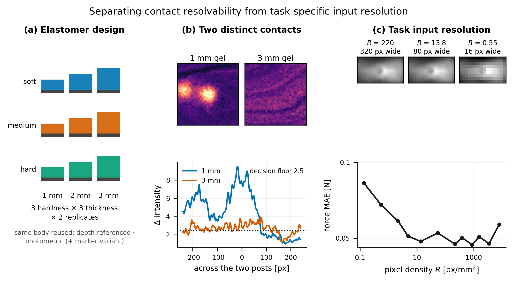

(a) 겔 설계, (b) 두 접촉을 가를 수 있는가, (c) 과제가 요구하는 입력 해상도. **(b) 와 (c) 를 화살표로 잇지 않았다** — 둘이 독립이라는 것은 이 자료로 입증되지 않았다. (b) 의 두 장은 같은 경도·같은 프로브·같은 압입에서 두께만 다르고 표시 범위도 공유한다.

### Figure 2 — 입력 해상도 대 힘 추정 오차

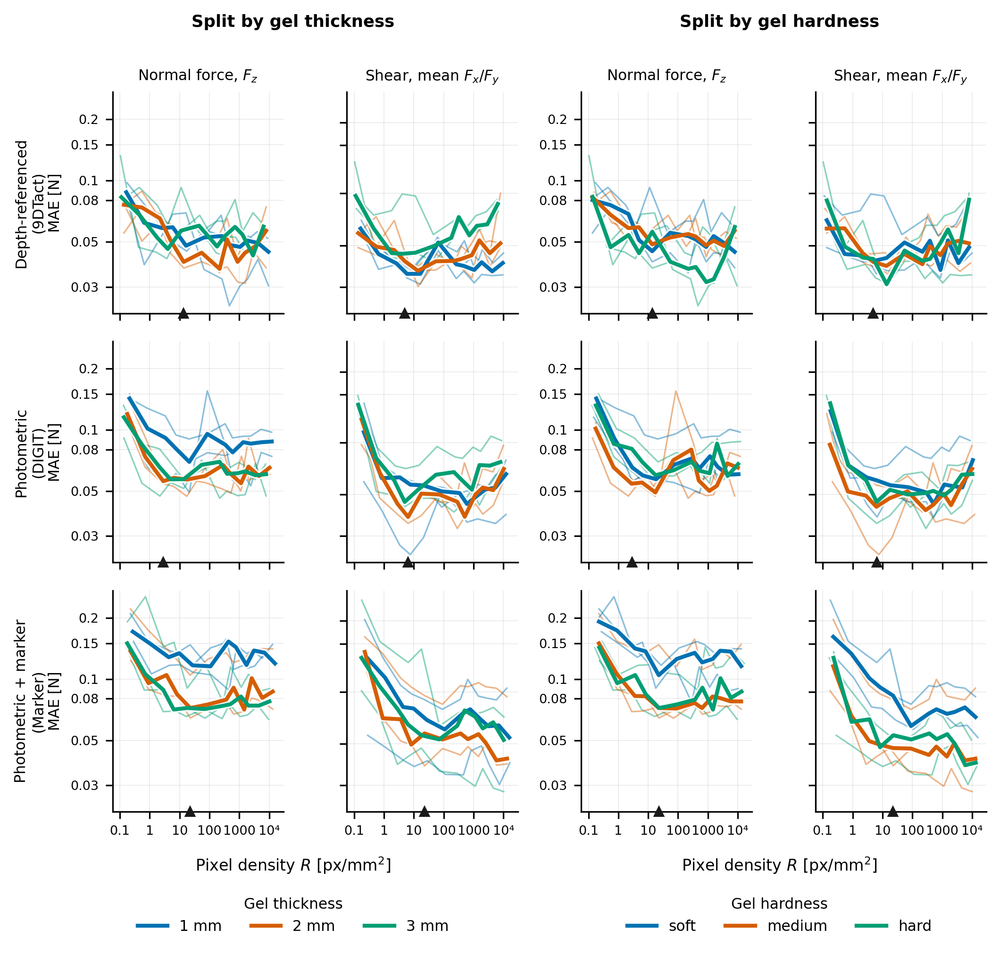

행이 감지 원리(9DTact · DIGIT · Marker), 열이 Fz 와 전단이다. **왼쪽 넷은 두께로, 오른쪽 넷은 경도로 같은 자료를 나눴다** — 가는 선(시편별 seed 중앙값)은 양쪽이 똑같고 굵은 군 중앙값만 달라진다. 축 아래 삼각형이 평탄 구간의 시작이다. **두 나눔 모두에서 굵은 선 셋이 가는 선들의 산포 안에 들어 있다** — 겔 설계 어느 축도 곡선을 가르지 않는다는 것이 이 그림의 요점이다.

### Figure 3 — 겔 효과와 반복성

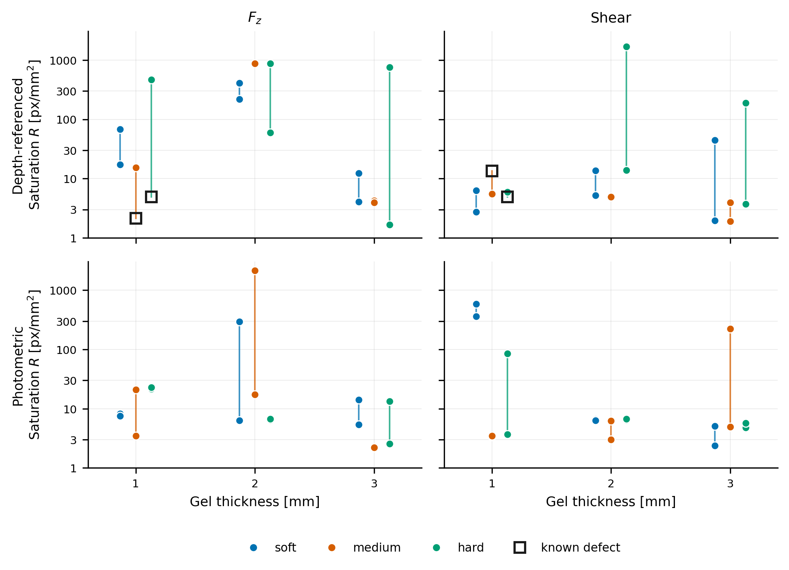

같은 조건의 r1·r2 를 선으로 이었다. **복제 쌍이 벌어진 거리가 두께·경도가 벌어진 거리보다 크다** — 8 배 이상 벌어진 쌍이 있다. 빈 사각형이 빛 누출 유닛이고, 지우지 않고 표시한다.

### Figure 4 — 형상 복원

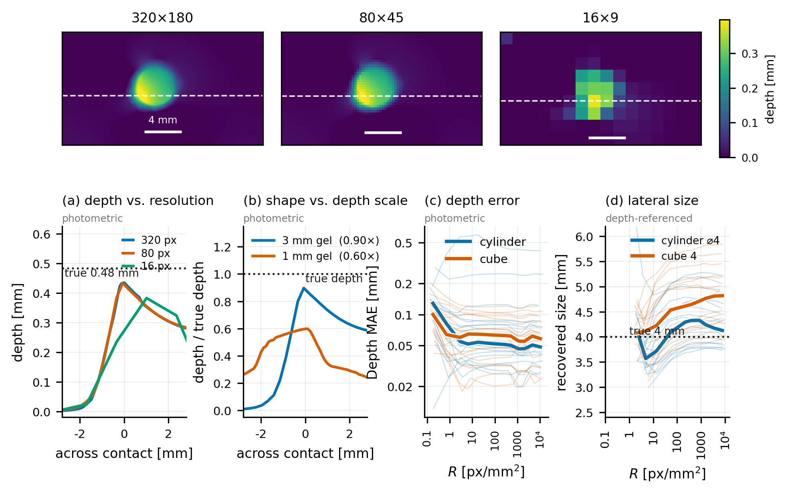

(a) 320·80·16 px 단면, (b) **모양과 깊이 배율을 갈라 보인다** — 상관이 0.99 여도 깊이가 참값의 0.61 배에서 멈추는 유닛이 있다, (c) 오차 대 해상도. 접촉 중심은 원해상도에서 한 번 찾아 세 해상도가 함께 쓴다.

만드는 것은 `src/scripts/paper_fig1.py` ~ `paper_fig4.py`. Figure 2·3 은 복제 선택 규칙으로 고른 시편 9 개를 쓴다 — `results_single_sensor.md` 와 같은 집합이다.

---

## 0. 한눈에

> **표시된 유닛.** `9DTact_hard_1mm_r2` 와 `9DTact_medium_1mm_r2` 는 운전자가
> 2026-09-11 에 **바디에서 빛이 새는 것을 육안으로 확인**한 유닛이다. 데이터도
> 일치한다 — 두 점 자국이 중앙 1.7 ~ 1.8 그레이 레벨로 17 유닛 중앙값 3.7 의
> 절반이라 네 간격 모두 '미분해' 로 기록됐고, 천장은 상대 문턱 탓에 짝보다
> +24 %, +25 % 부풀었다.
>
> **빼지 않고 표시한다.** 자료는 전부 들어 있고 의심 표시만 달린다 — 뺀 자료는
> 보이지 않으므로 검토되지도 않기 때문이다. 유닛별 그림에서는 제목에 `!` 와
> 먹색이 붙고 선이 **점선**이며, 흩어그림에서는 **검은 테두리와 `!`** 다 —
> 채움은 자기 군의 색 그대로라 어느 경도인지도 함께 읽힌다. **색이 아니라**
> **형태로 표시한다**: 붉은색은 범주 팔레트의 주황과 헷갈렸다.
> 3×3 표에서 `!` 가 붙은 칸은 그 칸의 복제 하나가 의심 유닛이라는 뜻이고,
> 모든 csv 에 `suspect_hardware` 열이 있다. 등록부의 같은 이름 필드가 근거다.
>
> **통계는 포함해서 냈다.** 빼면 어떻게 되는지는 부록 A 의 csv
> (`C_relative_vs_absolute_criterion.csv` 의 `*_no_suspect` 열)에 함께 적었다 —
> 중앙값이 31.00 에서 30.97 N 으로 움직일 뿐 결론은 같다.

| | 9DTact | DIGIT | DIGIT_Marker |
|---|---|---|---|
| 유닛 | 18 (천장 17) | 18 | 18 |
| 최대 측정 가능 힘 | **ball8** 17/18 | **ball8** 18/18 | `ball4` 만 |
| 공간 분해능 | 6 간격 × 17 | 2 간격 × 18 | **없음** |
| 힘 추정 vs 해상도 | 12 단 × 17 | 12 단 × 18 | 12 단 × 18 |
| 형상 복원 vs 해상도 | 8 단 × 17 | 파이프라인 신규 | **없음** |

## 1. 최대 측정 가능 힘 (천장)

이미지가 변하기를 멈추는 힘. 판정은 *응답이 그 유닛 최대의 15 % 아래로 두 단 연속*.
겔이 견디는 한계가 아니라 **사진이 답하기를 멈추는 지점**이다.

*천장 대 두께, 경도별 — 세 원리. 선은 복제 평균, 점은 유닛 하나하나, 세로 막대는 두 복제의 폭. 검은 테두리에 `!` 가 붙은 점이 빛 누출 의심 유닛이고, 채움은 자기 경도의 색 그대로다. **세로 축은 원리마다 다르다** — 9DTact 가 63 N 까지 가는데 DIGIT 계열은 6 ~ 23 N 이라 축을 묶으면 DIGIT 과 Marker 의 기울기가 눌려 보이지 않는다.*

그림: `extra/figures/B_ceiling_vs_thickness.png` · 자료: `extra/data/B_ceiling_vs_thickness.csv`

**9DTact 는 두께가 늘면 오르고 DIGIT 계열은 내려간다.**
점을 다 찍었으므로 평균선이 두 복제 중 어느 쪽에 끌려갔는지 바로 보인다 —
예컨대 9DTact 의 `medium 2 mm` 는 점이 하나뿐이고(짝은 2026-09-04 에
파괴됐다), `soft 2 mm` 는 두 복제가 24.6 과 30.2 N 으로 벌어져 있다.

> **`DIGIT_Marker` 의 자는 다르다.** 마커 유닛에는 `ball8` 램프가 없어 `ball4`
> 로 잰 값이다. **힘은 프로브 사이에서 환산되지 않으므로**(부록 C: 비 1.50 ~ 3.26,
> CV 21 %) Marker 의 세로 위치를 나머지 둘과 나란히 읽으면 안 된다. 한 원리
> **안에서의 두께·경도 방향**만 읽을 것.

### 3×3 표 — 칸은 `r1 / r2  (평균)`, `!` 는 빛 누출 의심 유닛이 든 칸

**9DTact** (N)

| hardness   | 1mm                   | 2mm                 | 3mm                 |
|:-----------|:----------------------|:--------------------|:--------------------|
| soft       | 27.8 / 26.8  (27.3)   | 30.2 / 24.6  (27.4) | 31.0 / 30.6  (30.8) |
| medium     | 31.0 / 38.6  (34.8) ! | 30.2                | 38.5 / 34.2  (36.3) |
| hard       | 27.5 / 34.1  (30.8) ! | 43.3 / 43.8  (43.6) | 63.2 / 60.3  (61.7) |

자료: `1_9DTact/data/table_max_force_3x3.csv`

**DIGIT** (N)

| hardness   | 1mm                 | 2mm                 | 3mm                 |
|:-----------|:--------------------|:--------------------|:--------------------|
| soft       | 23.4 / 22.4  (22.9) | 17.7 / 14.7  (16.2) | 11.8 / 11.1  (11.4) |
| medium     | 18.2 / 22.1  (20.1) | 14.1 / 22.6  (18.4) | 14.4 / 15.0  (14.7) |
| hard       | 19.5 / 17.0  (18.2) | 22.4 / 17.7  (20.1) | 11.8 / 13.7  (12.8) |

자료: `2_DIGIT/data/table_max_force_3x3.csv`

**DIGIT_Marker** (N)

| hardness   | 1mm                 | 2mm                | 3mm                |
|:-----------|:--------------------|:-------------------|:-------------------|
| soft       | 20.5 / 12.3  (16.4) | 12.3 / 9.4  (10.8) | 8.1 / 7.1  (7.6)   |
| medium     | 8.3 / 12.6  (10.4)  | 6.2 / 10.0  (8.1)  | 6.9 / 6.7  (6.8)   |
| hard       | 10.8 / 10.0  (10.4) | 9.7 / 9.4  (9.6)   | 9.2 / 12.3  (10.8) |

자료: `3_DIGIT_Marker/data/table_max_force_3x3.csv`

`!` 는 운전자가 빛이 새는 것을 육안으로 확인한 유닛이다 — 신호가 약해 판정 문턱이
낮아지므로 천장이 **부풀려져** 있다. 분석에서 따로 표시하거나 빼야 한다.

`9DTact_medium_2mm_r1` 은 2026-09-04 에 파괴돼 복제가 하나뿐이다.

**DIGIT_Marker 는 `ball4` 로 잰 값**이라 위 두 표와 같은 자가 아니다.

### 경도 — 9DTact 만 따라가고, 두께와 함께 커진다

| 원리 | 천장 대 경도 | 천장 대 두께 | 포화 깊이 대 경도 | 포화 깊이 대 두께 |
|---|---|---|---|---|
| 9DTact | **ρ +0.67 (p 0.003)** | ρ +0.43 (p 0.086) | ρ +0.17 (p 0.510) | **ρ +0.93 (p 0.000)** |
| DIGIT | ρ +0.01 (p 0.959) | **ρ -0.76 (p 0.000)** | ρ -0.03 (p 0.918) | **ρ +0.94 (p 0.000)** |
| DIGIT_Marker | ρ +0.00 (p 1.000) | **ρ -0.59 (p 0.010)** | ρ -0.03 (p 0.918) | **ρ +0.92 (p 0.000)** |

Spearman, 유닛 단위. 자료: `extra/data/B_ceiling_vs_thickness.csv`

**천장은 9DTact 에서만 경도를 따라간다**(ρ +0.67, p 0.003). DIGIT 과 Marker 는
ρ 가 0.01 과 0.00 으로 전혀 따라가지 않는다 — 다만 그것을 "DIGIT 이 경도에
둔감하다" 로 읽으면 안 된다. **경도를 6 Shore 점밖에 흔들지 않았다**(부록 B).

**그리고 경도의 효과가 두께를 따라 커진다.** 9DTact 의 hard ÷ soft:

| | 1 mm | 2 mm | 3 mm |
|---|---:|---:|---:|
| 천장 비 | 1.13× | 1.59× | **2.00×** |

1 mm 에서는 경도를 40 Shore 점 흔들어도 천장이 13 % 밖에 안 오르는데,
3 mm 에서는 **두 배**가 된다. 얇은 겔에서는 기재가 금방 받쳐 주므로 겔
자신의 단단함이 들어설 자리가 없고, 두꺼워질수록 겔이 스스로 버티는 몫이
커지기 때문으로 읽힌다. **경도와 두께는 더하기가 아니라 곱하기다.**

### 포화가 일어나는 깊이

*포화 깊이는 두 원리 모두 두께를 따라 증가한다 — 기울기가 2.2 배 다르다.*

그림: `extra/figures/A_saturation_depth_vs_thickness.png` · 자료: `extra/data/A_saturation_depth_vs_thickness.csv`

**깊이는 경도를 전혀 따라가지 않는다.** 세 원리 모두 ρ 가 −0.03 ~ +0.17 이고
p 는 0.51 ~ 0.92 다. 대신 **두께는 세 원리 모두에서 ρ 0.92 ~ 0.94, p < 0.001** 로
따라간다. 천장에서는 경도가 9DTact 를 갈랐는데 **깊이에서는 아무도 가르지 않는다** —
포화가 일어나는 **자리**는 겔이 얼마나 단단한지가 아니라 **얼마나 두꺼운지**가
정한다. 단단함은 그 자리에 **도달하는 데 드는 힘**을 바꿀 뿐이다.

**힘과 깊이는 다른 이야기를 한다.** 천장(힘)은 두 원리가 반대로 가지만, 깊이는
둘 다 두께를 따라 증가한다. 그리고 그 깊이가 **왜 반대로 가는지를 설명한다** —
9DTact 는 두께의 2.0 ~ 5.2 배까지 들어가 **기재에 눌린 상태**에서 포화하므로
겔이 두꺼울수록 더 버티고, DIGIT 은 0.56 ~ 1.32 배에서 **광학이 먼저** 포화하므로
두꺼운 겔의 흐려진 상이 오히려 먼저 답하기를 멈춘다.

## 2. 깊이에 따른 자국 지름과 밝기

지름은 **픽셀**로 둔다 — mm 환산에 필요한 px/mm 이 유닛마다 최대 1.5 배 어긋나는
것이 2026-09-12 에 확인됐다. 픽셀은 측정된 그대로다.

### 9DTact

*9DTact — 유닛별 깊이-지름(실선)과 깊이-밝기(점선)*

그림: `1_9DTact/figures/optical_vs_depth_18units.png` · 자료: `1_9DTact/data/optical_vs_depth_18units.csv`

**지름 기울기, ball4 (px/mm)**

| hardness   | 1mm                | 2mm              | 3mm   |
|:-----------|:-------------------|:-----------------|:------|
| soft       | 463 / 317  (390)   | 386 / 687  (537) | 589   |
| medium     | 230 !              | —                | —     |
| hard       | 361 / 544  (453) ! | 551 / 562  (557) | —     |

자료: `1_9DTact/data/optical_slope_diameter_ball4_3x3.csv`

**지름 기울기, ball8 (px/mm)**

| hardness   | 1mm                | 2mm              | 3mm              |
|:-----------|:-------------------|:-----------------|:-----------------|
| soft       | 321 / 295  (308)   | 285 / 294  (289) | 256 / 272  (264) |
| medium     | 229 / 259  (244) ! | 308              | 306 / 324  (315) |
| hard       | 333 !              | 464 / 359  (412) | 547 / 453  (500) |

자료: `1_9DTact/data/optical_slope_diameter_ball8_3x3.csv`

### DIGIT

*DIGIT — 유닛별 깊이-지름(실선)과 깊이-밝기(점선)*

그림: `2_DIGIT/figures/optical_vs_depth_18units.png` · 자료: `2_DIGIT/data/optical_vs_depth_18units.csv`

**지름 기울기, ball4 (px/mm)**

| hardness   | 1mm              | 2mm              | 3mm              |
|:-----------|:-----------------|:-----------------|:-----------------|
| soft       | 355 / 319  (337) | 226 / 188  (207) | 173 / 211  (192) |
| medium     | 429 / 374  (402) | 199 / 261  (230) | 151 / 289  (220) |
| hard       | 414 / 252  (333) | 250 / 266  (258) | 167 / 195  (181) |

자료: `2_DIGIT/data/optical_slope_diameter_ball4_3x3.csv`

**지름 기울기, ball8 (px/mm)**

| hardness   | 1mm              | 2mm              | 3mm              |
|:-----------|:-----------------|:-----------------|:-----------------|
| soft       | 322 / 440  (381) | 339 / 319  (329) | 306 / 255  (280) |
| medium     | 502 / 454  (478) | 359 / 367  (363) | 243 / 361  (302) |
| hard       | 638 / 586  (612) | 332 / 366  (349) | 326 / 292  (309) |

자료: `2_DIGIT/data/optical_slope_diameter_ball8_3x3.csv`

### DIGIT_Marker

*DIGIT_Marker — 유닛별 깊이-지름(실선)과 깊이-밝기(점선)*

그림: `3_DIGIT_Marker/figures/optical_vs_depth_18units.png` · 자료: `3_DIGIT_Marker/data/optical_vs_depth_18units.csv`

**지름 기울기, ball4 (px/mm)**

| hardness   | 1mm              | 2mm              | 3mm              |
|:-----------|:-----------------|:-----------------|:-----------------|
| soft       | 330 / 379  (354) | 245 / 223  (234) | 202 / 185  (193) |
| medium     | 374 / 329  (351) | 244 / 284  (264) | 72 / 169  (120)  |
| hard       | 531 / 398  (464) | 273 / 262  (268) | 186 / 147  (166) |

자료: `3_DIGIT_Marker/data/optical_slope_diameter_ball4_3x3.csv`

### 두께·경도를 나란히 — 같은 축 위에 겹친다

위의 18 칸 격자는 유닛 하나하나를 보여주지만 **어느 두께가 더 가파른가** 같은
질문에는 답하지 못한다. 칸이 다르면 눈이 기울기를 나란히 놓지 못하기 때문이다.
그래서 같은 축 위에 겹친다 — 유닛마다 사다리가 닿은 깊이가 다르므로 공통 격자에
보간한 뒤, **그 깊이에 자료가 있는 유닛이 3 개 이상일 때만** 그린다. 선은
중앙값이고 띠는 사분위 범위다(평균은 한 유닛에 끌려간다).

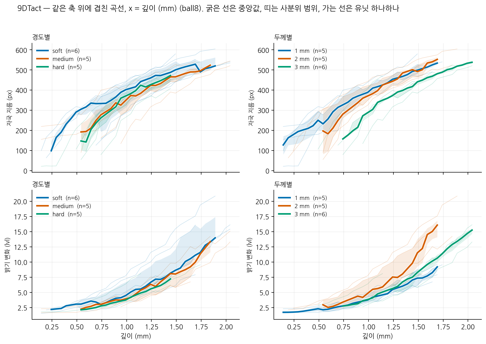

*9DTact (ball8) — 왼쪽은 경도별, 오른쪽은 두께별. 선은 중앙값, 띠는 사분위 범위.*

그림: `1_9DTact/figures/optical_by_group_ball8.png` · 자료: `1_9DTact/data/optical_by_group_ball8.csv`

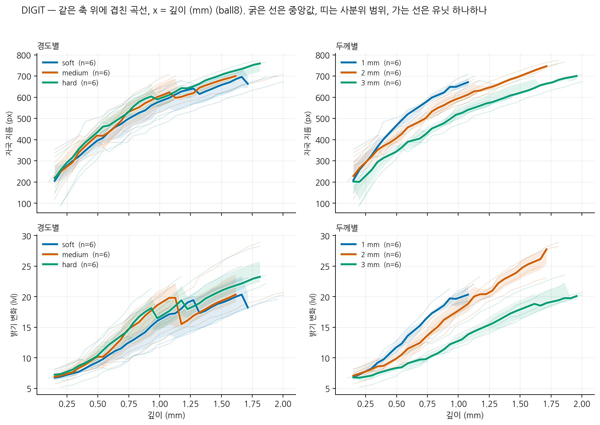

*DIGIT (ball8) — 왼쪽은 경도별, 오른쪽은 두께별. 선은 중앙값, 띠는 사분위 범위.*

그림: `2_DIGIT/figures/optical_by_group_ball8.png` · 자료: `2_DIGIT/data/optical_by_group_ball8.csv`

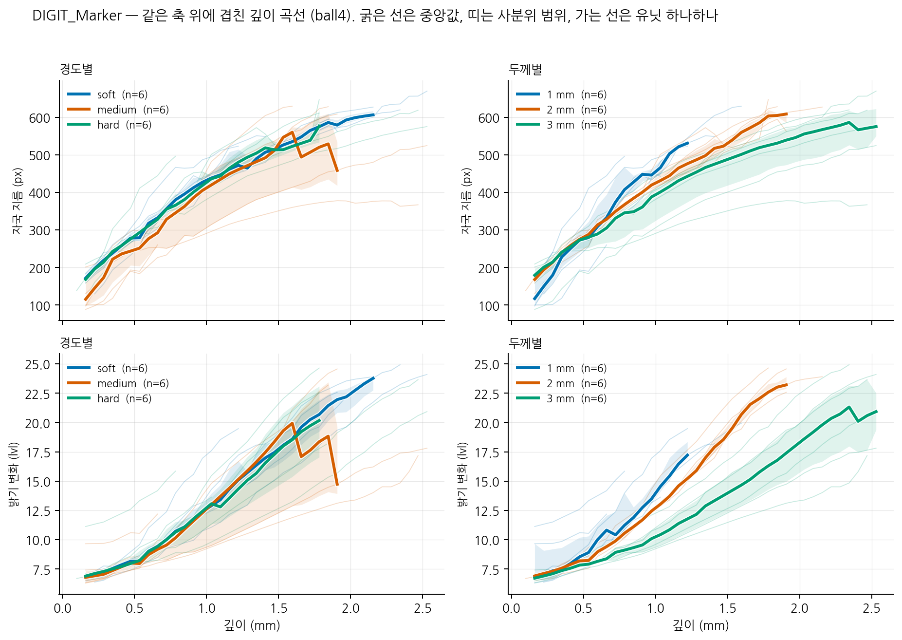

*DIGIT_Marker (ball4) — 왼쪽은 경도별, 오른쪽은 두께별. 선은 중앙값, 띠는 사분위 범위.*

그림: `3_DIGIT_Marker/figures/optical_by_group_ball4.png` · 자료: `3_DIGIT_Marker/data/optical_by_group_ball4.csv`

**DIGIT 계열은 얇을수록 넓고 밝다** — 두 지표 모두 1 → 2 → 3 mm 로 단조 감소한다.
기재가 가까워 변형이 옆으로 퍼지고, 겔이 얇아 빛이 덜 흩어지는 것으로 읽힌다.

> **9DTact 는 단조가 아니다.** 두 지표 모두 **2 mm 가 가장 크다** — 지름
> 553 px (1 mm 534, 3 mm 481), 밝기 16 lvl (1 mm 9, 3 mm 11). 3 mm 가 가장 낮은
> 것은 DIGIT 과 같지만 1 mm 가 2 mm 보다 낮은 것은 다르다. **왜 가운데가 솟는지는
> 이 자료로 답하지 못한다.** 9DTact 는 투명 겔 위에 검은 안료층을 덧씌우므로
> 기재까지의 실제 두께가 라벨보다 두껍고(`measurement_protocol.md` 의 깊이
> 뒷막이 항목), 1 mm 라벨의 겔이 실제로는 가장 얇지 않을 수 있다 — 확인하지
> 않은 추측이다.

> **경도가 겹치는 것을 "경도가 무관하다" 로 읽으면 안 된다.** DIGIT 계열은
> 경도를 6 Shore 점밖에 흔들지 않았다(부록 B). 9DTact 는 40 점을 흔들고도
> 곡선이 겹치므로, 적어도 9DTact 에서는 **실제로 약한 효과**라고 말할 수 있다.

> **원리 간 기울기를 비교하면 안 된다.** 자료마다 깊이 구간이 다르고 (각 유닛의
> 유효 구간에서 맞춘다), 자국이 시야를 채우면 `contact_region` 이 덩어리를 놓쳐
> 지름이 무너지므로 그 지점에서 잘랐다. 구간은 `optical_slopes.csv` 의
> `depth_lo_mm` / `depth_hi_mm` 에 있다.

## 3. 힘에 따른 자국 지름과 밝기

2 절과 **같은 행의 같은 자국**을 깊이 대신 **힘**에 대해 놓는다. 로봇이 깊이를
명령하고 F/T 가 힘을 읽으므로 두 축은 같은 램프의 두 얼굴이다. 그런데 어느 쪽을
x 로 놓느냐가 **어느 변수가 갈리는지를 바꾼다.**

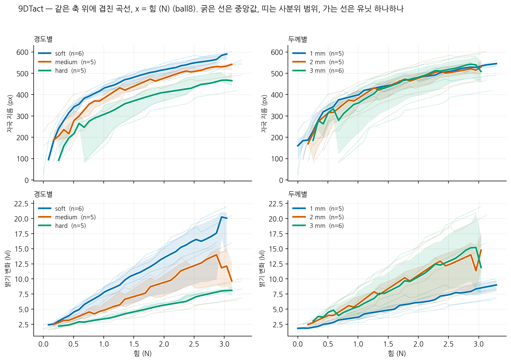

*9DTact (ball8) — x 가 힘이다. 왼쪽은 경도별, 오른쪽은 두께별.*

그림: `1_9DTact/figures/force_by_group_ball8.png` · 자료: `1_9DTact/data/force_by_group_ball8.csv`

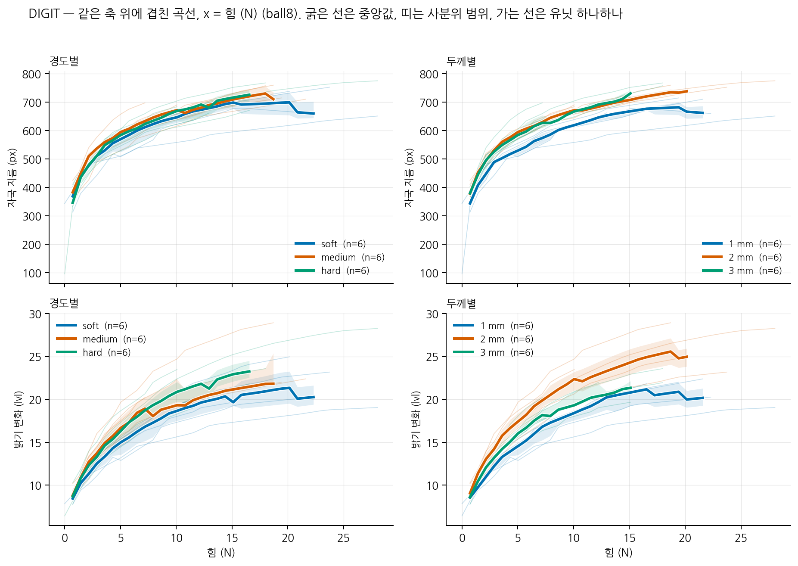

*DIGIT (ball8) — x 가 힘이다. 왼쪽은 경도별, 오른쪽은 두께별.*

그림: `2_DIGIT/figures/force_by_group_ball8.png` · 자료: `2_DIGIT/data/force_by_group_ball8.csv`

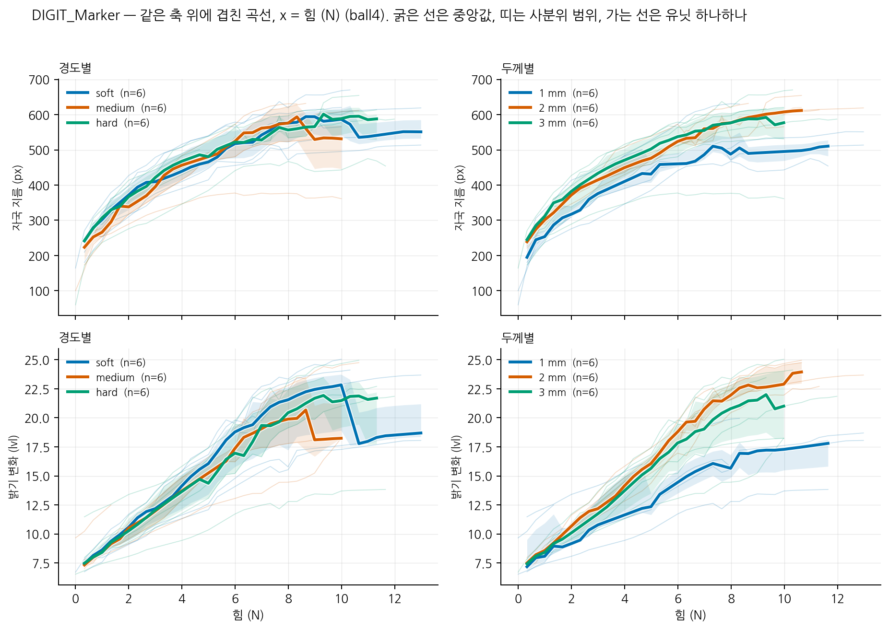

*DIGIT_Marker (ball4) — x 가 힘이다. 왼쪽은 경도별, 오른쪽은 두께별.*

그림: `3_DIGIT_Marker/figures/force_by_group_ball4.png` · 자료: `3_DIGIT_Marker/data/force_by_group_ball4.csv`

### 한 장으로 — x 축을 바꾸면 갈리는 변수가 바뀐다

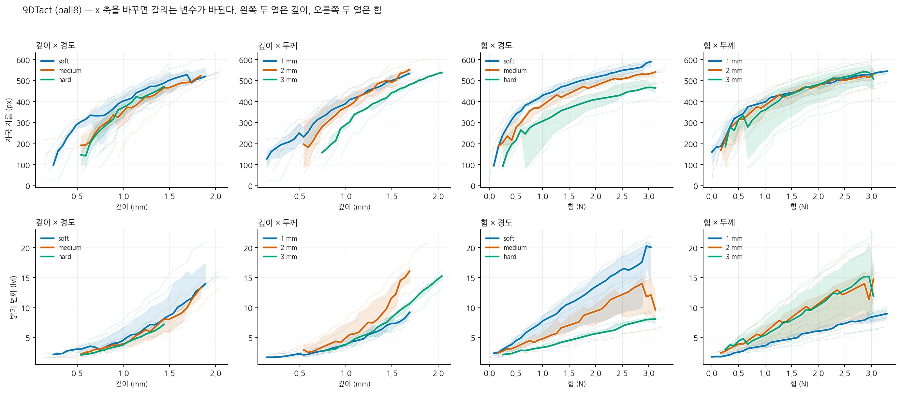

*9DTact (ball8). 행은 잰 것, 열은 (x 축) × (나눈 변수). 왼쪽 두 열이 깊이, 오른쪽 두 열이 힘이고 각 쌍의 앞이 경도별 뒤가 두께별이다. 행 안에서 세로 축을 맞췄으므로 **열을 가로질러 읽으면 된다.***

그림: `extra/figures/H_reversal_9DTact_ball8.png` · 자료: `extra/data/H_reversal_9DTact_ball8.csv`

**왼쪽 절반과 오른쪽 절반이 서로 거울이다.** `깊이 × 경도` 에서는 세 곡선이
포개져 있는데 `힘 × 경도` 에서는 벌어지고, `깊이 × 두께` 에서는 벌어져 있는데
`힘 × 두께` 에서는 포개진다. 지름과 밝기가 같은 방향으로 움직인다.

**같은 자국, 같은 램프, 바뀐 것은 x 축뿐이다.**

물리로는 그럴 만하다. **같은 깊이**에서는 기재가 얼마나 가까운지가 변형을
정하므로 두께가 이긴다. **같은 힘**에서는 겔이 얼마나 무른지가 얼마나 들어가는지를
정하므로 경도가 이긴다. 두 축은 같은 램프의 두 얼굴이지만 **서로 다른 질문**이다.

> **DIGIT 계열에서는 뒤집히지 않는다.** 두께가 두 기준 모두에서 갈리고, 경도는
> 힘 기준에서도 거의 올라오지 않는다. 9DTact 는 경도를 40 Shore 점
> 흔들었고 DIGIT 계열은 6 점을 흔들었다(부록 B) — **경도가 안 보이는 것이 아니라**
> **거의 바꾸지 않은 것**이라는 읽기와 맞는다.

> **어느 축을 쓸 것인가.** 센서를 **쓰는** 쪽에서는 힘이 자연스럽고(손이 아는 것은
> 힘이다), 겔을 **설계하는** 쪽에서는 깊이가 자연스럽다(기재까지의 거리를 고른다).
> 이 문서의 다른 절은 깊이를 쓰므로, 두 기준을 섞어 인용하지 말 것.

## 4. 공간 분해능

두 기둥(지름 1.0 mm)을 여러 간격으로 눌러 골이 보이는지 판정한다. 세 관문을
모두 넘어야 *분해*다: **dip ≥ 0.265**(Rayleigh), **자국 ≥ 2.5 그레이 레벨**,
**dip > 잡음의 3 배**.

*3×3 표와 같은 숫자를 그림으로. 위는 분해된 가장 좁은 간격 대 두께(선은 복제 평균, 점은 유닛 하나하나), 아래는 유닛마다의 분해된 깊이 범위.*

그림: `extra/figures/G_spatial_resolution.png` · 자료: `extra/data/G_spatial_resolution.csv`

### 9DTact — 분해된 가장 좁은 간격 (중심간격 mm)

| hardness   | 1mm                   | 2mm                 | 3mm                 |
|:-----------|:----------------------|:--------------------|:--------------------|
| soft       | 1.50 / 1.75  (1.62)   | 1.75 / 1.25  (1.50) | 2.00 / 1.25  (1.62) |
| medium     | 1.10 / 1.10  (1.10) ! | 1.10                | 2.50 / 1.75  (2.12) |
| hard       | 1.25 / 1.10  (1.18) ! | 1.25 / 1.50  (1.38) | 2.50 / 2.50  (2.50) |

자료: `1_9DTact/data/table_spatial_resolution_3x3.csv`

### 9DTact — 분해된 깊이 범위 (mm)

| hardness   | 1mm                 | 2mm               | 3mm               |
|:-----------|:--------------------|:------------------|:------------------|
| soft       | 0.2–0.6 / 0.1–0.6   | 0.1–0.9 / 0.1–0.9 | 0.3–0.3 / 0.2–0.9 |
| medium     | 0.1–0.6 / 0.1–0.1 ! | 0.1–0.9           | 0.5–0.9 / 0.3–0.9 |
| hard       | 0.1–0.6 / 0.2–0.6 ! | 0.1–0.9 / 0.2–0.9 | 0.4–0.9 / 0.3–0.9 |

자료: `1_9DTact/data/table_resolved_depth_range_3x3.csv`

### DIGIT — 분해된 가장 좁은 간격 (중심간격 mm)

| hardness   | 1mm                 | 2mm                 | 3mm                 |
|:-----------|:--------------------|:--------------------|:--------------------|
| soft       | 1.10 / 1.10  (1.10) | 1.10 / 1.10  (1.10) | 1.10 / 1.10  (1.10) |
| medium     | 1.10 / 1.10  (1.10) | 1.10 / 1.10  (1.10) | 1.10 / 1.10  (1.10) |
| hard       | 1.10 / 1.10  (1.10) | 1.10 / 1.10  (1.10) | 1.10 / 1.10  (1.10) |

자료: `2_DIGIT/data/table_spatial_resolution_3x3.csv`

### DIGIT — 분해된 깊이 범위 (mm)

| hardness   | 1mm               | 2mm               | 3mm               |
|:-----------|:------------------|:------------------|:------------------|
| soft       | 0.1–0.6 / 0.1–0.6 | 0.1–0.9 / 0.1–0.9 | 0.1–0.9 / 0.1–0.9 |
| medium     | 0.1–0.6 / 0.1–0.6 | 0.1–0.9 / 0.1–0.9 | 0.2–0.9 / 0.1–0.9 |
| hard       | 0.1–0.6 / 0.1–0.6 | 0.1–0.9 / 0.1–0.9 | 0.2–0.9 / 0.1–0.9 |

자료: `2_DIGIT/data/table_resolved_depth_range_3x3.csv`

> **DIGIT 의 분해능 표는 아홉 칸이 전부 1.10 mm 다.** 가장 좁은 프로브를 18/18
> 유닛이 분해했으므로 **값이 아니라 상한**이다 — "가장자리 간격 0.10 mm 보다
> 좋다" 가 이 연구가 말할 수 있는 전부다. 구별은 **깊이 범위** 표에서 나온다:
> 1 mm 겔은 0.6 mm 까지, 2~3 mm 겔은 0.9 mm 까지 분해한다.

> **DIGIT_Marker 는 공간 분해능을 재지 않았다** (운전자 결정, 2026-09-11).

### 입력 해상도 스윕 — 힘·형상과 같은 x 축에 올린다

판정을 그대로 두고 **입력 영상만** 12 단으로 줄인다. 힘 추정·형상 복원과
같은 질문이 된다 — *이 판정에 픽셀이 몇 개 필요한가.*

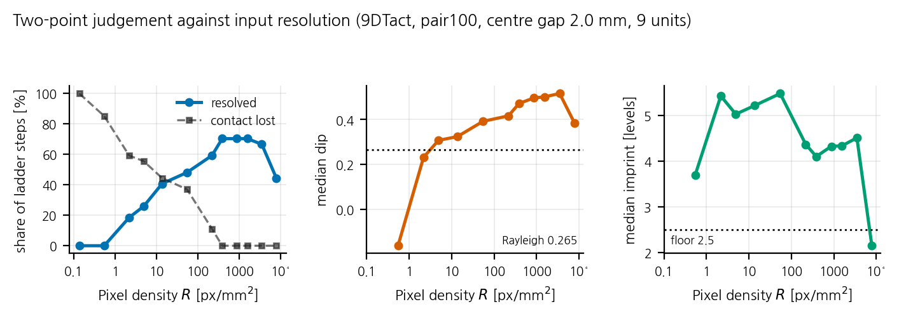

*두 점 판정 대 입력 해상도 (9DTact, pair100, 중심 간격 2.0 mm). 왼쪽은 분해된 사다리 단의 비율, 가운데는 골 깊이와 Rayleigh 문턱, 오른쪽은 자국 밝기와 판정 바닥.*

그림: `extra/figures/H_resolution_sweep.png` · 자료: `extra/data/H_resolution_sweep.csv`

**공간 분해능은 힘·형상보다 훨씬 촘촘한 화소를 쓴다.** 분해 비율이
R ≈ 385 px/mm² (426×240) 에서 최대(71 %)이고 R ≈ 217 아래로 무너진다.
골 깊이가 Rayleigh 를 넘는 것은 R ≈ 13.6 까지이고 R ≈ 4.9 에서 0.20 으로
내려간다. 같은 9DTact 카메라에서 힘은 R ≈ 5~17, 형상은 R ≈ 53~59 에서
포화한다 — **세 과제가 요구하는 화소 밀도가 70 배 벌어진다.**

**전해상도가 여기서도 손해다.** R ≈ 7830 (1920×1080) 의 분해 비율이 39 % 로
R ≈ 385 의 71 % 보다 낮다. 골 자체는 얕아지지 않는데(0.384 대 0.464)
**픽셀당 잡음이 네 배**여서(0.108 대 0.026) "골이 자기 잡음의 3 배" 관문이
걸린다. 자국 밝기도 2.15 로 판정 바닥 2.5 아래다.

> **낮은 쪽 끝은 바닥이지 측정이 아니다.** R ≈ 217 아래에서 "접촉 없음" 이
> 빠르게 늘어난다(6 → 22 → 26 → 31 → 34 → 44 → 50 단). 덩어리 검출이
> 접촉을 놓치는 것이 섞여 있으므로, R ≈ 54 미만의 값은 **분해 실패의 상한**
> 으로만 읽을 것. 골이 실제로 Rayleigh 아래로 떨어지는 것과 검출기가 포기하는
> 것이 같은 구간에서 함께 일어난다.

만드는 것은 `scripts/resolution_sweep.py` · 자료 `extra/data/resolution_sweep_pair100.csv`

## 5. 힘 추정 오차 대 해상도

ResNet-18 을 해상도 12 단(가로 1920 → 8 px, 화소 밀도로는 원리에 따라 약 7800~12900 에서 0.1 px/mm² 까지)에서 학습해 축별 MAE 를 낸다.
**학습 파라미터는 원리·해상도에 걸쳐 전부 같다** — 실효 배치 64(경사 누적으로
고정), 30 에폭, Adam 5e-4, weight decay 1e-4, cycle 분할, seed 3 개.

> **미세배치가 배치를 나누게 한 뒤의 값이다 (2026-09-14).** 그 전에는
> `accum = round(batch / micro)` 의 반올림 탓에 640×360 에서 44,
> 854×480 에서 72, 1280×720 에서 66 이 걸려 **열두 칸 중 셋이 다른
> 최적화기로 학습되고 있었다.** 그 세 단만 다시 학습해 갈아 끼웠다 —
> 결론은 바뀌지 않았고(검정 20 개 중 q < 0.05 여전히 0 개), 포화 해상도가
> 한두 단 낮아졌다.

| 원리 | 입력 표현 |
|---|---|
| 9DTact | `grey` — 원저자 방식 (기준영상 + 밝아진 양 + 어두워진 양) |
| DIGIT | `raw` — 카메라 프레임 그대로 |
| DIGIT_Marker | `inpaint` — 마커 점을 지우고 주변에서 메움 |

*9DTact — 유닛별 축별 MAE 대 해상도*

그림: `1_9DTact/figures/force_mae_vs_resolution_18units.png` · 자료: `1_9DTact/data/force_mae_vs_resolution_18units.csv`

*DIGIT — 유닛별 축별 MAE 대 해상도*

그림: `2_DIGIT/figures/force_mae_vs_resolution_18units.png` · 자료: `2_DIGIT/data/force_mae_vs_resolution_18units.csv`

*DIGIT_Marker — 유닛별 축별 MAE 대 해상도*

그림: `3_DIGIT_Marker/figures/force_mae_vs_resolution_18units.png` · 자료: `3_DIGIT_Marker/data/force_mae_vs_resolution_18units.csv`

### 포화 해상도 — 경도·두께 칸별 (힘)

**포화 해상도** = 그 유닛 자신의 최솟값의 110 % 안에 드는 **가장 낮은** 해상도.
`argmin` 은 곡선이 평평한 구간에서 흔들리므로 쓰지 않는다.
칸에는 **두 복제를 그대로** 적는다(둘이 같으면 하나만). **검정 단위는 칸이
아니라 유닛**이다 — 칸마다 유닛이 둘뿐이라 칸으로는 검정이 되지 않는다.

단위는 **화소 밀도 R (px/mm²)** — 그 단으로 줄였을 때의 총 화소수를 그 유닛
카메라가 실제로 보는 면적으로 나눈 값이다. 같은 픽셀 폭이라도 시야가 좁은
유닛이 더 촘촘하므로, 유닛과 원리를 가로질러 견주려면 픽셀 폭이 아니라 이
값이어야 한다.

칸을 나누지 않은 중앙 포화 해상도부터 — 실무적으로 쓸 숫자는 이것이다.

| 원리 | 지표 | 중앙 포화 해상도 R (px/mm²) | 유닛별 범위 | 해당 픽셀 폭 | n |
|---|---|---:|---|---|---:|
| 9DTact | Fz | **17.3** | 1.66 ~ 880 | 80×45 | 17 |
| 9DTact | 전단 | **5.53** | 1.88 ~ 1,690 | 48×27 | 17 |
| DIGIT | Fz | **7.84** | 2.19 ~ 2,146 | 48×27 | 18 |
| DIGIT | 전단 | **6.00** | 2.38 ~ 590 | 48×27 | 18 |
| DIGIT_Marker | Fz | **22.5** | 1.07 ~ 455 | 80×45 | 18 |
| DIGIT_Marker | 전단 | **70.6** | 1.07 ~ 5,898 | 160×90 | 18 |

**9DTact — Fz (수직력)**

| 경도 | 1 mm | 2 mm | 3 mm |
|---|---|---|---|
| soft | 17.3 / 68.0 | 218 / 411 | 4.03 / 12.3 |
| medium | 2.13 / 15.4 | 870 | 3.92 / 4.23 |
| hard | 4.87 / 464 | 59.3 / 880 | 1.66 / 758 |

유닛 17 개 — 두께 ρ -0.214 (p 0.409, q 0.998) · 경도 ρ +0.100 (p 0.702, q 1.000)

**9DTact — 전단 (Fx·Fy 평균)**

| 경도 | 1 mm | 2 mm | 3 mm |
|---|---|---|---|
| soft | 2.72 / 6.23 | 5.22 / 13.6 | 1.96 / 44.7 |
| medium | 5.53 / 13.3 | 4.89 | 1.88 / 3.92 |
| hard | 4.87 / 5.89 | 13.8 / 1,690 | 3.73 / 190 |

유닛 17 개 — 두께 ρ -0.114 (p 0.662, q 1.000) · 경도 ρ +0.214 (p 0.409, q 0.998)

**DIGIT — Fz (수직력)**

| 경도 | 1 mm | 2 mm | 3 mm |
|---|---|---|---|
| soft | 7.49 / 8.19 | 6.35 / 293 | 5.36 / 14.2 |
| medium | 3.47 / 21.1 | 17.4 / 2,146 | 2.19 / 2.22 |
| hard | 21.4 / 23.0 | 6.39 / 6.74 | 2.55 / 13.3 |

유닛 18 개 — 두께 ρ -0.446 (p 0.064, q 0.981) · 경도 ρ +0.013 (p 0.959, q 1.000)

**DIGIT — 전단 (Fx·Fy 평균)**

| 경도 | 1 mm | 2 mm | 3 mm |
|---|---|---|---|
| soft | 364 / 590 | 6.35 / 6.60 | 2.38 / 5.10 |
| medium | 3.37 / 3.47 | 3.01 / 6.25 | 4.92 / 222 |
| hard | 3.68 / 85.8 | 6.39 / 6.74 | 4.77 / 5.74 |

유닛 18 개 — 두께 ρ -0.197 (p 0.434, q 0.998) · 경도 ρ -0.092 (p 0.717, q 1.000)

**DIGIT_Marker — Fz (수직력)**

| 경도 | 1 mm | 2 mm | 3 mm |
|---|---|---|---|
| soft | 27.0 | 22.4 / 22.6 | 17.4 / 287 |
| medium | 1.07 / 89.6 | 19.7 / 22.7 | 2.82 / 72.8 |
| hard | 9.86 / 455 | 20.9 / 23.0 | 16.5 / 18.5 |

유닛 18 개 — 두께 ρ -0.210 (p 0.403, q 0.998) · 경도 ρ -0.223 (p 0.374, q 0.998)

**DIGIT_Marker — 전단 (Fx·Fy 평균)**

| 경도 | 1 mm | 2 mm | 3 mm |
|---|---|---|---|
| soft | 27.0 / 108 | 22.6 / 1,434 | 69.5 / 71.7 |
| medium | 1.07 / 22.4 | 22.7 / 557 | 18.2 / 1,129 |
| hard | 27.4 / 455 | 591 / 5,898 | 16.5 / 4,733 |

유닛 18 개 — 두께 ρ +0.170 (p 0.499, q 0.998) · 경도 ρ +0.170 (p 0.499, q 0.998)

자료: `extra/data/knee_by_cell_3x3.csv` · 유닛별 `knee_force_by_unit.csv` · 요약 `knee_summary.csv` · 검정 `knee_trends.csv`

**겔은 힘의 포화 해상도를 움직이지 않는다.** 위 **12 개 검정**(행 6 개 ×
두께·경도) 어느 것도 q < 0.05 가 아니다. q 는 **힘과 형상을 합친 20 개**에
Benjamini-Hochberg 를 건 값이다 — 두 절을 따로 보정하면 "20 번 중 하나" 라는
사실이 가려진다.

**같은 칸의 두 복제가 내는 포화 해상도가 얼마나 다른가**가 이 검정의 한계를 정한다:

| 원리 · 지표 | 쌍 | 배율 중앙 | 같은 단 | 8 배 이상 |
|---|---:|---:|---:|---:|
| 9DTact · Fz | 8 | **6.7×** | 0 | 4 |
| 9DTact · 전단 | 8 | **1.6×** | 1 | 1 |
| DIGIT · Fz | 9 | **1.7×** | 3 | 1 |
| DIGIT · 전단 | 9 | **1.5×** | 4 | 1 |
| DIGIT_Marker · Fz | 9 | **1.0×** | 5 | 1 |
| DIGIT_Marker · 전단 | 9 | **5.0×** | 1 | 2 |

**9DTact 의 Fz 포화 해상도는 복제 쌍 안에서 중앙 6.7 배, 여덟 쌍 중 넷이 8 배 이상**
어긋난다. 겔이 같고 장착만 다른데 그렇다. 두께가 만들 수 있는 차이가 그보다
작다면 이 설계로는 보이지 않는다 — **무효과의 증거가 아니라 검정력의 한계다.**

## 6. 형상 복원 대 해상도

**9DTact** 는 밝기→깊이 조회표를 `ball4` 로 보정하고 `cyl4`·`cube4` 로 평가한다.
**DIGIT 계열**은 광도 스테레오라 다른 파이프라인이 필요하고, 이번에 새로 만들었다
(`src/scripts/digit_shape.py`): 알려진 반지름의 구로 픽셀별 참 기울기를 구 기하에서
계산하고, (색차, 위치) → (gx, gy) 를 회귀한 뒤 푸아송 방정식을 DCT 로 풀어
높이맵을 만든다.

> **DIGIT_Marker 는 형상 복원을 하지 않는다** — 마커 점이 음영을 가려 같은 방법을
> 쓸 수 없다.

*9DTact — 형상 복원 오차 대 화소 밀도. 둘 다 R ≈ 54 px/mm² 에서 최소.*

그림: `1_9DTact/figures/shape_mae_summary.png` · 자료: `1_9DTact/data/shape_mae_summary.csv`

**9DTact 는 해상도 의존성이 뚜렷하다** — R ≈ 0.14 px/mm² 의 0.529 mm 에서 R ≈ 54 의 0.062 mm 까지
**8.5 배** 좋아지고, 그 위로는 다시 나빠진다. 회색조 손실을 보정하면(점선) R ≈ 14 위로
평평해지므로, 고해상도의 악화는 조회표가 회색조를 잃는 데서 온다.

### 유닛별 — 경도 × 두께 × 복제

5 절의 힘 그림과 같은 배치다. 행이 경도, 열이 두께와 복제이고, 선 하나가 평가
압자 하나다. 가로축은 화소 밀도 R (px/mm²) 이다.

*9DTact — 유닛별 형상 복원 오차 대 해상도 (조회표 그대로)*

그림: `1_9DTact/figures/shape_mae_vs_resolution_18units.png` · 자료: `1_9DTact/data/shape_mae_vs_resolution_18units.csv`

*9DTact — 유닛별 형상 복원 오차 대 해상도 (회색조 손실 보정)*

그림: `1_9DTact/figures/shape_mae_corrected_18units.png` · 자료: `1_9DTact/data/shape_mae_corrected_18units.csv`

*DIGIT — 유닛별 형상 복원 오차 대 해상도 (광도 스테레오)*

그림: `2_DIGIT/figures/shape_mae_vs_resolution_18units.png` · 자료: `2_DIGIT/data/shape_mae_vs_resolution_18units.csv`

> **DIGIT_Marker 는 이 그림이 없다** — 형상 복원을 하지 않기 때문이다.

*DIGIT — 형상 복원 오차 대 화소 밀도, 그리고 R ≈ 512 px/mm² 에서의 예측-참값.*

그림: `2_DIGIT/figures/shape_mae_summary.png` · 자료: `2_DIGIT/data/shape_mae_summary.csv`

### 포화 해상도 — 경도·두께 칸별 (형상)

**포화 해상도** = 그 유닛 자신의 최솟값의 110 % 안에 드는 **가장 낮은** 해상도.
`argmin` 은 곡선이 평평한 구간에서 흔들리므로 쓰지 않는다.
칸에는 **두 복제를 그대로** 적는다(둘이 같으면 하나만). **검정 단위는 칸이
아니라 유닛**이다 — 칸마다 유닛이 둘뿐이라 칸으로는 검정이 되지 않는다.

단위는 **화소 밀도 R (px/mm²)** — 그 단으로 줄였을 때의 총 화소수를 그 유닛
카메라가 실제로 보는 면적으로 나눈 값이다. 같은 픽셀 폭이라도 시야가 좁은
유닛이 더 촘촘하므로, 유닛과 원리를 가로질러 견주려면 픽셀 폭이 아니라 이
값이어야 한다.

칸을 나누지 않은 중앙 포화 해상도부터 — 실무적으로 쓸 숫자는 이것이다.

| 원리 | 지표 | 중앙 포화 해상도 R (px/mm²) | 유닛별 범위 | 해당 픽셀 폭 | n |
|---|---|---:|---|---|---:|
| 9DTact | cyl4 | **59.3** | 16.4 ~ 7,830 | 160×90 | 17 |
| 9DTact | cube4 | **53.3** | 3.92 ~ 7,830 | 160×90 | 17 |
| DIGIT | cyl4 | **13.8** | 0.18 ~ 83.2 | 80×45 | 18 |
| DIGIT | cube4 | **16.7** | 0.21 ~ 85.8 | 80×45 | 18 |

**9DTact — 원기둥 ⌀4 mm**

| 경도 | 1 mm | 2 mm | 3 mm |
|---|---|---|---|
| soft | 68.0 / 69.3 | 54.6 / 58.0 | 196 / 716 |
| medium | 53.3 / 61.4 | 7,830 | 47.0 / 697 |
| hard | 16.4 / 217 | 55.0 / 59.3 | 41.5 / 47.4 |

유닛 17 개 — 두께 ρ +0.000 (p 1.000, q 1.000) · 경도 ρ -0.414 (p 0.098, q 0.981)

**9DTact — 정육면체 4 mm**

| 경도 | 1 mm | 2 mm | 3 mm |
|---|---|---|---|
| soft | 17.0 / 69.3 | 13.6 / 14.5 | 196 / 1,275 |
| medium | 15.4 / 53.3 | 7,830 | 3.92 / 188 |
| hard | 16.4 / 217 | 55.0 / 59.3 | 41.5 / 47.4 |

유닛 17 개 — 두께 ρ +0.114 (p 0.662, q 1.000) · 경도 ρ +0.043 (p 0.870, q 1.000)

**DIGIT — 원기둥 ⌀4 mm**

| 경도 | 1 mm | 2 mm | 3 mm |
|---|---|---|---|
| soft | 3.64 / 83.2 | 0.18 / 18.3 | 5.10 / 14.9 |
| medium | 0.84 / 3.47 | 17.4 / 18.8 | 13.7 / 13.9 |
| hard | 0.92 / 3.43 | 17.7 / 18.7 | 13.3 / 16.0 |

유닛 18 개 — 두께 ρ +0.249 (p 0.319, q 0.998) · 경도 ρ -0.013 (p 0.959, q 1.000)

**DIGIT — 정육면체 4 mm**

| 경도 | 1 mm | 2 mm | 3 mm |
|---|---|---|---|
| soft | 3.64 / 83.2 | 17.6 / 18.3 | 14.2 / 14.9 |
| medium | 0.21 / 3.47 | 17.4 / 18.8 | 13.9 / 54.7 |
| hard | 0.23 / 85.8 | 17.7 / 18.7 | 13.3 / 16.0 |

유닛 18 개 — 두께 ρ +0.079 (p 0.756, q 1.000) · 경도 ρ +0.000 (p 1.000, q 1.000)

자료: `extra/data/knee_by_cell_3x3.csv` · 유닛별 `knee_shape_by_unit.csv` · 요약 `knee_summary.csv` · 검정 `knee_trends.csv`

q 는 **힘과 형상을 합친 20 개**에 Benjamini-Hochberg 를 건 값이다 —
보정의 근거는 5 절에 한 번만 적었다, 복제 재현성도 거기 있다. **어느 칸도 q < 0.05 가
아니다.**

---

# 부록

본문의 결론을 떠받치지만 그 자체가 결과는 아닌 것들 — 판정 기준을 어떻게
골랐나, 겔 규격이 어떻게 불균형한가, 프로브를 바꾸면 무엇이 옮겨지나 —
그리고 이 결과가 무엇을 말하지 못하는가.

## 부록 A. 판정 기준 — 상대와 절대

*상대 기준은 원리 간 격차를 1.8 배로 압축한다.*

그림: `extra/figures/C_relative_vs_absolute_criterion.png` · 자료: `extra/data/C_relative_vs_absolute_criterion.csv`

현행 판정은 문턱이 **유닛 자신의 최대 응답의 15 %** 라, 응답이 약한 유닛일수록
천장이 높게 나온다. 복제 쌍 다섯에서 모두 그 방향이었다. 고정 문턱으로 다시
계산하면 격차가 **4.3 ~ 6.6 배**로 커진다.

**원리 간 비교에는 절대 기준을 쓴다.** 상대 기준 값은 한 유닛의 운용 한계로만 쓴다.

## 부록 B. 경도 범위 불균형

두 계열의 "soft / medium / hard" 는 같은 눈금이 아니다. 9DTact 는 OO-30 에서
OO-70 까지 **40 Shore 점**을 흔들었고, DIGIT 계열은 OO-51 에서 OO-57 까지
**6 점**을 흔들었다 — **6.7 배** 차이다. 9DTact 는 서로 다른 두 제품군
(Ecoflex, Dragon Skin)을 가로지르고, DIGIT 계열은 Solaris 한 배합에서
가소제(Slacker) 비율만 바꿨다.

그래서 **9DTact 의 soft 와 DIGIT 의 soft 가 다른 물건**일 뿐 아니라,
**DIGIT 의 soft 와 hard 도 서로 거의 같은 물건**이다. DIGIT 계열의 경도 세 등급은
실질적으로 한 겔이다.

**원리를 가로질러 경도를 하나의 요인으로 놓는 분석은 이 설계로 성립하지 않는다.**
이 문서의 3×3 표에서 경도 행 사이의 차이는 **한 원리 안에서만** 읽을 것이고,
그때도 DIGIT 계열은 6 점 안에서의 차이임을 함께 보아야 한다. 겔 규격과 실측
경도는 `docs/methods.md` §2.1 에 있다.

## 부록 C. 프로브 전이 — 깊이는 옮겨지고 힘은 아니다

*ball8/ball4 비. 힘은 1.50~3.26 으로 흩어지고 깊이는 0.99 에 모인다.*

그림: `extra/figures/E_probe_transfer.png` · 자료: `extra/data/E_probe_transfer.csv`

Hertz 는 같은 깊이의 힘이 √R 에 비례한다고 예측하므로 **1.41** 을 기대하는데,
실측 중앙이 **2.37** 이고 복제 쌍 안에서도 1.98 과 3.26 으로 갈린다. 반면 깊이
비는 중앙 **0.99** 로 1 과 통계적으로 구분되지 않는다 (p 0.858).

> **포화 깊이는 유닛의 성질이고, 그 깊이에서의 힘은 프로브가 정한다.**

같은 18 쌍이 *시야 포화* 교란도 기각한다 — `ball8` 은 같은 깊이에서 자국이 1.2~1.4
배 큰데, 시야가 원인이라면 계통적으로 더 얕게 포화해야 한다. 더 얕게 포화한 것이
18 중 10 (이항검정 p 0.815) 으로 효과가 없다.

| unit          | hardness   |   thickness_mm |   ball4_N |   ball4_depth_mm |   ball8_N |   ball8_depth_mm |   force_ratio |   depth_ratio |
|:--------------|:-----------|---------------:|----------:|-----------------:|----------:|-----------------:|--------------:|--------------:|
| soft_1mm_r1   | soft       |              1 |   7.84619 |         0.828292 |   23.4125 |         0.959903 |       2.98394 |      1.15889  |
| soft_1mm_r2   | soft       |              1 |   8.46835 |         1.1716   |   22.4492 |         1.31538  |       2.65095 |      1.12272  |
| soft_2mm_r1   | soft       |              2 |   6.40522 |         1.47523  |   17.7183 |         1.57532  |       2.76624 |      1.06784  |
| soft_2mm_r2   | soft       |              2 |   6.80288 |         1.5084   |   14.7359 |         1.49601  |       2.16613 |      0.991789 |
| soft_3mm_r1   | soft       |              3 |   5.26627 |         1.81725  |   11.7611 |         1.79652  |       2.23329 |      0.988595 |
| soft_3mm_r2   | soft       |              3 |   7.11478 |         2.13669  |   11.0916 |         1.92659  |       1.55895 |      0.901669 |
| medium_1mm_r1 | medium     |              1 |   7.52194 |         1.10242  |   18.2193 |         1.09121  |       2.42215 |      0.989829 |
| medium_1mm_r2 | medium     |              1 |   8.92793 |         1.11373  |   22.0723 |         1.15873  |       2.47228 |      1.0404   |
| medium_2mm_r1 | medium     |              2 |   5.19531 |         1.60146  |   14.1386 |         1.64787  |       2.72141 |      1.02898  |
| medium_2mm_r2 | medium     |              2 |   7.33058 |         1.44554  |   22.5909 |         1.52836  |       3.08174 |      1.05729  |
| medium_3mm_r1 | medium     |              3 |   6.63405 |         2.21707  |   14.416  |         2.06706  |       2.17303 |      0.932335 |
| medium_3mm_r2 | medium     |              3 |   6.47109 |         2.25668  |   15.0342 |         2.16089  |       2.32329 |      0.95755  |
| hard_1mm_r1   | hard       |              1 |   9.84857 |         1.12074  |   19.4554 |         1.09528  |       1.97545 |      0.977288 |
| hard_1mm_r2   | hard       |              1 |   5.19425 |         0.915261 |   16.9507 |         0.962061 |       3.26336 |      1.05113  |
| hard_2mm_r1   | hard       |              2 |   7.36926 |         1.55224  |   22.4109 |         1.68119  |       3.04114 |      1.08307  |
| hard_2mm_r2   | hard       |              2 |   9.02935 |         1.63027  |   17.7377 |         1.4679   |       1.96445 |      0.900408 |
| hard_3mm_r1   | hard       |              3 |   7.88039 |         2.20143  |   11.8343 |         1.82267  |       1.50175 |      0.827949 |
| hard_3mm_r2   | hard       |              3 |   7.86481 |         1.98085  |   13.6734 |         1.689    |       1.73856 |      0.852662 |

자료: `extra/data/E_probe_transfer.csv`

## 부록 D. 이 결과가 말하지 못하는 것

| 한계 | 제한하는 것 |
|---|---|
| DIGIT_Marker 천장이 `ball4` 뿐 | **세 원리** 천장 비교 |
| DIGIT_Marker 공간 분해능 미측정 | 표제 변수의 세 원리 비교 |
| DIGIT 이 가장 좁은 프로브를 18/18 분해 | DIGIT 분해능 **값** — 상한만 |
| 경도 범위가 6.7 배 불균형 | 원리 간 **경도 효과** 비교 |
| px/mm 이 유닛마다 최대 1.5 배 어긋남 | mm 단위 자국 크기, 픽셀 요구량 |
| F/T 라벨 바닥 0.028 N | 힘 추정의 **절대값** (상대 비교는 유효) |
| `9DTact_medium_2mm_r1` 파괴 | 3×3 표의 한 칸이 복제 1 개 |

전체 한계표는 `docs/methods.md` §10.0.

